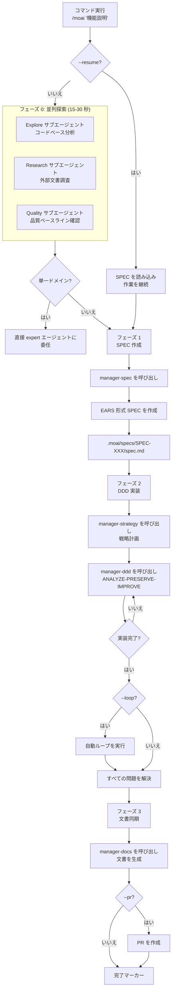

import { Callout } from "nextra/components";

# /moai

完全自律自動化コマンド。目標を指定すると、MoAI が自律的に **plan → run → sync** パイプラインを実行します。

<Callout type="tip">
  **一言でいうと**: `/moai` は「完全自律自動化」コマンドです。実装したい機能を自然言語で説明するだけで、MoAI が SPEC 作成から実装、文書化まで**全プロセスを自動的に**行います。
</Callout>

<Callout type="info">
**スラッシュコマンド対応**: MoAI のすべてのサブコマンドはスキルとしてラップされています。`/moai` と入力するだけで、利用可能なサブコマンドの一覧が表示されます。各サブコマンドは `/moai:fix`、`/moai:loop`、`/moai:review` などの形式で直接実行することもできます。
</Callout>

## 概要

`/moai` は MoAI-ADK の**完全自律自動化ワークフロー**コマンドです。サブコマンドを個別に実行する必要はありません - 単一のコマンドで開発プロセス全体が自動化されます：

1. **SPEC 作成** (manager-spec)
2. **DDD 実装** (manager-ddd)
3. **文書同期** (manager-docs)

## 使用方法

```bash
# 基本使用法
> /moai "実装したい機能の説明"

# ワークツリー使用
> /moai "機能説明" --worktree

# ブランチ使用
> /moai "機能説明" --branch

# ループモード有効化
> /moai "機能説明" --loop

# 既存 SPEC を再開
> /moai --resume SPEC-AUTH-001
```

## サポートされるフラグ

| フラグ                | 説明                             | 例                           |
| ------------------- | --------------------------------------- | --------------------------------- |
| `--loop`            | 自動反復修正を有効化       | `/moai "機能" --loop`          |
| `--max N`           | 最大反復回数を指定 (デフォルト 100) | `/moai "機能" --loop --max 10` |
| `--branch`          | 機能ブランチを自動作成              | `/moai "機能" --branch`        |
| `--pr`              | 完了後に PR を自動作成         | `/moai "機能" --pr`            |
| `--resume SPEC-XXX` | 既存 SPEC 作業を再開                | `/moai --resume SPEC-AUTH-001`     |
| `--team`            | Agent Teams モードを強制            | `/moai "機能" --team`          |
| `--solo`            | サブエージェントモードを強制        | `/moai "機能" --solo`          |

### --loop フラグ

実装後に自動的に反復修正を実行してすべてのエラーを解決します：

```bash
> /moai "JWT 認証システム" --loop
```

このオプション使用時：

1. SPEC 作成
2. DDD 実装
3. **自動ループ実行** (LSP エラー、テスト失敗、カバレッジ問題を解決)
4. 文書同期
5. PR 作成

<Callout type="tip">
  `--loop` オプションは実装後のクリーンアップを**完全に自動化**して生産性を最大化します。
</Callout>

### --team / --solo フラグ

`--team` フラグは Agent Teams モードを強制し、複数の専門エージェントが**並列で協力**します：

```bash
> /moai "機能説明" --team
```

#### 前提条件

Agent Teams モードを使用するには、以下の 2 つの条件を両方満たす必要があります：

1. 環境変数：`CLAUDE_CODE_EXPERIMENTAL_AGENT_TEAMS=1`（settings.json で設定）
2. 設定ファイル：`workflow.team.enabled: true`（`.moai/config/sections/workflow.yaml`）

#### モード選択

| フラグ | 動作 |
| ------ | ---- |
| `--team` | Agent Teams モードを強制（並列実行） |
| `--solo` | サブエージェントモードを強制（逐次実行） |
| （なし） | 複雑度に基づく自動選択 |

**自動選択基準**（フラグなしの場合）：

- 影響ドメイン >= 3 → チームモード
- 修正ファイル >= 10 → チームモード
- 複雑度スコア >= 7 → チームモード
- その他 → サブエージェントモード

#### チーム構成

**Plan フェーズチーム：**

| エージェント | 役割 | 主要タスク |
| ------------ | ---- | ---------- |
| **researcher** | コードベース探索 | 関連コード、参照実装、依存関係分析 |
| **analyst** | 要件分析 | ユーザーストーリー、受入条件、エッジケース |
| **architect** | 技術設計 | アーキテクチャ決定、代替案評価、トレードオフ |

**Run フェーズチーム：**

| エージェント | 役割 | 主要タスク |
| ------------ | ---- | ---------- |
| **backend-dev** | バックエンド実装 | API、ビジネスロジック、データベース |
| **frontend-dev** | フロントエンド実装 | UI コンポーネント、状態管理、スタイリング |
| **tester** | テスト作成 | ユニット、統合、E2E テスト |

#### ファイルオーナーシップ

チームモードでは、各エージェントが特定のファイルパターンを**排他的に所有**し、競合を防止します：

| エージェント | 所有ファイルパターン |
| ------------ | -------------------- |
| backend-dev | `src/**/*.go`, `internal/**`, `pkg/**` |
| frontend-dev | `src/**/*.tsx`, `src/**/*.css`, `public/**` |
| tester | `**/*_test.go`, `**/*.test.ts`, `**/*.spec.ts` |

#### トークンコスト

Agent Teams は各エージェントが独立したコンテキストウィンドウを使用するため、トークン使用量が増加します：

| チームパターン | エージェント数 | 予想倍率 |
| -------------- | -------------- | -------- |
| Plan 研究 | 3 | ~3x |
| 実装 | 3 | ~3x |
| 調査 | 3 | ~2x (haiku) |

<Callout type="warning">
  `--team` モードは実験的機能です。複雑なクロスレイヤータスクで最も効果的であり、単純な単一ドメインタスクには `--solo` モードの方が効率的です。
</Callout>

## 実行プロセス

`/moai` が内部的に実行する全プロセス：



**主要ポイント:**

- **フェーズ 0 (並列探索)**: 3 つのエージェントが同時に実行され、2-3 倍高速化
- **単一ドメインルーティング**: 簡単なタスクは SPEC をスキップして expert エージェントに直接委任
- **完了マーカー**: 作業完了時に `<moai>DONE</moai>` または `<moai>COMPLETE</moai>` を出力

## フェーズ別詳細

### フェーズ 0: 並列探索 (オプション)

3 つのエージェントが**同時に**実行され、プロジェクトコンテキストを迅速に把握します：

| エージェント    | 役割              | タスク                                           |
| -------- | ----------------- | ---------------------------------------------- |
| **Explore**  | コードベース分析 | 関連ファイル、アーキテクチャパターン、既存の実装を発見 |
| **Research** | 外部文書調査 | 公式ドキュメント、API ドキュメント、類似実装例 |
| **Quality**  | 品質ベースライン  | テストカバレッジ、リンター状態、技術的負債    |

**高速化**: 並列実行は逐次実行より 2-3 倍高速 (15-30 秒 vs 45-90 秒)

**単一ドメインルーティング:**

- 単一ドメインタスク (例: "SQL 最適化"): SPEC 作成をスキップしてドメイン expert エージェントに直接委任
- 複数ドメインタスク: フルワークフローに進む

### フェーズ 1: SPEC 作成

**manager-spec** サブエージェントが EARS 形式 SPEC 文書を作成します：

- .moai/specs/SPEC-XXX/spec.md
- EARS 形式の要件
- Given-When-Then 受入条件
- conversation_language で記述されたコンテンツ

### フェーズ 2: DDD 実装ループ

**[HARD] エージェント委任ルール**: すべての実装作業は専門エージェントに委任する必要があります。自動コンパクト後も直接実装は禁止されています。

**Expert エージェント選択:**

| タスクタイプ          | エージェント                         |
| ------------------ | ----------------------------- |
| バックエンドロジック      | expert-backend サブエージェント       |
| フロントエンドコンポーネント| expert-frontend サブエージェント      |
| テスト作成      | expert-testing サブエージェント       |
| バグ修正         | expert-debug サブエージェント         |
| リファクタリング        | expert-refactoring サブエージェント   |
| セキュリティ修正     | expert-security サブエージェント      |

**ループ動作 (--loop または ralph.yaml loop.enabled が true の場合):**

```
問題が存在 AND 反復 < 最大:
  1. 診断を実行 (デフォルトで並列)
  2. 適切な expert エージェントに修正を委任
  3. 修正結果を検証
  4. 完了マーカーを確認
  5. マーカー発見時ループ終了
```

### フェーズ 3: 文書同期

**manager-docs** サブエージェントが実装と文書を同期します：

- API 文書を生成
- README を更新
- CHANGELOG に追加
- 成功時に完了マーカーを追加

## TODO 管理

**[HARD] TodoWrite ツール必須**: すべてのタスク追跡に TodoWrite を使用する必要があります

- 問題発見時: TodoWrite (pending ステータス)
- 作業開始前: TodoWrite (in_progress ステータス)
- 作業完了後: TodoWrite (completed ステータス)
- TODO リストのテスト出力を禁止

## 完了マーカー

AI は作業完了時にマーカーを追加します：

- `<moai>DONE</moai>` - タスク完了
- `<moai>COMPLETE</moai>` - 完全完了
- `<moai:done />` - XML 形式

## LLM モードルーティング

llm.yaml 設定に基づく自動ルーティング：

| モード          | Plan フェーズ     | Run フェーズ      |
| ------------- | -------------- | -------------- |
| `claude-only` | Claude         | Claude         |
| `hybrid`      | Claude         | GLM (worktree) |
| `glm-only`    | GLM (worktree) | GLM (worktree) |

## 実践例

### 例: JWT 認証システムの完全自動化

**ステップ 1: コマンド実行**

```bash
> /moai "JWT ベースのユーザー認証システム: サインアップ、ログイン、トークンリフレッシュ" --worktree --loop --pr
```

**ステップ 2: フェーズ 0 - 並列探索**

```
[並列探索を開始]
  Explore サブエージェント: src/auth/ を分析中...
  Research サブエージェント: JWT ベストプラクティスを調査中...
  Quality サブエージェント: テストカバレッジ 32% を確認...

[探索完了 - 23 秒]
  発見ファイル: 4
  推奨ライブラリ: PyJWT, bcrypt
  ベースライン: LSP エラー 0、カバレッジ 32%
```

**ステップ 3: フェーズ 1 - SPEC 作成**

```
[manager-spec を呼び出し]
  SPEC ID: SPEC-AUTH-001
  要件: 5 (EARS 形式)
  受入条件: 3 シナリオ

  ユーザー承認: 完了
```

**ステップ 4: フェーズ 2 - DDD 実装**

```
[manager-strategy]
  作業分解: 7 タスク
  戦略計画完了

[manager-ddd]
  ANALYZE: コード構造分析完了
  PRESERVE: 12 個のキャラクタリゼーションテストを作成
  IMPROVE: 7 タスクの実装完了

[manager-quality]
  TRUST 5: すべての柱が通過
  カバレッジ: 89%
  ステータス: PASS
```

**ステップ 5: 自動ループ (--loop)**

```
[ループ開始 - 反復 1/100]
  診断: 2 個のタイプエラーを発見
  修正: expert-backend サブエージェントに委任
  検証: すべてのエラーを解決

[ループ完了 - 1 反復]
  完了条件を満たしました!
```

**ステップ 6: フェーズ 3 - 文書同期**

```
[manager-docs]
  API 文書: docs/api/auth.md を作成
  README: 使用法セクションを更新
  CHANGELOG: v1.1.0 エントリを追加
  SPEC-AUTH-001: ACTIVE → COMPLETED
```

**ステップ 7: 完了**

```
[完了]
  SPEC: SPEC-AUTH-001
  コミット: 7
  テスト: 36/36 通過
  カバレッジ: 89%
  PR: #42 を作成 (Draft → Ready)

<moai:COMPLETE />
```

## よくある質問

### Q: `/moai` とサブコマンドの違いは何ですか?

| コマンド       | スコープ          | 使用タイミング                     |
| ------------- | -------------- | ------------------------------- |
| `/moai`       | 完全自動化| 高速な完全自動化を希望      |
| `/moai plan`  | SPEC のみ      | まず SPEC を確認したい        |
| `/moai run`   | 実装のみ| SPEC が既に存在する        |
| `/moai sync`  | 文書のみ| 実装後に文書を更新 |

### Q: --loop フラグはいつ使用すべきですか?

実装後にすべてのエラーを自動的に修正したい場合に使用します。大規模なリファクタリング後のクリーンアップに特に便利です。

### Q: 単一ドメインルーティングとは何ですか?

単一ドメインタスク (例: "SQL クエリ最適化") は SPEC 作成をスキップしてドメイン expert エージェントに直接委任され、時間を節約できます。

## 関連ドキュメント

- [/moai plan](/workflow-commands/moai-plan) - SPEC 作成の詳細
- [/moai run](/workflow-commands/moai-run) - DDD 実装の詳細
- [/moai sync](/workflow-commands/moai-sync) - 文書同期の詳細
- [/moai loop](/utility-commands/moai-loop) - 反復修正ループの詳細
- [/moai fix](/utility-commands/moai-fix) - ワンショット自動修正の詳細
