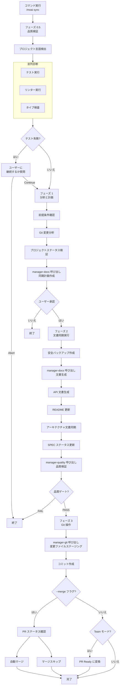

import { Callout } from "nextra/components";

# /moai sync

実装完了したコードの文書を同期し、Git 自動化を通じてデプロイの準備をします。

<Callout type="info">
**スラッシュコマンド**: Claude Code で `/moai:sync` と入力すると、このコマンドを直接実行できます。`/moai` だけ入力すると、利用可能なすべてのサブコマンドの一覧が表示されます。
</Callout>

## 概要

`/moai sync` は MoAI-ADK ワークフローの **フェーズ 3 (Sync)** コマンドです。フェーズ 2 で実装が完了したコードを分析して文書を自動生成し、Git コミットおよび PR (Pull Request) を作成してデプロイ準備を完了します。内部的には **manager-docs** エージェントが全プロセスを管理します。

<Callout type="info">
**なぜ文書同期が必要なのですか?**

コードを書いた後に文書を別途作成するのは面倒で、コードと文書が不一致になりやすいです。`/moai sync` はこの問題を解決します:

- **コードを分析** して API 文書を **自動生成** します
- README と CHANGELOG を **自動更新** します
- Git コミットと PR を **自動作成** します

コード変更と文書が常に同期されるため、「文書が古くなっている」という問題がなくなります。

</Callout>

## 使用方法

Run フェーズ完了後に実行します:

```bash
# Run フェーズ完了後に /clear 実行 (推奨)
> /clear

# 文書同期と PR 作成
> /moai sync
```

## サポートされるモード

| モード         | 説明                        | 使用タイミング                  |
| ------------- | --------------------------- | -------------------------- |
| `auto` (デフォルト) | 変更ファイルのみスマート同期 | 日次開発                  |
| `force`       | 全文書を再生成            | エラー回復、大規模リファクタリング |
| `status`      | 読み取り専用ステータス確認   | クイックヘルスチェック           |
| `project`     | プロジェクト全体文書更新   | マイルストーン完了、定期同期 |

### モード別使用方法

```bash
# デフォルトモード (変更ファイルのみ)
> /moai sync

# 全再生成
> /moai sync --mode force

# ステータス確認のみ
> /moai sync --mode status

# プロジェクト全体更新
> /moai sync --mode project
```

## サポートされるフラグ

| フラグ     | 説明              | 例                 |
| -------- | ---------------- | ------------------- |
| `--pr`   | changelogプロンプトをスキップしてPRを自動作成 | `/moai sync --pr` |
### --pr フラグ

changelogプロンプトをスキップして自動的にPRを作成します:

```bash
> /moai sync --pr
```

**使用例**: changelog情報を手動で入力せずに素早くPRを作成したい場合。changelogはPRレビュー中に後から追加できます。


| `--merge` | 完了後に PR を自動マージ | `/moai sync --merge` |
| `--team`  | Agent Teams モードを強制 | `/moai sync --team`   |
| `--solo`  | サブエージェントモードを強制 | `/moai sync --solo`   |

### --merge フラグ

Sync 完了後に自動的に PR をマージしてブランチを整理します:

```bash
> /moai sync --merge
```

**ワークフロー:**

1. CI/CD ステータス確認 (gh pr checks)
2. マージ衝突確認 (gh pr view --json mergeable)
3. 通過かつマージ可能時: 自動マージ (gh pr merge --squash --delete-branch)
4. develop ブランチにチェックアウト、pull、ローカルブランチ削除

<Callout type="tip">
  `--merge` オプションは **CI/CD が通過した場合のみ** PR を自動マージします。安全な自動化を保証します。
</Callout>

**トークン効率化戦略:**

- SPEC 文書のメタデータと要約のみロードします
- 以前のフェーズで変更されたファイルリストをキャッシュして再利用します
- 文書テンプレートを使用して生成時間を短縮します

## 実行プロセス

`/moai sync` が内部的に実行する全プロセスです:



## フェーズ別詳細

### フェーズ 0.5: 品質検証 (並列診断)

文書同期前にプロジェクト品質を検証します。

**ステップ 1 - プロジェクト言語検出:**

| 言語                | 指標ファイル                                  |
| ------------------- | --------------------------------------------- |
| Python              | pyproject.toml、setup.py、requirements.txt |
| TypeScript          | tsconfig.json、package.json (typescript) |
| JavaScript          | package.json (tsconfig なし)                |
| Go                  | go.mod、go.sum                             |
| Rust                | Cargo.toml、Cargo.lock                     |
| その他 11 言語対応 |

**ステップ 2 - 並列診断:**

3 つのツールが同時に実行されます:

| 診断ツール   | 目的             | タイムアウト |
| ----------- | ---------------- | -------- |
| テスト実行 | テスト失敗検出   | 180 秒   |
| リンター      | コードスタイル検査 | 120 秒   |
| タイプ検査   | タイプエラー検査   | 120 秒   |

**ステップ 3 - テスト失敗処理:**

テストが失敗した場合、ユーザーに選択肢を提示します:

- **Continue**: 失敗に関係なく継続
- **Abort**: 中断して終了

**ステップ 4 - コードレビュー:**

**manager-quality** サブエージェントが TRUST 5 品質検証を実行して包括的なレポートを作成します。

**ステップ 5 - 品質レポート生成:**

test-runner、linter、type-checker、code-review のステータスを集約して全体ステータス (PASS または WARN) を決定します。

### フェーズ 1: 分析と計画

**manager-docs** サブエージェントが同期戦略を策定します。

**出力:** documents_to_update、specs_requiring_sync、project_improvements_needed、estimated_scope

### フェーズ 2: 文書同期実行

**ステップ 1 - 安全バックアップ作成:**

修正前にバックアップを作成します:

- タイムスタンプ作成
- バックアップディレクトリ: `.moai-backups/sync-{timestamp}/`
- 重要ファイルコピー: README.md、docs/、.moai/specs/
- バックアップ整合性検証

**ステップ 2 - 文書同期:**

**manager-docs** サブエージェントが以下のタスクを実行します:

- Living Documents に変更されたコードを反映
- API 文書の自動生成と更新
- README 必要に応じて更新
- アーキテクチャ文書同期
- プロジェクト問題修正と破壊された参照の回復
- SPEC 文書が実装と一致することを確認
- 変更されたドメイン検出とドメイン別更新作成
- 同期レポート生成: `.moai/reports/sync-report-{timestamp}.md`

**ステップ 3 - 事後同期品質検証:**

**manager-quality** サブエージェントが TRUST 5 基準で同期品質を検証します:

- すべてのプロジェクトリンク完了
- 文書が適切にフォーマットされている
- すべての文書が一貫性を維持
- 資格情報の露出なし
- すべての SPEC が適切にリンクされている

**ステップ 4 - SPEC ステータス更新:**

完了した SPEC のステータスを一括更新して "completed" に設定し、バージョン変更とステータス遷移を記録します。

### フェーズ 3: Git 操作と PR

**manager-git** サブエージェントが Git 操作を実行します:

**ステップ 1 - コミット作成:**

- すべての変更された文書、レポート、README、docs/ ファイルをステージング
- 同期された文書、プロジェクト修正、SPEC 更新をリストする単一コミット作成
- git log でコミット検証

**ステップ 2 - PR Ready 変換 (Team モードのみ):**

- git_strategy.mode で設定を確認
- Team モードの場合: Draft PR から Ready に変換 (gh pr ready)
- 設定されている場合、レビュアー指定とラベル割り当て
- Personal モードの場合: スキップ

**ステップ 3 - 自動マージ (--merge フラグ時のみ):**

- gh pr checks で CI/CD ステータス確認
- gh pr view --json mergeable でマージ衝突確認
- 通過かつマージ可能なら: gh pr merge --squash --delete-branch 実行
- develop チェックアウト、pull、ローカルブランチ削除

### フェーズ 4: 完了と次のステップ

**標準完了レポート:**

以下を要約して表示します:

- mode、scope、更新/作成されたファイル数
- プロジェクト改善内容
- 更新された文書
- 生成されたレポート
- バックアップ場所

**ワークツリーモード次のステップ (git コンテキストで自動検出):**

| オプション                 | 説明                         |
| -------------------- | ---------------------------- |
| メインディレクトリに戻る | ワークツリーを出てメインへ       |
| ワークツリーで継続    | 現在のワークツリーで作業継続      |
| 他のワークツリーに切り替え | 他のワークツリーを選択           |
| このワークツリー削除     | ワークツリー整理                |

**ブランチモード次のステップ (git コンテキストで自動検出):**

| オプション                  | 説明                      |
| --------------------- | ------------------------- |
| 変更をコミットしてプッシュ  | 変更内容をリモートにアップロード    |
| メインブランチに戻る    | develop または main へ       |
| PR 作成               | Pull Request 作成         |
| ブランチで継続         | 現在のブランチで作業継続      |

**標準次のステップ:**

| オプション           | 説明                     |
| -------------- | ------------------------ |
| 次の SPEC 作成 | `/moai plan` を実行        |
| 新規セッション開始   | `/clear` を実行            |
| PR レビュー      | Team モード: gh pr view    |
| 開発継続        | Personal モード: 作業継続 |

## 生成される文書

`/moai sync` が自動生成または更新する文書は以下の通りです:

### API 文書

実装されたコードから API エンドポイント、関数シグネチャ、クラス構造を分析して文書を作成します。

| 文書タイプ    | 内容                         | 生成条件               |
| ------------ | ---------------------------- | ---------------------- |
| API リファレンス | エンドポイント、リクエスト/レスポンススキーマ | REST API が含まれる場合  |
| 関数文書    | パラメータ、戻り値、例外       | 公開関数が含まれる場合 |
| クラス文書  | プロパティ、メソッド、継承関係      | クラスが含まれる場合    |

### README 更新

プロジェクトの README.md を以下のように更新します:

- **使用法セクション**: 新しく追加された機能の使用例
- **API セクション**: 新しいエンドポイントリスト追加
- **依存関係セクション**: 新しく追加されたライブラリを反映

### CHANGELOG 作成

[Keep a Changelog](https://keepachangelog.com) 形式で変更履歴を記録します:

```markdown
## [Unreleased]

### Added

- JWT ベースのユーザー認証システム (SPEC-AUTH-001)
  - POST /api/auth/register - サインアップ
  - POST /api/auth/login - ログイン
  - POST /api/auth/refresh - トークンリフレッシュ
```

## Git 自動化

`/moai sync` は文書生成後に Git 操作を自動的に実行します。

### コミットメッセージ形式

MoAI-ADK は [Conventional Commits](https://www.conventionalcommits.org/) 形式に従います:

| プレフィックス     | 目的      | 例                                        |
| ---------- | --------- | ----------------------------------------- |
| `feat`     | 新機能   | `feat(auth): add JWT authentication`        |
| `fix`      | バグ修正 | `fix(auth): resolve token expiration issue` |
| `docs`     | 文書      | `docs(auth): update API documentation`      |
| `refactor` | リファクタリング  | `refactor(auth): centralize auth logic`     |
| `test`     | テスト    | `test(auth): add characterization tests`    |

## 品質ゲート

Sync フェーズの品質基準は Run フェーズよりも文書中心です:

| 項目     | 基準          | 説明                        |
| -------- | ------------- | --------------------------- |
| LSP エラー | **0 個**       | コードにエラーがあってはならない   |
| 警告     | **最大 10 個** | 文書生成時の一部警告許容 |
| LSP ステータス | **Clean**     | 全体的にクリーンな状態      |

<Callout type="warning">
  品質ゲートを通過できない場合、文書生成と PR 作成が **ブロック** されます。まず `/moai run` に戻ってコード問題を修正するか、`/moai fix` でエラーを迅速に修正してください。
</Callout>

## 実践例

### 例: 文書同期と PR 作成

**ステップ 1: Run フェーズ完了確認**

```bash
# Run フェーズが完了したことを確認
# manager-ddd が "DONE" または "COMPLETE" マーカーを出力している必要があります
```

**ステップ 2: トークンクリア後に Sync 実行**

```bash
> /clear
> /moai sync
```

**ステップ 3: manager-docs が自動的に実行するタスク**

manager-docs エージェントが文書同期のために実行する 4 つのフェーズです。

---

#### フェーズ 0.5: 品質検証

文書生成前にプロジェクトステータスを検証します。

```bash
フェーズ 0.5: 品質検証
  プロジェクト言語: Python
  テスト: 36/36 通過
  リンター: 0 エラー
  タイプ検査: 0 エラー
  カバレッジ: 89%
  全体ステータス: PASS
```

---

#### フェーズ 1: 分析と計画

Git 変更内容を分析して同期計画を策定します。

```bash
フェーズ 1: 分析と計画
  Git 変更: 12 ファイル修正
  同期計画: API 文書 1 つ、README 更新、CHANGELOG 追加
  ユーザー承認: 完了
```

---

#### フェーズ 2: 文書同期

必要な文書を作成して既存の文書を更新します。

```bash
フェーズ 2: 文書同期
  バックアップ作成: .moai-backups/sync-20260128-143052/
  API 文書: docs/api/auth.md (新規)
  README.md: 使用法セクション更新
  CHANGELOG.md: v1.1.0 エントリ追加
  SPEC-AUTH-001 ステータス: ACTIVE → COMPLETED

  品質検証: すべての項目通過
```

---

#### フェーズ 3: Git 操作

コミットを作成して PR を開きます。

```bash
フェーズ 3: Git 操作
  コミット作成: docs(auth): synchronize documentation for SPEC-AUTH-001
  PR ステータス: Draft → Ready (Team モード)
```

**ステップ 4: 作成された PR を確認**

```bash
# ターミナルで PR を確認
$ gh pr view 42
```

作成された PR には SPEC 要件、変更ファイルリスト、テスト結果が自動的に含まれます。

## よくある質問

### Q: PR を自動的に作成したくない場合は?

`git-strategy.yaml` で `auto_pr: false` に設定するとコミットまでのみ自動的に実行します。PR は好きなタイミングで直接作成できます。

### Q: CHANGELOG 形式を変更できますか?

現在は [Keep a Changelog](https://keepachangelog.com) 形式をデフォルトで使用しています。カスタム形式のサポートは今後予定しています。

### Q: 文書のみ生成して Git 操作を行わないようにするには?

`git-strategy.yaml` で `auto_commit: false` に設定すると文書生成のみ実行します。Git 操作は手動で実行できます。

### Q: 品質ゲート失敗時にはどうすればよいですか?

2 つの方法があります:

```bash
# 方法 1: /moai fix で迅速な修正
> /moai fix "リンターエラーを修正"

# 方法 2: /moai run で再実装
> /moai run SPEC-AUTH-001
```

修正後、再度 `/moai sync` を実行してください。

### Q: `/moai sync` と `/moai` の違いは何ですか?

`/moai sync` は **実装完了したコードの文書化のみ** を担当します。`/moai` は SPEC 作成から実装、文書化まで **全ワークフロー** を自動的に実行します。

## 関連ドキュメント

- [/moai run](/workflow-commands/moai-run) - 前のフェーズ: DDD 実装
- [TRUST 5 品質システム](/core-concepts/trust-5) - 品質ゲート詳細説明
- [クイックスタート](/getting-started/quickstart) - 完全ワークフローチュートリアル
