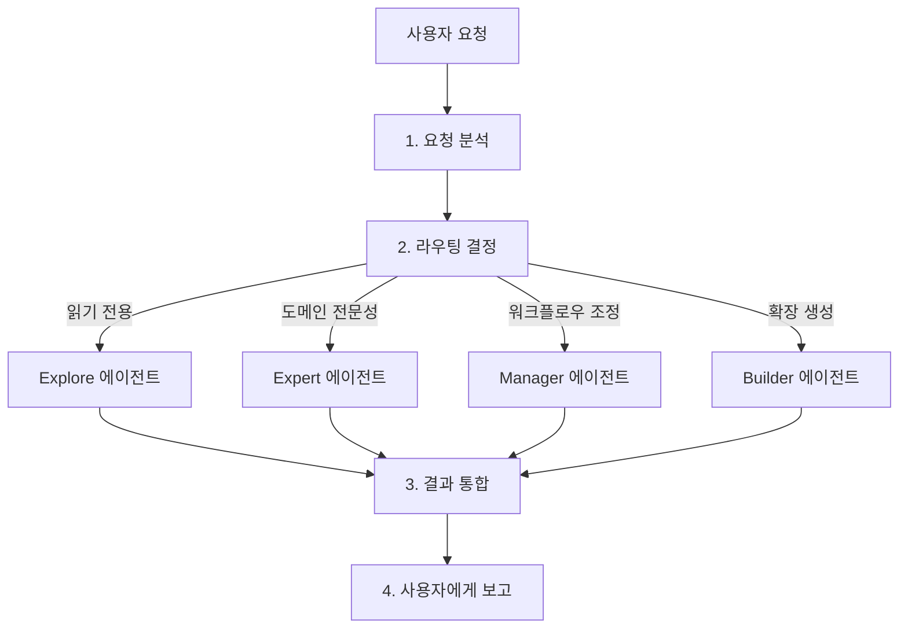
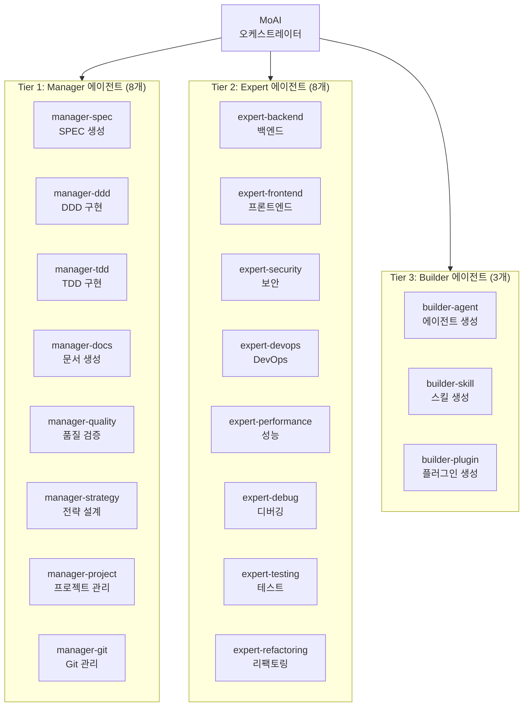
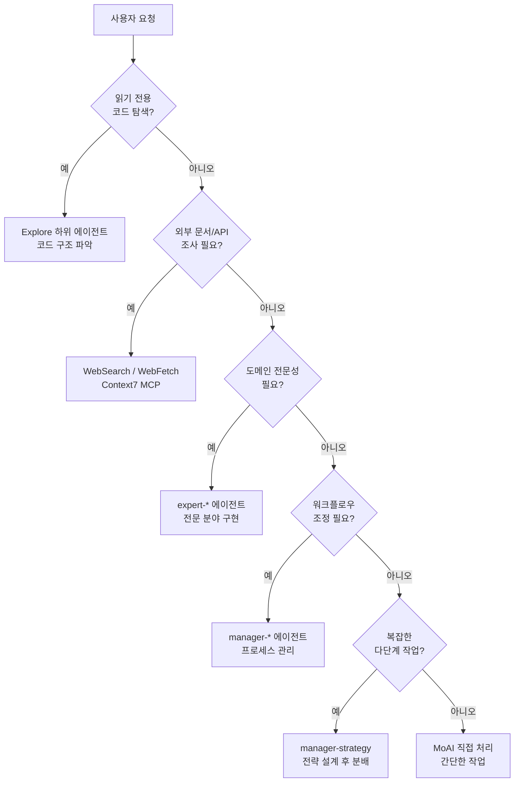
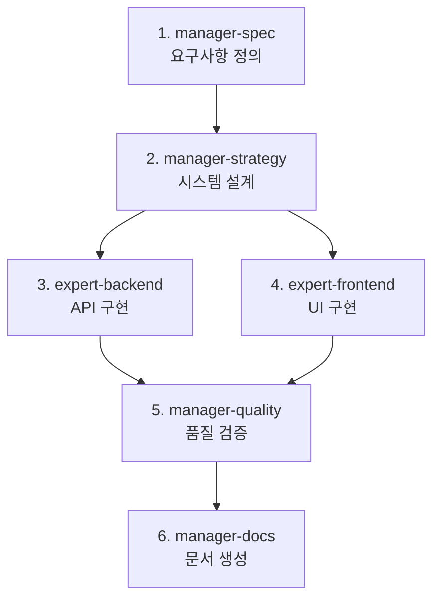

import { Callout } from 'nextra/components'

# 에이전트 가이드

MoAI-ADK의 에이전트 시스템을 상세히 안내합니다.

<Callout type="tip">
**한 줄 요약**: 에이전트는 각 분야의 **전문가 팀**입니다. MoAI가 팀 리더로서 적절한 전문가에게 작업을 배분합니다.
</Callout>

## 에이전트란?

에이전트는 특정 분야에 전문화된 **AI 작업 수행자**입니다.

Claude Code의 **Sub-agent (하위 에이전트)** 시스템을 기반으로 하며, 각 에이전트는 독립적인 컨텍스트 창, 사용자 정의 시스템 프롬프트, 특정 도구 액세, 독립적인 권한을 가집니다.

회사 조직에 비유하면, MoAI는 CEO이고, Manager 에이전트는 부서장, Expert 에이전트는 각 분야의 전문가, Builder 에이전트는 신규 팀원을 채용하는 HR 팀입니다.

## MoAI 오케스트레이터

MoAI는 MoAI-ADK의 **최상위 조율자**입니다. 사용자의 요청을 분석하고 적절한 에이전트에게 작업을 위임합니다.

### MoAI의 핵심 규칙

| 규칙 | 설명 |
|------|------|
| 위임 전용 | 복잡한 작업은 직접 수행하지 않고 전문 에이전트에게 위임 |
| 사용자 창구 | 사용자와의 상호작용은 MoAI만 수행 (하위 에이전트는 불가) |
| 병렬 실행 | 독립적인 작업은 여러 에이전트에게 동시에 위임 |
| 결과 통합 | 에이전트 실행 결과를 취합하여 사용자에게 보고 |

### MoAI의 요청 처리 흐름



## 에이전트 3계층

MoAI-ADK의 에이전트는 **3개 계층**으로 구성됩니다.



## Manager 에이전트 상세

Manager 에이전트는 **워크플로우를 조율하고 관리**하는 역할을 합니다.

| 에이전트 | 역할 | 사용 스킬 | 주요 도구 |
|----------|------|-----------|-----------|
| `manager-spec` | SPEC 문서 생성, EARS 형식 요구사항 정의 | `moai-workflow-spec` | Read, Write, Grep |
| `manager-ddd` | ANALYZE-PRESERVE-IMPROVE 사이클 실행 | `moai-workflow-ddd`, `moai-foundation-core` | Read, Write, Edit, Bash |
| `manager-tdd` | RED-GREEN-REFACTOR 사이클 실행 | `moai-workflow-tdd`, `moai-foundation-core` | Read, Write, Edit, Bash |
| `manager-docs` | 문서 생성, Nextra 통합 | `moai-library-nextra`, `moai-docs-generation` | Read, Write, Edit |
| `manager-quality` | TRUST 5 검증, 코드 리뷰 | `moai-foundation-quality` | Read, Grep, Bash |
| `manager-strategy` | 시스템 설계, 아키텍처 결정 | `moai-foundation-core`, `moai-foundation-philosopher` | Read, Grep, Glob |
| `manager-project` | 프로젝트 구성, 초기화 | `moai-workflow-project` | Read, Write, Bash |
| `manager-git` | Git 브랜칭, 머지 전략 | `moai-foundation-core` | Bash (git) |

### Manager 에이전트와 워크플로우 명령어

Manager 에이전트는 주요 MoAI 워크플로우 명령어와 직접 연결됩니다.

```bash
# Plan 단계: manager-spec이 SPEC 문서 생성
> /moai plan "사용자 인증 시스템 구현"

# Run 단계: manager-ddd가 DDD 사이클 실행
> /moai run SPEC-AUTH-001

# Sync 단계: manager-docs가 문서 동기화
> /moai sync SPEC-AUTH-001
```

## Expert 에이전트 상세

Expert 에이전트는 **특정 도메인에서 실제 구현 작업**을 수행합니다.

| 에이전트 | 역할 | 사용 스킬 | 주요 도구 |
|----------|------|-----------|-----------|
| `expert-backend` | API 개발, 서버 로직, DB 통합 | `moai-domain-backend`, 언어별 스킬 | Read, Write, Edit, Bash |
| `expert-frontend` | React 컴포넌트, UI 구현 | `moai-domain-frontend`, `moai-lang-typescript` | Read, Write, Edit, Bash |
| `expert-security` | 보안 분석, OWASP 준수 | `moai-foundation-core` (TRUST 5) | Read, Grep, Bash |
| `expert-devops` | CI/CD, 인프라, 배포 자동화 | 플랫폼별 스킬 | Read, Write, Bash |
| `expert-performance` | 성능 최적화, 프로파일링 | 도메인별 스킬 | Read, Grep, Bash |
| `expert-debug` | 디버깅, 오류 분석, 문제 해결 | 언어별 스킬 | Read, Grep, Bash |
| `expert-testing` | 테스트 생성, 커버리지 개선 | `moai-workflow-testing` | Read, Write, Bash |
| `expert-refactoring` | 코드 리팩토링, 아키텍처 개선 | `moai-workflow-ddd` | Read, Write, Edit |

### Expert 에이전트 활용 예시

```bash
# 백엔드 API 개발 요청
> FastAPI로 사용자 CRUD API를 만들어줘
# → MoAI가 expert-backend에 위임
# → moai-lang-python + moai-domain-backend 스킬 활성화

# 보안 분석 요청
> 이 코드의 보안 취약점을 분석해줘
# → MoAI가 expert-security에 위임
# → OWASP Top 10 기준으로 분석

# 성능 최적화 요청
> 이 쿼리가 느린데 최적화해줘
# → MoAI가 expert-performance에 위임
# → 프로파일링 및 최적화 제안
```

## Builder 에이전트 상세

Builder 에이전트는 **MoAI-ADK를 확장하는 새로운 구성 요소**를 생성합니다.

| 에이전트 | 역할 | 생성물 |
|----------|------|--------|
| `builder-agent` | 새로운 에이전트 정의 생성 | `.claude/agents/moai/*.md` |
| `builder-skill` | 새로운 스킬 생성 | `.claude/skills/my-skills/*/skill.md` |
| `builder-plugin` | 새로운 플러그인 생성 | `.claude-plugin/plugin.json` |

<Callout type="info">
Builder 에이전트에 대한 자세한 내용은 [빌더 에이전트 가이드](/advanced/builder-agents)를 참고하세요.
</Callout>

## Quality 에이전트 (v2.9.0)

### evaluator-active - 독립적 품질 평가자

`evaluator-active`는 **회의적 품질 평가(Skeptical Quality Evaluation)**를 수행하는 독립적인 에이전트입니다. manager-quality를 보완하며, 능동적 테스트를 통해 결함을 찾는 데 중점을 둡니다.

**핵심 특징:**
- **회의적 평가**: "아마 괜찮을 것이다"는 불허. 구체적인 증거 없이 PASS 금지
- **4차원 평가**: Functionality (40%), Security (25%), Craft (20%), Consistency (15%)
- **HARD 규칙**: Security FAIL = 전체 FAIL (다른 점수와 무관)
- **판정 결과**: PASS, FAIL, UNVERIFIED (확인 불가)

**평가 차원 상세:**

| 차원 | 가중치 | 기준 | FAIL 조건 |
|------|--------|------|-----------|
| Functionality | 40% | 모든 SPEC 인수조건 충족 | 인수조건 하나라도 FAIL |
| Security | 25% | OWASP Top 10 준수 | Critical/High 발견 |
| Craft | 20% | 테스트 커버리지 >= 85% | 커버리지 미달 |
| Consistency | 15% | 코드베이스 패턴 준수 | 주요 패턴 위반 |

**개입 모드:**
- **final-pass** (standard harness): Phase 2.8a 단일 평가
- **per-sprint** (thorough harness): Phase 2.0 계약 협상 + Phase 2.8a 사후 평가

**모드별 배포:**

| 모드 | 동작 방식 |
|------|-----------|
| Sub-agent | `Agent(subagent_type="evaluator-active")` 호출 |
| Team | Reviewer 역할 팀원이 평가 작업 수행 |
| CG | Leader(Claude)가 직접 평가 수행 (에이전트 미생성) |

### SEMAP Behavioral Contracts (행동 계약)

SEMAP (Semantic Agent Protocol)은 에이전트의 **행동 범위를 명시적으로 제한**하는 계약 시스템입니다. manager-ddd, manager-quality에 적용됩니다.

**SEMAP 구조:**

| 요소 | 설명 | 예시 |
|------|------|------|
| **Preconditions** | 실행 전 참 상태 | 구현 단계 완료, 모든 대상 파일 접근 가능 |
| **Postconditions** | 실행 후 참 상태 | 품질 보고서 생성, 모든 Critical 발견에 수정 제안 |
| **Invariants** | 실행 중 유지 조건 | 읽기 전용 작업, 독립적 판단 |
| **Forbidden** | 금지 동작 | PASS 증거 없이 수여, 소스 코드 수정 |

<Callout type="info">
SEMAP 계약은 에이전트 정의 파일(`.claude/agents/moai/*.md`)의 `## Behavioral Contract (SEMAP)` 섹션에 정의됩니다.
</Callout>

### 모델 정책 (Model Policy)

MoAI-ADK는 3단계 모델 정책을 지원합니다.

| 정책 | 설명 | Opus | Sonnet | Haiku |
|------|------|------|--------|-------|
| **high** | 최대 품질 | spec, strategy, security | backend, frontend, ddd, tdd | quality, git, researcher |
| **medium** | 균형 (기본값) | spec, strategy, security | backend, frontend, ddd, tdd | quality, git, researcher |
| **low** | 비용 최적화 | 없음 | spec, strategy, security | 나머지 전부 |

```bash
moai init --model-policy high
moai update -c --model-policy medium
```

---


## 에이전트 선택 결정 트리

MoAI가 사용자 요청을 분석하여 적절한 에이전트를 선택하는 과정입니다.



### 에이전트 선택 기준

| 작업 유형 | 선택할 에이전트 | 예시 |
|-----------|----------------|------|
| 코드 읽기/분석 | Explore | "이 프로젝트의 구조를 분석해줘" |
| API 개발 | expert-backend | "REST API 엔드포인트 만들어줘" |
| UI 구현 | expert-frontend | "로그인 페이지 만들어줘" |
| 버그 수정 | expert-debug | "이 에러 원인을 찾아줘" |
| 테스트 작성 | expert-testing | "이 함수의 테스트를 추가해줘" |
| 보안 검토 | expert-security | "보안 취약점 점검해줘" |
| SPEC 생성 | manager-spec | `/moai plan "기능 설명"` |
| DDD 구현 | manager-ddd | `/moai run SPEC-XXX` |
| 문서 생성 | manager-docs | `/moai sync SPEC-XXX` |
| 코드 리뷰 | manager-quality | "이 PR을 리뷰해줘" |
| 확장 생성 | builder-* | "새 스킬을 만들어줘" |

## 에이전트 정의 파일

에이전트는 `.claude/agents/moai/` 디렉토리에 마크다운 파일로 정의됩니다.

### 파일 구조

```
.claude/agents/moai/
├── expert-backend.md
├── expert-frontend.md
├── expert-security.md
├── expert-devops.md
├── expert-performance.md
├── expert-debug.md
├── expert-testing.md
├── expert-refactoring.md
├── manager-spec.md
├── manager-ddd.md
├── manager-docs.md
├── manager-quality.md
├── manager-strategy.md
├── manager-project.md
├── manager-git.md
├── builder-agent.md
├── builder-skill.md
└── builder-plugin.md
```

### 에이전트 정의 형식

```markdown
---
name: expert-backend
description: >
  백엔드 API 개발 전문가. API 설계, 서버 로직, 데이터베이스 통합을 담당.
  PROACTIVELY 사용하여 백엔드 구현 작업 시 자동 위임.
tools: Read, Write, Edit, Grep, Glob, Bash, TodoWrite
model: sonnet
---

당신은 백엔드 개발 전문가입니다.

## 역할
- REST/GraphQL API 설계 및 구현
- 데이터베이스 스키마 설계
- 인증/인가 시스템 구현
- 서버 사이드 비즈니스 로직

## 사용 스킬
- moai-domain-backend
- moai-lang-python (Python 프로젝트 시)
- moai-lang-typescript (TypeScript 프로젝트 시)

## 품질 기준
- TRUST 5 프레임워크 준수
- 85%+ 테스트 커버리지
- OWASP Top 10 보안 기준
```

<Callout type="warning">
**주의**: 하위 에이전트는 **사용자에게 직접 질문할 수 없습니다**. 모든 사용자 상호작용은 MoAI를 통해서만 이루어집니다. 에이전트에게 위임하기 전에 필요한 정보를 미리 수집하세요.
</Callout>

## 에이전트 간 협업 패턴

### 순차 실행 (의존성 있음)

```bash
# 1. manager-spec이 SPEC 생성
# 2. SPEC을 바탕으로 manager-ddd가 구현
# 3. 구현 완료 후 manager-docs가 문서 생성
> /moai plan "인증 시스템"
> /moai run SPEC-AUTH-001
> /moai sync SPEC-AUTH-001
```

### 병렬 실행 (독립적 작업)

```bash
# MoAI가 독립적인 작업을 동시에 위임
# - expert-backend: API 구현
# - expert-frontend: UI 구현
# - expert-testing: 테스트 작성
> 백엔드 API와 프론트엔드 UI를 동시에 만들어줘
```

### 에이전트 체인

복잡한 작업에서는 여러 에이전트가 순서대로 작업을 이어받습니다.



## Sub-agent (하위 에이전트) 시스템

Claude Code의 공식 Sub-agent 시스템은 MoAI-ADK의 에이전트 구조의 기반이 됩니다.

### Sub-agent란?

Sub-agent는 **특정 작업 유형에 특화된 AI 어시스턴트**입니다.

| 특징 | 설명 |
|------|------|
| **독립 컨텍스트** | 각 sub-agent는 자체 컨텍스트 창에서 실행 |
| **사용자 정의 프롬프트** | 전문 시스템 프롬프트로 작동 방식 정의 |
| **특정 도구 액세** | 필요한 도구만 선택적으로 제공 |
| **독립 권한** | 개별 권한 설정 가능 |

### Sub-agent vs 에이전트 팀

| 하위 에이전트 모드 | 에이전트 팀 모드 |
|-----------------|---------------|
| 단일 sub-agent가 순차적으로 작업 수행 | 여러 팀원이 병렬로 협업 |
| 간단한 작업에 적합 | 복잡한 다단계 작업에 적합 |
| 빠른 실행 | 체계적인 조율 필요 |

## 에이전트 팀 (Agent Teams)

에이전트 팀 모드는 여러 전문가가 **병렬로 협업**하는 고급 워크플로우입니다.

<Callout type="info">
**실험적 기능**: 에이전트 팀은 Claude Code v2.1.32+에서 사용 가능하며 `CLAUDE_CODE_EXPERIMENTAL_AGENT_TEAMS=1` 환경 변수와 `workflow.team.enabled: true` 설정이 필요합니다.
</Callout>

### 팀 모드 설정

| 설정 | 기본값 | 설명 |
|---------|---------|-------------|
| `workflow.team.enabled` | `false` | 에이전트 팀 모드 활성화 |
| `workflow.team.max_teammates` | `10` | 팀당 최대 팀원 수 |
| `workflow.team.auto_selection` | `true` | 복잡도 기반 자동 모드 선택 |

### 모드 선택

| 플래그 | 동작 |
|-------|------|
| **--team** | 팀 모드 강제 |
| **--solo** | 하위 에이전트 모드 강제 |
| **플래그 없음** | 복잡도 임계값에 따라 자동 선택 |

### /moai --team 워크플로우

MoAI의 `--team` 플래그는 SPEC 워크플로우에서 에이전트 팀을 활성화합니다.

```bash
# Plan 단계: 팀 모드로 연구 및 분석
> /moai plan --team "사용자 인증 시스템"
# researcher, analyst, architect가 병렬로 작업

# Run 단계: 팀 모드로 구현
> /moai run --team SPEC-AUTH-001
# backend-dev, frontend-dev, tester가 병렬로 작업

# Sync 단계: 문서 생성 (항상 sub-agent)
> /moai sync SPEC-AUTH-001
# manager-docs가 문서 생성
```

### 팀 구성

| 역할 | Plan Phase | Run Phase | 권한 |
|------|------------|-----------|------|
| **팀 리드** | MoAI | MoAI | 모든 작업 조율 |
| **연구원** | researcher (haiku) | - | 읽기 전용 코드 분석 |
| **분석가** | analyst (inherit) | - | 요구사항 분석 |
| **설계자** | architect (inherit) | - | 기술 설계 |
| **백엔드 개발** | - | backend-dev (acceptEdits) | 서버 측 파일 |
| **프론트엔드 개발** | - | frontend-dev (acceptEdits) | 클라이언트 측 파일 |
| **테스터** | - | tester (acceptEdits) | 테스트 파일 |
| **디자이너** | - | designer (acceptEdits) | UI/UX 디자인 |
| **품질** | - | quality (plan) | TRUST 5 검증 |

### 팀 파일 소유권

에이전트 팀에서는 파일 소유권을 명확히 구분하여 충돌을 방지합니다.

| 파일 유형 | 소유권 |
|----------|--------|
| `.md` 문서 | 모든 팀원 |
| `src/` | backend-dev |
| `components/` | frontend-dev |
| `tests/` | tester |
| `*.design.pen` | designer |
| 공유 설정 | 모든 팀원 |

## 관련 문서

- [스킬 가이드](/advanced/skill-guide) - 에이전트가 활용하는 스킬 체계
- [빌더 에이전트 가이드](/advanced/builder-agents) - 커스텀 에이전트 생성
- [Hooks 가이드](/advanced/hooks-guide) - 에이전트 실행 전후 자동화
- [SPEC 기반 개발](/core-concepts/spec-based-dev) - SPEC 워크플로우 상세

<Callout type="tip">
**팁**: 에이전트를 직접 지정하지 않아도 됩니다. MoAI에게 자연어로 요청하면 최적의 에이전트를 자동으로 선택합니다. "API 만들어줘"라고 하면 `expert-backend`가, "이 코드 리뷰해줘"라고 하면 `manager-quality`가 자동으로 호출됩니다.
</Callout>
