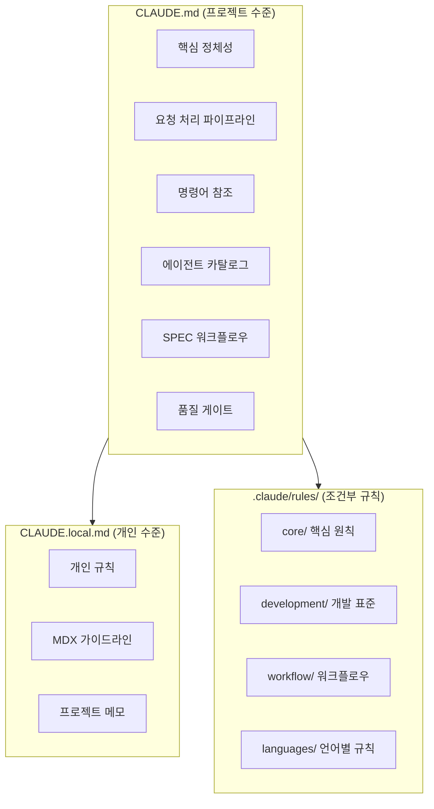
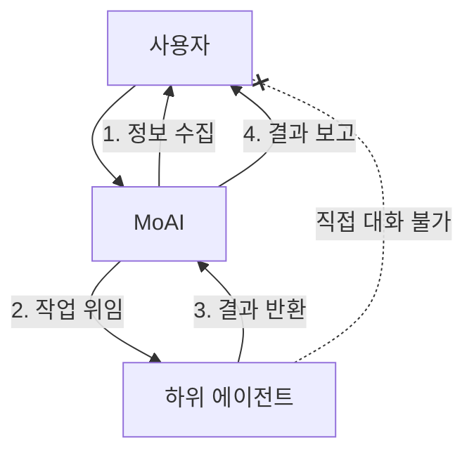
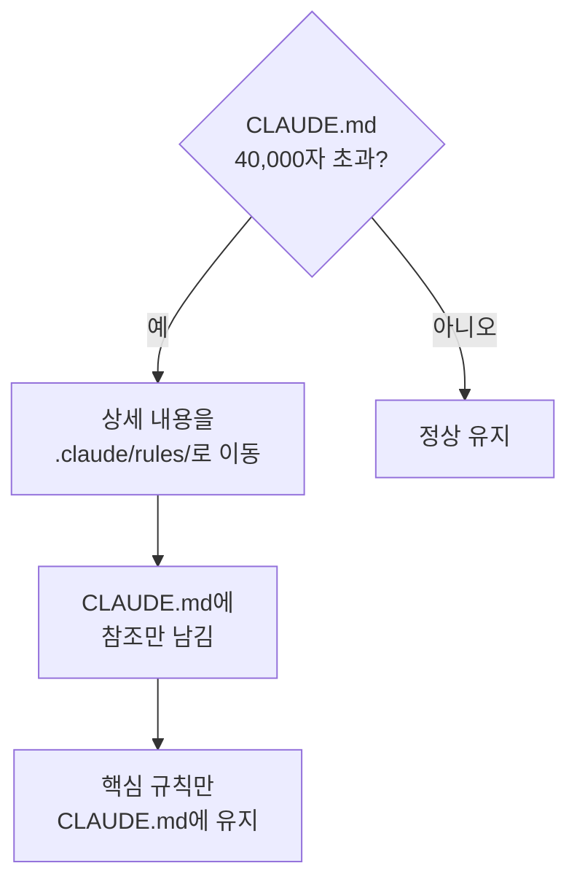
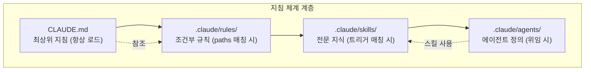

import { Callout } from 'nextra/components'

# CLAUDE.md 가이드

Claude Code의 핵심 지침 파일 체계를 상세히 안내합니다.

<Callout type="tip">
**한 줄 요약**: `CLAUDE.md`는 프로젝트의 **헌법**입니다. Claude Code가 프로젝트를 어떻게 이해하고, 어떤 규칙을 따르며, 어떤 에이전트를 호출할지 모두 이 파일에서 결정됩니다.
</Callout>

## CLAUDE.md란?

`CLAUDE.md`는 Claude Code가 세션을 시작할 때 **가장 먼저 읽는 지침 파일**입니다. 이 파일에 프로젝트의 규칙, 에이전트 구조, 워크플로우, 품질 기준 등이 정의되어 있습니다.

사람이 새 회사에 입사하면 사원 핸드북을 읽는 것처럼, Claude Code는 세션을 시작할 때 `CLAUDE.md`를 읽고 프로젝트의 맥락을 파악합니다.

## 파일 구조

MoAI-ADK는 2개의 지침 파일과 규칙 디렉토리를 사용합니다.



| 파일/디렉토리 | 용도 | Git 추적 | 업데이트 시 |
|---------------|------|----------|-------------|
| `CLAUDE.md` | MoAI-ADK 핵심 지침 | 예 | 덮어쓰기 |
| `CLAUDE.local.md` | 개인 커스텀 지침 | 아니오 | 보존 |
| `.claude/rules/moai/` | 조건부 세부 규칙 | 예 | 덮어쓰기 |
| `.claude/rules/local/` | 개인 커스텀 규칙 | 아니오 | 보존 |

## MoAI CLAUDE.md 주요 섹션

### 1. 핵심 정체성

MoAI 오케스트레이터의 역할과 HARD 규칙을 정의합니다.

```markdown
## 1. 핵심 정체성

MoAI는 Claude Code의 전략적 오케스트레이터입니다.

### HARD 규칙 (필수)
- [HARD] 언어 인식 응답: 사용자의 conversation_language로 응답
- [HARD] 병렬 실행: 독립적인 도구 호출은 병렬 실행
- [HARD] XML 태그 비표시: 사용자 대면 응답에 XML 비표시
- [HARD] Markdown 출력: 모든 커뮤니케이션에 Markdown 사용
```

### 2. 요청 처리 파이프라인

사용자 요청을 분석하고 라우팅하는 4단계 파이프라인입니다.

| 단계 | 설명 |
|------|------|
| 1. 분석 | 요청의 복잡성 평가, 기술 키워드 감지 |
| 2. 라우팅 | 명령 유형에 따라 적절한 경로 선택 |
| 3. 실행 | 에이전트에게 위임하여 작업 수행 |
| 4. 보고 | 결과 통합 및 사용자에게 보고 |

### 3. 명령어 참조

MoAI-ADK의 3가지 명령어 유형을 정의합니다.

| 유형 | 명령어 | 용도 |
|------|--------|------|
| Type A (워크플로우) | `/moai project`, `/moai plan`, `/moai run`, `/moai sync` | 주요 개발 워크플로우 |
| Type B (유틸리티) | `/moai`, `/moai fix`, `/moai loop` | 빠른 수정, 자동화 |
| Type C (피드백) | `/moai feedback` | 개선 사항 보고 |

### 4. 에이전트 카탈로그

20개 에이전트의 역할과 선택 기준을 정의합니다.

| 계층 | 에이전트 | 개수 |
|------|----------|------|
| Manager | spec, ddd, docs, quality, strategy, project, git | 7개 |
| Expert | backend, frontend, security, devops, performance, debug, testing, refactoring | 8개 |
| Builder | agent, skill, command, plugin | 4개 |

### 5. SPEC 워크플로우

3단계 SPEC 기반 개발 워크플로우를 정의합니다.

```bash
# Plan: SPEC 문서 생성 (30K 토큰)
> /moai plan "기능 설명"

# Run: DDD 구현 (180K 토큰)
> /moai run SPEC-XXX

# Sync: 문서 동기화 (40K 토큰)
> /moai sync SPEC-XXX
```

### 6. 품질 게이트

TRUST 5 프레임워크와 LSP 품질 게이트를 정의합니다.

| 품질 기준 | 요구사항 |
|-----------|----------|
| Tested | 85%+ 커버리지, LSP 타입 오류 0 |
| Readable | 명확한 이름, LSP 린트 오류 0 |
| Unified | 일관된 스타일, LSP 경고 10 이하 |
| Secured | OWASP 준수, LSP 보안 경고 0 |
| Trackable | 명확한 커밋, LSP 상태 추적 |

### 7. 사용자 상호작용 아키텍처

하위 에이전트는 사용자와 직접 대화할 수 없습니다.



### 8. 구성 참조

언어 설정, 사용자 설정, 프로젝트 규칙을 참조합니다.

```yaml
language:
  conversation_language: ko           # 사용자 응답 언어
  agent_prompt_language: en           # 에이전트 내부 언어
  git_commit_messages: en             # Git 커밋 메시지
  code_comments: en                   # 코드 주석
  documentation: en                   # 문서 파일
```

## CLAUDE.local.md 활용법

`CLAUDE.local.md`는 개인적인 규칙과 메모를 작성하는 파일입니다. MoAI-ADK 업데이트와 무관하게 보존됩니다.

### 작성 예시

```markdown
# 프로젝트 로컬 설정

## 문서 작성 가이드라인

### MDX 렌더링 오류 방지
- 강조 표시와 괄호 사이에 반드시 공백

### Mermaid 다이어그램 방향
- 모든 다이어그램은 세로 방향 (flowchart TD)

## 개인 메모
- DB 마이그레이션 전 백업 필수
- API 엔드포인트 네이밍: kebab-case 사용
```

### 활용 팁

| 용도 | 내용 예시 |
|------|-----------|
| 코딩 규칙 | "변수명은 camelCase, 파일명은 kebab-case" |
| 프로젝트 메모 | "인증은 JWT, 만료 24시간, 갱신 7일" |
| 금지 사항 | "console.log를 프로덕션 코드에 남기지 말 것" |
| 선호 패턴 | "React 컴포넌트는 함수형만 사용" |
| MDX 규칙 | "강조와 괄호 사이 공백 필수" |

## .claude/rules/ 시스템

`.claude/rules/` 디렉토리에는 **조건부로 로드되는 세부 규칙**이 저장됩니다.

### 디렉토리 구조

```
.claude/rules/moai/
├── core/                          # 핵심 원칙
│   └── moai-constitution.md       # TRUST 5, 핵심 규칙
├── development/                   # 개발 표준
│   ├── skill-authoring.md         # 스킬 작성 가이드
│   └── coding-standards.md        # 코딩 표준
├── workflow/                      # 워크플로우
│   ├── workflow-modes.md          # Plan/Run/Sync 정의
│   └── spec-workflow.md           # SPEC 워크플로우
└── languages/                     # 언어별 규칙 (16개)
    ├── python.md
    ├── typescript.md
    ├── javascript.md
    └── ...
```

### 조건부 로딩 (paths frontmatter)

규칙 파일은 `paths` 프론트매터를 통해 **특정 파일 작업 시에만 로드**됩니다.

```yaml
---
paths:
  - "**/*.py"
  - "**/pyproject.toml"
---

# Python 코딩 규칙
- ruff 포맷터 사용
- type hints 필수
- docstring은 Google 스타일
```

이 규칙은 Python 파일을 수정할 때만 로드되어 **토큰을 절약**합니다.

### 규칙 파일 종류

| 디렉토리 | 파일 | 로드 조건 |
|----------|------|-----------|
| `core/` | `moai-constitution.md` | 항상 로드 |
| `development/` | `skill-authoring.md` | 스킬 관련 작업 시 |
| `development/` | `coding-standards.md` | 코드 작업 시 |
| `workflow/` | `workflow-modes.md` | 워크플로우 명령 시 |
| `workflow/` | `spec-workflow.md` | SPEC 관련 작업 시 |
| `languages/` | `python.md` 등 | 해당 언어 파일 수정 시 |

## 크기 제한

`CLAUDE.md`는 **40,000자 이하**를 유지해야 합니다.

### 크기 초과 시 대응 방법



**대응 전략:**

1. **상세 내용 이동**: 긴 설명은 `.claude/rules/` 파일로 분리
2. **참조 사용**: `CLAUDE.md`에서 `@파일경로`로 참조
3. **핵심만 유지**: 정체성, HARD 규칙, 에이전트 카탈로그만 유지
4. **스킬로 전환**: 긴 패턴 설명은 스킬로 변환

## 실전 예시: CLAUDE.local.md 커스텀 규칙

### 프론트엔드 프로젝트

```markdown
# 프로젝트 로컬 설정

## React 규칙
- 컴포넌트는 반드시 함수형으로 작성
- Props 인터페이스는 컴포넌트 파일 상단에 정의
- 상태 관리는 Zustand 사용
- CSS는 Tailwind CSS만 사용

## 네이밍 규칙
- 컴포넌트: PascalCase (UserProfile.tsx)
- 유틸리티: camelCase (formatDate.ts)
- 상수: UPPER_SNAKE_CASE (MAX_RETRY_COUNT)
- API 엔드포인트: kebab-case (/api/user-profiles)

## 금지 사항
- any 타입 사용 금지
- console.log 프로덕션 코드에 금지
- default export 금지 (named export만 사용)
```

### 백엔드 프로젝트

```markdown
# 프로젝트 로컬 설정

## Python 규칙
- FastAPI 사용
- 비동기 함수 우선 (async/await)
- Pydantic v2 모델 사용
- SQLAlchemy 2.0 스타일

## 데이터베이스 규칙
- 마이그레이션 전 반드시 백업
- 인덱스는 쿼리 패턴 분석 후 추가
- soft delete 패턴 사용 (is_deleted 플래그)

## API 규칙
- RESTful 엔드포인트 네이밍
- 응답 형식 통일: {"data": ..., "message": ...}
- 에러 코드 표준화
```

## CLAUDE.md, rules, skills의 관계



| 계층 | 파일 | 로드 시점 | 역할 |
|------|------|-----------|------|
| 1. CLAUDE.md | `CLAUDE.md` | 항상 | 프로젝트 정체성, 핵심 규칙 |
| 2. Rules | `.claude/rules/*.md` | 파일 패턴 매칭 시 | 조건부 세부 규칙 |
| 3. Skills | `.claude/skills/*/skill.md` | 트리거 매칭 시 | 전문 지식, 패턴 |
| 4. Agents | `.claude/agents/*.md` | 위임 시 | 전문가 역할 정의 |

## 관련 문서

- [스킬 가이드](/advanced/skill-guide) - 스킬 시스템 상세
- [에이전트 가이드](/advanced/agent-guide) - 에이전트 시스템 상세
- [settings.json 가이드](/advanced/settings-json) - 설정 파일 관리
- [Hooks 가이드](/advanced/hooks-guide) - 이벤트 자동화

<Callout type="tip">
**팁**: `CLAUDE.md`를 직접 수정하는 것보다 `CLAUDE.local.md`에 개인 규칙을 추가하는 것을 권장합니다. MoAI-ADK 업데이트 시에도 개인 규칙이 안전하게 보존됩니다.
</Callout>
