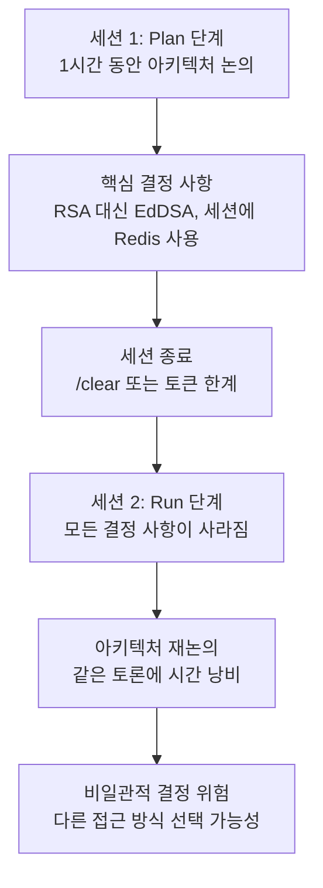
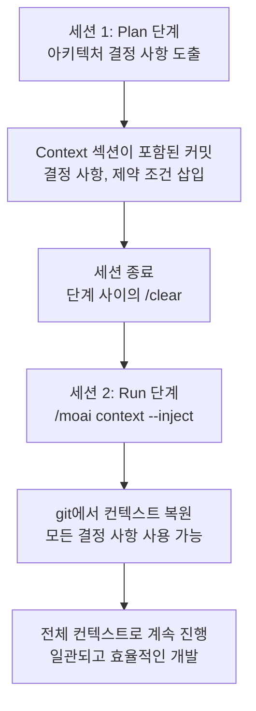
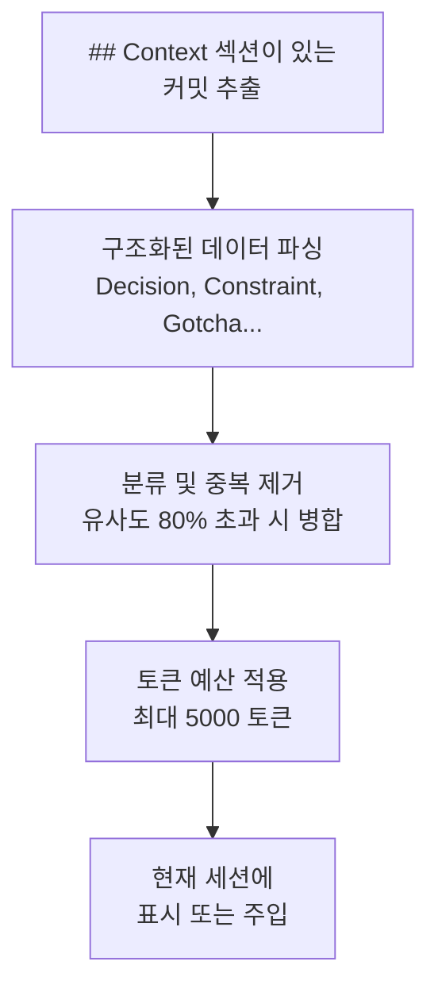
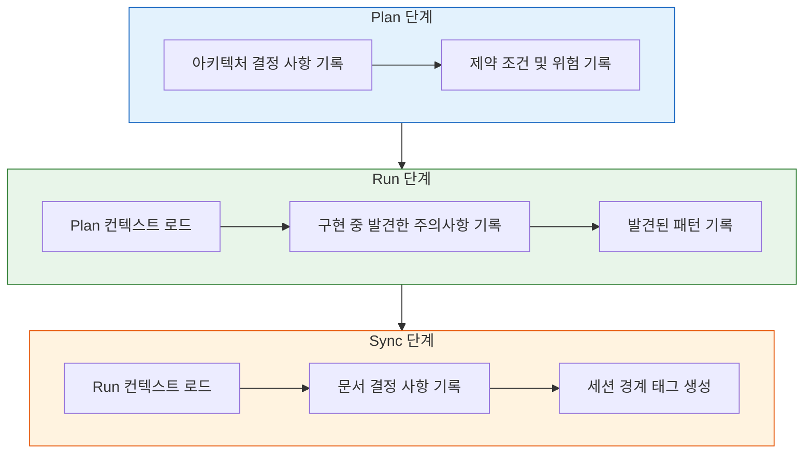

import { Callout } from "nextra/components";

# MoAI Memory

세션 간 AI-개발자 상호작용 컨텍스트를 보존하는 MoAI-ADK의 Git 기반 컨텍스트 메모리 시스템에 대한 상세 가이드입니다.

<Callout type="tip">
  **한 줄 요약:** MoAI Memory는 구조화된 컨텍스트 (결정 사항, 제약 조건, 주의사항) 를 git 커밋 메시지에 삽입하여, 다음 세션에서 정확히 이전에 작업하던 부분부터 이어서 시작할 수 있게 합니다.
</Callout>

## MoAI Memory란?

MoAI Memory는 구조화된 git 커밋 메시지를 사용하여 세션 간 AI-개발자 상호작용 컨텍스트를 보존하는 **Git 기반 컨텍스트 메모리 시스템**입니다. 모든 구현 커밋에는 개발 중에 발견된 결정 사항, 제약 조건, 패턴을 기록하는 `## Context` 섹션이 포함됩니다.

일상적인 비유로 설명하면, MoAI Memory는 **의사의 진료 차트**와 같습니다. 진료할 때마다 의사가 진단, 처방, 소견을 기록하고, 다음 진료 시 차트를 읽어 같은 질문을 반복하지 않고도 환자의 이력을 바로 파악하는 것과 같습니다.

| 진료 차트 | MoAI Memory | 공통점 |
|-----------|-------------|--------|
| 진단 및 처방 | 결정 사항 및 제약 조건 | 결정된 내용을 기록합니다 |
| 관찰된 부작용 | 발견된 주의사항 | 예상치 못한 발견을 기록합니다 |
| 치료 계획 | 패턴 및 위험 | 접근 방식과 주의사항을 기록합니다 |
| 환자 선호도 | UserPrefs | 개인 선호도를 기록합니다 |

## 왜 MoAI Memory가 필요한가?

### 세션 연속성 문제

여러 세션에 걸쳐 AI와 함께 개발할 때 가장 큰 문제는 **이전 결정의 컨텍스트를 잃어버리는 것**입니다.



**컨텍스트가 손실되는 일반적인 상황:**

| 상황 | 발생하는 일 | 영향 |
|------|------------|------|
| 단계 전환 | Plan과 Run 단계 사이의 `/clear` | 모든 계획 결정 사항 손실 |
| 토큰 한계 | 긴 세션에서 초기 컨텍스트 잘림 | 중요한 아키텍처 결정 손실 |
| 팀 핸드오프 | 다음 단계를 다른 에이전트가 처리 | 에이전트가 이전 컨텍스트 부재 |
| 다일 작업 | 하루 또는 주말 후 재개 | 모든 것을 다시 설명해야 함 |

### MoAI Memory의 해결책

MoAI Memory는 구조화된 컨텍스트를 git 커밋에 직접 삽입하여, 컨텍스트가 **코드와 함께 이동**하도록 합니다.



<Callout type="info">
**MoAI Memory 없이:**

세션 2는 컨텍스트 없이 시작됩니다. AI가 EdDSA 대신 RSA를 선택하거나, 세션에 Redis를 선택했다는 사실을 잊을 수 있습니다. 이미 결정된 사항을 다시 논의하는 데 시간을 소비하게 됩니다.

**MoAI Memory 사용 시:**

단일 명령으로 모든 이전 결정 사항을 로드합니다:

```bash
> /moai context --spec SPEC-AUTH-001 --inject
```

</Callout>

## 작동 방식

모든 구현 커밋에는 6가지 카테고리의 컨텍스트를 기록하는 구조화된 `## Context` 섹션이 포함됩니다:

| 카테고리 | 목적 | 예시 |
|----------|------|------|
| **Decision** | 기술적 선택과 근거 | "RSA256 대신 EdDSA (성능 우선)" |
| **Constraint** | 활성 제약 조건 | "/api/v1 하위 호환성 유지 필수" |
| **Gotcha** | 발견된 함정 | "Redis TTL은 토큰 저장에 불안정" |
| **Pattern** | 참고한 참조 구현 | "auth.go:45의 미들웨어 체인 패턴" |
| **Risk** | 알려진 위험 / 연기된 항목 | "속도 제한은 2단계로 연기" |
| **UserPref** | 개발자 선호도 | "OOP보다 함수형 스타일 선호" |

### 세션 간 컨텍스트 흐름

```
세션 1 (Plan)          세션 2 (Run)           세션 3 (Sync)
    |                      |                      |
    v                      v                      v
 결정 사항 --> git commit --> 컨텍스트 --> git commit --> 컨텍스트
 제약 조건   with ## Context  git에서     with ## Context  git에서
 패턴        섹션              로드        섹션              로드
```

## 커밋 형식

DDD와 TDD 워크플로우 모두 컨텍스트 섹션이 포함된 구조화된 커밋을 생성합니다.

### TDD 모드 커밋

```
🔴 RED: Add failing test for token expiry validation
SPEC: SPEC-AUTH-001
Phase: RUN-RED

## Context (AI-Developer Memory)
- Decision: 15-minute access token TTL (security best practice)
- Gotcha: Clock skew between services requires 30s grace period
- Pattern: Token validation pattern from middleware/auth.go:89

## MX Tags Changed
- Added: @MX:TODO auth_test.go:15 (test for token expiry)
```

### DDD 모드 커밋

```
🔴 ANALYZE: Document JWT validation behavior
SPEC: SPEC-AUTH-001
Phase: RUN-ANALYZE

## Context (AI-Developer Memory)
- Decision: Use EdDSA for JWT signing (performance priority)
- Constraint: Must support existing RSA tokens during migration
- Risk: Token rotation deferred to Phase 2

## MX Tags Changed
- Added: @MX:ANCHOR jwt.go:42 (fan_in: 5)
```

<Callout type="info">
  `## Context` 섹션은 커밋 생성 시 **manager-git 에이전트**에 의해 자동으로 생성됩니다. 직접 작성할 필요가 없습니다.
</Callout>

## 컨텍스트 조회

`/moai context` 명령을 사용하여 이전 컨텍스트를 조회하고 주입합니다.

### SPEC의 컨텍스트 조회

```bash
# 특정 SPEC의 모든 컨텍스트 조회
/moai context --spec SPEC-AUTH-001

# 최근 7일간의 결정 사항만 조회
/moai context --category Decision --days 7

# 압축된 요약만 표시
/moai context --spec SPEC-AUTH-001 --summary
```

### 현재 세션에 컨텍스트 주입

```bash
# 이전 컨텍스트를 현재 세션에 로드
/moai context --spec SPEC-AUTH-001 --inject
```

이 명령은 SPEC 관련 git 커밋에서 모든 컨텍스트를 추출하여 현재 세션에 주입하므로, 원활한 작업 재개가 가능합니다.

### 조회 방식



**토큰 예산 우선순위:**

| 우선순위 | 카테고리 | 근거 |
|----------|----------|------|
| 1 (중요) | Decisions, Constraints | 핵심 아키텍처 컨텍스트 |
| 2 (중요) | Gotchas, Risks | 실수 반복 방지 |
| 3 (권장) | Patterns, UserPrefs | 효율성 향상 |

## 컨텍스트 카테고리 상세

### Decision

**무엇을 선택했고 왜인지**를 기록합니다. 세션 연속성에 가장 중요한 카테고리입니다.

```
- Decision: EdDSA over RSA256 (user requested, performance priority)
- Decision: Use Redis for session storage (low latency requirement)
- Decision: Separate auth service from main API (microservice boundary)
```

### Constraint

**반드시 준수해야 하는 활성 제한**을 기록합니다.

```
- Constraint: Must maintain /api/v1 backward compatibility
- Constraint: API response time within 500ms (P95)
- Constraint: Cannot use external OAuth providers (air-gapped environment)
```

### Gotcha

개발 중에 발견된 **예상치 못한 함정**을 기록합니다. 같은 실수가 반복되는 것을 방지합니다.

```
- Gotcha: Redis TTL unreliable for RefreshToken storage, use DB instead
- Gotcha: Clock skew between services requires 30s grace period
- Gotcha: bcrypt cost factor 12 causes 300ms delay on low-end hardware
```

### Pattern

현재 작업을 안내한 **참조 구현**을 기록합니다.

```
- Pattern: middleware chain pattern from auth.go:45
- Pattern: error handling pattern from pkg/errors/handler.go
- Pattern: repository pattern from internal/user/repository.go
```

### Risk

미래 세션을 위한 **알려진 위험**과 연기된 항목을 기록합니다.

```
- Risk: Rate limiting deferred to Phase 2
- Risk: Token rotation not yet implemented (security debt)
- Risk: No load testing for concurrent session handling
```

### UserPref

일관된 상호작용 스타일을 위한 **개발자 선호도**를 기록합니다.

```
- UserPref: Prefers functional style over OOP
- UserPref: Wants detailed commit messages with context
- UserPref: Prefers Go table-driven tests
```

## 주요 이점

| 이점 | 설명 |
|------|------|
| **제로 의존성** | git 자체를 메모리 저장소로 사용합니다 -- 외부 데이터베이스나 서비스 불필요 |
| **팀 공유** | `git clone`과 함께 컨텍스트가 이동합니다 -- 자동 팀 지식 이전 |
| **완전한 감사 추적** | `git log`로 완전한 결정 이력 확인 가능 |
| **세션 연속성** | `/clear` 또는 세션 중단 후 전체 컨텍스트로 작업 재개 |
| **단계 전환** | Plan에서 Run으로, Run에서 Sync로 컨텍스트가 자연스럽게 흐름 |

## MoAI 워크플로우와의 통합

MoAI Memory는 Plan-Run-Sync 파이프라인의 각 단계와 통합됩니다:



### 세션 경계 태그

각 단계가 완료된 후 경계를 표시하는 git 태그가 생성됩니다:

```bash
# 세션 경계 태그 예시
git tag -a "moai/SPEC-AUTH-001/run-complete" \
  -m "Run phase completed
SPEC: SPEC-AUTH-001
Decisions: 5, Constraints: 3, Risks: 2
Next action: /moai sync SPEC-AUTH-001"
```

이 태그는 `/moai context`가 단계 전환 지점을 빠르게 찾는 데 도움을 줍니다.

## 설계 영감

MoAI Memory는 [claude-mem](https://github.com/thedotmack/claude-mem), [claude-brain](https://github.com/memvid/claude-brain), [memory-mcp](https://github.com/yuvalsuede/memory-mcp)에서 영감을 받아, 추가 인프라가 전혀 필요 없는 Git 네이티브 방식으로 재설계되었습니다.

## 관련 문서

- [MoAI-ADK란?](/core-concepts/what-is-moai-adk) -- MoAI-ADK의 전체 아키텍처를 이해합니다
- [SPEC 기반 개발](/core-concepts/spec-based-dev) -- SPEC 문서가 어떻게 생성되고 관리되는지 배웁니다
- [TRUST 5 품질](/core-concepts/trust-5) -- 모든 코드 변경에 대한 품질 검증 기준을 배웁니다
