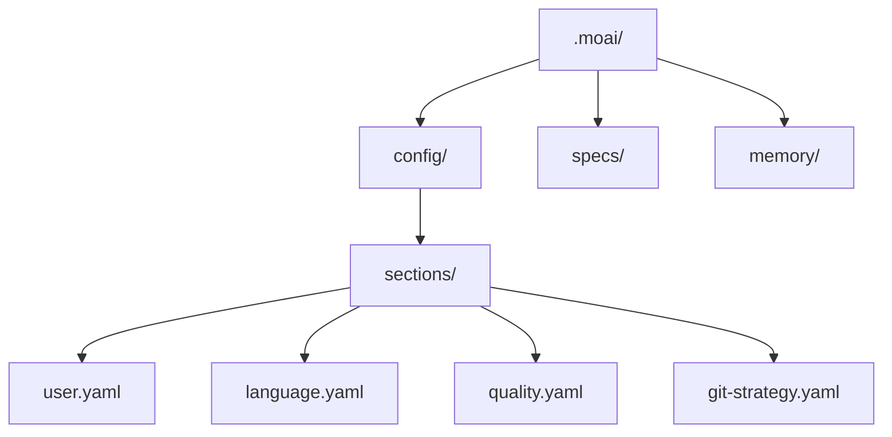
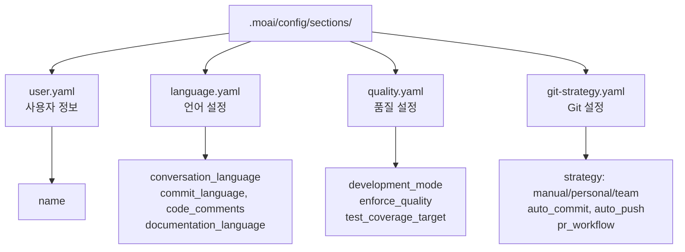

import { Callout } from 'nextra/components'

# 초기 설정

MoAI-ADK의 인터랙티브 설정 마법사를 통해 첫 설정을 완료하세요. 9단계를 통해 시스템을 개발 환경에 맞게 구성합니다.

## 설정 마법사 시작

### 신규 프로젝트 생성

새로운 프로젝트를 생성하면서 초기화하려면:

```bash
moai init my-project
```

이 명령은 `my-project` 폴더를 생성하고 MoAI-ADK를 초기화합니다.

### 현재 폴더에 설치

기존 프로젝트에 MoAI-ADK를 설치하려면 해당 폴더로 이동 후 실행하세요:

```bash
cd my-existing-project
moai init
```

<Callout type="tip">
`moai init`은 현재 폴더에 바로 설치합니다. 신규 프로젝트는 `moai init <프로젝트명>`으로 생성하세요.
</Callout>

## 9단계 설정 과정

### 1단계: 대화 언어 선택

Claude가 응답할 언어를 선택하세요.

```bash
? 대화 언어를 선택하세요:
▸ English - English
  Korean (한국어) - Korean
  Japanese (日本語) - Japanese
  Chinese (中文) - Chinese
```

<Callout type="tip">
언어 선택은 나중에 `.moai/config/sections/language.yaml` 파일에서 변경할 수 있습니다.
</Callout>

### 2단계: 이름 입력

설정 파일에 사용됩니다. Enter를 눌러 건너뛸 수 있습니다.

```bash
? 이름 입력: [이름]
```

### 3단계: Git 자동화 모드 선택

Claude가 수행할 수 있는 Git 작업 범위를 설정합니다.

```bash
? Git 자동화 모드 선택:
▸ Manual - AI가 커밋이나 푸시를 하지 않음
  Personal - AI가 브랜치 생성 및 커밋 가능
  Team - AI가 브랜치 생성, 커밋, PR 생성 가능
```

**Manual**: AI가 Git 작업을 수행하지 않습니다. 모든 커밋과 푸시는 사용자가 직접 실행합니다.
**Personal**: AI가 브랜치를 생성하고 커밋할 수 있습니다. 개인 프로젝트에 적합합니다.
**Team**: AI가 브랜치 생성, 커밋, PR 생성까지 수행합니다. 팀 협업 워크플로우에 최적화되어 있습니다.

<Callout type="info">
Git 설정은 `.moai/config/sections/git-strategy.yaml` 파일에 저장됩니다. `moai update -c` 명령으로 언제든지 재설정할 수 있습니다.
</Callout>

### 4단계: Git 프로바이더 선택

프로젝트의 Git 호스팅 플랫폼을 선택합니다.

```bash
? Git 프로바이더 선택:
▸ GitHub - GitHub.com
  GitLab - GitLab.com 또는 자체 호스팅 GitLab
```

### 5단계: Git 커밋 메시지 언어 선택

커밋 메시지 작성에 사용할 언어를 선택합니다.

```bash
? Git 커밋 메시지 언어 선택:
▸ Korean (한국어) - 한국어로 커밋
  English - 영어로 커밋
  Japanese (日本語) - 일본어로 커밋
  Chinese (中文) - 중국어로 커밋
```

<Callout type="tip">
커밋 메시지 언어는 코드 주석 언어와 다르게 설정할 수 있습니다.
</Callout>

### 6단계: 코드 주석 언어 선택

코드 주석에 사용할 언어를 선택합니다.

```bash
? 코드 주석 언어 선택:
▸ Korean (한국어) - 한국어로 주석
  English - 영어로 주석
  Japanese (日本語) - 일본어로 주석
  Chinese (中文) - 중국어로 주석
```

<Callout type="info">
대부분의 프로젝트에서는 코드 주석 언어로 영어를 사용하는 것이 좋습니다.
</Callout>

### 7단계: 문서 언어 선택

문서 파일에 사용할 언어를 선택합니다.

```bash
? 문서 언어 선택:
▸ Korean (한국어) - 한국어로 문서
  English - 영어로 문서
  Japanese (日本語) - 일본어로 문서
  Chinese (中文) - 중국어로 문서
```

### 8단계: Agent Teams 실행 모드 선택

MoAI가 Agent Teams (병렬) 또는 sub-agents (순차)를 사용하도록 설정합니다.

```bash
? Agent Teams 실행 모드 선택:
▸ Auto (권장) - 작업 복잡도 기반 지능형 선택
  Sub-agent (클래식) - 기존 단일 에이전트 모드
  Team (실험적) - 병렬 Agent Teams (실험적 기능 필요)
```

**Auto**: 작업 복잡도에 따라 자동으로 최적의 모드를 선택합니다. 대부분의 경우 권장됩니다.
**Sub-agent**: 단일 에이전트가 순차적으로 작업을 처리합니다. 의존성이 높은 작업에 적합합니다.
**Team**: 여러 전문 에이전트가 병렬로 협업합니다. `CLAUDE_CODE_EXPERIMENTAL_AGENT_TEAMS=1` 환경 변수가 필요합니다.

### 9단계: 팀원 표시 모드 선택

Agent 팀원 표시 방법을 설정합니다. 분할 화면은 tmux가 필요합니다.

```bash
? 팀원 표시 모드 선택:
▸ Auto (권장) - tmux 사용 가능 시 tmux, 없으면 in-process (기본값)
  In-Process - 같은 터미널에서 실행 (어디서나 동작)
  Tmux - tmux 분할 화면 (tmux/iTerm2 필요)
```

**Auto**: tmux 설치 여부를 자동으로 감지하여 최적의 표시 모드를 선택합니다.
**In-Process**: 팀원 작업이 같은 터미널 창에서 실행됩니다. tmux 없이도 동작합니다.
**Tmux**: tmux 분할 화면으로 팀원 작업을 시각적으로 확인할 수 있습니다.

## 설정 완료

모든 단계를 완료하면 설정 파일이 생성됩니다:



생성된 설정 파일을 확인해보세요:

```bash
cat .moai/config/sections/user.yaml
```

## 설정 구조



## 설정 수정

설정은 언제든지 수정할 수 있습니다:

### 수동 수정

```bash
# 사용자 설정
vim .moai/config/sections/user.yaml

# 언어 설정
vim .moai/config/sections/language.yaml

# 품질 설정
vim .moai/config/sections/quality.yaml

# Git 설정
vim .moai/config/sections/git-strategy.yaml
```

### 재설정

설정 마법사를 다시 실행하여 모든 설정을 재구성할 수 있습니다:

```bash
# 설정 마법사 다시 실행 (권장)
moai update -c

# 또는 전체 초기화
moai init --reset
```

<Callout type="tip">
`moai update -c` 명령은 기존 설정을 유지하면서 변경하고 싶은 항목만 선택적으로 재설정할 수 있습니다.
</Callout>

<Callout type="warning">
`moai init --reset` 옵션은 기존 설정을 모두 덮어씁니다. 중요한 설정은 백업해두세요.
</Callout>

## 설정 검증

설정이 올바르게 구성되었는지 확인하세요:

```bash
moai doctor
```

출력 예시:

```bash
moai doctor
Running system diagnostics...

┏━━━━━━━━━━━━━━━━━━━━━━━━━━━━━━━━━━━━━━━━━━┳━━━━━━━━┓
┃ Check                                    ┃ Status ┃
┡━━━━━━━━━━━━━━━━━━━━━━━━━━━━━━━━━━━━━━━━━━╇━━━━━━━━┩
│ Python >= 3.11                           │   ✓    │
│ Git installed                            │   ✓    │
│ Project structure (.moai/)               │   ✓    │
│ Config file (.moai/config/config.yaml)   │   ✓    │
└──────────────────────────────────────────┴────────┘

✓ All checks passed
```

이 명령은 다음을 검증합니다:

- Python >= 3.11 설치 여부
- Git 설치 여부
- 프로젝트 구조 (`.moai/` 폴더)
- 설정 파일 (`.moai/config/config.yaml`)

## 다음 단계

설정이 완료되면 [빠른 시작](./quickstart) 가이드를 따라 첫 프로젝트를 생성해보세요.

```bash
moai --help
```

모든 명령어와 옵션을 확인할 수 있습니다.

---

## 다음 단계

[빠른 시작](./quickstart)에서 첫 프로젝트를 생성하는 방법을 알아보세요.
