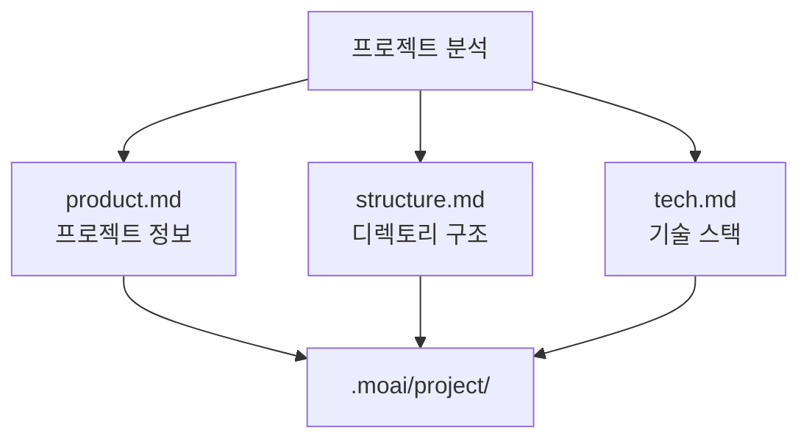
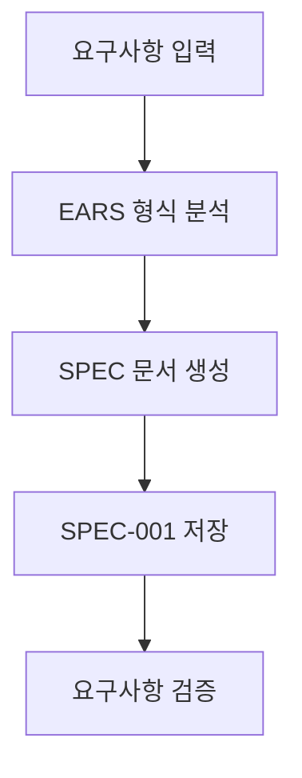
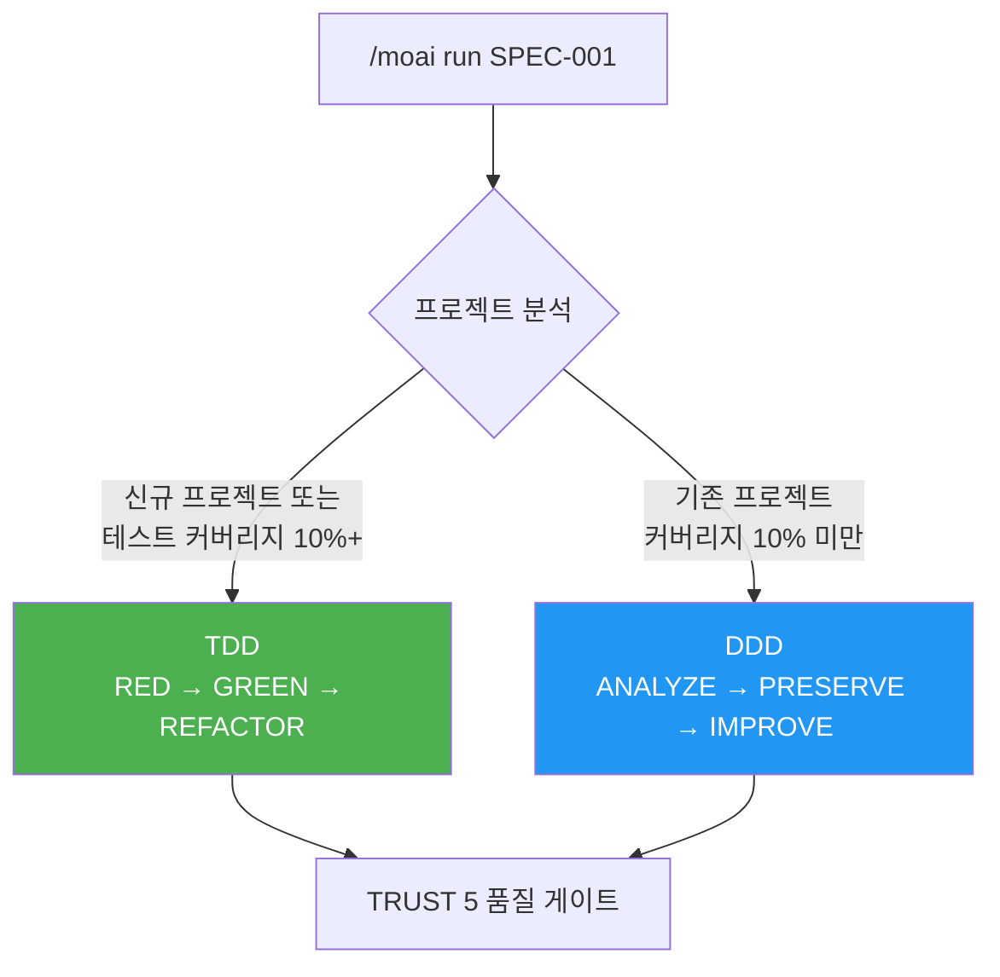
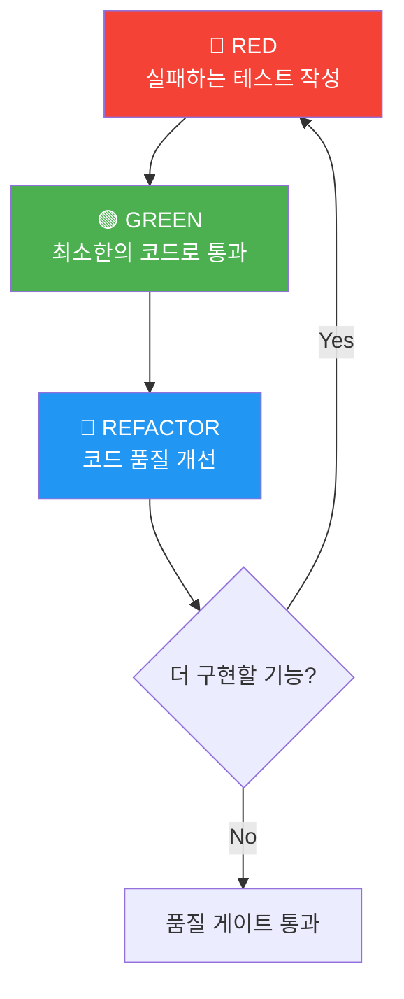
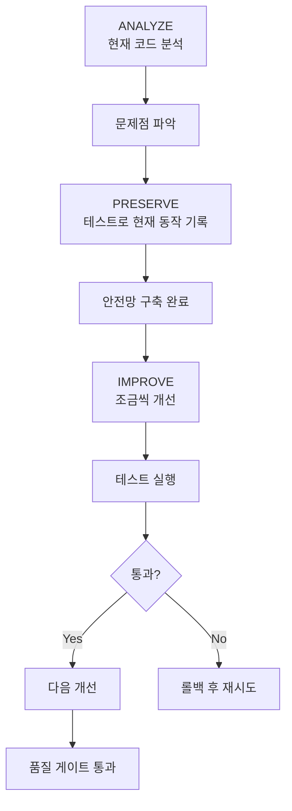
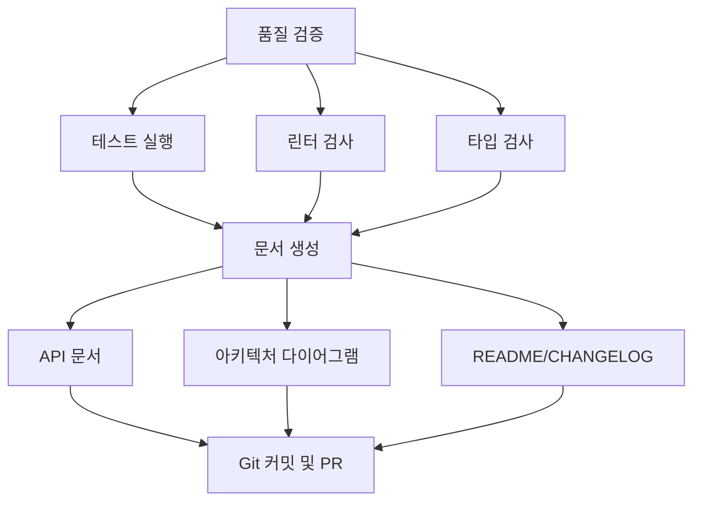
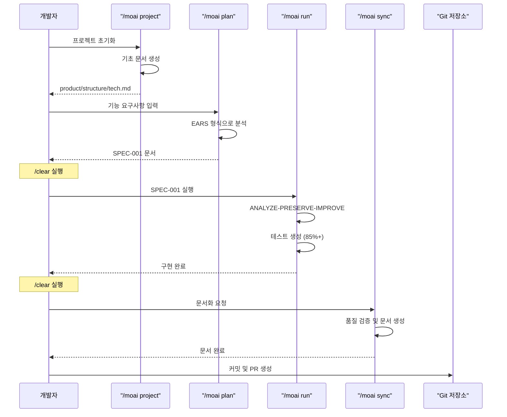
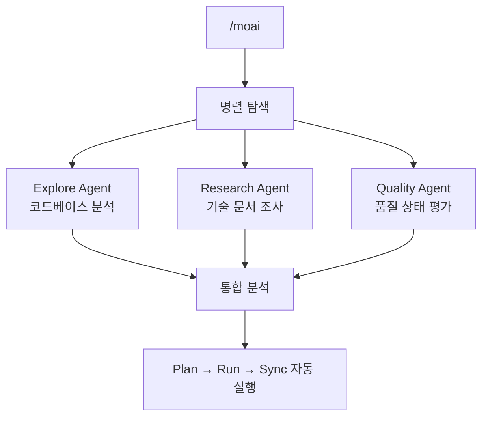
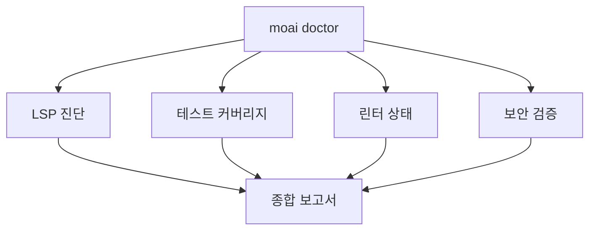

import { Callout } from 'nextra/components'

# 빠른 시작

MoAI-ADK를 사용하여 첫 프로젝트를 생성하고 개발 워크플로우를 경험해보세요.

## 사전 준비

시작하기 전에 다음이 완료되어야 합니다:

- [x] MoAI-ADK 설치 ([설치 가이드](./installation))
- [x] 초기 설정 완료 ([초기 설정](./init-wizard))
- [x] GLM API 키 획득

## 첫 프로젝트 생성

### 1단계: 프로젝트 초기화

새로운 프로젝트를 생성하려면 `moai init` 명령어를 사용하세요:

```bash
moai init my-first-project
cd my-first-project
```

기존 프로젝트에 MoAI-ADK를 초기화하려면 해당 폴더로 이동 후 실행하세요:

```bash
cd existing-project
moai init
```

### 2단계: 프로젝트 문서 생성

프로젝트의 기초 문서를 생성합니다. 이 단계는 Claude Code가 프로젝트를 이해하는 데 필수적입니다.

```bash
> /moai project
```

이 명령은 프로젝트를 분석하여 다음 3개 파일을 자동 생성합니다:



| 파일 | 내용 |
|------|------|
| **product.md** | 프로젝트 이름, 설명, 타겟 사용자, 핵심 기능 |
| **structure.md** | 디렉토리 트리, 주요 폴더 목적, 모듈 구성 |
| **tech.md** | 사용 기술, 프레임워크, 개발 환경, 빌드/배포 설정 |

<Callout type="tip">
`/moai project`는 프로젝트 초기 설정 후 또는 구조가 크게 변경된 후에 실행하세요.
</Callout>

### 3단계: SPEC 문서 생성

첫 번째 기능에 대한 SPEC 문서를 생성합니다. EARS 형식을 사용하여 명확한 요구사항을 정의합니다.

<Callout type="info">
**SPEC이 왜 필요한가요?** 📝

**바이브코딩** (Vibe Coding)의 가장 큰 문제는 **맥락 유실**입니다:

- AI와 대화하면서 코딩하다 보면, "아까 뭘 하려고 했더라?" 하는 순간이 옵니다
- 세션이 끊기거나 컨텍스트가 초기화되면 **이전에 논의했던 요구사항이 사라집니다**
- 결국 같은 설명을 반복하거나, 의도와 다른 코드가 만들어집니다

**SPEC 문서가 이 문제를 해결합니다:**

| 문제 | SPEC의 해결 방법 |
|------|-----------------|
| 맥락 유실 | 요구사항을 **파일로 저장**하여 영구 보존 |
| 모호한 요구사항 | **EARS 형식**으로 명확하게 구조화 |
| 커뮤니케이션 오류 | **인수 기준**으로 완료 조건 명시 |
| 진행 상황 추적 불가 | **SPEC ID**로 작업 단위 관리 |

**한 줄 요약:** SPEC은 "AI와 나눈 대화를 문서로 남기는 것"입니다. 세션이 끊겨도 SPEC 문서만 읽으면 다시 이어서 작업할 수 있습니다!
</Callout>

```bash
> /moai plan "사용자 인증 기능 구현"
```

이 명령은 다음을 수행합니다:



생성된 SPEC 문서는 `.moai/specs/SPEC-001/spec.md`에 저장됩니다.

<Callout type="warning">
SPEC 생성 후 반드시 `/clear` 명령을 실행하여 토큰을 절약하세요.
</Callout>

### 4단계: TDD/DDD 개발 실행

SPEC 문서를 바탕으로 개발 방법론을 선택하여 구현을 진행합니다.

```bash
> /clear
> /moai run SPEC-001
```

MoAI-ADK는 프로젝트 상태에 따라 최적의 개발 방법론을 자동으로 선택합니다.



---

#### TDD 모드 (신규 프로젝트 / 테스트 커버리지 10%+)

<Callout type="info">
**TDD란?** 📝

TDD는 "시험 문제를 먼저 만들고 나서 공부하는 것"입니다:
- **테스트(채점 기준)를 먼저 작성합니다** — 기능이 없으니 당연히 실패
- **테스트를 통과하는 최소한의 코드를 작성합니다** — 딱 필요한 만큼만
- **테스트를 유지하면서 코드를 개선합니다** — 더 좋은 코드로 다듬기

**핵심:** 코드보다 테스트가 먼저입니다!
</Callout>

**RED-GREEN-REFACTOR 사이클:**

| 단계 | 의미 | 하는 일 |
|------|------|--------|
| 🔴 **RED** | 실패 | 아직 없는 기능의 테스트를 먼저 작성 |
| 🟢 **GREEN** | 통과 | 테스트를 통과하는 최소한의 코드 작성 |
| 🔵 **REFACTOR** | 개선 | 테스트를 유지하면서 코드 품질 향상 |



---

#### DDD 모드 (기존 프로젝트 / 테스트 커버리지 10% 미만)

<Callout type="info">
**DDD란?** 🏠

DDD는 "집 리모델링"과 비슷합니다:
- **기존 집을 부수지 않고** 방 하나씩 개선합니다
- **리모델링 전에 현재 상태를 사진으로 찍어둡니다** (= 특성화 테스트)
- **한 방씩 작업하고, 매번 확인합니다** (= 점진적 개선)

**핵심:** 기존 동작을 보존하면서 안전하게 개선합니다!
</Callout>

**ANALYZE-PRESERVE-IMPROVE 사이클:**

| 단계 | 비유 | 실제 작업 |
|------|------|----------|
| **ANALYZE** (분석) | 🔍 집 점검하기 | 현재 코드 구조와 문제점 파악 |
| **PRESERVE** (보존) | 📸 현재 상태 사진 찍기 | 특성화 테스트로 현재 동작 기록 |
| **IMPROVE** (개선) | 🔧 방 하나씩 리모델링 | 테스트 통과하면서 조금씩 개선 |



---

<Callout type="tip">
`/moai run`은 자동으로 85% 이상의 테스트 커버리지를 목표로 개발합니다. 개발 방법론은 `.moai/config/sections/quality.yaml`의 `development_mode`에서 수동으로 변경할 수 있습니다.
</Callout>

**완료 조건:**
- 테스트 커버리지 >= 85%
- 0 errors, 0 type errors
- LSP 베이스라인 달성

### 5단계: 문서 동기화

개발이 완료되면 품질 검증과 문서를 자동 생성합니다.

```bash
> /clear
> /moai sync SPEC-001
```

이 명령은 다음을 수행합니다:



## 전체 개발 워크플로우



## 통합 자동화: /moai

모든 단계를 한 번에 자동 실행하려면:

```bash
> /moai "사용자 인증 기능 구현"
```

MoAI는 Plan → Run → Sync를 자동으로 실행하며, 병렬 탐색으로 3-4배 빠른 분석을 제공합니다.



## 워크플로우 선택 가이드

| 상황 | 권장 명령어 | 이유 |
|------|-----------|------|
| 신규 프로젝트 | `/moai project` 먼저 실행 | 기초 문서 필수 |
| 단순 기능 | `/moai plan` + `/moai run` | 빠른 실행 |
| 복잡한 기능 | `/moai` | 자동 최적화 |
| 병렬 개발 | `--worktree` 플래그 사용 | 독립 환경 보장 |

## 실전 예제

### 예제 1: 간단한 API 엔드포인트

```bash
# 1. 프로젝트 문서 생성 (최초 1회)
> /moai project

# 2. SPEC 생성
> /moai plan "사용자 목록 조회 API 엔드포인트 구현"
> /clear

# 3. 구현
> /moai run SPEC-001
> /clear

# 4. 문서화 및 PR
> /moai sync SPEC-001
```

### 예제 2: 복잡한 기능 (MoAI 사용)

```bash
# 프로젝트 문서가 이미 있다면 MoAI로 한 번에 실행
> /moai "JWT 인증 미들웨어 구현"
```

### 예제 3: 병렬 개발 (Worktree 사용)

```bash
# 독립된 환경에서 병렬 개발
> /moai plan "결제 시스템 구현" --worktree
```

## 파일 구조 이해하기

MoAI-ADK 프로젝트의 표준 구조:

```
my-first-project/
├── CLAUDE.md                        # Claude Code 프로젝트 지침서
├── CLAUDE.local.md                  # 프로젝트 로컬 설정 (개인용)
├── .mcp.json                        # MCP 서버 설정
├── .claude/
│   ├── agents/                      # Claude Code 에이전트 정의
│   ├── commands/                    # 슬래시 명령어 정의
│   ├── hooks/                       # 훅 스크립트
│   ├── skills/                      # 재사용 가능한 스킬
│   └── rules/                       # 프로젝트 규칙
├── .moai/
│   ├── config/
│   │   └── sections/
│   │       ├── user.yaml            # 사용자 정보
│   │       ├── language.yaml        # 언어 설정
│   │       ├── quality.yaml         # 품질 게이트 설정
│   │       └── git-strategy.yaml    # Git 전략 설정
│   ├── project/
│   │   ├── product.md               # 프로젝트 개요
│   │   ├── structure.md             # 디렉토리 구조
│   │   └── tech.md                  # 기술 스택
│   ├── specs/
│   │   └── SPEC-001/
│   │       └── spec.md              # 요구사항 명세서
│   └── memory/
│       └── checkpoints/             # 세션 체크포인트
├── src/
│   └── [프로젝트 소스 코드]
├── tests/
│   └── [테스트 파일]
└── docs/
    └── [생성된 문서]
```

## 품질 확인

개발 중 언제든지 품질을 확인할 수 있습니다:

```bash
moai doctor
```

이 명령은 다음을 확인합니다:

- LSP 진단 (오류, 경고)
- 테스트 커버리지
- 린터 상태
- 보안 검증



## 유용한 팁

### 토큰 관리

대규모 프로젝트에서는 각 단계 후 `/clear`를 실행하여 토큰을 절약하세요:

```bash
> /moai plan "복잡한 기능 구현"
> /clear  # 세션 초기화
> /moai run SPEC-001
> /clear
> /moai sync SPEC-001
```

### 버그 수정 및 자동화

```bash
# 자동 수정
> /moai fix "테스트에서 발생하는 TypeError 수정"

# 반복 수정 (완료될 때까지)
> /moai loop "모든 린터 경고 수정"
```

---

## 다음 단계

[핵심 개념](/core-concepts/what-is-moai-adk)에서 MoAI-ADK의 심화 기능을 알아보세요.
