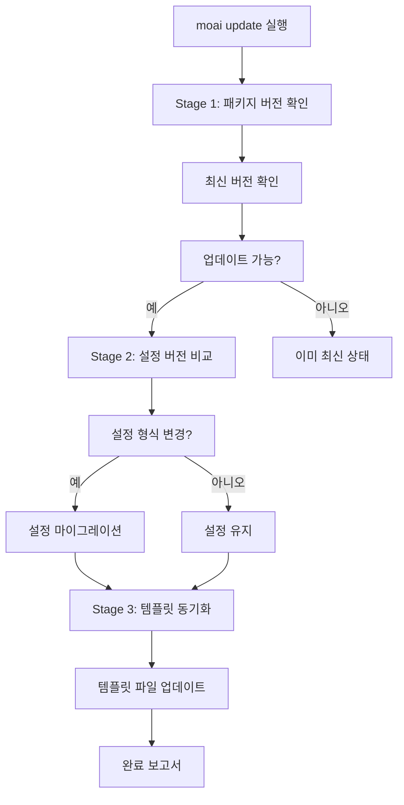
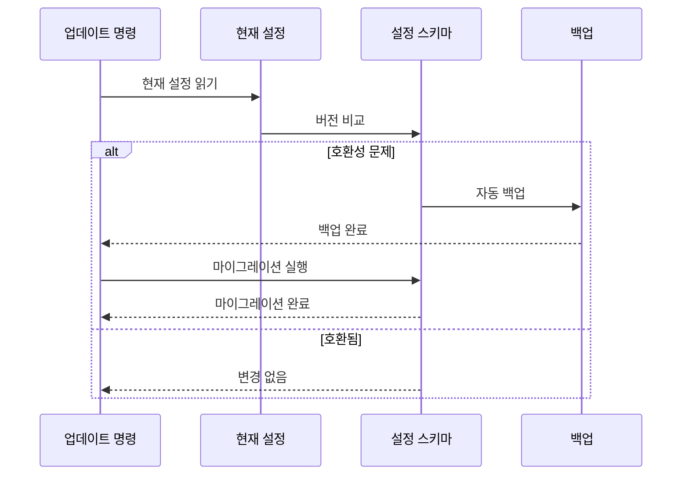
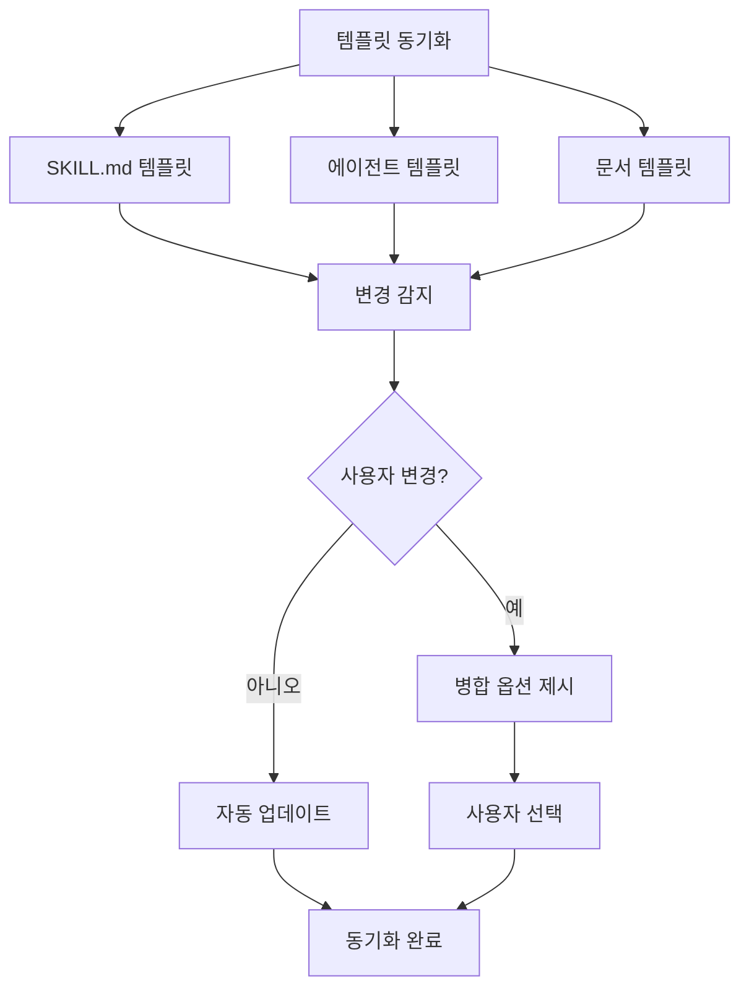

import { Callout } from 'nextra/components'

# 업데이트

MoAI-ADK를 최신 버전으로 유지하고 스마트 업데이트 워크플로우를 통해 원활한 업그레이드를 수행하세요.

## 업데이트 명령

MoAI-ADK를 최신 버전으로 업데이트하려면:

```bash
moai update
```

이 명령은 3단계 스마트 업데이트 워크플로우를 실행합니다.

## 3단계 스마트 업데이트 워크플로우



### Stage 1: 패키지 버전 확인

먼저 현재 설치된 버전과 GitHub Releases의 최신 버전을 비교합니다.

```bash
# 현재 버전 확인
moai --version

# 사용 가능한 업데이트 확인
moai update --check-only
```

**확인 항목:**

- 현재 설치된 버전
- GitHub Releases 최신 버전
- 변경 로그 (새 기능, 버그 수정, 호환성)

**출력 예시:**

```
Current version: 1.2.0
Latest version: 1.3.0

Release notes:
- Add new expert-performance agent
- Improve token optimization
- Fix SPEC validation issues

Update available! Run 'moai update' to upgrade.
```

### Stage 2: 설정 버전 비교

설정 파일의 형식과 호환성을 검사합니다.



**검사 파일:**

- `.moai/config/sections/user.yaml`
- `.moai/config/sections/language.yaml`
- `.moai/config/sections/quality.yaml`

**마이그레이션 예시:**

```yaml
# 이전 설정 (v1.2.0)
development_mode: ddd
test_coverage_target: 85

# 새로운 설정 (v1.3.0)
development_mode: ddd
test_coverage_target: 85
ddd_settings:
  require_existing_tests: true
  characterization_tests: true
```

<Callout type="tip">
설정 마이그레이션 전에 항상 `.moai/config/` 디렉터리가 백업됩니다.
</Callout>

### Stage 3: 템플릿 동기화

프로젝트 템플릿과 기본 파일을 최신 버전으로 동기화합니다.



**동기화 파일:**

- `.moai/templates/` - 프로젝트 템플릿
- `.claude/skills/` - 스킬 템플릿
- `.claude/agents/` - 에이전트 템플릿

<Callout type="info">
사용자가 수정한 템플릿 파일은 보존되며, 새 버전과 병합 옵션이 제공됩니다.
</Callout>

## 업데이트 옵션

### 동작 방식

| 명령어 | 바이너리 업데이트 | 템플릿 동기화 |
|--------|-------------------|---------------|
| `moai update` | O | O |
| `moai update --binary` | O | X |
| `moai update --templates-only` | X | O |

### 바이너리 전용 업데이트

MoAI-ADK 바이너리만 업데이트하고 템플릿은 동기화하지 않습니다:

```bash
$ moai update --binary
```

**사용 경우:**
- 템플릿을 직접 수정한 경우
- 템플릿 동기화를 건너뛰고 싶을 때
- 빠른 바이너리 업데이트만 필요할 때

### 템플릿 전용 동기화

템플릿만 동기화하고 바이너리는 업데이트하지 않습니다:

```bash
$ moai update --templates-only
```

**사용 경우:**
- 최신 스킬과 에이전트 템플릿 적용
- 바이너리 버전 유지하면서 템플릿만 업데이트
- 여러 프로젝트에서 템플릿 동기화 필요 시

### 체크 전용 (Check Only)

실제 업데이트 없이 사용 가능한 버전을 확인합니다:

```bash
$ moai update --check-only
```

### 자동 업데이트

확인 없이 자동으로 업데이트를 진행합니다:

```bash
$ moai update --yes
```

### 특정 버전

특정 버전으로 업데이트합니다:

```bash
$ moai update --version 1.2.0
```

### 백업 보존

업데이트 실패 시 복구를 위해 백업을 보존합니다:

```bash
$ moai update --keep-backup
```

## 업데이트 후 절차

### 1단계: 버전 확인

```bash
moai --version
```

### 2단계: 설정 검증

```bash
moai doctor
```

### 3단계: 새로운 기능 확인

```bash
moai --help
```

새로 추가된 명령어나 옵션을 확인하세요.

## 문제 해결

### 문제: 업데이트 실패

```bash
Error: Update failed - permission denied
```

**해결 방법:**

```bash
# curl을 사용하여 수동 재설치
curl -fsSL https://raw.githubusercontent.com/modu-ai/moai-adk/main/install.sh | bash

# 또는 특정 버전으로 재설치
moai update --version <VERSION>
```

### 문제: 설정 마이그레이션 오류

```bash
Error: Config migration failed
```

**해결 방법:**

```bash
# 백업에서 복원
cp -r .moai/config.bak .moai/config

# 수동으로 마이그레이션
vim .moai/config/sections/quality.yaml
```

### 문제: 템플릿 충돌

```bash
Warning: Template conflicts detected
```

**해결 방법:**

```bash
# 자동 병합 (사용자 변경 보존)
$ moai update --merge

# 수동 병합 (백업 보존, 병합 가이드 생성)
$ moai update --manual

# 강제 업데이트 (백업 없음)
$ moai update --force
```

## 개인 설정 관리

MoAI-ADK 업데이트 시 **CLAUDE.md**와 **settings.json**은 새 버전으로 덮어 쓰입니다. 개인적인 수정 사항이 있다면 다음과 같이 관리하세요.

### .local 파일 사용

개인 설정은 별도 파일에 저장하여 업데이트 시 덮어쓰기를 방지하세요:

| 파일 | 위치 | 용도 |
|------|------|------|
| `CLAUDE.md` | 프로젝트 루트 | MoAI-ADK 관리 (업데이트 시 변경됨) |
| `settings.json` | `.claude/` | MoAI-ADK 관리 (업데이트 시 변경됨) |
| `CLAUDE.local.md` | 프로젝트 루트 | ✅ 프로젝트 개인 설정 (업데이트 영향 없음) |
| `.claude/settings.local.json` | 프로젝트 | ✅ 프로젝트 개인 설정 (업데이트 영향 없음) |

**개인 설정 예시 (프로젝트 로컬):**

```markdown
# CLAUDE.local.md

## 사용자 정보

- Name: John Developer
- Role: Senior Software Engineer
- Expertise: Backend Development, DevOps

## 개발 선호도

- 언어: Python, TypeScript
- 프레임워크: FastAPI, React
- 테스트: pytest, Jest
- 문서: Markdown, OpenAPI
```

**개인 설정 예시 (settings):**

```json
// .claude/settings.local.json
{
  "env": {
    "ANTHROPIC_AUTH_TOKEN": "YOUR-API-KEY",
    "ANTHROPIC_BASE_URL": "https://api.z.ai/api/anthropic",
    "ANTHROPIC_DEFAULT_HAIKU_MODEL": "glm-4.7-flashx",
    "ANTHROPIC_DEFAULT_SONNET_MODEL": "glm-4.7",
    "ANTHROPIC_DEFAULT_OPUS_MODEL": "glm-4.7"
  },
  "permissions": {
    "allow": [
      "Bash(bun run typecheck:*)",
      "Bash(bun install)",
      "Bash(bun run build)"
    ]
  },
  "enabledMcpjsonServers": [
    "context7"
  ],
  "companyAnnouncements": [
    "🗿 MoAI-ADK: 28개 전문 에이전트 + 52개 Skills로 SPEC-First DDD",
    "⚡ /moai: 원스탑 Plan→Run→Sync 자동화 (지능형 라우팅)",
    "🌳 moai worktree: 격리된 워크트리 환경에서 병렬 SPEC 개발",
    "🤖 Expert Agents (8): backend, frontend, security, devops, debug, performance, refactoring, testing",
    "🤖 Manager Agents (8): git, spec, ddd, tdd, docs, quality, project, strategy",
    "🤖 Builder Agents (3): agent, skill, plugin",
    "🤖 Team Agents (8, 실험적): researcher, analyst, architect, designer, backend-dev, frontend-dev, tester, quality",
    "📋 워크플로우: /moai plan (SPEC) → /moai run (DDD) → /moai sync (Docs)",
    "🚀 옵션: --team (병렬 Agent Teams), --ultrathink (Sequential Thinking MCP 깊은 분석), --loop (반복 자동 수정)",
    "✅ 품질: TRUST 5 + 85%+ 커버리지 + Ralph Engine (LSP + AST-grep)",
    "🔄 Git 전략: 3-Mode (Manual/Personal/Team) + Smart Merge 설정 업데이트",
    "📚 팁: moai update --templates-only로 최신 skills와 agents 동기화",
    "📚 팁: moai worktree new SPEC-XXX로 병렬 개발용 worktree 생성",
    "⚙️ moai update -c: Model 가용성 설정 (high/medium/low) - Claude 요금제별 모델 구성",
    "💡 하이브리드 모드: Plan은 Claude (Opus/Sonnet), Run/Sync는 GLM-5로 비용 절감",
    "💡 병렬 개발: 터미널1은 Claude, 터미널2+는 'moai glm && claude'로 병렬 실행",
    "💎 GLM-5 스폰서: z.ai 파트너십 - 비용 효율적인 AI로 동등한 성능",
    "💬 모두의AI 공식 디스코드에서 다양한 에이전틱 코딩 정보를 받아보세요! https://discord.gg/Y3fRHb3tfw"
  ],
  "_meta": {
    "description": "User-specific Claude Code settings (gitignored - never commit)",
    "created_at": "2026-01-27T18:15:26.175926Z",
    "note": "Edit this file to customize your local development environment"
  }
}
```

<Callout type="info">
**설정 우선순위:** Local > Project > User > Enterprise<br />
<code>settings.local.json</code>이 프로젝트 설정을 오버라이드합니다.
</Callout>

### moai 폴더 구조

MoAI-ADK는 다음 폴더에서만 파일을 관리합니다:

```
.claude/
├── agents/
│   └── moai/                # MoAI-ADK 에이전트 (업데이트 대상)
│
├── hooks/
│   └── moai/                # MoAI-ADK 훅 스크립트 (업데이트 대상)
│
├── skills/
│   ├── moai-*               # MoAI-ADK 스킬 (moai- 접두사, 업데이트 대상)
│   │
│   └── my-skills/           # ✅ 개인 스킬 (업데이트 제외)
│
└── rules/
    └── moai/                # 규칙 파일 (moai 관리)
        ├── core/            # Core principles and constitution
        ├── development/     # Development guidelines and standards
        ├── languages/       # Language-specific rules (16 languages)
        └── workflow/        # Workflow phase definitions
```

**명명 규칙:**

| 유형 | 위치 | 업데이트 영향 |
|------|------|--------------|
| **에이전트** | `agents/moai/` | ⚠️ **업데이트 시 변경됨** |
| **훅** | `hooks/moai/` | ⚠️ **업데이트 시 변경됨** |
| **스킬** | `skills/moai-*` | ⚠️ **업데이트 시 변경됨** |
| **규칙** | `rules/moai/` | ⚠️ **업데이트 시 변경됨** |
| **개인 에이전트** | `agents/my-agents/` | ✅ **업데이트 영향 없음** |
| **개인 스킬** | `skills/my-skills/` | ✅ **업데이트 영향 없음** |

<Callout type="warning">
**중요:** <code>moai-*</code> 접두사를 가진 스킬은 MoAI-ADK가 관리합니다. 개인적인 추가나 수정은 `my-*` 폴더나 별도 접두사를 사용하세요.
</Callout>

<Callout type="warning">
**중요:** `moai/` 폴더 내의 파일은 업데이트 시 덮어 쓰일 수 있습니다. 개인적인 추가나 수정은 별도 폴더를 사용하세요.
</Callout>

### 파일 정리 방법

```bash
# 개인 에이전트 이동 (예시)
mv .claude/agents/my-agent.md .claude/my-agents/

# 개인 스킬 이동 (예시)
mv .claude/skills/my-skill.md .claude/my-skills/
```

### 변경 로그

최근 변경 사항은 [GitHub Releases](https://github.com/modu-ai/moai-adk/releases)를 확인하세요.

## 롤백

업데이트 후 문제가 발생하면 이전 버전으로 롤백할 수 있습니다:

```bash
# 특정 버전으로 롤백
moai update --version 1.2.0

# 또는 백업에서 복원
cp -r .moai/config.bak .moai/config
```

<Callout type="warning">
롤백 전에 현재 작업을 커밋하세요.
</Callout>

## 다음 단계

업데이트를 완료한 후:

1. **[변경 로그 확인](/getting-started/update)** - 새로운 기능 학습
2. **[핵심 개념](/core-concepts/what-is-moai-adk)** - 새로운 에이전트 및 기능 숙달
3. **[빠른 시작](/getting-started/quickstart)** - 프로젝트에 새로운 기능 적용

---

정기적으로 업데이트하여 MoAI-ADK의 최신 기능과 개선 사항을 활용하세요!
