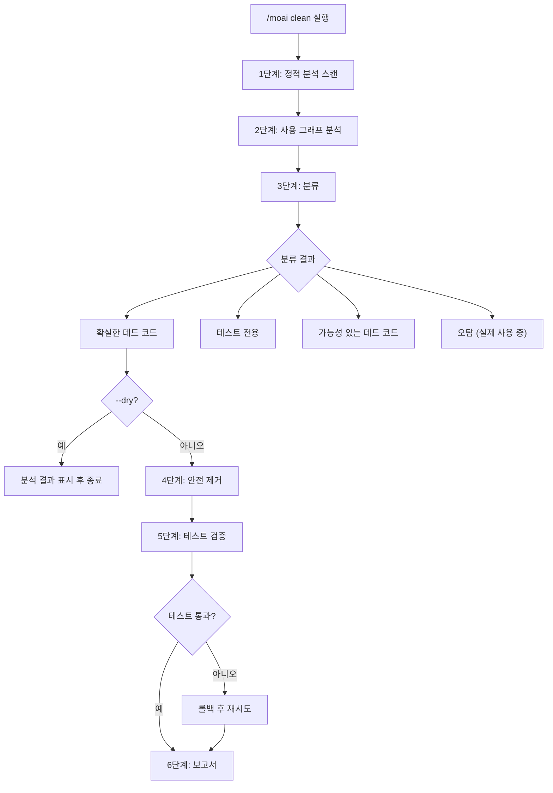
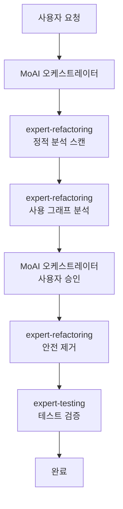

import { Callout } from 'nextra/components'

# /moai clean

데드 코드 식별 및 안전 제거 명령어입니다. 정적 분석과 사용 그래프 분석을 통해 **미사용 코드를 찾아 안전하게 제거**합니다.

<Callout type="tip">
**한 줄 요약**: `/moai clean`은 "코드 다이어트 도구"입니다. 사용하지 않는 함수, 변수, import, 파일을 **자동으로 찾아서 안전하게 삭제**합니다.
</Callout>

<Callout type="info">
**슬래시 커맨드**: Claude Code에서 `/moai:clean`을 입력하면 이 명령어를 바로 실행할 수 있습니다. `/moai`만 입력하면 사용 가능한 모든 서브커맨드 목록이 표시됩니다.
</Callout>

## 개요

프로젝트가 성장하면 더 이상 사용하지 않는 코드가 쌓이게 됩니다. 미사용 import, 호출되지 않는 함수, 참조되지 않는 타입 등이 코드베이스를 복잡하게 만듭니다. `/moai clean`은 이런 데드 코드를 정적 분석으로 찾아내고, 테스트 검증을 거쳐 안전하게 제거합니다.

## 사용법

```bash
# 기본 사용법
> /moai clean

# 미리보기 (수정 없이 확인만)
> /moai clean --dry

# 안전한 항목만 제거
> /moai clean --safe-only

# 특정 파일/디렉토리만 분석
> /moai clean --file src/auth/

# 특정 코드 유형만 분석
> /moai clean --type functions
```

## 지원 플래그

| 플래그 | 설명 | 예시 |
|-------|------|------|
| `--dry` (또는 `--dry-run`) | 제거 없이 분석 결과만 표시 | `/moai clean --dry` |
| `--safe-only` | 확실한 데드 코드만 제거 (불확실한 항목 건너뜀) | `/moai clean --safe-only` |
| `--file PATH` | 특정 파일 또는 디렉토리만 분석 | `/moai clean --file src/utils/` |
| `--type TYPE` | 특정 코드 유형만 분석 | `/moai clean --type imports` |
| `--aggressive` | 낮은 사용 코드도 포함 (1개 호출자가 데드 코드인 경우) | `/moai clean --aggressive` |

### --type 플래그 옵션

| 유형 | 설명 |
|------|------|
| `functions` | 호출되지 않는 함수/메서드 |
| `imports` | 참조되지 않는 import 문 |
| `types` | 사용되지 않는 타입 정의 |
| `variables` | 선언 후 사용되지 않는 변수 |
| `files` | 어디서도 import 되지 않는 파일 |

### --dry 플래그

실제 코드를 수정하지 않고 어떤 항목이 데드 코드로 분류되는지 미리 확인합니다:

```bash
> /moai clean --dry
```

이 옵션은 제거 전에 분석 결과를 검토하고 싶을 때 유용합니다.

## 실행 과정

`/moai clean`은 6단계로 실행됩니다.



### 1단계: 정적 분석 스캔

언어별 도구를 사용하여 데드 코드 후보를 탐지합니다:

| 언어 | 분석 도구 | 검사 대상 |
|------|-----------|-----------|
| **Go** | `go vet`, `staticcheck`, `deadcode` | 미사용 변수, 함수, 타입 |
| **Python** | `vulture`, `autoflake` | 데드 코드, 미사용 import |
| **TypeScript/JavaScript** | `ts-prune`, ESLint `no-unused-vars` | 미사용 export, 변수 |
| **Rust** | `cargo clippy`, `cargo udeps` | 데드 코드 경고, 미사용 의존성 |

**스캔 카테고리:**

- 미사용 import: 참조가 없는 import 문
- 미사용 변수: 선언되었지만 읽히지 않는 변수
- 미사용 함수: 정의되었지만 호출되지 않는 함수
- 미사용 타입: 사용처가 없는 타입 정의
- 미사용 파일: 어디서도 import 하지 않는 파일
- 데드 의존성: 설치되었지만 import 되지 않는 패키지

### 2단계: 사용 그래프 분석

정적 분석 결과를 검증하기 위해 사용 그래프를 구축합니다:

- 각 후보에 대해 코드베이스 전체에서 참조를 검색
- 간접 사용 확인 (인터페이스, 리플렉션, 동적 디스패치)
- 테스트 전용 사용 확인 (테스트에서만 사용, 프로덕션 코드에서 미사용)
- 조건부 컴파일 확인 (빌드 태그, 환경 기반 import)

### 3단계: 분류

| 분류 | 설명 | 제거 안전도 |
|------|------|------------|
| **확실한 데드 코드** | 코드베이스 어디에서도 참조 없음 | 안전 |
| **테스트 전용** | 테스트 파일에서만 사용됨 | 대체로 안전 |
| **가능성 있는 데드 코드** | 낮은 신뢰도 (동적 사용 가능성) | 주의 필요 |
| **오탐** | 실제 사용 중 (리플렉션, 플러그인 등) | 제거 불가 |

### 4단계: 안전 제거

의존성 그래프의 역순으로 제거합니다 (리프 노드 먼저):

- 관련 코드를 그룹으로 제거 (함수 + 비공개 헬퍼)
- 영향받는 import 업데이트
- 모든 export가 제거된 빈 파일 정리
- `@MX:ANCHOR` 태그가 있는 코드는 명시적 승인 없이 제거하지 않음

### 5단계: 테스트 검증

제거 후 전체 테스트 스위트를 실행하여 회귀를 검증합니다. 테스트가 실패하면 해당 제거를 롤백하고 "오탐"으로 분류합니다.

### 6단계: 보고서

```
데드 코드 제거 보고서

제거됨: 15개 항목 (287줄)
  - src/utils/helper.go: UnusedFunction (15줄)
  - src/models/old.go: 전체 파일 삭제 (120줄)

유지됨 (오탐): 2개 항목
  - src/api/handler.go: DynamicHandler (리플렉션 사용)

테스트 결과: PASS (모든 테스트 통과)

코드베이스 감소:
  - 파일 제거: 3개
  - 줄 제거: 287줄
  - 의존성 제거: 1개
```

## 에이전트 위임 체인



| 에이전트 | 역할 | 주요 작업 |
|----------|------|----------|
| **expert-refactoring** | 분석 및 제거 | 정적 분석, 사용 그래프, 안전 제거 |
| **expert-testing** | 검증 | 테스트 스위트 실행, 회귀 확인 |
| **MoAI 오케스트레이터** | 조율 | 사용자 승인, @MX 태그 정리 |

## 자주 묻는 질문

### Q: 데드 코드를 잘못 제거하면 어떻게 하나요?

Git으로 되돌릴 수 있습니다. MoAI는 의존성 역순으로 제거하고 테스트를 실행하므로, 문제가 생기면 자동으로 롤백합니다.

### Q: `--aggressive`는 언제 사용하나요?

호출자가 1개인데 그 호출자도 데드 코드인 경우를 포함하고 싶을 때 사용합니다. 대규모 리팩토링 후 정리에 유용합니다.

### Q: 리플렉션으로 사용되는 코드도 제거되나요?

`--safe-only` 모드에서는 "확실한 데드 코드"만 제거합니다. 리플렉션이나 동적 디스패치로 사용되는 코드는 "오탐"으로 분류되어 보존됩니다.

## 관련 문서

- [/moai fix - 일회성 자동 수정](/utility-commands/moai-fix)
- [/moai mx - @MX 태그 스캔](/utility-commands/moai-mx)
- [/moai review - 코드 리뷰](/quality-commands/moai-review)
- [/moai coverage - 커버리지 분석](/quality-commands/moai-coverage)
