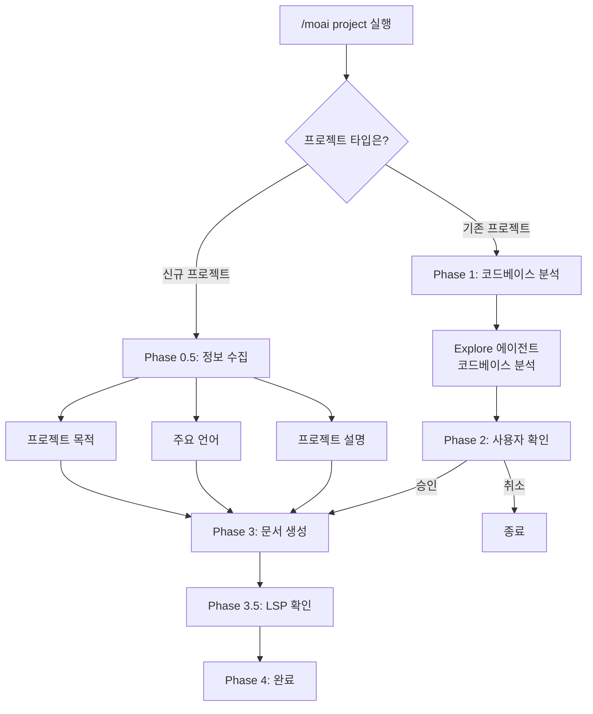
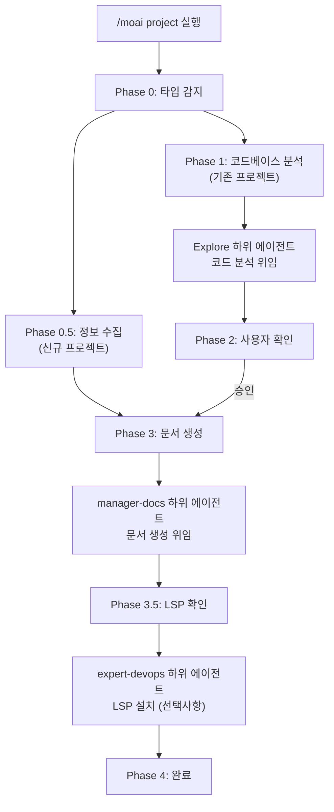

import { Callout } from "nextra/components";

# /moai project

프로젝트의 코드베이스를 분석하여 AI가 프로젝트를 이해하는 데 필요한 기초 문서를
자동으로 생성합니다.

<Callout type="info">
**슬래시 커맨드**: Claude Code에서 `/moai:project`를 입력하면 이 명령어를 바로 실행할 수 있습니다. `/moai`만 입력하면 사용 가능한 모든 서브커맨드 목록이 표시됩니다.
</Callout>

## 개요

`/moai project`는 MoAI-ADK 워크플로우의 **프로젝트 문서 생성** 명령어입니다.
프로젝트의 소스 코드, 설정 파일, 디렉토리 구조를 분석하여 AI가 프로젝트를 빠르게
이해할 수 있도록 돕습니다.

<Callout type="tip">
**왜 프로젝트 문서가 필요한가요?**

Claude Code는 새로운 대화를 시작할 때 프로젝트에 대해 아무것도 모릅니다.
`/moai project`가 생성한 문서를 통해 AI는 다음을 이해하게 됩니다:

- 이 프로젝트가 **무엇을 하는지** (product.md)
- 코드가 **어떻게 구성되어 있는지** (structure.md)
- 어떤 **기술을 사용하는지** (tech.md)

이 문서가 있어야 `/moai plan`, `/moai run` 등 이후 명령어에서 AI가 프로젝트
맥락에 맞는 정확한 작업을 수행할 수 있습니다.

</Callout>

## 사용법

```bash
> /moai project
```

별도의 인자나 옵션 없이 실행하면, 현재 프로젝트 디렉토리를 자동으로 분석합니다.

## 생성되는 문서

`/moai project`는 `.moai/project/` 디렉토리 아래에 3개의 문서를 생성합니다:

```
.moai/
└── project/
    ├── product.md      # 프로젝트 개요
    ├── structure.md    # 디렉토리 구조 분석
    └── tech.md         # 기술 스택 정보
```

### product.md - 프로젝트 개요

프로젝트의 핵심 정보를 담고 있습니다:

| 항목              | 설명                     | 예시                               |
| ----------------- | ------------------------ | ---------------------------------- |
| **프로젝트 이름** | 프로젝트의 공식 명칭     | "MoAI-ADK"                         |
| **설명**          | 프로젝트가 하는 일       | "AI 기반 개발 도구 키트"           |
| **타겟 사용자**   | 누구를 위한 프로젝트인지 | "Claude Code를 사용하는 개발자"    |
| **핵심 기능**     | 주요 기능 목록           | "SPEC 생성, DDD 구현, 문서 자동화" |
| **프로젝트 상태** | 현재 개발 단계           | "v1.1.0, Production"               |

### structure.md - 디렉토리 구조

프로젝트의 파일 및 폴더 구성을 분석합니다:

| 항목               | 설명                                      |
| ------------------ | ----------------------------------------- |
| **디렉토리 트리**  | 전체 폴더 구조 시각화                     |
| **주요 폴더 목적** | 각 폴더가 하는 역할 설명                  |
| **모듈 구성**      | 핵심 모듈 간 관계                         |
| **진입점**         | 프로그램 시작 파일 (main.py, index.ts 등) |

### tech.md - 기술 스택

프로젝트에서 사용하는 기술 정보를 정리합니다:

| 항목                | 설명                | 예시                          |
| ------------------- | ------------------- | ----------------------------- |
| **프로그래밍 언어** | 사용 언어 및 버전   | "Python 3.12, TypeScript 5.5" |
| **프레임워크**      | 주요 프레임워크     | "FastAPI 0.115, React 19"     |
| **데이터베이스**    | DB 종류 및 ORM      | "PostgreSQL 16, SQLAlchemy"   |
| **빌드 도구**       | 빌드 및 패키지 관리 | "Poetry, Vite"                |
| **배포 환경**       | 호스팅 및 CI/CD     | "Docker, GitHub Actions"      |

## 실행 과정

`/moai project`는 프로젝트 타입에 따라 다른 워크플로우를 실행합니다.

### 신규 프로젝트 vs 기존 프로젝트



## 상세 워크플로우

### Phase 0: 프로젝트 타입 감지

가장 먼저 프로젝트 타입을 확인합니다.

<Callout type="warning">
  **[HARD] 규칙**: 프로젝트 타입을 먼저 물어봐야 합니다. 코드베이스 분석 전에
  사용자에게 프로젝트 상황을 확인합니다.
</Callout>

**질문**: 어떤 타입의 프로젝트인가요?

| 옵션              | 설명                                                 |
| ----------------- | ---------------------------------------------------- |
| **신규 프로젝트** | 처음부터 시작하는 프로젝트. 정보를 수집형식으로 진행 |
| **기존 프로젝트** | 이미 코드가 있는 프로젝트. 코드를 자동으로 분석      |

### Phase 0.5: 신규 프로젝트 정보 수집

신규 프로젝트를 선택한 경우, 다음 정보를 수집합니다:

**질문 1 - 프로젝트 목적**:

- **Web Application**: 프론트엔드, 백엔드, 또는 풀스택 웹 앱
- **API Service**: REST API, GraphQL, 또는 마이크로서비스
- **CLI Tool**: 명령줄 유틸리티 또는 자동화 도구
- **Library/Package**: 재사용 가능한 코드 라이브러리 또는 SDK

**질문 2 - 주요 언어**:

- **Python**: 백엔드, 데이터 사이언스, 자동화
- **TypeScript/JavaScript**: 웹, Node.js, 프론트엔드
- **Go**: 고성능 서비스, CLI 도구
- **Other**: Rust, Java, Ruby 등 (상세 질문)

**질문 3 - 프로젝트 설명** (자유 입력):

- 프로젝트 이름
- 주요 기능 또는 목표
- 타겟 사용자

수집된 정보를 바탕으로 초기 문서를 생성하고 Phase 4로 이동합니다.

### Phase 1: 코드베이스 분석 (기존 프로젝트)

기존 프로젝트를 선택한 경우, **Explore 에이전트**에게 분석을 위임합니다.

<Callout type="info">
  **에이전트 위임**: 코드베이스 분석은 Explore 하위 에이전트가 수행합니다.
  MoAI는 결과만 수집하여 사용자에게 보여줍니다.
</Callout>

**분석 목표**:

- **프로젝트 구조**: 메인 디렉토리, 진입점, 아키텍처 패턴
- **기술 스택**: 언어, 프레임워크, 핵심 의존성
- **핵심 기능**: 주요 기능과 비즈니스 로직 위치
- **빌드 시스템**: 빌드 도구, 패키지 관리자, 스크립트

**Explore 에이전트 출력**:

- 감지된 기본 언어
- 식별된 프레임워크
- 아키텍처 패턴 (MVC, Clean Architecture, Microservices 등)
- 주요 디렉토리 매핑 (source, tests, config, docs)
- 의존성 카탈로그
- 진입점 식별

### Phase 2: 사용자 확인

분석 결과를 사용자에게 보여주고 승인을 받습니다.

**표시 내용**:

- 감지된 언어
- 프레임워크
- 아키텍처
- 핵심 기능 목록

**옵션**:

- **진행**: 문서 생성을 계속 진행
- **상세 검토**: 분석 세부사항을 먼저 검토
- **취소**: 프로젝트 설정 조정

### Phase 3: 문서 생성

**manager-docs 에이전트**에게 문서 생성을 위임합니다.

**전달 내용**:

- Phase 1 분석 결과 (또는 Phase 0.5 사용자 입력)
- Phase 2 사용자 확인
- 출력 디렉토리: `.moai/project/`
- 언어: config의 conversation_language

**생성 파일**:

| 파일             | 내용                                                                     |
| ---------------- | ------------------------------------------------------------------------ |
| **product.md**   | 프로젝트 이름, 설명, 타겟 사용자, 핵심 기능, 유스케이스                  |
| **structure.md** | 디렉토리 트리, 각 디렉토리의 목적, 핵심 파일 위치, 모듈 구성             |
| **tech.md**      | 기술 스택 개요, 프레임워크 선택 근거, 개발 환경 요구사항, 빌드/배포 설정 |

### Phase 3.5: 개발 환경 확인

감지된 기술 스택에 맞는 LSP 서버가 설치되어 있는지 확인합니다.

**언어별 LSP 매핑** (16개 언어 지원):

| 언어                  | LSP 서버                   | 확인 명령어                        |
| --------------------- | -------------------------- | ---------------------------------- |
| Python                | pyright 또는 pylsp         | `which pyright`                    |
| TypeScript/JavaScript | typescript-language-server | `which typescript-language-server` |
| Go                    | gopls                      | `which gopls`                      |
| Rust                  | rust-analyzer              | `which rust-analyzer`              |
| Java                  | jdtls (Eclipse JDT)        | -                                  |
| Ruby                  | solargraph                 | `which solargraph`                 |
| PHP                   | intelephense               | npm 통해 확인                      |
| C/C++                 | clangd                     | `which clangd`                     |
| Kotlin                | kotlin-language-server     | -                                  |
| Scala                 | metals                     | -                                  |
| Swift                 | sourcekit-lsp              | -                                  |
| Elixir                | elixir-ls                  | -                                  |
| Dart/Flutter          | dart language-server       | Dart SDK 내장                      |
| C#                    | OmniSharp 또는 csharp-ls   | -                                  |
| R                     | languageserver (R 패키지)  | -                                  |
| Lua                   | lua-language-server        | -                                  |

**LSP 미설치 시 옵션**:

- **LSP 없이 계속**: 완료까지 진행
- **설치 안내 표시**: 감지된 언어의 설정 가이드 표시
- **지금 자동 설치**: expert-devops 에이전트로 설치 (확인 필요)

### Phase 4: 완료

사용자의 언어로 완료 메시지를 표시합니다.

- 생성된 파일 목록
- 위치: `.moai/project/`
- 상태: 성공 또는 부분 완료

**다음 단계 옵션**:

- **SPEC 작성**: `/moai plan`으로 기능 명세서 정의
- **문서 검토**: 생성된 파일 열어서 검토
- **새 세션 시작**: 컨텍스트 지우고 새로 시작

## 언제 사용하나?

### 반드시 실행해야 하는 경우

- **새 프로젝트에 MoAI-ADK를 처음 적용할 때** - AI가 프로젝트를 이해할 기초
  문서가 필요합니다
- **기존 프로젝트에 MoAI-ADK를 도입할 때** - 이미 코드가 있는 프로젝트에서도
  문서를 자동 생성합니다

### 다시 실행하면 좋은 경우

- **프로젝트 구조가 크게 변경된 후** - 디렉토리 구조나 기술 스택이 바뀌었을 때
- **새로운 주요 기술을 도입한 후** - 예: 데이터베이스 변경, 프레임워크 추가
- **팀원이 프로젝트에 새로 합류할 때** - 최신 문서를 기반으로 온보딩

<Callout type="warning">
  `/moai project`는 기존 문서를 **덮어씁니다**. 수동으로 수정한 내용이 있다면
  실행 전에 백업하세요.
</Callout>

## 실전 예시

### 예시 1: 새 프로젝트에서 시작

#### 1단계: 명령어 실행

먼저 터미널에서 프로젝트를 초기화하고 Claude Code를 실행합니다.

```bash
# 터미널에서 프로젝트 초기화
$ moai init my-api-project
$ cd my-api-project

# Claude Code에서 프로젝트 문서 생성
> /moai project
```

#### 2단계: 프로젝트 타입 선택

새로운 프로젝트이므로 "신규 프로젝트"를 선택합니다.

```bash
AI: 프로젝트 타입을 선택해주세요:
1. 신규 프로젝트 (처음부터 시작)
2. 기존 프로젝트 (코드가 있음)

User: 1
```

AI가 신규 프로젝트 정보 수집 모드로 전환됩니다.

#### 3단계: 프로젝트 목적 선택

프로젝트의 목적을 선택합니다.

```bash
AI: 프로젝트 목적을 선택해주세요:
1. Web Application
2. API Service
3. CLI Tool
4. Library/Package

User: 2
```

API Service를 선택하여 REST API 서버 프로젝트임을 지정합니다.

#### 4단계: 주요 언어 선택

사용할 프로그래밍 언어를 선택합니다.

```bash
AI: 주요 언어를 선택해주세요:
1. Python
2. TypeScript/JavaScript
3. Go
4. Other

User: 1
```

Python을 선택하여 백엔드 API 서버 개발 환경을 구성합니다.

#### 5단계: 프로젝트 상세 정보 입력

프로젝트에 대한 자세한 정보를 입력합니다.

```bash
AI: 프로젝트에 대해 설명해주세요 (이름, 목표, 타겟 사용자):

User: REST API 서버입니다. 사용자 인증과 데이터 관리 기능이 있습니다. 개발자를 위한 도구입니다.
```

이 정보는 `product.md` 문서 생성에 사용됩니다.

#### 6단계: 문서 생성 완료

AI가 수집된 정보를 바탕으로 자동으로 문서를 생성합니다.

```bash
[문서 생성 중...]

완료! .moai/project/ 디렉토리에 3개의 문서가 생성되었습니다.
```

생성된 문서:

- `.moai/project/product.md` - 프로젝트 개요
- `.moai/project/structure.md` - 디렉토리 구조
- `.moai/project/tech.md` - 기술 스택

### 예시 2: 기존 프로젝트에 MoAI-ADK 도입

#### 1단계: 프로젝트 디렉토리 이동 및 초기화

이미 코드가 있는 프로젝트로 이동하고 MoAI-ADK를 초기화합니다.

```bash
# 이미 있는 프로젝트 디렉토리로 이동
$ cd ~/projects/existing-api

# MoAI-ADK 초기화
$ moai init

# Claude Code에서 프로젝트 문서 생성
> /moai project
```

#### 2단계: 프로젝트 타입 선택

기존 프로젝트임을 선택합니다.

```bash
AI: 프로젝트 타입을 선택해주세요:
1. 신규 프로젝트 (처음부터 시작)
2. 기존 프로젝트 (코드가 있음)

User: 2
```

기존 프로젝트 모드로 진행하여 코드베이스 분석을 시작합니다.

#### 3단계: 코드베이스 자동 분석

Explore 에이전트가 자동으로 프로젝트를 분석합니다.

```bash
[Explore 에이전트가 코드베이스를 분석 중...]

분석 결과:
- 언어: Python 3.12
- 프레임워크: FastAPI 0.115
- 데이터베이스: PostgreSQL 16
- 아키텍처: Clean Architecture
- 핵심 기능:
  * 사용자 인증
  * 데이터 CRUD
  * API 엔드포인트 관리
```

에이전트가 프로젝트 구조, 의존성, 패턴을 자동으로 파악합니다.

#### 4단계: 분석 결과 확인

분석 결과를 검토하고 문서 생성을 승인합니다.

```bash
이 분석으로 문서를 생성하시겠습니까?
1. 진행
2. 상세 검토
3. 취소

User: 1
```

분석 결과가 정확하면 "진행"을 선택하여 문서 생성을 계속합니다.

#### 5단계: 문서 생성

manager-docs 에이전트가 분석 결과를 바탕으로 문서를 생성합니다.

```bash
[manager-docs 에이전트가 문서 생성 중...]

완료! 다음 파일이 생성되었습니다:
- .moai/project/product.md
- .moai/project/structure.md
- .moai/project/tech.md
```

각 문서는 프로젝트의 다른 측면을 문서화합니다.

#### 6단계: LSP 확인 및 완료

개발 환경이 제대로 구성되어 있는지 확인합니다.

```bash
LSP 서버 'pyright'가 설치되어 있습니다.

다음 단계를 선택해주세요:
1. SPEC 작성 (/moai plan)
2. 문서 검토
3. 새 세션 시작
```

LSP 서버가 설치되어 있으므로 즉시 개발을 시작할 수 있습니다.

### 예시 3: 프로젝트 문서 생성 후 워크플로우 진행

#### 1단계: 프로젝트 문서 생성 (최초 1회)

프로젝트를 처음 설정할 때 문서를 생성합니다.

```bash
> /moai project
```

이 단계는 프로젝트당 한 번만 수행하면 됩니다.

#### 2단계: SPEC 생성

프로젝트 문서가 생성되었으면 AI가 프로젝트를 이해한 상태입니다.

```bash
> /moai plan "사용자 인증 기능 구현"
```

AI가 프로젝트의 기술 스택과 구조를 이미 알고 있으므로 더 정확한 SPEC을 생성할 수
있습니다.

<Callout type="tip">
  `/moai project`는 프로젝트당 보통 **1-2번**만 실행하면 됩니다. 매번 실행할
  필요는 없으며, 프로젝트 구조가 크게 바뀐 경우에만 다시 실행하세요.
</Callout>

## 에이전트 체인



## 자주 묻는 질문

### Q: 프로젝트 문서 없이 `/moai plan`을 실행하면 어떻게 되나요?

SPEC을 생성할 수는 있지만, AI가 프로젝트의 기술 스택이나 구조를 모르기 때문에
**부정확한 기술적 판단**을 할 수 있습니다. 항상 `/moai project`를 먼저 실행하는
것을 권장합니다.

### Q: 비공개 코드도 분석하나요?

`/moai project`는 **로컬 환경에서만** 동작합니다. 코드가 외부 서버로 전송되지
않으며, 생성된 문서도 `.moai/project/` 디렉토리에 로컬로 저장됩니다.

### Q: 모노레포 프로젝트에서도 동작하나요?

네, 모노레포 구조도 지원합니다. 루트 디렉토리에서 실행하면 전체 프로젝트 구조를
분석합니다.

### Q: LSP 서버가 없으면 어떻게 되나요?

LSP 서버가 없어도 문서 생성은 진행됩니다. 다만, 이후 `/moai run` 단계에서 코드
품질 진단이 제한될 수 있습니다. Phase 3.5에서 LSP 설치 안내를 제공합니다.

## 관련 문서

- [빠른 시작](/getting-started/quickstart) - 전체 워크플로우 튜토리얼
- [/moai plan](./moai-1-plan) - 다음 단계: SPEC 문서 생성
- [SPEC 기반 개발](/core-concepts/spec-based-dev) - SPEC 방법론 상세 설명
- [하위 에이전트 카탈로그](/advanced/agents) - Explore, manager-docs 에이전트
  상세
