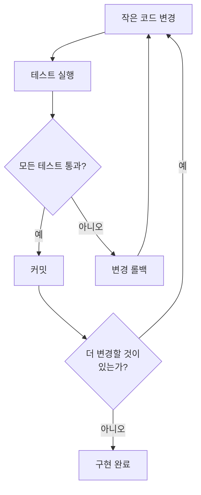
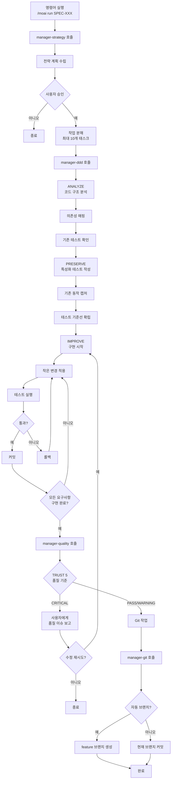

import { Callout } from "nextra/components";

# /moai run

SPEC 문서를 바탕으로 DDD (Domain-Driven Development) 방식으로 코드를 구현합니다.

<Callout type="info">
**슬래시 커맨드**: Claude Code에서 `/moai:run`을 입력하면 이 명령어를 바로 실행할 수 있습니다. `/moai`만 입력하면 사용 가능한 모든 서브커맨드 목록이 표시됩니다.
</Callout>

## 개요

`/moai run`은 MoAI-ADK 워크플로우의 **Phase 2 (Run)** 명령어입니다. Phase 1에서
생성된 SPEC 문서를 읽고, **ANALYZE-PRESERVE-IMPROVE** 사이클을 통해 기존 기능을
망가뜨리지 않으면서 안전하게 코드를 구현합니다. 내부적으로 **manager-ddd**
에이전트가 전체 과정을 관리합니다.

<Callout type="info">
**DDD를 집 리모델링으로 이해하기**

DDD의 ANALYZE-PRESERVE-IMPROVE 사이클은 **집 리모델링**과 같습니다:

| 단계         | 비유                | 실제 작업                       |
| ------------ | ------------------- | ------------------------------- |
| **ANALYZE**  | 집 점검하기         | 현재 코드 구조와 문제점 파악    |
| **PRESERVE** | 현재 상태 사진 찍기 | 특성화 테스트로 기존 동작 기록  |
| **IMPROVE**  | 방 하나씩 리모델링  | 테스트를 통과하면서 조금씩 개선 |

한 번에 집 전체를 부수면 위험하듯, 코드도 **조금씩 바꾸면서 매번 확인**하는 것이
안전합니다.

</Callout>

## 사용법

Plan 단계에서 생성된 SPEC ID를 인자로 전달합니다:

```bash
# Plan 단계 완료 후 반드시 /clear 실행
> /clear

# SPEC ID를 지정하여 구현 시작
> /moai run SPEC-AUTH-001
```

<Callout type="warning">
  `/moai run` 실행 전에 반드시 `/clear`를 실행하세요. Plan 단계에서 사용한
  토큰을 정리해야 Run 단계에서 **200K 토큰을 온전히 활용**할 수 있습니다.
</Callout>

## 지원 플래그

| 플래그              | 설명                  | 예시                               |
| ------------------- | --------------------- | ---------------------------------- |
| `--resume SPEC-XXX` | 중단된 구현 작업 재개 | `/moai run --resume SPEC-AUTH-001` |
| `--team`            | 에이전트 팀 모드 강제 | `/moai run SPEC-AUTH-001 --team`   |
| `--solo`            | 하위 에이전트 모드 강제 | `/moai run SPEC-AUTH-001 --solo`   |

**Resume 기능:**

재실행 시 마지막 성공한 단계 체크포인트부터 이어서 작업합니다.

## DDD 사이클

`/moai run`은 **ANALYZE -> PRESERVE -> IMPROVE** 세 단계를 순서대로 실행합니다.
각 단계에서 무슨 일이 일어나는지 자세히 살펴보겠습니다.

### 1. ANALYZE (분석)

기존 코드를 읽고, SPEC 요구사항과 비교하여 무엇을 해야 하는지 파악합니다.

**분석 항목:**

| 항목        | 설명                 | 예시                               |
| ----------- | -------------------- | ---------------------------------- |
| 코드 구조   | 파일, 모듈, 의존성   | "auth.py가 user_service.py에 의존" |
| 도메인 경계 | 비즈니스 로직의 범위 | "인증 도메인과 사용자 도메인 분리" |
| 테스트 현황 | 기존 테스트 커버리지 | "현재 45% 커버리지"                |
| 기술 부채   | 개선이 필요한 부분   | "SQL Injection 취약점 발견"        |

### 2. PRESERVE (보존)

기존 코드의 현재 동작을 **특성화 테스트**로 기록합니다. 이 테스트는 리팩토링
후에도 기존 기능이 그대로 동작하는지 확인하는 **안전망** 역할을 합니다.

<Callout type="tip">
**특성화 테스트란?**

"이 코드가 맞는지 틀리는지"를 판단하는 것이 아니라, **"현재 이렇게 동작한다"를
기록**하는 것입니다.

예를 들어, 기존 로그인 함수가 성공 시 `{"status": "success"}` 를 반환한다면, 이
동작을 테스트로 기록합니다. 나중에 코드를 바꿨을 때 이 테스트가 실패하면, "기존
동작이 바뀌었다"는 것을 바로 알 수 있습니다.

</Callout>

### 3. IMPROVE (개선)

SPEC 요구사항에 따라 **작은 단위로** 코드를 변경하고, 매번 테스트를 실행하여
기존 동작이 보존되는지 확인합니다.

**핵심 원칙: 작은 변경 + 매번 검증**



## 실행 과정

`/moai run`이 내부적으로 수행하는 전체 과정입니다:



## 단계별 상세

### Phase 1: 분석 및 계획

**manager-strategy** 하위 에이전트가 다음 작업을 수행합니다:

- SPEC 문서 완전 분석
- 요구사항 및 성공 기준 추출
- 구현 단계 및 개별 작업 식별
- 기술 스택 및 의존성 요구사항 결정
- 복잡도 및 노력 추정
- 단계별 접근 방식의 상세 실행 전략 생성

**출력:** plan_summary, requirements 목록, success_criteria, effort_estimate를
포함한 실행 계획

### Phase 1.5: 작업 분해

승인된 실행 계획을 원자적이고 검토 가능한 작업으로 분해합니다:

**작업 구조:**

- **Task ID**: SPEC 내 순차적 (TASK-001, TASK-002 등)
- **Description**: 명확한 작업 문장
- **Requirement Mapping**: 충족하는 SPEC 요구사항
- **Dependencies**: 선행 작업 목록
- **Acceptance Criteria**: 완료 검증 방법

**제약조건:** SPEC당 최대 10개 작업. 더 필요하면 SPEC 분할 권장

### Phase 2: DDD 구현

**manager-ddd** 하위 에이전트가 ANALYZE-PRESERVE-IMPROVE 사이클을 실행합니다:

**요구사항:**

- 작업 추적 초기화
- 완전한 ANALYZE-PRESERVE-IMPROVE 사이클 실행
- 각 변환 후 기존 테스트 통과 검증
- 커버리지 없는 코드 경로에 특성화 테스트 생성
- 테스트 커버리지 85% 이상 달성

**출력:** files_modified, characterization_tests_created, test_results,
behavior_preserved, structural_metrics

### Phase 2.5: 품질 검증

**manager-quality** 하위 에이전트가 TRUST 5 검증을 수행합니다:

| TRUST 5 기둥  | 검증 항목                          |
| ------------- | ---------------------------------- |
| **Tested**    | 테스트 존재 및 통과, DDD 규율 유지 |
| **Readable**  | 프로젝트 규칙 준수, 문서 포함      |
| **Unified**   | 기존 프로젝트 패턴 따름            |
| **Secured**   | 보안 취약점 없음, OWASP 준수       |
| **Trackable** | 명확한 커밋 메시지, 이력 분석 지원 |

**추가 검증:**

- 테스트 커버리지 85% 이상
- 동작 보존: 기존 테스트 변경 없이 통과
- 특성화 테스트 통과: 동작 스냅샷 일치
- 구조적 개선: 결합도 및 응집도 지표 개선

**출력:** trust_5_validation 결과, coverage_percentage, overall_status
(PASS/WARNING/CRITICAL), issues_found

### Phase 3: Git 작업 (조건부)

**manager-git** 하위 에이전트가 Git 자동화를 수행합니다:

**실행 조건:**

- quality_status가 PASS 또는 WARNING
- git_strategy.automation.auto_branch가 true이면 feature 브랜치 생성
- auto_branch가 false이면 현재 브랜치에 직접 커밋

### Phase 4: 완료 및 안내

사용자에게 다음 옵션을 제시합니다:

| 옵션           | 설명                                  |
| -------------- | ------------------------------------- |
| 문서 동기화    | `/moai sync` 실행하여 문서 및 PR 생성 |
| 다른 기능 구현 | `/moai plan`으로 추가 SPEC 생성       |
| 결과 검토      | 로컬에서 구현 및 테스트 커버리지 확인 |
| 완료           | 세션 종료                             |

## 품질 게이트

구현이 완료되면 다음 품질 기준을 모두 통과해야 합니다:

| 항목            | 기준         | 설명                                 |
| --------------- | ------------ | ------------------------------------ |
| LSP 오류        | **0개**      | 타입 체커, 린터 오류 없음            |
| 타입 오류       | **0개**      | pyright, mypy, tsc 등 타입 오류 없음 |
| 린트 오류       | **0개**      | ruff, eslint 등 린터 오류 없음       |
| 테스트 커버리지 | **85% 이상** | 코드 테스트 커버리지 목표            |
| 동작 보존       | **100%**     | 모든 특성화 테스트 통과              |

<Callout type="info">

**85% 커버리지는 왜 필요한가요?**

100%가 아닌 85%를 목표로 하는 이유

**100%는 비현실적**이며, 의미 없는 테스트가 추가될 수 있습니다. **85%면 핵심
로직**은 대부분 테스트됩니다. 나머지 15%는 설정 파일, 에러 핸들러 등 테스트하기
어려운 코드입니다.

</Callout>

## 실전 예시

### 예시: SPEC-AUTH-001 구현

**1단계: Plan 단계에서 SPEC 생성 완료**

```bash
> /moai plan "JWT 기반 사용자 인증: 회원가입, 로그인, 토큰 갱신"
# SPEC-AUTH-001 생성 완료
```

**2단계: 토큰 정리 후 구현 시작**

```bash
> /clear
> /moai run SPEC-AUTH-001
```

**3단계: manager-ddd가 자동으로 수행하는 작업**

manager-ddd 에이전트가 SPEC을 구현하기 위해 수행하는 4개의 Phase입니다.

---

#### Phase 1: 전략 계획

SPEC 문서를 분석하고 구현 전략을 수립합니다.

```bash
Phase 1: 전략 계획
- SPEC 문서 분석 완료
- 요구사항 5개 추출
- 작업 7개로 분해 (TASK-001 ~ TASK-007)
- 예상 복잡도: 중간
```

---

#### Phase 1.5: 작업 분해

구현 작업을 세부 단위로 나눕니다.

```bash
Phase 1.5: 작업 분해
- TASK-001: 사용자 모델 정의
- TASK-002: 비밀번호 해싱 유틸리티
- TASK-003: JWT 토큰 생성/검증
- TASK-004: 회원가입 API
- TASK-005: 로그인 API
- TASK-006: 토큰 갱신 API
- TASK-007: 입력 검증 미들웨어
```

---

#### Phase 2: DDD 구현

ANALYZE-PRESERVE-IMPROVE 사이클로 안전하게 구현합니다.

**ANALYZE 단계** - 기존 코드를 이해합니다:

```bash
ANALYZE 단계:
- 기존 코드 구조 분석: src/auth/ (4개 파일)
- 테스트 커버리지 확인: 현재 32%
- 의존성 매핑: bcrypt, PyJWT, SQLAlchemy
```

**PRESERVE 단계** - 기존 동작을 보호합니다:

```bash
PRESERVE 단계:
- 특성화 테스트 12개 작성
- 기존 동작 캡처 완료
- 테스트 기준선 확립: 32%
```

**IMPROVE 단계** - 점진적으로 구현합니다:

```bash
IMPROVE 단계:
- 반복 1: TASK-001 사용자 모델 (테스트 통과)
- 반복 2: TASK-002 비밀번호 해싱 (테스트 통과)
- 반복 3: TASK-003 JWT 토큰 (테스트 통과)
- 반복 4: TASK-004 회원가입 API (테스트 통과)
- 반복 5: TASK-005 로그인 API (테스트 통과)
- 반복 6: TASK-006 토큰 갱신 (테스트 통과)
- 반복 7: TASK-007 입력 검증 (테스트 통과)
```

---

#### Phase 2.5: 품질 검증

TRUST 5 기둥으로 품질을 검증합니다.

```bash
Phase 2.5: 품질 검증
- TRUST 5 기둥 모두 통과
- 테스트 커버리지: 89%
- LSP 오류: 0개
- 타입 오류: 0개
- 특성화 테스트: 12/12 통과
- 새 테스트: 24/24 통과
- 상태: PASS
```

---

#### Phase 3: Git 작업

Conventional Commits으로 커밋을 생성합니다.

```bash
Phase 3: Git 작업
- 브랜치: feature/SPEC-AUTH-001
- 커밋 7개 생성 (Conventional Commits)
```

---

#### Phase 4: 완료

구현이 완료되면 다음 단계로 안내합니다.

```bash
Phase 4: 완료
- 구현 완료
- 다음 단계: /moai sync
```

**4단계: 구현 완료 후 Sync 단계로 이동**

```bash
> /clear
> /moai sync SPEC-AUTH-001
```

## 자주 묻는 질문

### Q: 새 프로젝트에서 기존 코드가 없으면 PRESERVE 단계는 어떻게 되나요?

기존 코드가 없으면 PRESERVE 단계는 **빠르게 통과**됩니다. 새 코드에 대한
테스트를 IMPROVE 단계에서 함께 작성합니다.

### Q: 구현 도중 토큰이 부족하면 어떻게 하나요?

manager-ddd 에이전트가 **자동으로 진행 상황을 저장**합니다. `/clear` 후 다시
`/moai run SPEC-XXX`를 실행하면 SPEC 문서를 기반으로 이어서 작업합니다.

### Q: 테스트 커버리지 85%를 달성하기 어려우면?

`quality.yaml`에서 커버리지 목표를 조정할 수 있지만, **권장하지 않습니다**.
85%는 핵심 로직이 테스트되었음을 보장하는 최소 기준입니다. 커버리지가 부족하면
manager-ddd가 누락된 테스트를 자동으로 추가합니다.

### Q: Phase 2.5에서 CRITICAL 상태가 나오면 어떻게 하나요?

사용자에게 품질 이슈를 보고하고, 수정을 재시도할지 묻습니다. "예"를 선택하면
IMPROVE 단계로 돌아가 수정을 계속합니다.

### Q: `/moai run`과 `/moai`의 차이는 무엇인가요?

`/moai run`은 **이미 생성된 SPEC을 바탕으로 구현만** 수행합니다. `/moai`는 SPEC
생성부터 구현, 문서화까지 **전체 워크플로우**를 자동으로 수행합니다.

## v2.9.0 신규 기능

### Harness Level Routing (품질 깊이 라우팅)

Run phase 시작 시 SPEC 복잡도에 따라 품질 파이프라인 깊이를 자동 결정합니다.

| 레벨 | 대상 | evaluator | 건너뛰는 Phase |
|------|------|-----------|---------------|
| **minimal** | 단순 버그 수정, 설정 변경 | 비활성 | 0, 0.5, 2.0, 2.5, 2.75, 2.8a |
| **standard** | 일반 기능 개발 (기본값) | final-pass (Phase 2.8a만) | 없음 |
| **thorough** | 보안/결제 등 중요 기능 | per-sprint (Phase 2.0 + 2.8a) | 없음 |

실패 시 자동 에스컬레이션: minimal → standard → thorough (최대 2회)

### Phase 0.9: JIT Language Detection (언어 자동 감지)

프로젝트의 주요 언어를 자동 감지하여 에이전트 스폰 시 적절한 언어 스킬을 주입합니다.

| 감지 파일 | 언어 스킬 |
|-----------|-----------|
| `go.mod` | moai-lang-go |
| `package.json` (typescript) | moai-lang-typescript |
| `pyproject.toml` | moai-lang-python |
| `Cargo.toml` | moai-lang-rust |
| `pom.xml` / `build.gradle` | moai-lang-java |

### Phase 0.95: Scale-Based Mode Selection (규모 기반 모드 선택)

SPEC 규모에 따라 최적의 실행 모드를 자동 선택합니다.

| 패턴 | 기준 | 실행 모드 |
|------|------|-----------|
| 버그 수정 | 파일 ≤ 3, 단일 도메인 | **Fix Mode** |
| 단일 기능 | 파일 ≤ 5, 단일 도메인 | **Focused Mode** |
| 도메인 내 기능 | 파일 5-10 | **Standard Mode** |
| 멀티 도메인 | 파일 ≥ 10 또는 도메인 ≥ 3 | **Full Pipeline** |
| 대규모 변경 | complexity ≥ 7 + --team | **Team Mode** |

### Phase 2.0: Sprint Contract (thorough 전용)

thorough 레벨에서만 실행됩니다. evaluator-active와 구현 전 Done 기준을 사전 합의합니다.

**계약 내용:**
- 통과해야 할 구체적 테스트 케이스
- 식별된 엣지 케이스
- 하드 임계값 (커버리지 %, 성능 목표, 보안 요구사항)

최대 2라운드 협상 후 evaluator 권고안으로 확정됩니다.

### Phase 2.8a/2.8b 분리

기존 Phase 2.8이 두 단계로 분리되었습니다:

- **Phase 2.8a**: evaluator-active 능동 평가 (Functionality/Security/Craft/Consistency)
- **Phase 2.8b**: manager-quality TRUST 5 정적 검증 (기존 동작)

<Callout type="warning">
Security FAIL = 전체 FAIL. 최대 3회 수정-평가 사이클 후 사용자에게 보고됩니다.
</Callout>

### Drift Guard (범위 이탈 감지)

DDD/TDD 사이클 완료 시 계획 대비 실제 변경을 비교합니다.

- drift ≤ 20%: 정보 기록만
- 20% < drift ≤ 30%: 경고
- drift > 30%: Phase 2.7 재계획 게이트 트리거

### tasks.md 영속 아티팩트

태스크 분해를 `.moai/specs/SPEC-{ID}/tasks.md`에 기록합니다. Git 추적 가능하며 Drift Guard에서 참조합니다.

### spec-compact.md

Run phase 진입 시 SPEC 요약본을 자동 로드하여 ~30% 토큰을 절약합니다. `.moai/specs/SPEC-{ID}/spec-compact.md`가 존재하면 전체 spec.md 대신 사용됩니다.

## 관련 문서

- [도메인 주도 개발](/core-concepts/ddd) - ANALYZE-PRESERVE-IMPROVE 사이클 상세
  설명
- [TRUST 5 품질 시스템](/core-concepts/trust-5) - 품질 게이트 상세 설명
- [/moai plan](./moai-1-plan) - 이전 단계: SPEC 문서 생성
- [/moai sync](./moai-3-sync) - 다음 단계: 문서 동기화 및 PR
