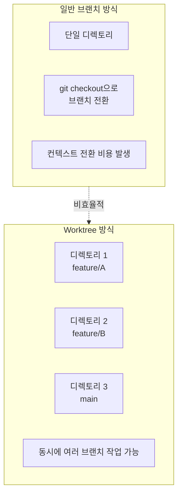
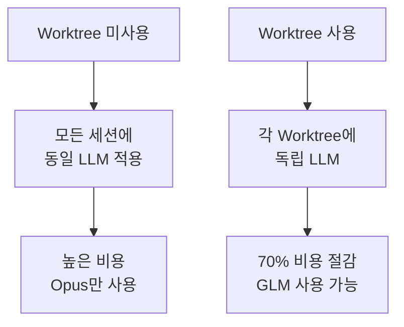
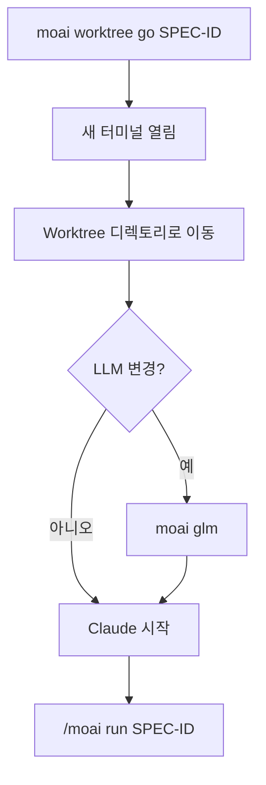
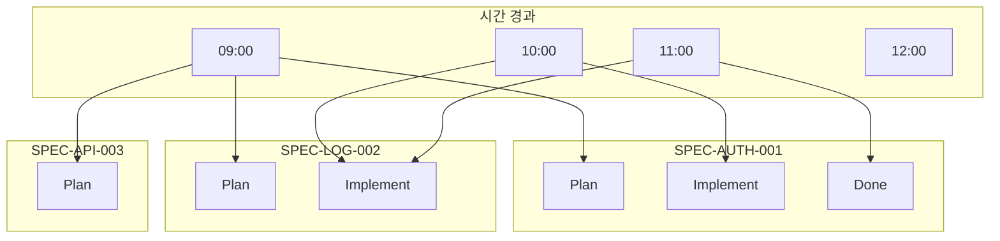
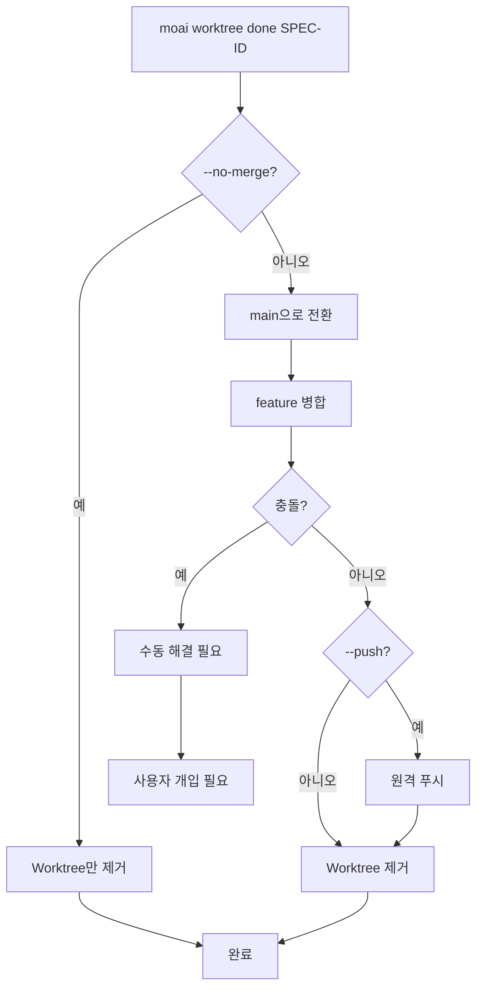
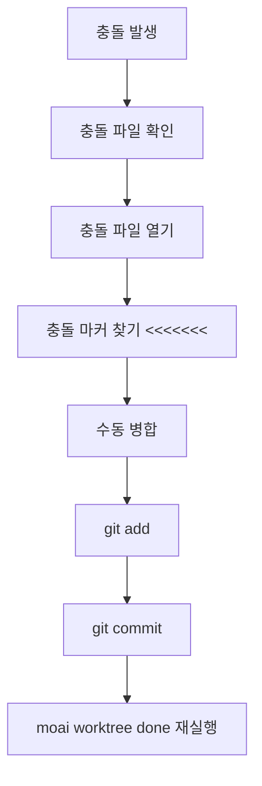
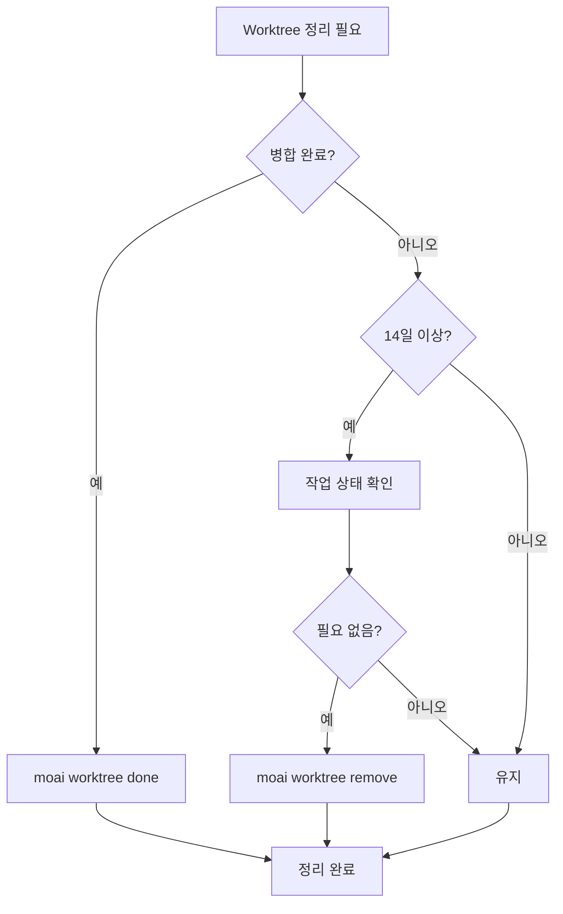
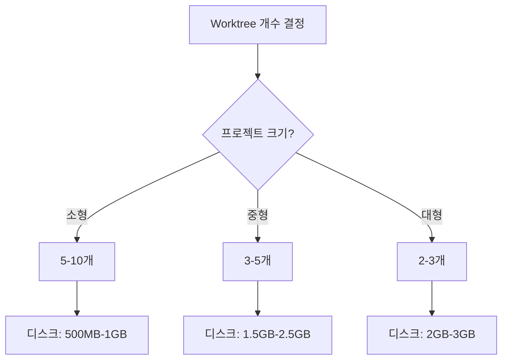
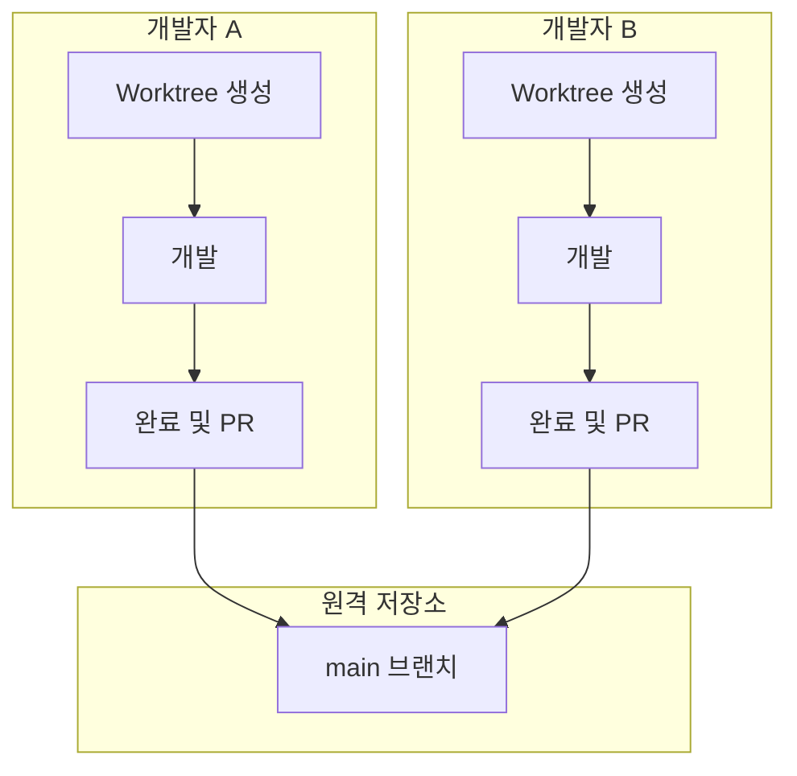

# Git Worktree 자주 묻는 질문

Git Worktree 사용 중 발생하는 일반적인 문제들과 해결 방법을 정리했습니다.

## 목차

1. [기본 개념](#기본-개념)
2. [사용 관련](#사용-관련)
3. [문제 해결](#문제-해결)
4. [성능 및 최적화](#성능-및-최적화)
5. [팀 협업](#팀-협업)

---

## 기본 개념

### Q: Git Worktree와 일반 브랜치의 차이점은 무엇인가요?

**A**: Git Worktree는 **물리적으로 분리된 디렉토리**에서 작업할 수 있게
해줍니다:



**주요 차이점**:

| 특징          | 일반 브랜치         | Git Worktree    |
| ------------- | ------------------- | --------------- |
| 작업 디렉토리 | 1개 공유            | N개 독립        |
| 브랜치 전환   | `git checkout` 필요 | 디렉토리 이동만 |
| 동시 작업     | 불가능              | 가능            |
| LLM 설정      | 공유됨              | 독립적          |
| 충돌 가능성   | 높음                | 낮음            |

---

### Q: 왜 Worktree를 사용해야 하나요?

**A**: 다음과 같은 이유로 Worktree 사용을 권장합니다:

1. **LLM 설정 독립성**: 각 SPEC마다 다른 LLM 사용 가능
   - Plan 단계: Opus (고품질)
   - Implement 단계: GLM (저비용)
   - Document 단계: Sonnet (중간)

2. **병렬 개발**: 동시에 여러 SPEC 개발 가능
3. **충돌 방지**: 독립된 작업 공간으로 충돌 최소화
4. **비용 절감**: GLM 사용으로 70% 비용 절감



---

### Q: MoAI-ADK에서 Worktree는 필수인가요?

**A**: 아니요, 필수는 아니지만 **강력히 권장**합니다:

- **단일 SPEC 개발**: Worktree 없이도 가능
- **다중 SPEC 개발**: Worktree 필수적
- **팀 협업**: Worktree로 충돌 방지
- **비용 최적화**: Worktree로 LLM 분리

---

## 사용 관련

### Q: Worktree를 생성하는 방법은?

**A**: 두 가지 방법이 있습니다:

**방법 1: 자동 생성 (권장)**

```bash
# SPEC 계획 단계에서 자동 생성
> /moai plan "기능 설명" --worktree

# 자동으로:
# 1. SPEC 문서 생성
# 2. Worktree 생성
# 3. Feature 브랜치 생성
```

**방법 2: 수동 생성**

```bash
# Worktree 수동 생성
moai worktree new SPEC-AUTH-001

# 특정 브랜치에서 생성
moai worktree new SPEC-AUTH-001 --from develop
```

---

### Q: Worktree로 어떻게 진입하나요?

**A**: `moai worktree go` 명령어를 사용합니다:

```bash
# Worktree 진입
moai worktree go SPEC-AUTH-001

# 새 터미널이 열리고 Worktree로 이동
# 프롬프트가 변경됨
(SPEC-AUTH-001) $
```

**진입 후 작업 흐름**:



---

### Q: 여러 Worktree를 동시에 사용할 수 있나요?

**A**: 네, 무제한으로 가능합니다:

```bash
# Terminal 1
moai worktree go SPEC-AUTH-001
(SPEC-AUTH-001) $ moai glm

# Terminal 2
moai worktree go SPEC-LOG-002
(SPEC-LOG-002) $ moai glm

# Terminal 3
moai worktree go SPEC-API-003
(SPEC-API-003) $ moai glm

# 모두 동시에 작업 가능
```

**병렬 작업 시각화**:



---

### Q: Worktree를 완료하는 방법은?

**A**: `moai worktree done` 명령어를 사용합니다:

```bash
# 기본 완료 (병합 + 정리)
moai worktree done SPEC-AUTH-001

# 원격에 푸시까지
moai worktree done SPEC-AUTH-001 --push

# 병합 없이 제거만
moai worktree done SPEC-AUTH-001 --no-merge
```

**완료 프로세스**:



---

## 문제 해결

### Q: Worktree 충돌이 발생했어요

**A**: 다음 단계로 해결하세요:



**실제 예시**:

```bash
moai worktree done SPEC-AUTH-001
✗ 병합 충돌 발생!

# 1. 충돌 파일 확인
cd .moai/worktrees/SPEC-AUTH-001
git status
# 충돌 파일: src/auth/jwt.ts

# 2. 충돌 해결
code src/auth/jwt.ts

# 3. 충돌 마커 확인 및 수정
<<<<<<< HEAD
const secret = process.env.JWT_SECRET;
=======
const secret = config.jwt.secret;
>>>>>>> feature/SPEC-AUTH-001

# 4. 병합
const secret = process.env.JWT_SECRET || config.jwt.secret;

# 5. 커밋
git add src/auth/jwt.ts
git commit -m "fix: resolve merge conflict"

# 6. 완료 재시도
cd /path/to/project
moai worktree done SPEC-AUTH-001
✓ 완료!
```

---

### Q: Worktree가 손상되었어요

**A**: 다음 단계로 복구하세요:

```bash
# 1. 진단
moai worktree status SPEC-AUTH-001
✗ Worktree 디렉토리가 존재하지 않습니다

# 2. 기존 Worktree 제거
moai worktree remove SPEC-AUTH-001 --force

# 3. Worktree 재생성
moai worktree new SPEC-AUTH-001

# 4. 복구 확인
moai worktree status SPEC-AUTH-001
✓ Worktree 정상
```

---

### Q: 디스크 공간이 부족해요

**A**: 오래된 Worktree를 정리하세요:

```bash
# 1. 디스크 사용량 확인
$ du -sh .moai/worktrees/*
2.5G    .moai/worktrees/SPEC-AUTH-001
1.8G    .moai/worktrees/SPEC-LOG-002
3.2G    .moai/worktrees/SPEC-API-003

# 2. 오래된 Worktree 정리
$ moai worktree clean --older-than 14

# 정리될 Worktree:
#   - SPEC-OLD-001 (30일 전, 2.1GB)
#   - SPEC-OLD-002 (45일 전, 1.7GB)

계속 진행하시겠습니까? [y/N] y

✓ 2개 Worktree 정리 완료
✓ 3.8GB 디스크 공간 확보
```

**정리 전략**:



---

### Q: LLM이 예상대로 작동하지 않아요

**A**: Worktree별 LLM 설정을 확인하세요:

```bash
# 현재 LLM 확인
moai config
현재 LLM: GLM 5

# Worktree에서 LLM 변경
moai worktree go SPEC-AUTH-001
(SPEC-AUTH-001) $ moai cc
→ Claude Opus로 변경됨

# 다른 Worktree는 영향 없음
(SPEC-AUTH-001) $ exit
moai worktree go SPEC-LOG-002
(SPEC-LOG-002) $ moai config
현재 LLM: GLM 5 (변경 없음)
```

---

### Q: Git 명령어가 작동하지 않아요

**A**: 올바른 디렉토리에 있는지 확인하세요:

```bash
# Worktree 디렉토리 확인
pwd
/Users/goos/MoAI/moai-project/.moai/worktrees/SPEC-AUTH-001

# Git 상태 확인
git status
On branch feature/SPEC-AUTH-001
nothing to commit, working tree clean

# 만약 Git 오류가 발생하면
git fetch --all
git rebase origin/feature/SPEC-AUTH-001
```

---

## 성능 및 최적화

### Q: Worktree가 성능에 영향을 주나요?

**A**: 미미한 영향만 있습니다:

**장점**:

- 각 Worktree가 독립적이어서 캐시 효율적
- Git 작업이 빠름 (로컬 브랜치)
- 파일 시스템 캐시 활용

**단점**:

- 디스크 공간 사용 (각 Worktree마다 중복)
- 초기 Worktree 생성 시 시간 소요

**최적화 팁**:

```bash
# 1. 필요 없는 Worktree 제거
moai worktree clean --merged-only

# 2. Git 가비지 컬렉션
git gc --aggressive --prune=now

# 3. Worktree 압축
git worktree prune
```

---

### Q: 몇 개의 Worktree를 생성할 수 있나요?

**A**: 이론적으로 무제한이지만 실제로는 다음 factors에 의해 제한됩니다:

**제한 factors**:

1. **디스크 공간**: 각 Worktree는 약 100MB-1GB 사용
2. **메모리**: 각 Worktree에서 열린 세션
3. **파일 시스템**: 동시에 열 수 있는 파일 수

**권장 사항**:

- **소형 프로젝트**: 5-10개 Worktree
- **중형 프로젝트**: 3-5개 Worktree
- **대형 프로젝트**: 2-3개 Worktree



---

### Q: Worktree를 자동으로 정리할 수 있나요?

**A**: 네, 정기적인 정리 스크립트를 사용할 수 있습니다:

```bash
#!/bin/bash
# clean-worktrees.sh

# 병합된 Worktree 정리
moai worktree clean --merged-only

# 30일 이상된 Worktree 정리
moai worktree clean --older-than 30

# Git 가비지 컬렉션
cd /path/to/project
git gc --aggressive --prune=now

echo "Worktree 정리 완료"
```

**크론 작업 설정**:

```bash
# 매주 일요일 새벽 2시에 실행
0 2 * * 0 /path/to/clean-worktrees.sh >> /var/log/worktree-cleanup.log 2>&1
```

---

## 팀 협업

### Q: 팀에서 Worktree를 어떻게 사용하나요?

**A**: 다음과 같은 워크플로우를 권장합니다:



**팀 협업 가이드**:

1. **Worktree 명명 규칙**: `SPEC-{카테고리}-{번호}`
2. **정기적인 동기화**: `git pull origin main`
3. **PR 리뷰 전에**: 로컬에서 테스트 완료
4. **충돌 방지**: 자주 `main`과 동기화

---

### Q: Worktree와 원격 저장소를 동기화하는 방법은?

**A**: 정기적으로 `git pull`을 실행하세요:

```bash
# 각 Worktree에서 동기화
moai worktree go SPEC-AUTH-001
(SPEC-AUTH-001) $ git pull origin main

# 또는 모든 Worktree 동기화
for spec in $(moai worktree list --porcelain | awk '{print $1}'); do
    cd ~/.moai/worktrees/$spec
    echo "Syncing $spec..."
    git pull origin main
done
```

---

### Q: PR 리뷰 중 Worktree를 어떻게 관리하나요?

**A**: 다음 전략을 사용하세요:

```bash
# PR 생성 전
moai worktree status SPEC-AUTH-001
# 상태 확인

git log main..feature/SPEC-AUTH-001
# 변경 사항 확인

# PR 리뷰 중
# Worktree 유지 (병합 대기)

# PR 승인 후
moai worktree done SPEC-AUTH-001 --push
# 병합 및 정리

# PR 거부 후
cd .moai/worktrees/SPEC-AUTH-001
# 수정 작업 계속
```

---

## 추가 질문

### Q: Worktree를 사용하지 않고 MoAI-ADK를 사용할 수 있나요?

**A**: 네, 가능하지만 권장하지 않습니다:

```bash
# Worktree 없이 사용
> /moai plan "기능 설명"
# Worktree 생성 단계 건너뜀

# 하지만 다음 문제 발생:
# 1. 모든 세션에 동일 LLM 적용
# 2. 병렬 개발 불가
# 3. 컨텍스트 전환 비용
```

---

### Q: Worktree를 백업해야 하나요?

**A**: Worktree는 Git으로 관리되므로 별도 백업이 필요 없습니다:

```bash
# Worktree는 Git의 일부
# 원격 저장소에 푸시하면 자동 백업

# 정기적으로 원격에 푸시
git push origin feature/SPEC-AUTH-001

# Worktree 손실 시 복구
git fetch origin
git worktree add SPEC-AUTH-001 origin/feature/SPEC-AUTH-001
```

---

## 관련 문서

- [Git Worktree 개요](/worktree/index)
- [완벽 가이드](./guide)
- [실제 사용 예시](./examples)

## 추가 도움이 필요하신가요?

- [GitHub Issues](https://github.com/MoAI-ADK/moai-adk/issues)
- [Discord 커뮤니티](https://discord.gg/moai-adk)
- [이메일 지원](mailto:support@moai-adk.org)
