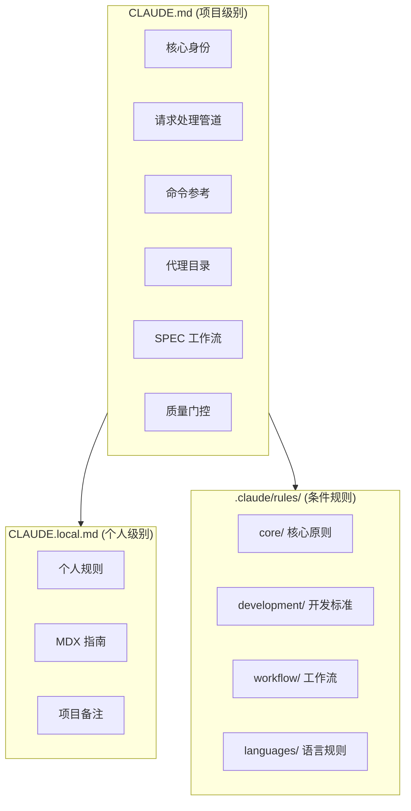
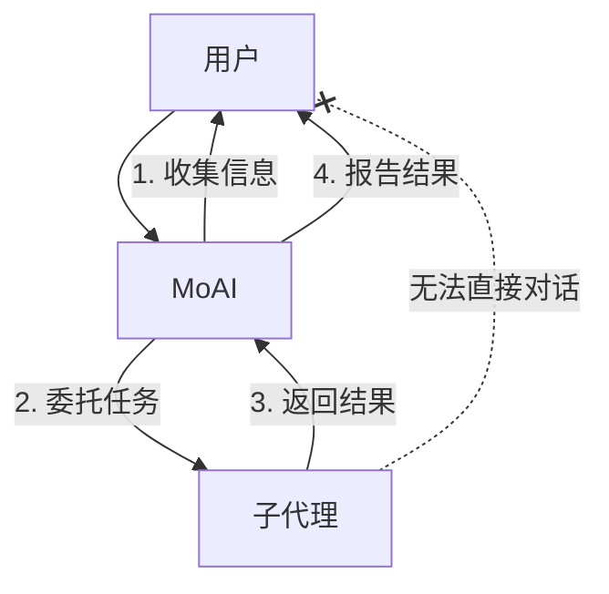
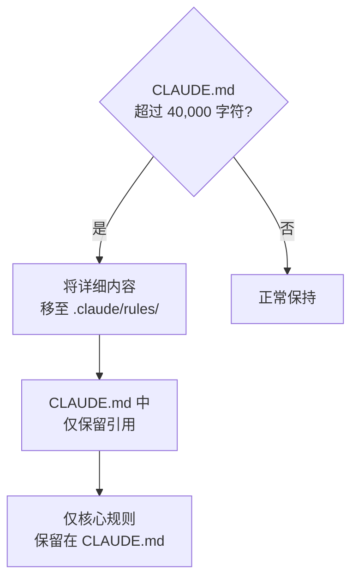
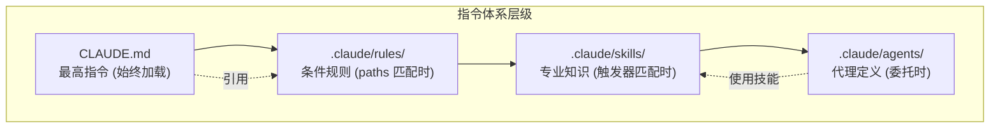

import { Callout } from 'nextra/components'

# CLAUDE.md 指南

Claude Code 的核心指令文件体系详细介绍。

<Callout type="tip">
**一句话总结**: `CLAUDE.md` 是项目的 **宪法**。Claude Code 如何理解项目、遵循什么规则、调用什么代理,全部由这个文件决定。
</Callout>

## CLAUDE.md 是什么?

`CLAUDE.md` 是 Claude Code 在会话开始时 **最先读取的指令文件**。这个文件定义了项目的规则、代理结构、工作流、质量标准等。

就像新员工入职时阅读员工手册一样,Claude Code 在会话开始时会阅读 `CLAUDE.md` 来了解项目的上下文。

## 文件结构

MoAI-ADK 使用 2 个指令文件和规则目录。



| 文件/目录 | 用途 | Git 追踪 | 更新时 |
|---------------|------|----------|-------------|
| `CLAUDE.md` | MoAI-ADK 核心指令 | 是 | 覆盖 |
| `CLAUDE.local.md` | 个人自定义指令 | 否 | 保留 |
| `.claude/rules/moai/` | 条件详细规则 | 是 | 覆盖 |
| `.claude/rules/local/` | 个人自定义规则 | 否 | 保留 |

## MoAI CLAUDE.md 主要章节

### 1. 核心身份

定义 MoAI 协调器的角色和 HARD 规则。

```markdown
## 1. 核心身份

MoAI 是 Claude Code 的战略协调器。

### HARD 规则 (必需)
- [HARD] 语言感知响应: 使用用户的 conversation_language 响应
- [HARD] 并行执行: 独立工具调用并行执行
- [HARD] 不显示 XML 标签: 用户面向响应不显示 XML
- [HARD] Markdown 输出: 所有沟通使用 Markdown
```

### 2. 请求处理管道

分析用户请求并路由的 4 阶段管道。

| 阶段 | 说明 |
|------|------|
| 1. 分析 | 评估请求复杂性、检测技术关键字 |
| 2. 路由 | 根据命令类型选择适当路径 |
| 3. 执行 | 委托给代理执行任务 |
| 4. 报告 | 整合结果并向用户报告 |

### 3. 命令参考

定义 MoAI-ADK 的 3 种命令类型。

| 类型 | 命令 | 用途 |
|------|--------|------|
| Type A (工作流) | `/moai project`, `/moai plan`, `/moai run`, `/moai sync` | 主要开发工作流 |
| Type B (实用工具) | `/moai`, `/moai fix`, `/moai loop` | 快速修复、自动化 |
| Type C (反馈) | `/moai feedback` | 改进建议报告 |

### 4. 代理目录

定义 20 个代理的角色和选择标准。

| 层级 | 代理 | 数量 |
|------|----------|------|
| Manager | spec, ddd, docs, quality, strategy, project, git | 7 个 |
| Expert | backend, frontend, security, devops, performance, debug, testing, refactoring | 8 个 |
| Builder | agent, skill, command, plugin | 4 个 |

### 5. SPEC 工作流

定义 3 阶段 SPEC 基础开发工作流。

```bash
# Plan: SPEC 文档创建 (30K tokens)
> /moai plan "功能描述"

# Run: DDD 实现 (180K tokens)
> /moai run SPEC-XXX

# Sync: 文档同步 (40K tokens)
> /moai sync SPEC-XXX
```

### 6. 质量门控

定义 TRUST 5 框架和 LSP 质量门控。

| 质量标准 | 要求 |
|-----------|----------|
| Tested | 85%+ 覆盖率, LSP 类型错误 0 |
| Readable | 清晰命名, LSP 语法错误 0 |
| Unified | 一致风格, LSP 警告 10 以下 |
| Secured | OWASP 合规, LSP 安全警告 0 |
| Trackable | 清晰提交, LSP 状态追踪 |

### 7. 用户交互架构

子代理无法直接与用户对话。



### 8. 配置参考

引用语言设置、用户设置、项目规则。

```yaml
language:
  conversation_language: ko           # 用户响应语言
  agent_prompt_language: en           # 代理内部语言
  git_commit_messages: en             # Git 提交消息
  code_comments: en                   # 代码注释
  documentation: en                   # 文档文件
```

## CLAUDE.local.md 使用方法

`CLAUDE.local.md` 是用于编写个人规则和备注的文件。与 MoAI-ADK 更新无关,会被保留。

### 编写示例

```markdown
# 项目本地配置

## 文档编写指南

### MDX 渲染错误防止
- 强调标记和括号之间必须有空格

### Mermaid 图表方向
- 所有图表使用纵向 (flowchart TD)

## 个人备注
- 数据库迁移前必须备份
- API 端点命名: kebab-case
```

### 使用提示

| 用途 | 内容示例 |
|------|-----------|
| 编码规则 | "变量名使用 camelCase,文件名使用 kebab-case" |
| 项目备注 | "认证使用 JWT,过期 24 小时,刷新 7 天" |
| 禁止事项 | "生产代码中不保留 console.log" |
| 偏好模式 | "React 组件只用函数式" |
| MDX 规则 | "强调和括号之间必须有空格" |

## .claude/rules/ 系统

`.claude/rules/` 目录存储 **条件加载的详细规则**。

### 目录结构

```
.claude/rules/moai/
├── core/                          # 核心原则
│   └── moai-constitution.md       # TRUST 5, 核心规则
├── development/                   # 开发标准
│   ├── skill-authoring.md         # 技能编写指南
│   └── coding-standards.md        # 编码标准
├── workflow/                      # 工作流
│   ├── workflow-modes.md          # Plan/Run/Sync 定义
│   └── spec-workflow.md           # SPEC 工作流
└── languages/                     # 语言规则 (16 个)
    ├── python.md
    ├── typescript.md
    ├── javascript.md
    └── ...
```

### 条件加载 (paths frontmatter)

规则文件通过 `paths` frontmatter **仅在处理特定文件时加载**。

```yaml
---
paths:
  - "**/*.py"
  - "**/pyproject.toml"
---

# Python 编码规则
- 使用 ruff 格式化器
- 类型提示必需
- docstring 使用 Google 风格
```

此规则仅在修改 Python 文件时加载,**节省 token**。

### 规则文件类型

| 目录 | 文件 | 加载条件 |
|----------|------|-----------|
| `core/` | `moai-constitution.md` | 始终加载 |
| `development/` | `skill-authoring.md` | 技能相关任务时 |
| `development/` | `coding-standards.md` | 代码工作时 |
| `workflow/` | `workflow-modes.md` | 工作流命令时 |
| `workflow/` | `spec-workflow.md` | SPEC 相关任务时 |
| `languages/` | `python.md` 等 | 修改相应语言文件时 |

## 大小限制

`CLAUDE.md` 必须保持在 **40,000 字符以下**。

### 超过大小限制的应对方法



**应对策略:**

1. **移动详细内容**: 长篇说明分离到 `.claude/rules/` 文件
2. **使用引用**: `CLAUDE.md` 中使用 `@文件路径` 引用
3. **保留核心**: 仅保留身份、HARD 规则、代理目录
4. **转换为技能**: 长篇模式说明转换为技能

## 实战示例: CLAUDE.local.md 自定义规则

### 前端项目

```markdown
# 项目本地配置

## React 规则
- 组件必须使用函数式
- Props 接口在组件文件顶部定义
- 状态管理使用 Zustand
- CSS 仅使用 Tailwind CSS

## 命名规则
- 组件: PascalCase (UserProfile.tsx)
- 工具: camelCase (formatDate.ts)
- 常量: UPPER_SNAKE_CASE (MAX_RETRY_COUNT)
- API 端点: kebab-case (/api/user-profiles)

## 禁止事项
- 禁止使用 any 类型
- 生产代码禁止 console.log
- 禁止 default export (仅使用 named export)
```

### 后端项目

```markdown
# 项目本地配置

## Python 规则
- 使用 FastAPI
- 优先异步函数 (async/await)
- 使用 Pydantic v2 模型
- SQLAlchemy 2.0 风格

## 数据库规则
- 迁移前必须备份
- 分析查询模式后添加索引
- 使用 soft delete 模式 (is_deleted 标志)

## API 规则
- RESTful 端点命名
- 统一响应格式: {"data": ..., "message": ...}
- 错误代码标准化
```

## CLAUDE.md, rules, skills 的关系



| 层级 | 文件 | 加载时机 | 角色 |
|------|------|-----------|------|
| 1. CLAUDE.md | `CLAUDE.md` | 始终 | 项目身份、核心规则 |
| 2. Rules | `.claude/rules/*.md` | 文件模式匹配时 | 条件详细规则 |
| 3. Skills | `.claude/skills/*/skill.md` | 触发器匹配时 | 专业知识、模式 |
| 4. Agents | `.claude/agents/*.md` | 委托时 | 专家角色定义 |

## 相关文档

- [技能指南](/advanced/skill-guide) - 技能系统详情
- [代理指南](/advanced/agent-guide) - 代理系统详情
- [settings.json 指南](/advanced/settings-json) - 设置文件管理
- [Hooks 指南](/advanced/hooks-guide) - 事件自动化

<Callout type="tip">
**提示**: 相比直接修改 `CLAUDE.md`,建议在 `CLAUDE.local.md` 中添加个人规则。这样 MoAI-ADK 更新时个人规则也能安全保留。
</Callout>
