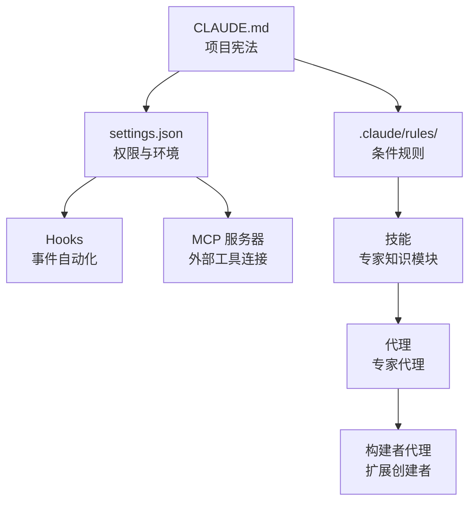

import { Callout } from 'nextra/components'

# 高级

深入介绍 MoAI-ADK 的内部结构和高级功能。

<Callout type="info">
本章节是为已经理解 MoAI-ADK 基本概念并希望掌握内部运行原理的开发者准备的指南。
</Callout>

## 学习结构

MoAI-ADK 由 7 个核心组件组成:

## 目录

| 主题 | 描述 |
|-------|-------------|
| [技能指南](/advanced/skill-guide) | 为 AI 提供专业知识的技能系统 |
| [代理指南](/advanced/agent-guide) | 专业化 AI 任务执行器系统 |
| [构建者代理指南](/advanced/builder-agents) | 创建技能、代理、命令、插件 |
| [Hooks 指南](/advanced/hooks-guide) | 基于事件的自动化脚本 |
| [settings.json 指南](/advanced/settings-json) | Claude Code 全局设置管理 |
| [CLAUDE.md 指南](/advanced/claude-md-guide) | 项目指南文件系统 |
| [MCP 服务器](/advanced/mcp-servers) | 外部工具连接协议 |
| [Google Stitch 指南](/advanced/stitch-guide) | AI 驱动的 UI/UX 设计生成工具 |

<Callout type="tip">
每个文档都可以独立阅读,但从**技能指南**开始按顺序阅读可以系统性地理解整个架构。
</Callout>
