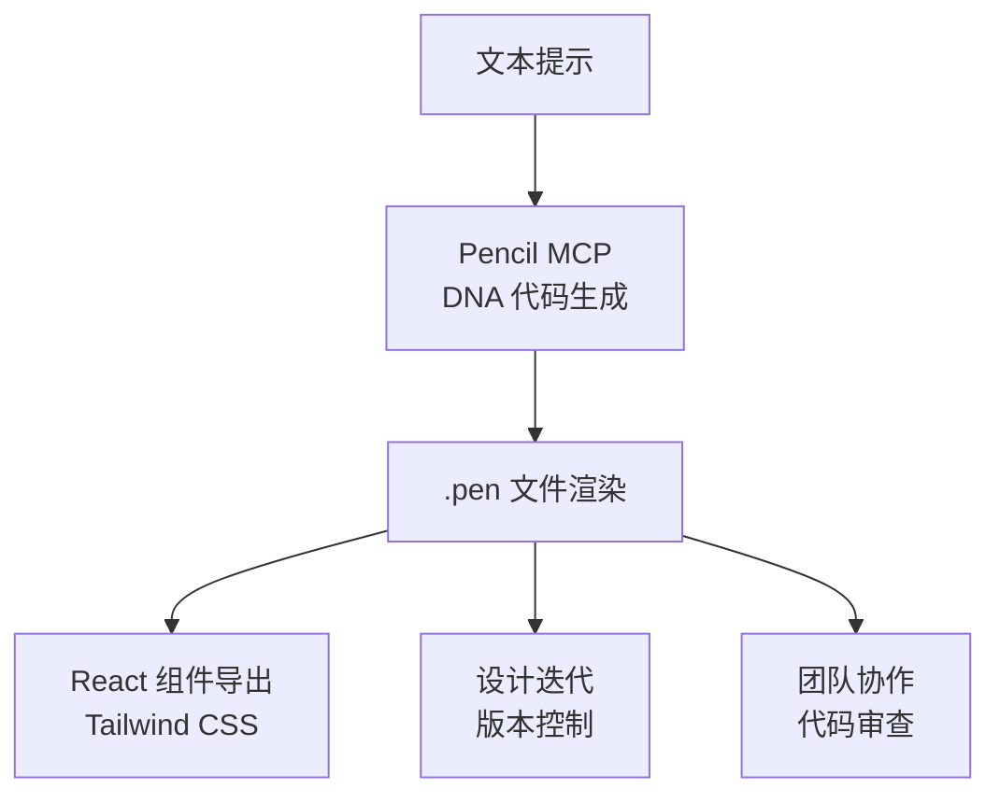
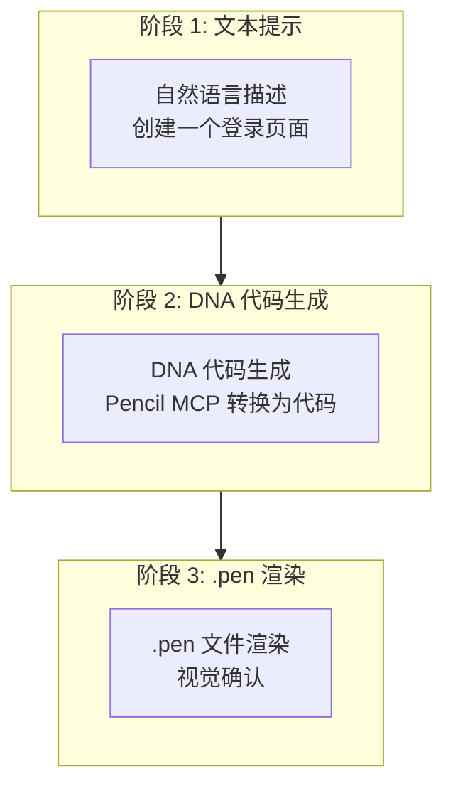
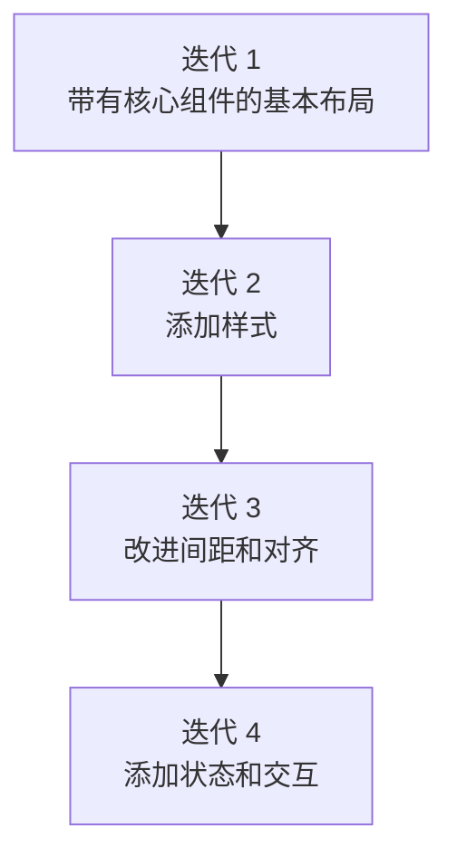
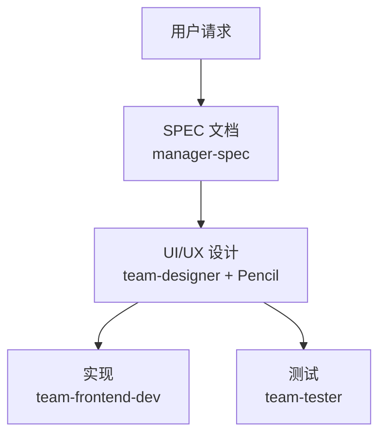

import { Callout } from 'nextra/components'

# Pencil 指南

Pencil MCP 服务器用于基于 AI 的 UI/UX 设计生成的综合指南。

<Callout type="tip">
**一句话总结**: Pencil 是一个 **代码优先的设计工具**。通过 MCP 在 Claude Code 中直接生成 UI，使用 .pen 文件管理，并导出为生产代码。
</Callout>

## Pencil 是什么？

Pencil 是一个 **AI 驱动的设计工具**，可直接在您的开发环境中使用。它弥合了设计与代码之间的差距，使开发人员无需 Figma 等独立设计工具即可创建一致的 UI。



### 主要功能

| 功能 | 描述 |
|------|------|
| **DNA 代码** | UI 的声明式代码格式（支持版本控制） |
| **文本到设计** | 从自然语言描述生成 UI 界面 |
| **.pen 文件** | 加密的设计文件格式 |
| **React 导出** | 使用 Tailwind CSS 的生产代码 |
| **无限画布** | 支持大规模设计项目 |
| **团队协作** | 基于代码的设计审查 |

<Callout type="info">
Pencil 使用 **开放设计格式**。.pen 文件可以直接在代码库中管理。访问 https://pencil.dev 了解更多信息。
</Callout>

## 安装

Pencil 可作为 IDE 扩展和独立的桌面应用程序使用。选择最适合您工作流程的选项。

### VS Code 扩展

1. 打开 VS Code
2. 转到扩展（Cmd/Ctrl + Shift + X）
3. 搜索 "Pencil"
4. 点击 **安装**

### Cursor 扩展

1. 打开 Cursor
2. 转到扩展
3. 搜索 "Pencil"
4. 点击 **安装**

<Callout type="warning">
**注意**: Cursor 的某些功能可能需要 Cursor Pro 订阅。查看 Cursor 定价以了解当前限制。
</Callout>

### 桌面应用程序

**macOS:**
- 从 Pencil 网站下载最新的 `.dmg` 文件
- 将 Pencil 拖到应用程序文件夹
- 启动 Pencil

**Linux:**
- 下载适合您发行版的软件包
```bash
# .deb 包示例
sudo dpkg -i pencil-*.deb

# .AppImage 示例
chmod +x pencil-*.AppImage
./pencil-*.AppImage
```

**Windows:**
- Windows 用户应使用 VS Code 或 Cursor 扩展

### 安装后

1. **完成激活** - 您需要通过电子邮件激活 Pencil
2. **登录 Claude Code** - AI 功能所需
3. **打开欢迎文件** - 右键点击画布 → 打开欢迎文件
4. **创建第一个设计** - 了解如何创建 .pen 文件

## MCP 集成

Pencil 通过 **模型上下文协议 (MCP)** 与 AI 助手深度集成，实现强大的设计自动化和工作流程。

### 支持的 AI 助手

Pencil 通过 MCP 与多种 AI 工具配合使用：

| AI 助手 | 说明 |
|--------|------|
| **Claude Code** | CLI 和 IDE |
| **Claude Desktop** | 桌面应用程序 |
| **Cursor** | AI 驱动的 IDE |
| **Windsurf IDE** | Codeium |
| **Codex CLI** | OpenAI |
| **Antigravity IDE** | AI 开发环境 |
| **OpenCode CLI** | 命令行工具 |

### MCP 是什么？

MCP 是一种协议，为 AI 助手提供与设计文件交互的工具。可以将其视为 API，让 AI 能够以编程方式读取和修改 `.pen` 文件。

### 工作原理

1. **Pencil MCP 服务器在本地运行** - 设计操作无云依赖
2. **AI 助手连接** - 当 Pencil 运行时通过 MCP 连接
3. **AI 可以使用工具** 来读取、修改和生成设计
4. **您保持控制** - AI 建议，您批准

### 安全与隐私

<Callout type="info">
**本地优先**: Pencil MCP 服务器在您的机器上运行。设计文件保持本地。没有远程访问。
</Callout>

| 安全特性 | 说明 |
|---------|------|
| **仅本地** | MCP 服务器在您的机器上运行 |
| **无远程访问** | 设计文件保持本地 |
| **私有仓库** | 源代码尚未公开 |
| **工具检查** | 在 IDE 设置中查看可用工具 |

## MCP 配置

### .mcp.json 设置（可选）

Pencil MCP 服务器在您使用 Pencil 时自动运行。对于基本使用，无需额外配置。

但是，如果您需要手动配置，可以在项目根目录的 `.mcp.json` 文件中添加 Pencil MCP 服务器。

```json
{
  "mcpServers": {
    "pencil": {
      "command": "npx",
      "args": ["-y", "@modelcontextprotocol/server-pencil"]
    }
  }
}
```

<Callout type="warning">
**重要**: Pencil MCP 在本地运行，无需 API 密钥。如果您的配置包含 `PENCIL_API_KEY`，请将其删除。
</Callout>

### settings.json 权限设置

在 `permissions.allow` 中注册 MCP 工具。

```json
{
  "permissions": {
    "allow": [
      "mcp__pencil__*"
    ]
  }
}
```

### 验证连接

**在 Cursor 中:**
- 打开设置 → 工具和 MCP
- 验证 Pencil 出现在 MCP 服务器列表中

**在 Codex CLI 中:**
1. 先运行 Pencil
2. 打开 Codex
3. 运行 `/mcp`
4. Pencil 应该出现在 MCP 列表中

## MCP 工具列表

AI 助手通过 MCP 连接到 Pencil 时，可以访问这些工具：

### 设计工具

| 工具 | 用途 |
|------|------|
| `open_document` | 创建新的 .pen 文件或打开现有文件 |
| `batch_design` | 一次创建/修改多个设计元素（插入、复制、更新、替换、移动、删除操作） |
| `batch_get` | 一次检索多个节点信息（搜索模式、节点结构） |

### 分析工具

| 工具 | 用途 |
|------|------|
| `get_screenshot` | 捕获 .pen 文件的屏幕截图（渲染设计预览、验证视觉输出） |
| `snapshot_layout` | 分析布局结构（检测定位问题、查找重叠元素） |
| `get_editor_state` | 获取当前编辑器状态、选择信息、活动文件详情 |

### 变量和主题

| 工具 | 用途 |
|------|------|
| `get_variables` | 读取设计令牌 |
| `set_variables` | 更新主题值、与 CSS 同步 |
| `get_guidelines` | 获取设计指南（代码、表格、tailwind、落地页） |
| `get_style_guide_tags` | 获取样式指南标签 |
| `get_style_guide` | 基于标签或名称获取样式指南 |
| `get_variables` | 提取当前变量和主题状态 |

### 实用工具

| 工具 | 用途 |
|------|------|
| `find_empty_space_on_canvas` | 在画布上查找指定方向和大小的空白区域 |
| `search_all_unique_properties` | 递归搜索父节点上所有唯一属性 |
| `replace_all_matching_properties` | 递归替换父节点上所有匹配属性 |

### 工具选择指南

| 目的 | 使用的工具 |
|------|-----------|
| 开始新设计 | `open_document` |
| 创建组件 | `batch_design` |
| 预览设计 | `get_screenshot` |
| 分析布局 | `snapshot_layout` |
| 导出设计 | 使用 Pencil Editor 导出 |
| 参考样式 | `get_style_guide` |

## DNA 代码格式

Pencil 使用 DNA 代码，一种用于表达 UI 的声明式格式。

### 基本结构

```dna
// 按钮组件 DNA 代码
component Button {
  variant: primary
  size: medium
  content: "点击我"
  onClick: handleSubmit
}
```

### 布局结构

```dna
// 登录表单布局
layout LoginForm {
  direction: column
  spacing: 16
  children: [
    Input {
      placeholder: "邮箱"
      type: email
    }
    Input {
      placeholder: "密码"
      type: password
    }
    Button {
      variant: primary
      content: "登录"
    }
  ]
}
```

### 设计令牌

```dna
// 令牌引用
color: primary.500
spacing: md
radius: lg

// 令牌定义
tokens {
  primary.500 = #3B82F6
  md = 16px
  lg = 8px
}
```

## AI 集成工作流程

### 使用 Claude Code

**前提条件：**
1. 安装 Claude Code CLI
2. 身份验证：`claude`
3. 运行 Pencil
4. 打开 `.pen` 文件

**基本工作流程：**
1. **打开 AI 提示面板：** 按 `Cmd/Ctrl + K`
2. **寻求设计帮助：**
```bash
"创建一个带有邮箱和密码的登录表单"
"向此页面添加导航栏"
"为我的设计系统设计卡片组件"
```
3. **AI 使用 MCP 工具** 修改您的 `.pen` 文件
4. **立即看到更改** 反映在画布上

### 使用 Cursor

**设置：**
1. 在 Cursor 中安装 Pencil 扩展
2. 完成激活
3. 验证 MCP 连接：设置 → 工具和 MCP

**Cursor 特定功能：**

**内联编辑：**
- 在 Pencil 中选择元素
- 使用 Cursor 的 AI 聊天进行修改
- 更改应用于 `.pen` 文件

**代码库感知：**
- Cursor 可以看到您的代码和设计
- 要求在它们之间同步组件
- 自动维护一致性

<Callout type="warning">
**常见问题：**
- "Need Cursor Pro"：某些功能可能需要 Cursor Pro 订阅
- 提示面板缺失：检查激活/登录状态，重启 Cursor，验证 MCP 连接
</Callout>

### 使用 Codex CLI

**设置：**
1. **先运行 Pencil** - 启动桌面应用程序或 IDE 扩展
2. **在终端中打开 Codex**
3. **验证 MCP 连接：** `/mcp`
4. **Pencil 应该出现** 在 MCP 服务器列表中

**使用 Codex 工作：**

**终端中的设计提示：**
```bash
# 在 Codex CLI 中
> 在 design.pen 中创建按钮组件
> 向落地页添加主图区域
> 基于蓝色生成配色方案
```

**好处：**
- 命令行工作流程
- 可脚本化的设计生成
- 与构建工具集成

## 设计生成工作流程

使用 Pencil 生成设计的三个阶段模式。



### 实践示例：电商卡片

```bash
# 阶段 1：使用文本提示请求设计
> 创建一个产品卡片。顶部是产品图片，中间是标题和价格，
# 底部是购物车按钮。简洁的极简风格

# 阶段 2：Pencil 生成 DNA 代码
# → component ProductCard { ... }

# 阶段 3：渲染为 .pen 文件
# → open_document 然后 batch_design
```

<Callout type="tip">
**核心**: Pencil **将设计作为代码管理**。.pen 文件可以通过 Git 进行版本控制，并集成到代码审查工作流程中。
</Callout>

## 高级工作流程

### 自动化设计生成

**样式指南：** 要求 AI 遵循特定的设计系统：

```bash
"使用 Material Design 原则创建仪表板"
"使用现代、极简美学设计落地页"
"按照 design-system.pen 中的设计系统构建组件"
```

**批量操作：**
```bash
"创建此按钮组件的 5 个变体"
"生成包含所有输入类型的完整表单"
"设计包含主图、功能、定价和页脚的整个落地页"
```

### 设计系统管理

**一致性执行：**
```bash
"确保所有按钮使用主色变量"
"更新所有标题以使用排版比例"
"对所有元素应用 8px 间距网格"
```

**组件库：**
```bash
"创建包含所有变体的完整按钮组件"
"生成表单输入组件（文本、选择、复选框、单选）"
"构建包含图像、标题、描述和操作的卡片组件"
```

### 代码-设计工作流程

**导入现有应用程序：**
```bash
"从 src/components 重新创建所有组件"
"从我们的 Tailwind 配置导入设计系统"
"分析代码库并创建匹配的设计"
```

**同步更改：**
```bash
"更新所有 React 组件以匹配 Pencil 设计"
"将新配色方案应用于设计和代码"
"在 CSS 和 Pencil 之间同步排版变量"
```

## 提示编写指南

结构化的提示是在 Pencil 中获得良好结果的关键。

### 有效提示示例

**创建设计：**
- "设计一个带有侧边栏和主内容区域的仪表板"
- "创建一个包含 3 个层级的定价表"
- "添加带有标题和 CTA 按钮的主图区域"

**修改设计：**
- "将所有主按钮更改为蓝色"
- "使侧边栏更窄"
- "在这些元素之间添加间距"

**设计系统：**
- "创建带有变体的按钮组件"
- "基于 #3b82f6 生成配色方案"
- "构建排版比例"

**代码集成：**
- "为此组件生成 React 代码"
- "从我们的代码库导入 Header"
- "从这些变量创建 Tailwind 配置"

### 好提示 vs 坏提示

| 坏提示 | 好提示 |
|--------|--------|
| "创建一个很酷的按钮" | "中等大小的主按钮，蓝色背景，'确认'文本，16px 内边距" |
| "仪表板" | "带侧边栏导航的分析仪表板，顶部 3 个指标卡片（收入、用户、转化率），折线图，表格" |
| "响应式" | "移动端：垂直堆叠，桌面端：3 列网格" |

### 有效提示模板

```
创建一个 [组件类型]。
包含 [组件列表]。
布局为 [布局]。
应用 [样式]。
考虑 [响应式]。
```

<Callout type="info">
**黄金法则**: 提示越 **具体** 越好。明确指定颜色、间距、对齐和交互。
</Callout>

### 迭代设计

1. **从宽泛开始：** "创建仪表板布局"
2. **细化：** "添加带有导航项的侧边栏"
3. **细节：** "使用悬停状态设置导航项样式"
4. **完善：** "调整间距以匹配 8px 网格"

## 故障排除

### 连接问题

**"Claude Code 未连接"：**
1. 确保 Claude Code 已登录：`claude`
2. 重启 Pencil
3. 在项目目录中打开终端并运行 `claude`

**MCP 服务器未出现：**
1. 验证 Pencil 正在运行
2. 检查 IDE MCP 设置
3. 重启 Pencil 和 AI 助手

### 权限问题

**"无法访问文件夹"：**
- 接受权限提示
- 检查系统文件夹权限
- 使用适当的权限运行 IDE/Pencil

**"权限提示从未出现"：**
- 在单独的 Claude Code 会话中尝试操作
- 检查通知设置
- 验证 IDE 权限

### AI 输出问题

**"无效的 API 密钥"：**
- 重新验证 Claude Code：`claude`
- 检查冲突的身份验证配置
- 清除环境变量

**AI 做出意外的更改：**
- 在提示中更具体
- 要求 AI 在应用之前解释
- 如有需要，使用版本控制恢复

## React 组件导出

在 Pencil Editor 中将 .pen 文件导出为 React 组件。

### 导出配置

```typescript
// pencil.config.js
module.exports = {
  framework: 'react',
  styling: 'tailwind',
  output: './src/components/generated',
  options: {
    typescript: true,
    responsive: true,
    accessibility: true
  }
};
```

### 生成的组件示例

```typescript
export interface ButtonProps {
  variant?: 'primary' | 'secondary' | 'tertiary';
  size?: 'small' | 'medium' | 'large';
  isLoading?: boolean;
}

export const Button = ({ variant = 'primary', size = 'medium', isLoading, children, ...props }: ButtonProps) => {
  const baseStyles = 'inline-flex items-center justify-center font-medium rounded-md transition-colors';

  const variantStyles = {
    primary: 'bg-blue-600 text-white hover:bg-blue-700',
    secondary: 'bg-gray-200 text-gray-900 hover:bg-gray-300',
    tertiary: 'bg-transparent text-gray-700 hover:bg-gray-100'
  };

  const sizeStyles = {
    small: 'px-3 py-1.5 text-sm',
    medium: 'px-4 py-2 text-base',
    large: 'px-6 py-3 text-lg'
  };

  return (
    <button className={`${baseStyles} ${variantStyles[variant]} ${sizeStyles[size]}`} {...props}>
      {isLoading ? '加载中...' : children}
    </button>
  );
};
```

## 最佳实践

| 原则 | 描述 |
|------|------|
| **代码优先** | 将设计作为代码管理，便于版本控制和协作 |
| **迭代方法** | 从基本布局开始，然后逐步添加细节 |
| **可访问性** | 始终指定 ARIA 标签、键盘导航 |
| **响应式** | 始终包含移动端和桌面端行为 |
| **设计系统** | 使用一致的令牌和组件 |

### 渐进式增强策略

复杂的界面分多次生成可以提高质量。



### 验证

AI 进行更改后：
1. **在画布上视觉审查**
2. **检查结构** 在图层面板中
3. **测试交互** （如适用）
4. **要求截图** 以验证复杂的布局

## 与 MoAI 一起使用

MoAI 与 Pencil MCP 集成以实现自动化 UI 设计。

```bash
# MoAI 使用 Pencil 进行 UI 生成
> /moai run --team
# team-designer 代理使用 Pencil MCP 进行设计生成
```

### 团队模式设计工作流程



## 相关文档

- [MCP 服务器指南](/advanced/mcp-servers) - MCP 协议概述
- [settings.json 指南](/advanced/settings-json) - MCP 服务器权限设置
- [代理指南](/advanced/agent-guide) - MoAI 代理系统
- [技能指南](/advanced/skill-guide) - moai-design-tools 技能

<Callout type="tip">
**提示**: 最大化利用 Pencil 的关键是 **将设计作为代码管理**。使用 Git 管理 .pen 文件可以使设计版本跟踪和协作变得更加容易。
</Callout>

Sources:
- [Pencil Documentation](https://docs.pencil.dev/)
- [Installation - Pencil Documentation](https://docs.pencil.dev/getting-started/installation)
- [AI Integration - Pencil Documentation](https://docs.pencil.dev/getting-started/ai-integration)
