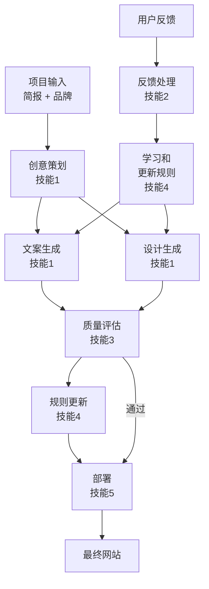

# 代理 & 技能

import { Callout } from 'nextra/components'

AI Agency 由 6 个专门代理和 5 个技能模块组成，每个都有特定的职责。理解这个架构有助于您更好地利用系统。

## 6 个核心代理

### 1. 创意策划代理 (Creative Strategist)
**职责**：分析简报和品牌定义，制定项目策略

**工作流程**：
- 解析项目简报
- 分析目标受众
- 定义内容策略
- 创建项目里程碑

**交互方式**：自动运行，无需用户干预

### 2. 文案生成代理 (Copy Generator)
**职责**：创建所有文本内容

**工作流程**：
- 为每个页面生成标题
- 创建营销文案
- 编写产品描述
- 优化 SEO 文本

**输出示例**：
- 主页标题和副标题
- 功能描述
- 调用行动（CTA）按钮文本

### 3. 设计代理 (Design Agent)
**职责**：创建视觉设计和布局

**工作流程**：
- 应用品牌色彩和字体
- 设计页面布局
- 创建组件库
- 优化用户体验

**使用工具**：Figma（通过 MCP）、CSS 生成

### 4. SEO 优化代理 (SEO Optimizer)
**职责**：确保内容对搜索引擎友好

**工作流程**：
- 分析关键词
- 优化元描述
- 创建结构化数据
- 提高可读性和内容结构

**优化项**：
- Title 标签
- Meta 描述
- 标题层级（H1-H6）
- 内部链接

### 5. 质量评估代理 (Quality Evaluator)
**职责**：评估生成内容的质量

**评估维度**：
- 品牌一致性（95% 阈值）
- 内容准确性（100% 要求）
- 用户体验（85% 满意度）
- SEO 得分（70+ 分）
- 可访问性（WCAG AA 标准）

**评估结果**：通过 (✓) 或需改进 (△)

### 6. 反馈处理代理 (Feedback Processor)
**职责**：理解和应用用户反馈

**工作流程**：
1. 解析反馈内容
2. 识别影响范围
3. 更新规则库
4. 生成改进版本
5. 验证改进结果

## FROZEN 区域 vs EVOLVABLE 区域

AI Agency 采用双区域架构确保品牌一致性同时允许创意进化。

### FROZEN 区域（不变）
这些部分由品牌定义控制，不会改变：

```yaml
.agency/brand.yaml:
  - colors: 品牌色调不变
  - logo: 官方标志
  - company_name: 公司名称
  - core_values: 核心价值观
```

修改 FROZEN 区域需要显式的项目配置更新，所有 FROZEN 内容在生成时自动应用。

### EVOLVABLE 区域（进化）
这些部分根据用户反馈不断改进：

```
.agency/rules/:
  - copy-rules.md: 文案风格（可学习）
  - design-rules.md: 设计决策（可优化）
  - seo-rules.md: SEO 策略（可改进）
  - tone-rules.md: 声调变化（可适应）
```

每次用户反馈时，系统都会更新这些规则。系统学习用户的偏好并将其编码为规则供将来使用。

## 5 个技能模块

### 技能 1：内容生成
**功能**：从简报生成初始内容

```
Input: briefing.md + brand.yaml
↓
Process: 分析简报 → 遵循品牌规则 → 生成框架 → 填充内容
↓
Output: 网页、文案、配置
```

### 技能 2：反馈处理
**功能**：理解反馈并应用改进

```
Input: 用户反馈
↓
Process: NLP 解析 → 规则学习 → 内容重新生成
↓
Output: 改进版本 + 更新的规则
```

### 技能 3：质量评估
**功能**：评估内容是否满足标准

关键指标：
- 品牌一致性检查
- 语法和拼写验证
- 链接完整性检查
- 性能指标（加载时间、LCP）

### 技能 4：规则管理
**功能**：存储、更新和应用进化规则

```
规则优先级：
1. FROZEN 规则（品牌）- 权重 100%
2. 高置信度规则（10x+ 反馈）- 权重 90%
3. 规则（5-9x 反馈）- 权重 70%
4. 启发式（3-4x 反馈）- 权重 50%
5. 记录（1-2x 反馈）- 权重 10%
```

### 技能 5：部署和发布
**功能**：构建和发布最终网站

```
Build → Optimize → Test → Deploy
  ↓         ↓        ↓       ↓
编译  压缩文件  测试  发布到生产
```

## 技能依赖关系图



## MoAI 技能复制机制

AI Agency 建立在 MoAI 技能框架之上。当您的 Agency 创建新的规则或模式时，这些可以被反馈回 MoAI 系统中成为全局技能。

### 复制流程

```
1. Agency 学到新规则
   ↓
2. 规则经过 10x 验证（10+ 成功的反馈循环）
   ↓
3. 提交到 MoAI 技能库
   ↓
4. 全系统（所有 Agency 项目）都受益
```

### 示例
如果您的文案代理发现特定的按钮文本模式特别有效（如"立即开始 30 天免费试用"），该模式可能成为全局 CTA 规则，供所有项目使用。

## 代理间通信

代理使用两种方式通信：

### 1. 规则库共享（异步）
所有代理都读取和更新 `.agency/rules/` 中的共享规则库。这确保了一致性和效率。

### 2. 直接消息（同步）
在生成过程中，代理可以相互发送消息以协调工作：

```
文案代理 → 设计代理: "这个文案需要大标题，建议高度 80px"
设计代理 → 文案代理: "布局完成，文案最多 60 个字符"
```

## 配置代理行为

虽然大多数代理的行为是自动的，但您可以在 `.agency/config.yaml` 中自定义某些方面：

```yaml
agents:
  copy_generator:
    max_iterations: 3        # 文案生成最多尝试次数
    style: professional      # 风格选择
    tone: friendly          # 声调选择
  
  design_agent:
    color_palette: auto      # 自动或手动指定
    responsive_breakpoints:
      - 320px   # 手机
      - 768px   # 平板
      - 1024px  # 桌面
  
  quality_evaluator:
    strict_mode: false       # 严格模式（需要 100% 通过）
    min_score: 70            # 最低允许分数
```

<Callout type="info">
大多数用户不需要调整这些配置。默认值已针对大多数项目进行了优化。
</Callout>

## 监控代理性能

您可以查看每个代理的性能统计：

```bash
moai agency stats
```

这显示：
- 每个代理完成的任务数
- 平均处理时间
- 成功率
- 常见错误

## 下一步

- 了解[自我进化系统](./self-evolution)如何学习和改进
- 查看[命令参考](./command-reference)与代理交互的命令
