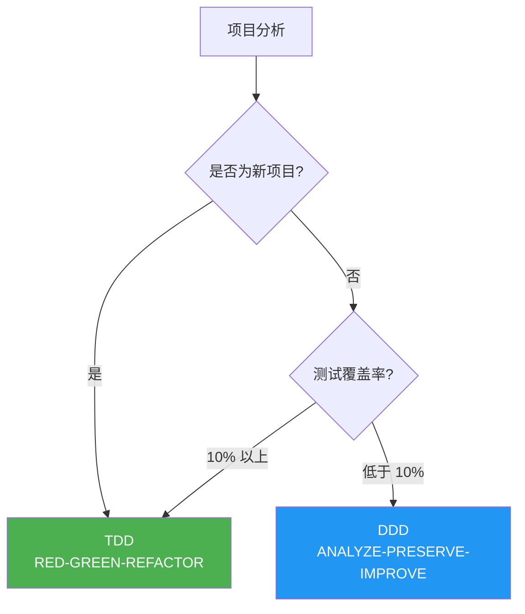
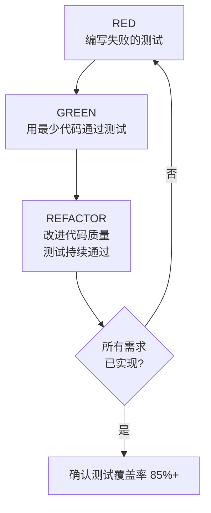
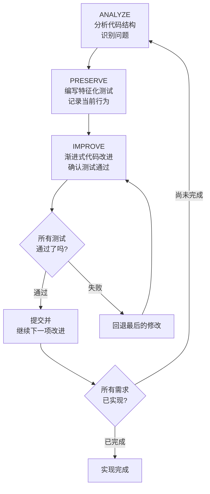
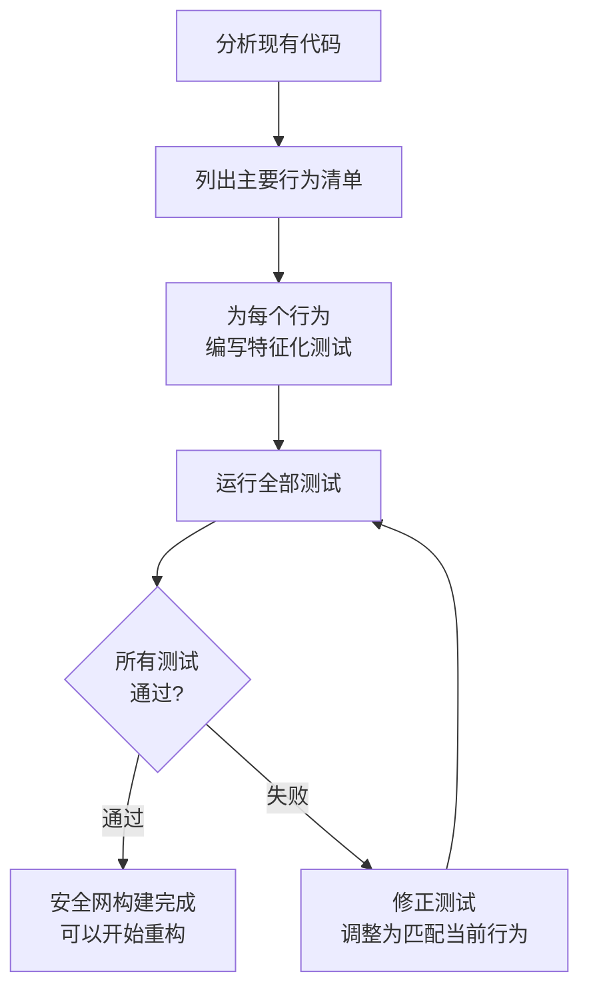
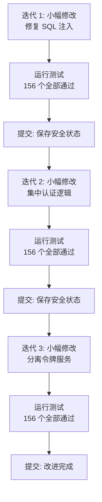
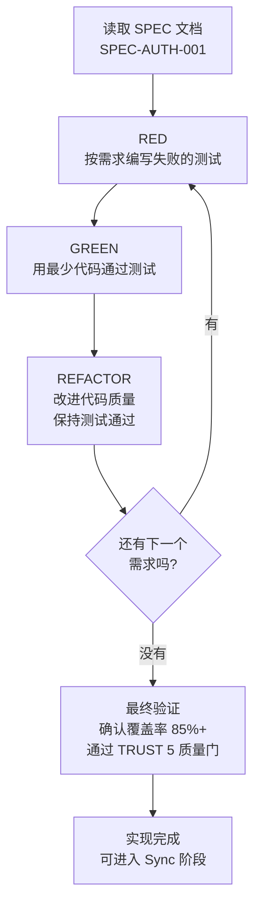
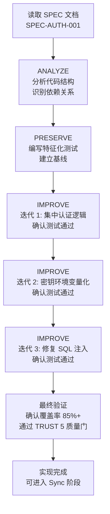

import { Callout } from "nextra/components";

# 开发方法论 (DDD/TDD)

详细介绍 MoAI-ADK 的开发方法论。根据项目状态选择使用 TDD 或 DDD。

<Callout type="tip">
  **一句话总结:** 新项目使用 **TDD** (RED-GREEN-REFACTOR)，几乎没有测试的
  现有项目使用 **DDD** (ANALYZE-PRESERVE-IMPROVE)。
  也可以在 `quality.yaml` 中手动选择。
</Callout>

## 方法论概述

MoAI-ADK 根据项目状态自动选择最优的开发方法论。



| 项目类型                             | 方法论  | 周期                      | 说明                                     |
| ------------------------------------ | ------- | ------------------------- | ---------------------------------------- |
| **新项目**                           | **TDD** | RED-GREEN-REFACTOR        | 先编写测试再实现代码                     |
| **现有项目** (覆盖率 >= 10%)          | **TDD** | RED-GREEN-REFACTOR        | 基于部分测试扩展 TDD                     |
| **现有项目** (覆盖率 < 10%)           | **DDD** | ANALYZE-PRESERVE-IMPROVE  | 通过特征化测试实现安全的渐进式改进       |

<Callout type="info">
  **方法论可以手动选择:** 在 `.moai/config/sections/quality.yaml` 中将
  `development_mode` 设置为 `tdd` 或 `ddd`，即可覆盖自动选择，
  使用您想要的方法论。
</Callout>

## 什么是 TDD?

**TDD** (Test-Driven Development) 是一种 **先编写测试，然后实现通过该测试的
最少代码** 的开发方法论。作为 MoAI-ADK 的默认方法论，
适用于大多数项目。

### RED-GREEN-REFACTOR 周期

TDD 以重复三个阶段的周期进行。



### 第 1 步: RED (编写失败的测试)

首先为要实现的功能 **编写测试**。由于代码尚未编写，测试必定会失败。

**核心原则:**

- 每次只编写一个测试
- 用 Given-When-Then 清晰描述要实现的行为
- 确认测试失败 (如果不失败则说明测试没有意义)

### 第 2 步: GREEN (用最少代码通过测试)

编写能够通过测试的 **最简单代码**。

**核心原则:**

- 不要提前优化或抽象
- 专注于正确性，优雅可以稍后考虑
- 测试通过即停止

### 第 3 步: REFACTOR (改进代码质量)

在保持测试通过的状态下整理代码。

**核心原则:**

- 消除重复代码
- 改善变量名和函数名
- 应用 SOLID 原则
- 测试必须持续通过

### TDD 实战示例

```python
# RED: 先编写失败的测试
def test_user_registration():
    """
    GIVEN: 存在有效的用户信息
    WHEN: 进行注册
    THEN: 应创建用户并发送欢迎邮件
    """
    user_service = UserService()
    result = user_service.register(
        email="newuser@example.com",
        password="SecurePass123!"
    )

    assert result.success is True
    assert result.user.id is not None
    assert email_service.welcome_email_sent("newuser@example.com") is True

# 运行测试 (预期失败 - 尚未实现)
# > pytest test_user_service.py - test_user_registration FAILED

# ====================================

# GREEN: 用最少代码通过测试
class UserService:
    def register(self, email: str, password: str) -> RegistrationResult:
        user = User.create(email, password)
        user_repository.save(user)
        email_service.send_welcome(email)
        return RegistrationResult.success(user)

# 运行测试 (通过)
# > pytest test_user_service.py - test_user_registration PASSED

# ====================================

# REFACTOR: 改进代码质量 (测试持续通过)
class UserService:
    def __init__(
        self,
        user_repo: UserRepository,
        email_service: EmailService,
        password_validator: PasswordValidator
    ):
        self.user_repo = user_repo
        self.email_service = email_service
        self.password_validator = password_validator

    def register(self, email: str, password: str) -> RegistrationResult:
        if not self.password_validator.validate(password):
            return RegistrationResult.failure("密码无效")

        user = User.create(email, password)
        self.user_repo.save(user)
        self.email_service.send_welcome(email)
        return RegistrationResult.success(user)

# 运行测试 (仍然通过)
# > pytest test_user_service.py - test_user_registration PASSED
```

### 在现有项目中使用 TDD (Brownfield Enhancement)

在有现有代码的项目中使用 TDD 时，会增加 **Pre-RED 阶段**:

1. **(Pre-RED)** 阅读目标区域的现有代码，理解当前行为
2. **RED:** 基于对现有代码的理解编写失败的测试
3. **GREEN:** 用最少代码通过测试
4. **REFACTOR:** 在保持测试通过的同时改进代码

<Callout type="info">
  即使有现有代码，只要测试覆盖率在 10% 以上就可以使用 TDD。
  在 Pre-RED 阶段了解现有行为后再编写测试，因此可以在安全保留现有功能的同时
  添加新功能。
</Callout>

## 什么是 DDD?

**DDD** (Domain-Driven Development) 是一种 **安全的代码改进方法**。它在尊重现有
代码的同时采取渐进式改进的方式。适用于几乎没有测试 (低于 10%) 的现有项目。

### 房屋翻新类比

为初次接触 DDD 的读者，用 **房屋翻新** 来做类比。想象一下翻新一栋 10 年的
老房子。

| 房屋翻新阶段        | DDD 阶段              | 做什么                             | 为什么重要                                                  |
| --------------------- | --------------------- | ---------------------------------- | ----------------------------------------------------------- |
| 检查房屋              | **ANALYZE** (分析)    | 检查墙壁裂缝、管道状况             | 不知道哪里有问题就无法修复                                  |
| 拍摄现状照片          | **PRESERVE** (保留)   | 拍摄所有房间的照片作为记录          | 以后疑惑"这里原来有墙吗?"时可以查看确认                     |
| 逐个房间翻新          | **IMPROVE** (改进)    | 每次只施工一个房间，每次都验证       | 一次性全部拆除就无法知道问题出在哪里                        |

**错误方法 vs 正确方法:**

```
错误方法: "把全部代码一次性改掉!"
  --> 破坏现有功能的风险很高
  --> 出问题时很难找到错在哪里

正确方法: "用测试记录当前行为，然后一点点改!"
  --> 现有功能一旦被破坏，测试会立即发出通知
  --> 出问题时只需回退最后一次修改即可
```

### ANALYZE-PRESERVE-IMPROVE 周期

MoAI-ADK 的 DDD 以重复三个阶段的周期进行。



### 第 1 步: ANALYZE (分析)

彻底分析现有代码的结构。就像医生检查患者一样。

**分析项目:**

| 分析对象   | 确认内容                           | 类比               |
| ---------- | ---------------------------------- | ------------------ |
| 文件结构   | 有哪些文件，它们如何关联           | 查看房屋平面图     |
| 依赖关系   | 哪个模块依赖于哪个模块             | 检查管道和电气线路 |
| 测试现状   | 现有测试有多少                     | 查看现有保险       |
| 问题点     | 重复代码、安全漏洞、性能瓶颈       | 检查墙壁裂缝和漏水 |

**manager-ddd 生成的分析报告示例:**

```markdown
## 代码分析报告

- 目标: src/auth/ (认证模块)
- 文件: 8 个 Python 文件
- 代码行数: 1,850 行
- 测试覆盖率: 5%

## 发现的问题
1. 重复的认证逻辑 (3 处存在相同代码)
2. 硬编码的密钥 (直接写在 config.py 中)
3. SQL 注入漏洞 (user_repository.py)
4. 测试不足 (5%，目标 85%)
```

### 第 2 步: PRESERVE (保留)

构建用于保留现有行为的 **安全网**。这一阶段的核心是编写 **特征化测试**
(Characterization Tests)。

<Callout type="info">
  **什么是特征化测试?**

  就像房屋翻新前 **拍照记录现状** 一样。

  普通测试检查"这个功能是否正确运行?"而特征化测试则记录"这个功能当前是
  如何运行的?"

  也就是说，不判断对错，而是 **记录"它原本就是这样运行的"这一事实**。之后修改
  代码时如果测试失败，就能立即知道现有行为发生了变化。
</Callout>

**特征化测试示例:**

```python
class TestExistingLoginBehavior:
    """记录现有登录函数当前行为的特征化测试"""

    def test_valid_login_returns_token(self):
        """
        GIVEN: 存在已注册的用户
        WHEN: 使用正确密码登录
        THEN: 原样记录当前实现返回的响应
        """
        user = create_test_user(
            email="test@example.com",
            password="password123"
        )

        result = login_service.login("test@example.com", "password123")

        # 原样记录当前行为 (不判断对错)
        assert result["status"] == "success"
        assert result["token"] is not None
        assert result["expires_in"] == 3600  # 当前过期时间

    def test_wrong_password_returns_error(self):
        """记录使用错误密码登录时的当前行为"""
        create_test_user(email="test@example.com", password="password123")

        result = login_service.login("test@example.com", "wrongpassword")

        assert result["status"] == "error"
        assert result["code"] == 401
```

**测试编写策略:**



### 第 3 步: IMPROVE (改进)

特征化测试构建完成后，就可以安全地改进代码了。核心原则是 **分成小步骤逐步
修改**。

**改进过程:**

```python
# 改进前: 原始代码
def login(email, password):
    # SQL 注入漏洞
    user = db.query("SELECT * FROM users WHERE email = '" + email + "'")
    if user and check_password(user.password, password):
        token = generate_token(user.id)
        return {"status": "success", "token": token}
    return {"status": "error", "code": 401}

# ====================================

# 改进后: 经过 3 次迭代完成的代码
def login(email: str, password: str) -> LoginResult:
    """处理用户登录。"""
    # 迭代 1: 使用参数化查询防止 SQL 注入
    user = user_repository.find_by_email(email)

    if not user:
        return LoginResult.failure("凭证无效")

    # 迭代 2: 集中认证逻辑
    if not auth_service.verify_password(user, password):
        return LoginResult.failure("凭证无效")

    # 迭代 3: 分离令牌服务
    token = token_service.generate(user.id)
    return LoginResult.success(token)
```

**渐进式改进步骤:**



<Callout type="warning">
  **核心原则:** 每次修改后必须运行测试。如果测试失败，只需回退最后一次修改
  即可。这就是"小步骤"的力量。一次修改太多内容的话，就很难找到问题出在哪里。
</Callout>

## 方法论比较

| 方面              | TDD                         | DDD                          |
| ----------------- | --------------------------- | ---------------------------- |
| **测试时机**      | 代码编写之前 (RED)          | 分析之后 (PRESERVE)          |
| **覆盖率策略**    | 每次提交严格要求            | 渐进式改进                   |
| **最佳场景**      | 新项目，10%+ 覆盖率         | 覆盖率低于 10% 的遗留代码    |
| **风险级别**      | 中等 (需要纪律)             | 低 (保留行为)                |
| **覆盖率豁免**    | 不允许                      | 允许                         |
| **Run Phase 周期** | RED-GREEN-REFACTOR          | ANALYZE-PRESERVE-IMPROVE     |

<Callout type="warning">
  **方法论选择指南:**

  - **新项目** (绿地): TDD (默认)
  - **现有项目** (覆盖率 50% 以上): TDD
  - **现有项目** (覆盖率 10-49%): TDD (利用 Pre-RED 阶段)
  - **现有项目** (覆盖率低于 10%): DDD (渐进式特征化测试)
</Callout>

## 什么是特征化测试?

特征化测试是 DDD 的核心工具。让我们更详细地了解一下。

### 与普通测试的区别

| 区别          | 普通测试                        | 特征化测试                     |
| ------------- | ------------------------------- | ------------------------------ |
| **目的**      | "这个功能是否正确运行?"         | "这个功能当前是如何运行的?"    |
| **编写时机**  | 编写新代码之前/之后             | 重构现有代码之前               |
| **基准**      | 需求 (设计文档)                 | 当前实际行为                   |
| **类比**      | 检查是否按设计图施工            | 用照片记录房屋的当前状态       |

### 编写原则

1. **只记录不判断**: 即使当前代码有 Bug，也原样记录该行为
2. **包含边界情况**: 不仅记录正常情况，还要记录所有异常情况
3. **可重复性**: 无论运行多少次测试都应产生相同结果
4. **快速执行**: 特征化测试必须快速运行，以便在每次修改后立即验证

## 执行方法

### TDD 执行

SPEC 文档准备好后，使用以下命令执行 TDD 周期。

```bash
# TDD 执行 (development_mode: tdd 时)
> /moai run SPEC-AUTH-001
```

执行该命令后，**manager-tdd 代理** 会自动执行 RED-GREEN-REFACTOR 周期:



### DDD 执行

```bash
# DDD 执行 (development_mode: ddd 时)
> /moai run SPEC-AUTH-001
```

执行该命令后，**manager-ddd 代理** 会自动执行 ANALYZE-PRESERVE-IMPROVE 周期:



## 方法论配置

在 `.moai/config/sections/quality.yaml` 文件中配置开发方法论。

### TDD 配置 (默认)

```yaml
constitution:
  development_mode: tdd  # 使用 TDD 方法论

  tdd_settings:
    test_first_required: true         # 实现前必须先编写测试
    red_green_refactor: true          # 遵循 RED-GREEN-REFACTOR 周期
    min_coverage_per_commit: 80       # 每次提交的最低覆盖率
    mutation_testing_enabled: false   # 变异测试 (可选)

  test_coverage_target: 85            # 整体覆盖率目标
```

### DDD 配置

```yaml
constitution:
  development_mode: ddd  # 使用 DDD 方法论

  ddd_settings:
    require_existing_tests: true      # 重构前需要现有测试
    characterization_tests: true      # 自动生成特征化测试
    behavior_snapshots: true          # 使用快照测试
    max_transformation_size: small    # 限制修改规模
    preserve_before_improve: true     # 必须先保留再改进

  test_coverage_target: 85            # 整体覆盖率目标
```

**DDD max_transformation_size 选项:**

| 值       | 修改范围                 | 建议场景                         |
| -------- | ------------------------ | -------------------------------- |
| `small`  | 1-2 个文件，简单重构     | 一般代码改进 (推荐)              |
| `medium` | 3-5 个文件，中等复杂度   | 模块结构变更                     |
| `large`  | 10 个以上文件            | 架构变更 (需谨慎)                |

<Callout type="warning">
  将 `max_transformation_size` 设置为 `large` 会一次性修改大量文件，
  出问题时难以定位原因。建议尽量保持 `small`。
</Callout>

## 实战示例: 遗留代码重构

这是一个重构 3 年前编写的认证模块的场景。测试覆盖率仅为 5%，非常低，
因此使用 DDD 方法论。

### 情况

```
问题:
- 2 处 SQL 注入漏洞
- 硬编码的密钥
- 3 处重复的认证逻辑
- 测试覆盖率 5%
- 代码复杂度高
```

### 执行过程

```bash
# 第 1 步: 创建 SPEC (Plan)
> /moai plan "重构遗留认证系统。修复 SQL 注入、密钥环境变量化、集中认证逻辑"

# manager-spec 创建 SPEC-AUTH-REFACTOR-001
```

```bash
# 第 2 步: 执行 DDD (Run)
> /moai run SPEC-AUTH-REFACTOR-001

# manager-ddd 执行 ANALYZE-PRESERVE-IMPROVE 周期
# ANALYZE: 分析代码，生成问题列表
# PRESERVE: 编写 156 个特征化测试
# IMPROVE: 通过 3 次迭代渐进式改进
```

```bash
# 第 3 步: 文档同步 (Sync)
> /moai sync SPEC-AUTH-REFACTOR-001

# manager-docs 更新 API 文档，生成重构报告
```

### 结果

| 指标               | 之前   | 之后     | 变化           |
| ------------------ | ------ | -------- | -------------- |
| 测试覆盖率         | 5%     | 87%      | +82%           |
| SQL 注入漏洞       | 2 处   | 0 处     | 已全部消除     |
| 硬编码的密钥       | 有     | 无       | 已环境变量化   |
| 重复代码           | 3 处   | 0 处     | 已集中化       |
| 代码复杂度         | 高     | 降低 35% | 结构改进       |

<Callout type="info">
  **关键要点:** 在整个重构过程中，没有任何一个现有行为被改变。
  156 个特征化测试在每次迭代中全部通过，因此在不影响现有用户的前提下
  大幅提升了代码质量。
</Callout>

## 相关文档

- [基于 SPEC 的开发](/core-concepts/spec-based-dev) -- 在执行开发方法论之前
  需要 SPEC 文档
- [TRUST 5 质量](/core-concepts/trust-5) -- 实现完成后确认质量验证标准
