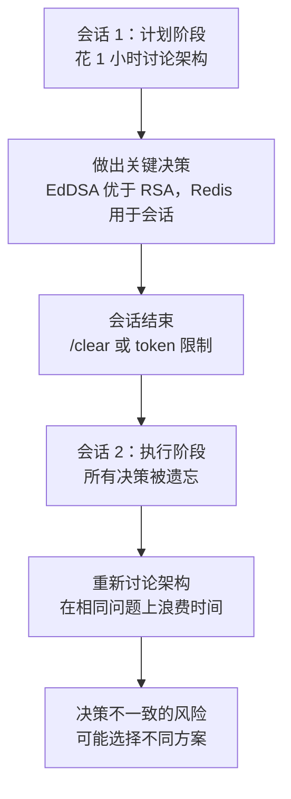
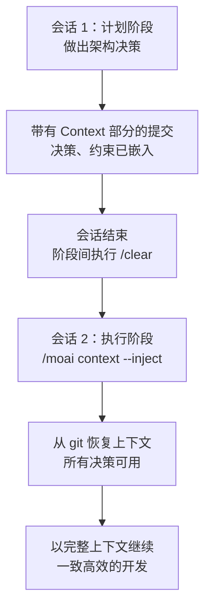
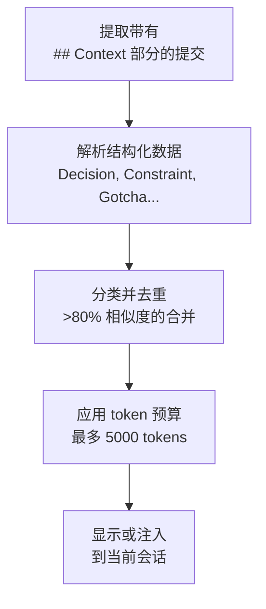
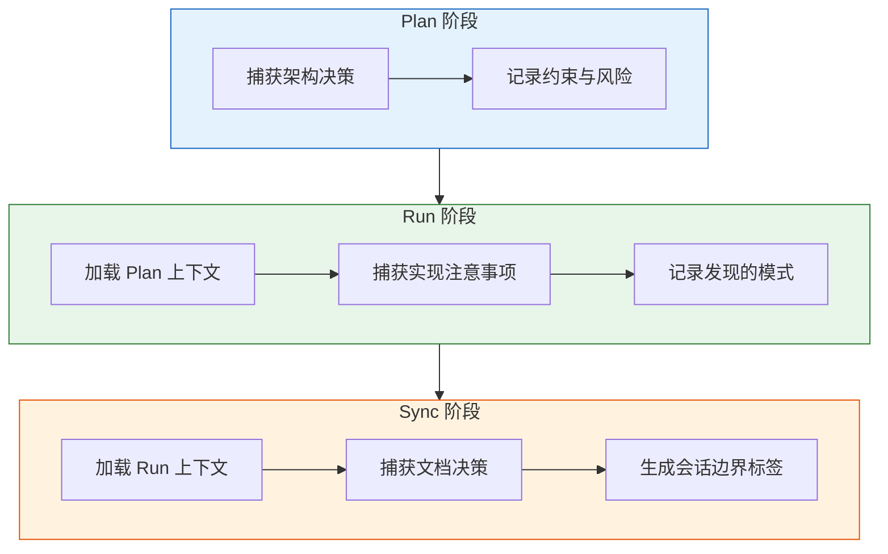

import { Callout } from "nextra/components";

# MoAI 记忆系统

MoAI-ADK 基于 Git 的上下文记忆系统详细指南，该系统可跨会话保留 AI 与开发者的交互上下文。

<Callout type="tip">
  **一句话总结:** MoAI 记忆系统将结构化上下文（决策、约束、注意事项）嵌入到 git 提交消息中，使未来的会话能够从上次中断的地方精确继续。
</Callout>

## 什么是 MoAI 记忆系统？

MoAI 记忆系统是一个 **基于 Git 的上下文记忆系统**，通过结构化的 git 提交消息跨会话保留 AI 与开发者的交互上下文。每个实现提交都包含一个 `## Context` 部分，用于捕获开发过程中发现的决策、约束和模式。

用日常生活类比，MoAI 记忆系统就像 **医生的病历本**。每次就诊时，医生会记录诊断结果、处方和观察情况。下次就诊时，医生翻阅病历便能立即了解患者的历史，无需重复询问相同的问题。

| 医生病历 | MoAI 记忆系统 | 共同点 |
|---------|-------------|--------|
| 诊断与处方 | 决策与约束 | 记录已确定的内容 |
| 观察到的副作用 | 发现的注意事项 | 记录意外发现 |
| 治疗方案 | 模式与风险 | 记录方法和注意事项 |
| 患者偏好 | UserPrefs | 记录个人偏好 |

## 为什么需要 MoAI 记忆系统？

### 会话连续性问题

在多个会话中与 AI 协作开发时，最大的问题是**丢失之前决策的上下文**。



**上下文丢失的常见场景：**

| 场景 | 发生情况 | 影响 |
|------|---------|------|
| 阶段切换 | Plan 和 Run 阶段之间执行 `/clear` | 所有计划决策丢失 |
| Token 限制 | 长会话裁剪早期上下文 | 关键架构决策丢失 |
| 团队交接 | 不同 Agent 处理下一个阶段 | Agent 缺乏之前的上下文 |
| 多日工作 | 一天或一个周末后恢复 | 需要重新解释所有内容 |

### MoAI 记忆系统如何解决这个问题

MoAI 记忆系统将结构化上下文直接嵌入到 git 提交中，使上下文**随代码一起传递**。



<Callout type="info">
**没有 MoAI 记忆系统：**

会话 2 从零上下文开始。AI 可能选择 RSA 而不是 EdDSA，或忘记 Redis 已被选为会话存储。你需要花时间重新讨论已经做出的决策。

**有了 MoAI 记忆系统：**

一个命令即可加载所有之前的决策：

```bash
> /moai context --spec SPEC-AUTH-001 --inject
```

</Callout>

## 工作原理

每个实现提交都包含一个结构化的 `## Context` 部分，捕获 6 类上下文：

| 类别 | 用途 | 示例 |
|------|------|------|
| **Decision** | 技术选择 + 理由 | "EdDSA 优于 RSA256（性能优先）" |
| **Constraint** | 有效约束 | "必须保持 /api/v1 向后兼容" |
| **Gotcha** | 发现的陷阱 | "Redis TTL 不可靠，不适合 token 存储" |
| **Pattern** | 使用的参考实现 | "来自 auth.go:45 的中间件链模式" |
| **Risk** | 已知风险 / 延迟事项 | "速率限制推迟到第 2 阶段" |
| **UserPref** | 开发者偏好 | "偏好函数式风格而非 OOP" |

### 跨会话的上下文流转

```
会话 1（Plan）         会话 2（Run）          会话 3（Sync）
    |                      |                      |
    v                      v                      v
 决策 --> git 提交 --> 上下文 --> git 提交 --> 上下文
 约束   带 ## Context   从 git    带 ## Context   从 git
 模式   部分           加载      部分             加载
```

## 提交格式

DDD 和 TDD 工作流都会产生带有上下文部分的结构化提交。

### TDD 模式提交

```
🔴 RED: Add failing test for token expiry validation
SPEC: SPEC-AUTH-001
Phase: RUN-RED

## Context (AI-Developer Memory)
- Decision: 15-minute access token TTL (security best practice)
- Gotcha: Clock skew between services requires 30s grace period
- Pattern: Token validation pattern from middleware/auth.go:89

## MX Tags Changed
- Added: @MX:TODO auth_test.go:15 (test for token expiry)
```

### DDD 模式提交

```
🔴 ANALYZE: Document JWT validation behavior
SPEC: SPEC-AUTH-001
Phase: RUN-ANALYZE

## Context (AI-Developer Memory)
- Decision: Use EdDSA for JWT signing (performance priority)
- Constraint: Must support existing RSA tokens during migration
- Risk: Token rotation deferred to Phase 2

## MX Tags Changed
- Added: @MX:ANCHOR jwt.go:42 (fan_in: 5)
```

<Callout type="info">
  `## Context` 部分由 **manager-git agent** 在创建提交时自动生成。你无需手动编写。
</Callout>

## 上下文检索

使用 `/moai context` 命令检索并注入之前的上下文。

### 查看某个 SPEC 的上下文

```bash
# 查看特定 SPEC 的所有上下文
/moai context --spec SPEC-AUTH-001

# 仅查看过去 7 天的决策
/moai context --category Decision --days 7

# 仅显示压缩摘要
/moai context --spec SPEC-AUTH-001 --summary
```

### 将上下文注入当前会话

```bash
# 将之前的上下文加载到当前会话
/moai context --spec SPEC-AUTH-001 --inject
```

该命令从与 SPEC 相关的 git 提交中提取所有上下文并注入到当前会话，实现无缝延续。

### 检索工作原理



**Token 预算优先级：**

| 优先级 | 类别 | 理由 |
|--------|------|------|
| 1（关键） | Decisions、Constraints | 核心架构上下文 |
| 2（重要） | Gotchas、Risks | 防止重复犯错 |
| 3（锦上添花） | Patterns、UserPrefs | 效率提升 |

## 上下文类别详解

### Decision（决策）

记录**选择了什么以及原因**。对于会话连续性最重要的类别。

```
- Decision: EdDSA over RSA256 (user requested, performance priority)
- Decision: Use Redis for session storage (low latency requirement)
- Decision: Separate auth service from main API (microservice boundary)
```

### Constraint（约束）

记录必须遵守的**有效限制**。

```
- Constraint: Must maintain /api/v1 backward compatibility
- Constraint: API response time within 500ms (P95)
- Constraint: Cannot use external OAuth providers (air-gapped environment)
```

### Gotcha（注意事项）

记录开发过程中发现的**意外陷阱**。防止重复犯相同的错误。

```
- Gotcha: Redis TTL unreliable for RefreshToken storage, use DB instead
- Gotcha: Clock skew between services requires 30s grace period
- Gotcha: bcrypt cost factor 12 causes 300ms delay on low-end hardware
```

### Pattern（模式）

记录指导当前工作的**参考实现**。

```
- Pattern: middleware chain pattern from auth.go:45
- Pattern: error handling pattern from pkg/errors/handler.go
- Pattern: repository pattern from internal/user/repository.go
```

### Risk（风险）

记录未来会话的**已知风险**和延迟事项。

```
- Risk: Rate limiting deferred to Phase 2
- Risk: Token rotation not yet implemented (security debt)
- Risk: No load testing for concurrent session handling
```

### UserPref（用户偏好）

记录**开发者偏好**，保持一致的交互风格。

```
- UserPref: Prefers functional style over OOP
- UserPref: Wants detailed commit messages with context
- UserPref: Prefers Go table-driven tests
```

## 核心优势

| 优势 | 说明 |
|------|------|
| **零依赖** | 使用 git 本身作为记忆存储 -- 无需外部数据库或服务 |
| **团队共享** | 上下文随 `git clone` 传递 -- 自动团队知识转移 |
| **完整审计记录** | `git log` 提供完整的决策历史 |
| **会话连续性** | 在 `/clear` 或会话中断后，以完整上下文恢复工作 |
| **阶段切换** | 上下文自然从 Plan 流向 Run 再流向 Sync |

## 与 MoAI 工作流集成

MoAI 记忆系统与 Plan-Run-Sync 流水线的每个阶段集成：



### 会话边界标签

每个阶段完成后，会创建一个 git 标签来标记边界：

```bash
# 会话边界标签示例
git tag -a "moai/SPEC-AUTH-001/run-complete" \
  -m "Run phase completed
SPEC: SPEC-AUTH-001
Decisions: 5, Constraints: 3, Risks: 2
Next action: /moai sync SPEC-AUTH-001"
```

这些标签帮助 `/moai context` 快速定位阶段切换点。

## 设计灵感

MoAI 记忆系统的灵感来源于
[claude-mem](https://github.com/thedotmack/claude-mem)、
[claude-brain](https://github.com/memvid/claude-brain) 和
[memory-mcp](https://github.com/yuvalsuede/memory-mcp)，并改编为无需额外基础设施的 Git 原生方案。

## 相关文档

- [MoAI-ADK 是什么？](/core-concepts/what-is-moai-adk) -- 了解 MoAI-ADK 的整体架构
- [基于 SPEC 的开发](/core-concepts/spec-based-dev) -- 了解 SPEC 文档的创建与管理方式
- [TRUST 5 质量](/core-concepts/trust-5) -- 了解所有代码变更的质量验证标准
