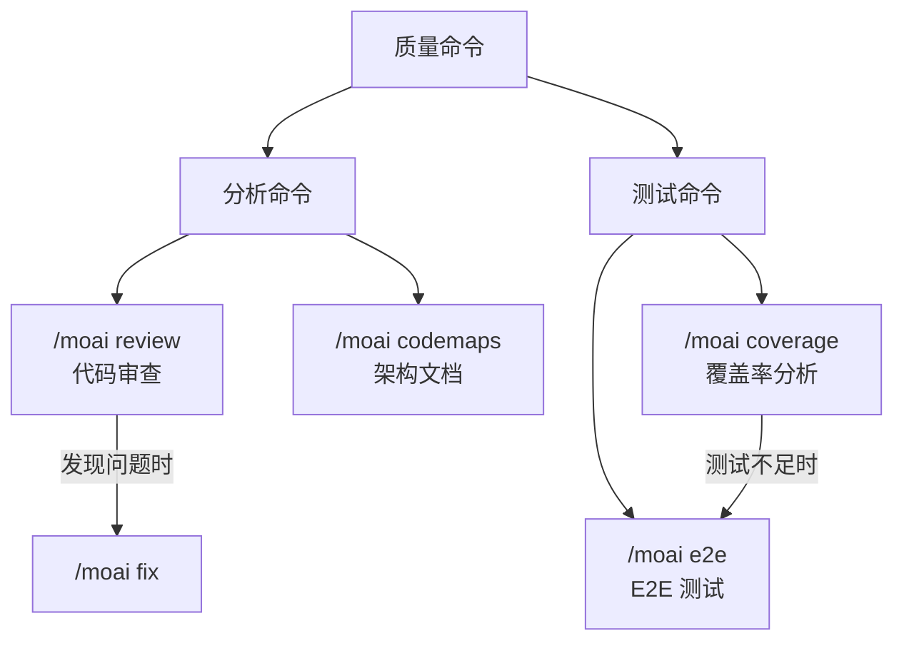

import { Callout } from 'nextra/components'

# 质量命令

介绍 MoAI-ADK 的代码质量管理命令。

<Callout type="info">
质量命令专注于**代码审查、测试覆盖率、E2E 测试和架构分析**。帮助您系统地管理和改善代码质量。
</Callout>

## 命令对比

| 命令 | 目的 | 执行方式 | 使用时机 |
|------|------|----------|----------|
| `/moai review` | 代码审查 | 安全/性能/质量/UX 四维分析 | PR 前需要代码审查时 |
| `/moai coverage` | 覆盖率分析 | 测试缺口分析和测试生成 | 想提高测试覆盖率时 |
| `/moai e2e` | E2E 测试 | 浏览器自动化测试创建/执行 | 想验证用户流程时 |
| `/moai codemaps` | 架构文档 | 代码库结构分析和文档化 | 想了解项目架构时 |

## 命令关系图

<Callout type="tip">
**不确定使用哪个命令？**

- 想全面检查代码质量 → `/moai review`
- 想找到并填补测试缺口 → `/moai coverage`
- 想从用户角度验证应用是否正常 → `/moai e2e`
- 想了解并记录项目结构 → `/moai codemaps`
</Callout>
