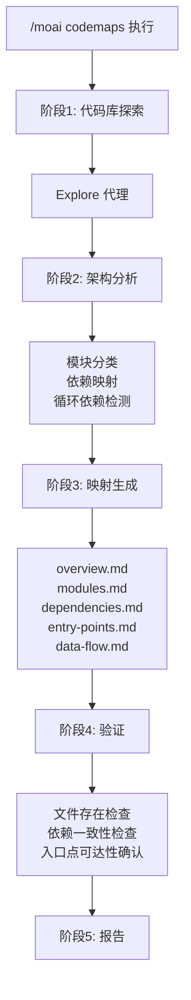
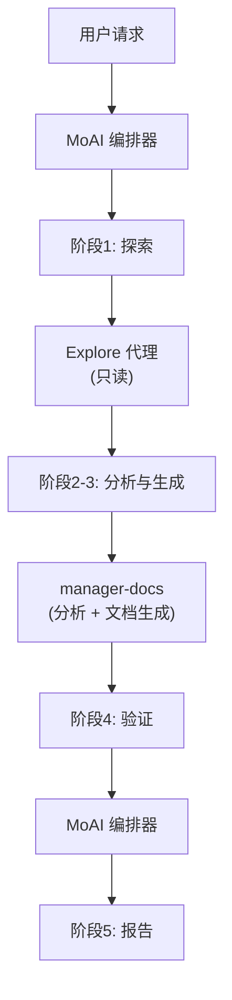

import { Callout } from 'nextra/components'

# /moai codemaps

扫描代码库并自动生成 **架构文档** 的命令。

<Callout type="tip">
**一句话总结**: `/moai codemaps` 是 "架构制图师"。分析代码库并 **自动生成结构文档**，包括模块映射、依赖关系图和入口点目录。
</Callout>

<Callout type="info">
**斜杠命令**: 在 Claude Code 中输入 `/moai:codemaps` 可以直接运行此命令。仅输入 `/moai` 即可查看所有可用子命令列表。
</Callout>

## 概述

加入新项目或理解大型代码库时，把握架构是最重要的第一步。`/moai codemaps` 自动分析代码库，生成模块映射、依赖关系图、入口点目录和数据流文档。

生成的文档存储在 `.moai/project/codemaps/` 目录中，帮助人和 AI 代理快速理解代码库。

## 用法

```bash
# 生成整个代码库的架构文档
> /moai codemaps

# 忽略现有文档重新生成
> /moai codemaps --force

# 仅分析特定区域
> /moai codemaps --area api

# 包含 Mermaid 图表
> /moai codemaps --format mermaid

# 限制探索深度
> /moai codemaps --depth 3
```

## 支持的标志

| 标志 | 描述 | 示例 |
|------|------|------|
| `--force` (别名 `--regenerate`) | 忽略现有文档重新生成所有代码映射 | `/moai codemaps --force` |
| `--area AREA` | 聚焦分析特定区域 | `/moai codemaps --area auth` |
| `--format FORMAT` | 输出格式 (markdown, mermaid, json, 默认: markdown) | `/moai codemaps --format mermaid` |
| `--depth N` | 最大目录探索深度 (默认: 4) | `/moai codemaps --depth 3` |

### --force 标志

删除所有现有代码映射文档并从头重新生成:

```bash
> /moai codemaps --force
```

代码库发生重大变化时非常有用。

### --area 标志

仅分析特定区域及其依赖:

```bash
# 仅分析 API 模块
> /moai codemaps --area api

# 仅分析认证模块
> /moai codemaps --area auth
```

结果存储在 `.moai/project/codemaps/{area}/`。

### --format 标志

指定输出格式:

```bash
# 包含 Mermaid 图表
> /moai codemaps --format mermaid

# 额外生成 JSON 格式
> /moai codemaps --format json
```

## 执行过程

`/moai codemaps` 分5个阶段执行。



### 阶段1: 代码库探索

`Explore` 代理深度探索代码库:

| 探索对象 | 描述 |
|----------|------|
| 目录结构 | 映射顶层及重要子目录 |
| 模块边界 | 识别包/模块边界和职责 |
| 入口点 | 查找主入口点 (main.go, index.ts, app.py 等) |
| 公共 API | 列出导出的函数、类型和接口 |
| 依赖关系图 | 映射模块间依赖 (import, require) |
| 外部依赖 | 编录第三方依赖 |
| 配置文件 | 识别构建、部署和配置文件 |

### 阶段2: 架构分析

`manager-docs` 代理分析探索结果:

- 按层分类模块 (展示层、业务层、数据层、基础设施层)
- 识别高 fan-in 模块 (`@MX:ANCHOR` 候选)
- 检测循环依赖
- 映射请求/数据流路径
- 识别领域边界
- 识别架构模式 (MVC, Clean, Hexagonal 等)

### 阶段3: 映射生成

在 `.moai/project/codemaps/` 目录生成5个文档:

| 文件 | 内容 |
|------|------|
| `overview.md` | 高层架构概要及模块描述 |
| `modules.md` | 详细模块目录 (职责、依赖) |
| `dependencies.md` | 依赖关系图 (文本和 Mermaid 图表) |
| `entry-points.md` | 入口点目录及调用路径 |
| `data-flow.md` | 关键数据流路径 |

使用 `--area` 标志时:
- `.moai/project/codemaps/{area}/overview.md`
- `.moai/project/codemaps/{area}/modules.md`
- `.moai/project/codemaps/{area}/dependencies.md`

### 阶段4: 验证

- 验证所有引用的文件和模块确实存在
- 检查依赖关系的双向一致性
- 验证入口点的可达性
- 与现有代码映射比较变更 (非 `--force` 时)

### 阶段5: 报告

```
## 代码映射生成报告

### 生成的文件
- .moai/project/codemaps/overview.md
- .moai/project/codemaps/modules.md
- .moai/project/codemaps/dependencies.md
- .moai/project/codemaps/entry-points.md
- .moai/project/codemaps/data-flow.md

### 架构亮点
- 模式: Clean Architecture
- 模块数: 12个
- 入口点: 3个 (API 服务器, CLI, Worker)

### 潜在问题
- 循环依赖: pkg/auth <-> pkg/user
- 高耦合: pkg/core (fan_in: 8)
- 孤立模块: pkg/legacy (无使用者)
```

## 代理委托链



**代理角色:**

| 代理 | 角色 | 主要工作 |
|------|------|----------|
| **MoAI 编排器** | 工作流协调, 验证, 报告 | 标志解析、验证、用户交互 |
| **Explore** | 代码库探索 (只读) | 目录结构、模块边界、依赖映射 |
| **manager-docs** | 架构分析和文档生成 | 模块分类、依赖分析、代码映射文件创建 |

## 常见问题

### Q: 代码映射应该多久重新生成一次？

在大规模重构或添加新模块后建议重新生成。运行 `/moai sync` 也会自动更新代码映射。

### Q: --area 生成的代码映射会与完整代码映射冲突吗？

不会。区域特定的代码映射存储在单独的子目录中，与完整代码映射独立管理。

### Q: 可以手动编辑生成的代码映射吗？

可以。但使用 `--force` 重新生成会覆盖手动编辑。不使用 `--force` 时，会参考现有文档进行增量更新。

### Q: 能识别哪些架构模式？

主要模式包括 MVC、Clean Architecture、Hexagonal、Layered Architecture。识别的模式记录在 `overview.md` 中。

## 相关文档

- [/moai review - 代码审查](/quality-commands/moai-review)
- [/moai coverage - 覆盖率分析](/quality-commands/moai-coverage)
- [/moai mx - @MX 标签扫描](/utility-commands/moai-mx)
