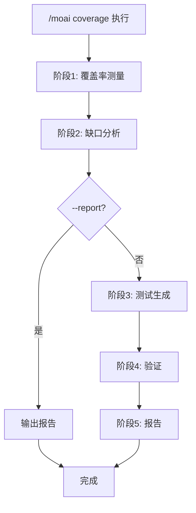
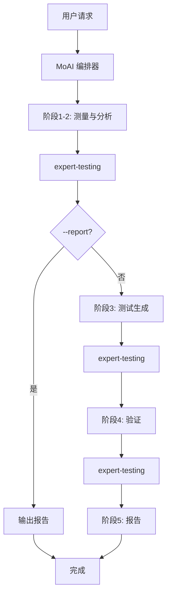

import { Callout } from 'nextra/components'

# /moai coverage

分析测试覆盖率、识别缺口并自动生成缺失测试的命令。

<Callout type="tip">
**一句话总结**: `/moai coverage` 是 "测试缺口猎手"。使用语言专用覆盖率工具 **精确测量**，按优先级 **自动生成缺失测试**。
</Callout>

<Callout type="info">
**斜杠命令**: 在 Claude Code 中输入 `/moai:coverage` 可以直接运行此命令。仅输入 `/moai` 即可查看所有可用子命令列表。
</Callout>

## 概述

要提高测试覆盖率，首先需要知道哪里不足。`/moai coverage` 使用语言专用工具精确测量覆盖率，按风险程度对缺口进行优先级分类，并自动生成缺失的测试。

根据 `quality.yaml` 中的 `development_mode` 设置，以 TDD 或 DDD 方式生成测试。

## 用法

```bash
# 分析整个项目覆盖率并生成测试
> /moai coverage

# 以 85% 覆盖率目标分析
> /moai coverage --target 85

# 仅分析特定文件
> /moai coverage --file src/auth/

# 仅生成报告 (不生成测试)
> /moai coverage --report

# 仅显示未覆盖的行
> /moai coverage --uncovered

# 仅关注关键路径
> /moai coverage --critical
```

## 支持的标志

| 标志 | 描述 | 示例 |
|------|------|------|
| `--target N` | 覆盖率目标百分比 (默认: quality.yaml 的 test_coverage_target) | `/moai coverage --target 85` |
| `--file PATH` | 仅分析特定文件或目录 | `/moai coverage --file src/auth/` |
| `--report` | 仅生成报告，不生成测试 | `/moai coverage --report` |
| `--package PKG` | 仅分析特定包 (Go) 或模块 | `/moai coverage --package pkg/api` |
| `--uncovered` | 仅显示未覆盖的行/函数 | `/moai coverage --uncovered` |
| `--critical` | 关注关键路径 (高 fan_in, 公共 API) | `/moai coverage --critical` |

### --target 标志

指定覆盖率目标。未指定时使用 `quality.yaml` 的 `test_coverage_target` 值 (默认: 85%):

```bash
# 目标 90% 覆盖率
> /moai coverage --target 90
```

### --report 标志

不生成测试，仅输出缺口分析报告:

```bash
> /moai coverage --report
```

想了解当前状态时非常有用。

### --critical 标志

仅关注 P1 (公共 API, 高 fan_in) 和 P2 (业务逻辑, 错误处理):

```bash
> /moai coverage --critical
```

## 执行过程

`/moai coverage` 分5个阶段执行。



### 阶段1: 覆盖率测量

使用语言专用工具精确测量覆盖率:

| 语言 | 覆盖率工具 | 执行命令 |
|------|-----------|----------|
| **Go** | go test + cover | `go test -coverprofile=coverage.out -covermode=atomic ./...` |
| **Python** | pytest-cov 或 coverage | `pytest --cov --cov-report=json` |
| **TypeScript/JavaScript** | vitest 或 jest | `vitest run --coverage` |
| **Rust** | cargo-llvm-cov | `cargo llvm-cov --json` |

测量结果:
- 整体覆盖率百分比
- 文件级覆盖率百分比
- 函数级覆盖率数据 (已覆盖/未覆盖行)
- 分支覆盖率 (如可用)

### 阶段2: 缺口分析

识别低于覆盖率目标的文件并按优先级分类:

| 优先级 | 条件 | 描述 |
|--------|------|------|
| **P1 (关键)** | 公共 API 函数, fan_in >= 3, @MX:ANCHOR | 最高优先级测试需求 |
| **P2 (高)** | 业务逻辑, 错误处理路径 | 高业务影响代码 |
| **P3 (中)** | 内部工具, 辅助函数 | 目标未达时需要测试 |
| **P4 (低)** | 生成代码, 配置, 简单 getter/setter | 可从目标中排除 |

### 阶段3: 测试生成

根据 `quality.yaml` 的 `development_mode` 以不同方式生成测试:

| 模式 | 测试方式 | 描述 |
|------|---------|------|
| **TDD** | RED-GREEN-REFACTOR | 先写失败测试后验证 |
| **DDD** | 特征化测试 | 捕获现有行为的测试 |

测试生成顺序: P1 → P2 → P3 → 跳过 P4

对于每个缺口:
- 表驱动测试 (Go) 或参数化测试 (Python/TS)
- 包含边界情况和错误场景
- 遵循代码库现有测试模式
- 遵守文件命名规范 (`*_test.go`, `*.test.ts`, `test_*.py`)

### 阶段4: 验证

测试生成后:
- 运行完整测试套件确保无回归
- 重新测量覆盖率确认改进
- 比较前后覆盖率百分比
- 验证是否达到目标

### 阶段5: 报告

```
## 覆盖率报告

### Before: 72.5% -> After: 88.3%
### 目标: 85% - 已达成

### 生成的测试: 8个
- auth_test.go: TestAuthenticateUser (覆盖 P1 缺口)
- auth_test.go: TestValidateToken (覆盖 P1 缺口)
- handler_test.go: TestErrorHandling (覆盖 P2 缺口)

### 按包的覆盖率
| 包 | Before | After | 目标 | 状态 |
|----|--------|-------|------|------|
| pkg/api | 70% | 88% | 85% | PASS |
| pkg/core | 45% | 82% | 85% | FAIL |

### 剩余缺口
- pkg/core: 差 3% (2个函数未覆盖)
```

## 代理委托链



**代理角色:**

| 代理 | 角色 | 主要工作 |
|------|------|----------|
| **MoAI 编排器** | 工作流协调, 用户交互 | 报告输出, 下一步指引 |
| **expert-testing** | 测量、分析、生成、验证专员 | 覆盖率测量、缺口分析、测试编写、验证 |

## 常见问题

### Q: 使用哪些覆盖率工具？

根据项目语言自动选择标准工具。Go 使用 `go test -cover`，Python 使用 `pytest-cov`，TypeScript 使用 `vitest` 或 `jest` 的覆盖率功能。

### Q: 生成的测试质量如何？

通过分析代码库现有测试模式以一致的风格编写测试。包括表驱动测试、边界情况和错误场景。

### Q: 如果未达到覆盖率目标怎么办？

会显示剩余缺口列表以及生成额外测试的选项。P4 (低优先级) 缺口会被跳过，因此可能无法达到 100%。

### Q: 可以从覆盖率测量中排除特定文件吗？

可以通过 `quality.yaml` 的 `coverage_exemptions` 设置排除。但排除比例默认限制为 5%。

## 相关文档

- [/moai review - 代码审查](/quality-commands/moai-review)
- [/moai e2e - E2E 测试](/quality-commands/moai-e2e)
- [/moai fix - 一键自动修复](/utility-commands/moai-fix)
- [/moai loop - 迭代修复循环](/utility-commands/moai-loop)
