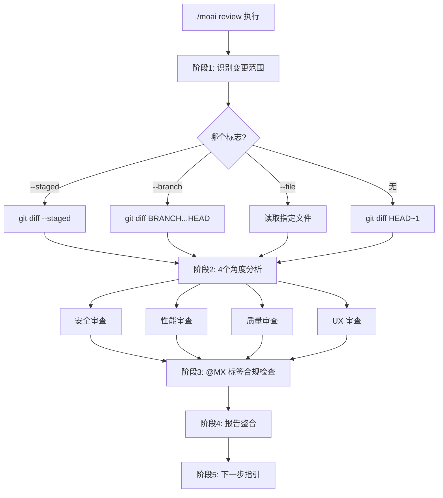
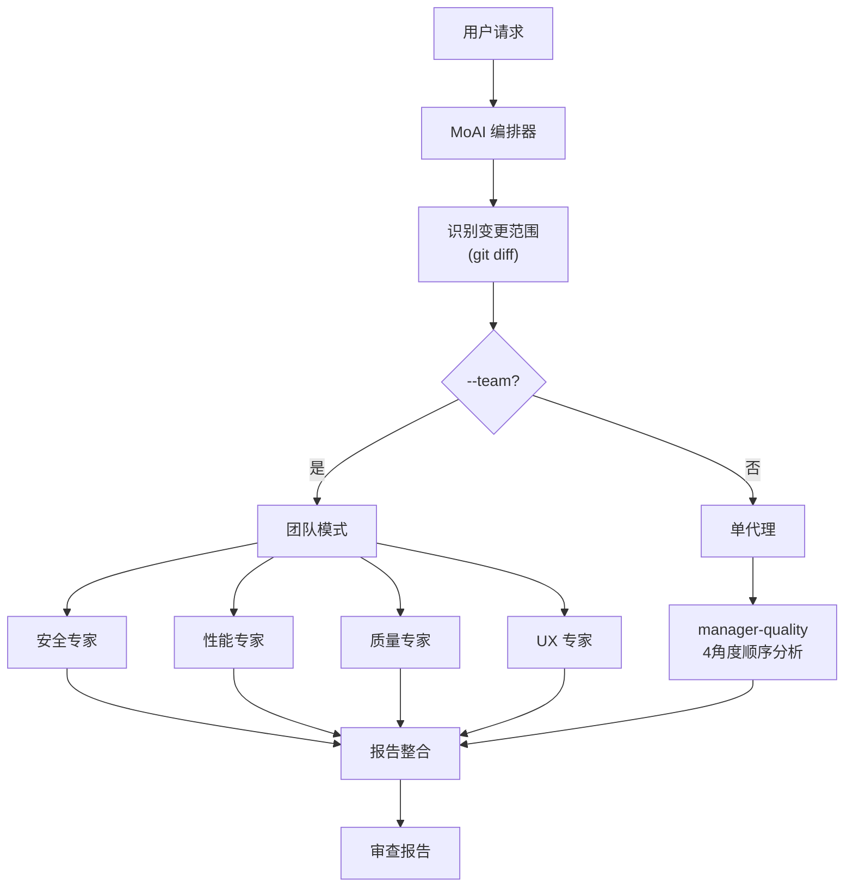

import { Callout } from 'nextra/components'

# /moai review

从 **安全、性能、质量、UX** 4个角度分析代码库的代码审查命令。

<Callout type="tip">
**一句话总结**: `/moai review` 是 "AI 代码审查员"。从 OWASP 安全检查到性能分析、TRUST 5 质量验证、UX 无障碍性，**同时从4个角度进行审查**。
</Callout>

<Callout type="info">
**斜杠命令**: 在 Claude Code 中输入 `/moai:review` 可以直接运行此命令。仅输入 `/moai` 即可查看所有可用子命令列表。
</Callout>

## 概述

代码审查是软件质量的核心。然而，要同时仔细检查安全、性能、质量和 UX 并不容易。`/moai review` 由 AI 从4个角度系统地分析代码，生成按严重程度分类的审查报告。

同时检查 @MX 标签的合规性，帮助 AI 代理更好地理解代码。

## 用法

```bash
# 审查最近提交的变更
> /moai review

# 仅审查已暂存的变更
> /moai review --staged

# 与特定分支比较审查
> /moai review --branch develop

# 安全重点审查
> /moai review --security

# 仅审查特定文件
> /moai review --file src/auth/service.py
```

## 支持的标志

| 标志 | 描述 | 示例 |
|------|------|------|
| `--staged` | 仅审查已暂存 (git add) 的变更 | `/moai review --staged` |
| `--branch BRANCH` | 与指定分支比较审查 (默认: main) | `/moai review --branch develop` |
| `--security` | 专注安全审查 (OWASP, 注入, 认证) | `/moai review --security` |
| `--file PATH` | 仅审查特定文件 | `/moai review --file src/auth/` |
| `--team` | 代理团队模式 (4名专家审查员并行分析) | `/moai review --team` |

### --staged 标志

仅审查通过 `git add` 暂存的变更。适用于提交前的最终检查:

```bash
> git add src/auth/
> /moai review --staged
```

### --security 标志

专注于安全角度进行更深入的分析:

```bash
> /moai review --security
```

深度分析 OWASP Top 10、注入风险、认证/授权逻辑、密钥泄露等。

### --team 标志

4名专业审查代理同时分析:

```bash
> /moai review --team
```

安全、性能、质量、UX 专家各自独立审查，能够进行更深入的分析。

## 执行过程

`/moai review` 分5个阶段执行。



### 阶段1: 识别变更范围

根据标志确定审查对象:

| 条件 | 使用的命令 |
|------|-----------|
| `--staged` | `git diff --staged` |
| `--branch BRANCH` | `git diff {BRANCH}...HEAD` |
| `--file PATH` | 直接读取指定文件 |
| 无标志 | `git diff HEAD~1` |

### 阶段2: 4个角度分析

从4个专业角度分析代码:

#### 角度1: 安全审查

| 检查项目 | 描述 |
|----------|------|
| OWASP Top 10 合规 | 主要网络安全漏洞检查 |
| 输入验证和清理 | 用户输入处理安全性 |
| 认证/授权逻辑 | 访问控制实现验证 |
| 密钥泄露 | API 密钥、密码、令牌泄露 |
| 注入风险 | SQL、命令、XSS、CSRF 风险 |
| 依赖漏洞 | 第三方库漏洞 |

#### 角度2: 性能审查

| 检查项目 | 描述 |
|----------|------|
| 算法复杂度 | O(n) 分析 |
| 数据库查询效率 | N+1 查询、缺失索引 |
| 内存使用模式 | 内存泄漏、过度分配 |
| 缓存机会 | 识别可缓存区域 |
| 包体积影响 | 前端变更的包大小影响 |
| 并发安全性 | 竞态条件、死锁 |

#### 角度3: 质量审查

| 检查项目 | 描述 |
|----------|------|
| TRUST 5 合规 | Tested, Readable, Unified, Secured, Trackable |
| 命名规范 | 代码可读性 |
| 错误处理 | 错误处理完整性 |
| 测试覆盖率 | 变更代码的测试存在性 |
| 文档 | 公共 API 文档 |
| 项目模式一致性 | 遵循现有代码库模式 |

#### 角度4: UX 审查

| 检查项目 | 描述 |
|----------|------|
| 用户流程完整性 | 变更是否破坏现有流程 |
| 错误状态 | 用户视角的错误和边界情况 |
| 无障碍性 | WCAG、ARIA 合规 |
| 加载状态 | 加载指示和反馈 |
| 破坏性变更 | 公共接口兼容性 |

### 阶段3: @MX 标签合规检查

检查变更文件的 @MX 标签合规情况:

- 新的 exported 函数: 需要 `@MX:NOTE` 或 `@MX:ANCHOR`
- 高 fan_in 函数 (>=3 调用者): 必须有 `@MX:ANCHOR`
- 危险模式: 应有 `@MX:WARN`
- 无测试的公共函数: 应有 `@MX:TODO`

### 阶段4: 报告整合

生成按严重程度分类的整合报告:

```
## 代码审查报告

### 严重问题 (必须修复)
- [SECURITY] src/auth/service.py:45: SQL 注入风险
- [PERFORMANCE] src/api/handler.py:23: N+1 查询模式

### 警告 (建议修复)
- [QUALITY] src/utils/helper.py:12: 缺少错误处理
- [UX] src/components/Form.tsx:88: 缺少无障碍属性

### 建议 (可以改进)
- [QUALITY] src/models/user.py:34: 建议方法拆分

### @MX 标签合规
- 缺失标签: 3个
- 过时标签: 1个
- 合规文件: 8/12

### 综合评估
- 安全: PASS
- 性能: WARN
- 质量: PASS
- UX: WARN
- TRUST 5 评分: 4/5
```

### 阶段5: 下一步指引

根据审查结果引导下一步操作:

- **自动修复**: 运行 `/moai fix` 自动解决 Level 1-2 问题
- **创建修复任务**: 将各发现项注册为独立任务
- **导出报告**: 将审查报告保存到 `.moai/reports/`
- **关闭**: 确认审查后不采取进一步操作

## 代理委托链



**代理角色:**

| 代理 | 角色 | 主要工作 |
|------|------|----------|
| **MoAI 编排器** | 变更识别及结果整合 | git diff、报告生成 |
| **manager-quality** | 代码质量分析 (默认模式) | 4角度顺序分析 |
| **expert-security** | 安全集中分析 (`--security`) | OWASP、注入、认证 |

## 常见问题

### Q: --team 模式和默认模式有什么区别？

默认模式由 `manager-quality` 代理顺序分析4个角度。`--team` 模式使用4名专业审查员同时分析，能进行更深入的分析，但令牌消耗约为4倍。

### Q: PR 前审查最佳的标志组合是什么？

`/moai review --staged` 最高效，仅审查已暂存的变更。如果安全很重要，请使用 `/moai review --staged --security`。

### Q: 可以跳过 @MX 标签检查吗？

目前 @MX 标签检查始终包含在内。结果显示在报告的单独部分，标签不会自动添加。

### Q: 审查中发现的问题可以自动修复吗？

是的，审查后运行 `/moai fix` 可以自动修复 Level 1-2 的问题。Level 3-4 的问题需要手动确认。

## 相关文档

- [/moai fix - 一键自动修复](/utility-commands/moai-fix)
- [/moai coverage - 覆盖率分析](/quality-commands/moai-coverage)
- [/moai e2e - E2E 测试](/quality-commands/moai-e2e)
- [/moai codemaps - 架构文档](/quality-commands/moai-codemaps)
