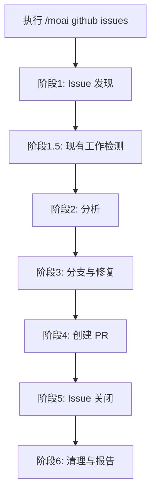
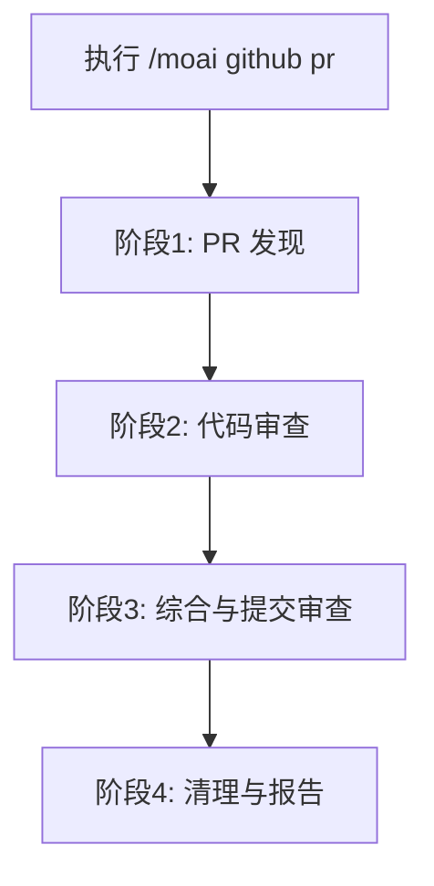

import { Callout } from 'nextra/components'

# /moai github

GitHub Issue 修复与 PR 代码审查自动化（支持 Agent Teams）。

<Callout type="tip">
**一句话总结**: `/moai github` 使用 Agent Teams **自动修复 GitHub Issue 并从多角度分析审查 PR**。
</Callout>

<Callout type="info">
**斜杠命令**: 在 Claude Code 中输入 `/moai:github` 直接执行。仅输入 `/moai` 可查看所有可用子命令列表。
</Callout>

## 概述

`/moai github` 提供两个主要工作流：

- **issues**: 获取 GitHub Issue，分析根本原因，实现修复，创建 PR
- **pr**: 获取 PR，执行多角度代码审查，提交审查评论

<Callout type="warning">
**重要**: 使用此命令需要安装并认证 GitHub CLI (`gh`)。
</Callout>

## 使用方法

### Issue 修复工作流

```bash
# 列出并选择开放中的 Issue
> /moai github issues

# 修复特定 Issue
> /moai github issues 123

# 修复特定标签的 Issue
> /moai github issues --label bug

# 修复所有开放中的 Issue（批量模式）
> /moai github issues --all

# CI 通过后自动合并
> /moai github issues 123 --merge
```

### PR 审查工作流

```bash
# 列出并选择开放中的 PR
> /moai github pr

# 审查特定 PR
> /moai github pr 456

# 审查所有开放中的 PR
> /moai github pr --all

# 批准后自动合并
> /moai github pr 456 --merge

# 强制子代理模式（跳过 Agent Teams）
> /moai github pr 456 --solo
```

## 支持的标志

| 标志 | 描述 | 示例 |
|------|------|---------|
| `--all` | 处理所有开放项目 | `/moai github issues --all` |
| `--label LABEL` | 按标签筛选 Issue | `/moai github issues --label bug` |
| `--merge` | CI 通过后自动合并 | `/moai github pr 123 --merge` |
| `--solo` | 强制子代理模式 | `/moai github issues --solo` |
| `--tmux` | 创建 tmux 会话用于并行工作 | `/moai github issues --tmux` |

## Issue 工作流

Issue 工作流遵循以下阶段：



### 阶段1: Issue 发现

1. 从 GitHub 获取开放中的 Issue
2. 显示 Issue 列表或按标签/编号筛选
3. 按类型分类 Issue（错误、功能、改进、文档）

### 阶段1.5: 现有工作检测

开始分析之前，工作流会检查现有的机器人工作：

- 检测 @claude 机器人分支
- 检查引用该 Issue 的现有 PR
- 询问用户是重用现有工作还是从头开始

| 机器人分支 | PR 存在 | 操作 |
|-----------|-----------|--------|
| 是 | 是（已合并） | 跳过 Issue（已解决） |
| 是 | 是（开放中） | 询问: 审查现有 PR / 重新修复 |
| 否 | 是（开放中） | 询问: 审查现有 PR / 继续工作 |
| 否 | 否 | 继续正常分析 |

### 阶段2: 分析

**团队模式（默认）:**

创建团队进行并行 Issue 分析：

- **分析师队友**: 探索代码库，识别根本原因
- **编码员队友**: 在隔离的工作树中实现修复
- **验证员队友**: 验证修复并测试覆盖率

**子代理模式（--solo）:**

委派给相应的专家代理：
- 错误修复: expert-debug 子代理
- 功能: expert-backend 或 expert-frontend 子代理
- 改进: expert-refactoring 子代理

### 阶段3: 分支与修复

1. 根据 Issue 类型创建功能分支：
   - 错误: `fix/issue-{number}`
   - 功能: `feat/issue-{number}`
   - 改进: `improve/issue-{number}`
   - 文档: `docs/issue-{number}`

2. 实现修复并测试
3. 验证测试通过
4. 使用 `Fixes #{number}` 引用提交更改

### 阶段4: 创建 PR

创建包含以下内容的 PR：
- 标题: `{type}: {issue title}`
- 正文: 修复摘要、测试计划、Issue 引用
- 通过 `Fixes #{number}` 自动链接 Issue

### 阶段5: Issue 关闭

PR 合并后，使用多语言评论关闭 Issue：

```
Issue 已成功解决！

实现: {摘要}
相关 PR: #{pr_number}
合并时间: {timestamp} {timezone}
测试覆盖率: {coverage}%
```

支持语言: 英语、韩语、日语、中文

## PR 审查工作流

PR 工作流执行多角度代码审查：



### 阶段2: 多角度审查

**团队模式（默认）:**

三名审查员并行分析 PR：

| 审查员 | 视角 | 重点领域 |
|----------|-------------|-------------|
| **security-reviewer** | 安全 | 注入风险、认证/授权、数据泄露、OWASP Top 10 |
| **perf-reviewer** | 性能 | 算法复杂度、数据库模式、内存泄漏、并发 |
| **quality-reviewer** | 质量 | 正确性、测试覆盖率、命名、错误处理 |

**子代理模式（--solo）:**

以下代理顺序审查：
1. expert-security 子代理
2. expert-performance 子代理
3. manager-quality 子代理

### 阶段3: 提交审查

发现内容按严重程度分类：

- **Critical**: 合并前必须修复（安全漏洞、数据丢失风险）
- **Important**: 应该修复（性能问题、错误处理缺失）
- **Suggestion**: 改进建议（命名、样式、轻微改进）

审查操作选项：
- **Approve**: 提交批准并附带摘要
- **Request Changes**: 提交必需更改
- **Comment Only**: 仅提交评论不做批准决定

## 机器人审查集成

合并 PR 时，在合并前检查机器人审查状态：

| 机器人 | 审查状态 | 操作 |
|-----|-------------|--------|
| CodeRabbit | CHANGES_REQUESTED | 修复反馈后发布 `@coderabbitai resolve` |
| CodeRabbit | APPROVED | 继续合并 |
| CodeRabbit | COMMENTED | 审查评论，如是 Critical/Important 则修复 |
| 无机器人审查 | - | 继续合并 |

## 自动合并安全协议

尝试合并之前：

1. **检查可合并性**: `CLEAN`、`BEHIND`、`BLOCKED` 或 `DIRTY`
2. **检查审查决定**: `APPROVED`、`CHANGES_REQUESTED` 或无
3. **检查 CI 状态**: 所有必需检查必须通过

| 合并状态 | 操作 |
|-------------|--------|
| CLEAN | 继续合并 |
| BEHIND | 更新分支，等待 CI，重试 |
| BLOCKED | 解决阻塞因素（审查/CI） |
| DIRTY | 报告冲突，无法自动合并 |

## 代理模式

### 团队模式（默认）

Agent Teams 模式提供并行多角度分析：

- **前提条件**: `CLAUDE_CODE_EXPERIMENTAL_AGENT_TEAMS=1` 和 `workflow.team.enabled: true`
- **优势**: 更快的分析，同时多角度视角
- **隔离**: 每个队友在隔离的工作树中工作

### 子代理模式（--solo）

Agent Teams 不可用时的回退模式：

- 顺序代理委派
- 单一上下文窗口
- 更简单的调试

## tmux 并行开发

提供 `--tmux` 标志时：

1. 创建 tmux 会话: `github-issues-{timestamp}`
2. 每个 Issue 工作树一个窗格（最多显示 3 个）
3. 每个窗格自动执行工作树进入
4. 创建后焦点返回第一个窗格

布局：
- 窗格 1-3: 垂直分割
- 窗格 4+: 水平分割

## Git 工作流配置

从 `.moai/config/sections/system.yaml` 读取 `github.git_workflow`：

| 策略 | 分支行为 | PR 目标 |
|----------|----------------|-----------|
| **github_flow** | 创建功能分支 | main |
| **gitflow** | 创建功能分支 | develop |
| **main_direct** | 留在 main | main（无 PR） |

## 常见问题

### Q: 修复过程中测试失败怎么办？

工作流会使用错误上下文重试最多 3 次。如果仍然失败，会询问用户重试、跳过或中止。

### Q: 可以不自动合并而审查 PR 吗？

可以，省略 `--merge` 标志。审查将被提交但不会合并。

### Q: 合并后 Issue 如何关闭？

使用多语言评论（EN/KO/JA/ZH）关闭 Issue，包含实现摘要、PR 链接、合并时间戳和测试覆盖率。

### Q: CodeRabbit 请求更改怎么办？

工作流:
1. 解析审查评论
2. 委派专家代理修复
3. 将修复推送到 PR 分支
4. 发布 `@coderabbitai resolve` 评论
5. 等待重新审查（最多 5 分钟）

### Q: 可以同时处理多个 Issue 吗？

可以，使用 `--all` 标志进行批量模式。为避免分支冲突，Issue 会顺序处理。

## 相关文档

- [/moai - 完全自动化](/utility-commands/moai)
- [/moai pr - 拉取请求管理](/workflow-commands/moai-sync)
- [Git Worktree 指南](/worktree/guide)
