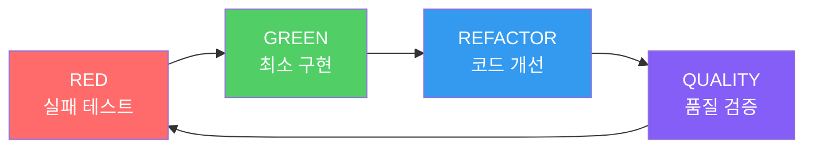

# 기능 개요

MoAI-ADK는 AI 기반의 SPEC-First TDD 개발 프레임워크로, 개발 프로세스의 모든 단계를 자동화하고 최적화합니다.

## 🎯 SPEC-First 개발

### EARS 형식 명세서
구조화되고 명확한 요구사항 정의를 통해 개발의 방향을 설정합니다.

```gherkin
When 사용자가 로그인 버튼을 클릭하면
And 유효한 자격증명을 입력했을 때
The system shall 사용자 세션을 생성하여야 한다
So that 사용자는 인증된 기능에 접근할 수 있다
```

### 15개 필수 필드
모든 명세서는 15개의 표준화된 필드를 포함하여 완성도를 보장합니다.

## 🔄 자동화된 TDD 워크플로우

RED → GREEN → REFACTOR 사이클을 자동으로 관리합니다.



## 🎩 Alfred 슈퍼에이전트

19개의 전문 AI 에이전트가 개발 프로세스를 오케스트레이션합니다.

### 핵심 에이전트
- **spec-builder**: 명세서 작성 전문가
- **tdd-implementer**: TDD 구현 전문가
- **test-engineer**: 테스트 엔지니어
- **git-manager**: Git 워크플로우 관리자
- **qa-validator**: 품질 검증 전문가

## 🔗 @TAG 추적성 시스템

모든 개발 산출물을 연결하는 완전한 추적성을 제공합니다.

```
@SPEC-DOCS-001 (요구사항)
  └── @TEST-DOCS-001-001 (테스트)
      └── @CODE-DOCS-001-001 (구현)
          └── @DOC-DOCS-001-001 (문서)
```

## 📚 Skills 시스템

55개의 전문 Claude Skills가 모든 기술 도메인을 지원합니다.

### Skills 카테고리
- **Foundation Skills**: 핵심 기반 (5개)
- **Alfred Workflow Skills**: 워크플로우 (9개)
- **Language Skills**: 프로그래밍 언어 (7개)
- **Domain Skills**: 기술 도메인 (5개)
- **Essentials Skills**: 핵심 개발 (3개)
- **BaaS Skills**: 클라우드 서비스 (3개)
- **Cross-Cutting Skills**: 공통 기능 (8개)

## 🛡️ TRUST 5 품질 원칙

코드 품질을 보장하는 5가지 핵심 원칙입니다.

1. **Test First**: 테스트 주도 개발
2. **Readable**: 가독성 있는 코드
3. **Unified**: 통합된 스타일
4. **Secured**: 보안 우선 설계
5. **Trackable**: 추적 가능한 변경

## 🚀 자동화된 파이프라인

CI/CD 파이프라인과 통합된 완전한 자동화를 제공합니다.

```yaml
# 자동화된 워크플로우
name: MoAI-ADK Pipeline
on: [push, pull_request]
jobs:
  quality:
    - 코드 품질 검증
    - 테스트 자동 실행
    - 문서 동기화
    - 보안 스캔
```

자세한 내용은 각 섹션을 참고하세요:
- [Skills 시스템](../skills) - 55개 전문 Skills 상세 정보
- [Alfred 페르소나](../output-style/personas) - 개인화된 개발 경험
- [Getting Started](../getting-started) - 5분 빠른 시작 가이드