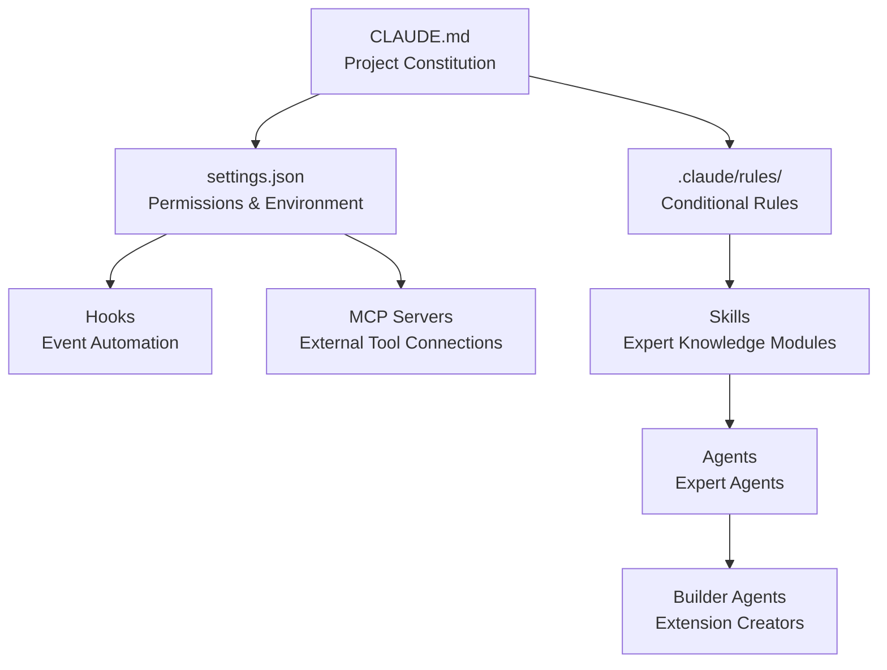

# Advanced

Covers MoAI-ADK's internal structure and advanced features in depth.


This section is a guide for developers who understand MoAI-ADK's basic concepts and want to grasp internal operating principles.


## Learning Structure

MoAI-ADK consists of 7 core components:

## Table of Contents

| Topic | Description |
|-------|-------------|
| [Skill Guide](/advanced/skill-guide) | Skill system that grants expert knowledge to AI |
| [Agent Guide](/advanced/agent-guide) | Specialized AI task executor system |
| [Builder Agent Guide](/advanced/builder-agents) | Creating skills, agents, commands, plugins |
| [Hooks Guide](/advanced/hooks-guide) | Event-based automation scripts |
| [settings.json Guide](/advanced/settings-json) | Claude Code global settings management |
| [CLAUDE.md Guide](/advanced/claude-md-guide) | Project guideline file system |
| [MCP Servers](/advanced/mcp-servers) | External tool connection protocol |
| [Google Stitch Guide](/advanced/stitch-guide) | AI-based UI/UX design generation tool |


Each document can be read independently, but reading sequentially starting from **Skill Guide** allows you to systematically understand the entire architecture.

