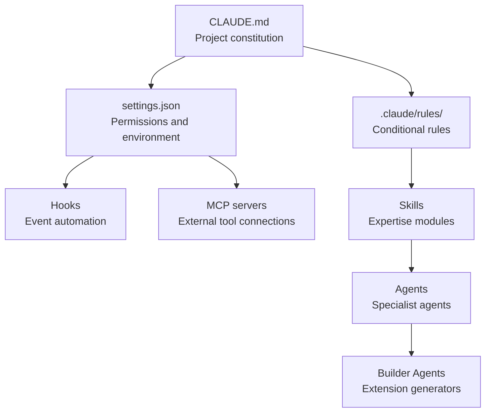

 <strong>Belongs to</strong>: 🪙 Tokenomics · 🧠 Agentic Loop Engineering · 🛡️ Agentic Harness

<!-- @value: tokenomics, self-learning, agentic-harness -->

This section is for developers who want to take MoAI-ADK apart and see how it works inside. Once you are comfortable with the basic workflow (plan → run → sync), this is where you can see how the harness is actually assembled.


The documents in this section cover mainly the third of v3.0's three core values — **Tokenomics** (Token Economics), **Agentic Loop Engineering**, and the **Agentic Harness** — namely the implementation details of the harness. The secret to making agents write good code is not the model, but the design of the environment around the model.


## How the Harness Is Assembled

The MoAI-ADK harness operates as seven components arranged in layers. The further down you go, the more dynamic the layer.

```mermaid
flowchart TD
    CLAUDE["CLAUDE.md<br>Project constitution"] --> SETTINGS["settings.json<br>Permissions and environment"]
    CLAUDE --> RULES[".claude/rules/<br>Conditional rules"]

    SETTINGS --> HOOKS["Hooks<br>Event automation"]
    SETTINGS --> MCP["MCP servers<br>External tool connections"]

    RULES --> SKILLS["Skills<br>Expertise modules"]
    SKILLS --> AGENTS["Agents<br>Specialist agents"]

    AGENTS --> BUILDERS["Builder Agents<br>Extension generators"]

```

If `CLAUDE.md` is the project's constitution, settings.json is the permission boundary, hooks are the deterministic control points, and skills and agents are the hands doing the actual work. And Builder Agents can regenerate this entire structure — a recursive architecture where the harness builds the harness.

## Table of Contents

### Cost — Tokenomics

| Topic | Description |
|------|------|
| [Tokenomics Overview](/en/advanced/tokenomics-overview) | The paradox of unit prices falling 98% while costs rise 320%, and the answer |
| [Token Budget](/en/advanced/token-budget) | Token Circuit Breaker · verify-diet · context diet |
| [No-Haiku 3-Tier](/en/advanced/no-haiku-3tier) | The DeepSWE-leaderboard rationale and the 3-tier policy |
| [Profile Matrix](/en/advanced/profile-matrix) | The single profile axis of 11 agents × `{model, effort}` across 33 cells |
| [statusline](/en/advanced/statusline) | An always-on dashboard for context usage, cache hit rate, and rate limits |

### Self-improvement — Agentic Loop Engineering

| Topic | Description |
|------|------|
| [Self-Evolving System](/en/advanced/self-evolving) | The 4-tier learning ladder (observation → heuristic → rule → auto-update) |
| [Autonomous Loops](/en/advanced/autonomous-loops) | The condition-declared and diagnostic-driven loops of `/moai goal` and `/moai loop` |
| [Decision Memory](/en/advanced/decision-memory) | The observation system that learns user choices |
| [ultracode Workflows](/en/advanced/ultracode-workflows) | Dynamic workflow orchestration (multi-agent fan-out) |

### Quality-control — Agentic Harness

| Topic | Description |
|------|------|
| [Skill Guide](/en/advanced/skill-guide) | The skill system that gives AI specialized expertise |
| [Agent Guide](/en/advanced/agent-guide) | The system of specialized AI task performers |
| [Builder Agents Guide](/en/advanced/builder-agents) | Creating skills, agents, commands, and plugins |
| [Harness v4 Builder](/en/advanced/harness-v4-builder) | Generate a project-specific harness from a single natural-language sentence |
| [Harness Profiles and Evaluation System](/en/advanced/harness-profiles) | 3-level verification depth + 4-dimension scoring |
| [Catalog System](/en/advanced/catalog-system) | The 3-tier manifest and slim init |

### Control and Automation

| Topic | Description |
|------|------|
| [Hooks Guide](/en/advanced/hooks-guide) | Event-driven automation scripts |
| [Hooks Reference](/en/advanced/hooks-reference) | The list of hooks MoAI-ADK ships |
| [settings.json Guide](/en/advanced/settings-json) | Managing Claude Code global settings |
| [config Sections](/en/advanced/config-sections) | Reference for the `.moai/config/sections/*.yaml` settings |
| [CLAUDE.md Guide](/en/advanced/claude-md-guide) | The project instruction file system |
| [@MX Tags](/en/advanced/mx-tags) | Inline annotations between agents for context, invariant contracts, and danger zones |
| [Security Notes](/en/advanced/security-notes) | The permission stack and sandboxing |


Each document can be read independently. If you want a systematic understanding of the whole architecture, however, we recommend the order **Skill Guide → Agent Guide → Builder Agents** — the flow from knowledge modules to performers, and from performers to generators, mirrors the recursive structure of the harness itself.

