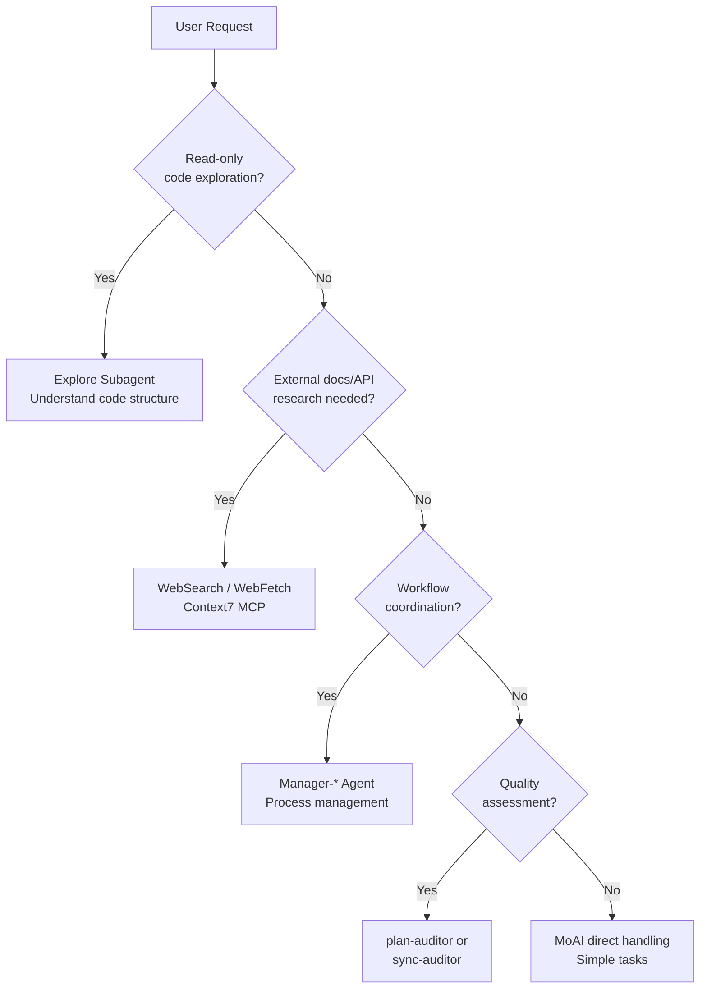

Detailed guide to MoAI-ADK's 8 core agent system.


**One-line summary**: Agents are **expert teams** for each domain. MoAI acts as team leader, delegating tasks to appropriate specialists.


## What are Agents?

Agents are **AI task executors** specialized in specific domains.

Based on Claude Code's **Sub-agent** system, each agent has an independent context window, custom system prompt, specific tool access, and independent permissions.

Using a company organization analogy: MoAI is the CEO, Manager agents are department heads, Evaluator agents are quality auditors, and Builder agents create new specialized teams.

## MoAI Orchestrator

MoAI is the **top-level coordinator** of MoAI-ADK. It analyzes user requests and delegates tasks to appropriate agents (8 retained agents only).

### MoAI's Core Rules

| Rule | Description |
|------|-------------|
| Delegation Only | Complex tasks are delegated to specialized agents, not performed directly |
| User Interface | Only MoAI handles user interaction (subagents cannot prompt users directly) |
| Parallel Execution | Independent tasks are delegated to multiple agents simultaneously (Agent Teams mode) |
| Result Integration | Consolidates agent execution results and reports to user |

## 8 Core Agent Catalog

MoAI-ADK uses **8 retained agents** (7 MoAI-custom + 1 Anthropic built-in).

### Manager Agents (4)

| Agent | Role | Phase | Key Skills |
|--------|------|-------|-----------|
| `manager-spec` | SPEC document creation, GEARS format requirements | Plan | `moai-workflow-spec` |
| `manager-develop` | DDD/TDD cycle implementation (cycle_type per quality.yaml) | Run | `moai-workflow-ddd`, `moai-workflow-tdd` |
| `manager-docs` | Documentation generation, CHANGELOG, README sync | Sync | `moai-workflow-project` |
| `manager-git` | PR creation, Git branching, merge strategy | PR (Tier L) | `moai-foundation-core` |

### Evaluator Agents (2)

| Agent | Role | Evaluates | Key Skills |
|--------|------|-----------|-----------|
| `plan-auditor` | Plan phase independent audit, GEARS compliance, bias prevention | SPEC completeness | `moai-foundation-core`, `moai-foundation-thinking` |
| `sync-auditor` | Sync phase quality scoring (4-dimension: Functionality, Security, Craft, Consistency) | Implementation quality | `moai-foundation-quality`, `moai-foundation-core` |

### Builder Agent (1)

| Agent | Role | Output |
|--------|------|--------|
| `builder-harness` | Dynamic project-specific agent team generation (Socratic interview based) | `.claude/agents/harness/`, `.moai/harness/manifest.json` |

### Built-in Agent (1, Anthropic)

| Agent | Role | Characteristics |
|--------|------|-----------------|
| `Explore` | Read-only code exploration and analysis | Haiku model, Read-only tools |

## Manager-Develop Domain Context Injection

`manager-develop` is invoked with domain-specific context injected.

- **Backend work**: `manager-develop` + backend domain context + `moai-domain-backend` skill
- **Frontend work**: `manager-develop` + frontend domain context + `moai-domain-frontend` skill
- **Other domains**: Language-specific skills + domain expertise prompt

## Agent Selection Decision Tree

The process by which MoAI analyzes user requests and selects appropriate agents.



## Agent Definition Files

The 8 retained agents are defined as markdown files in the `.claude/agents/moai/` directory.

### File Structure

```
.claude/agents/moai/
├── manager-spec.md
├── manager-develop.md
├── manager-docs.md
├── manager-git.md
├── plan-auditor.md
├── sync-auditor.md
├── builder-harness.md
└── (Explore: Anthropic built-in, no file)
```

### Agent Definition Format

```markdown
---
name: my-specialist
description: >
  Project specialist. Handles domain-specific tasks in this project context.
tools: Read, Write, Edit, Grep, Glob, Bash
model: inherit
---

You are a specialist for this project.

## Role

- Responsibility 1
- Responsibility 2
- Responsibility 3

## Used Skills

- moai-domain-backend
- Language-specific skills
```

## Agent Collaboration Patterns

### Plan-Run-Sync Sequential Workflow

```bash
# 1. manager-spec creates SPEC
/moai plan "feature description"

# 2. plan-auditor verifies SPEC quality
# (automatic)

# 3. manager-develop implements with DDD/TDD
/moai run SPEC-XXX

# 4. sync-auditor scores quality
# (automatic)

# 5. manager-docs synchronizes documentation
/moai sync SPEC-XXX
```

### Agent Teams Parallel Execution (Experimental)

```bash
# MoAI delegates parallel specialists with --team flag
/moai plan --team "feature with multiple domains"
/moai run --team SPEC-XXX
```

## Sub-agent System Basics

Claude Code's official Sub-agent system forms the foundation of MoAI-ADK's agent architecture.

### Sub-agent Characteristics

| Feature | Description |
|---------|-------------|
| **Independent Context** | Each sub-agent runs in its own 200K token context window |
| **Custom Prompt** | Specialized system prompt defines role and behavior |
| **Specific Tools** | Only necessary tools are provided |
| **Independent Permissions** | Individual permission mode settings |

### Sub-agent Constraints

| Constraint | Description |
|-----------|-------------|
| Cannot create sub-agents | Sub-agents cannot spawn other sub-agents |
| AskUserQuestion limit | Sub-agents cannot interact directly with users |
| Skills not inherited | Does not inherit skills from parent conversation |
| Independent context | Each agent has its own 200K token context |

## Agent Teams (Experimental)

Agent Teams mode is an advanced workflow where dynamic specialists **collaborate in parallel**. This mode spawns runtime-generated team members based on project context (role_profiles from `workflow.yaml`).

### Team Mode Settings

| Setting | Default | Description |
|---------|---------|-------------|
| `workflow.team.enabled` | `false` | Enable Agent Teams mode |
| `workflow.team.max_teammates` | `5` | Maximum teammates per team (Anthropic recommendation) |
| `workflow.team.auto_selection` | `true` | Auto-select mode based on complexity |

### Mode Selection

| Flag | Behavior |
|------|----------|
| **--team** | Force Agent Teams mode (dynamic team generation) |
| **--solo** | Force sub-agent mode (sequential delegation) |
| **No flag** | Auto-select based on complexity (domains ≥3, files ≥10, score ≥7) |

## Related Documentation

- [Harness v4 Builder](/advanced/builder-agents) - Dynamic agent team creation
- [Skill Guide](/advanced/skill-guide) - Skill system used by agents
- [SPEC-based Development](/workflow-commands/moai-plan) - SPEC workflow details


**Tip**: You don't need to specify agents directly. Just make natural language requests to MoAI and it will automatically select the optimal agent.

