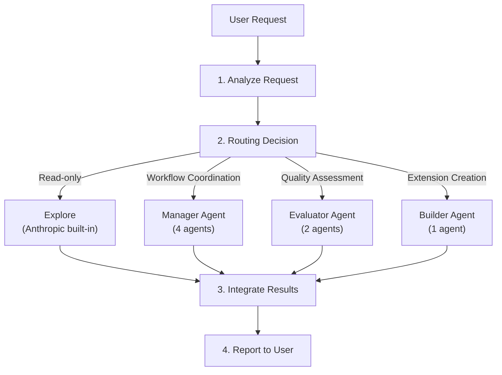
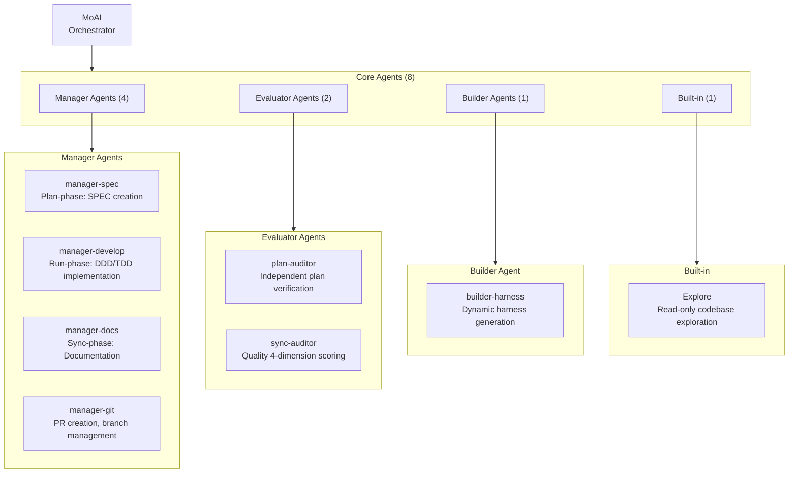
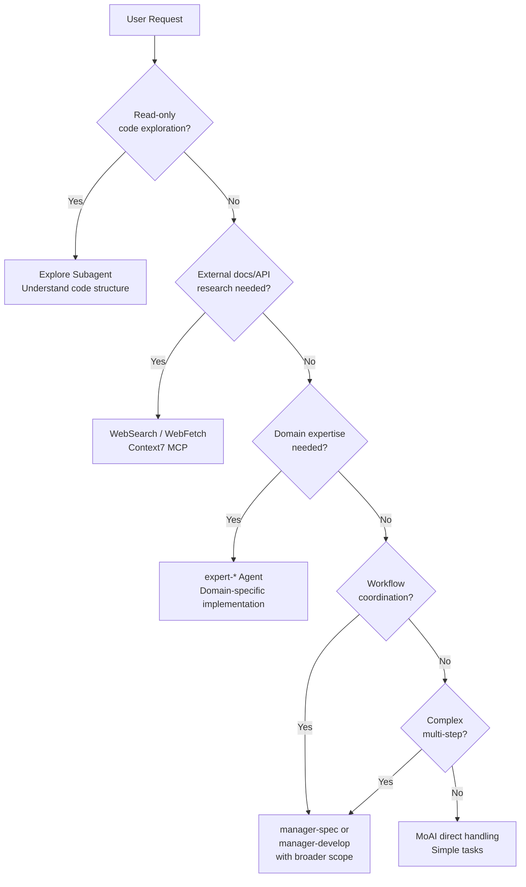
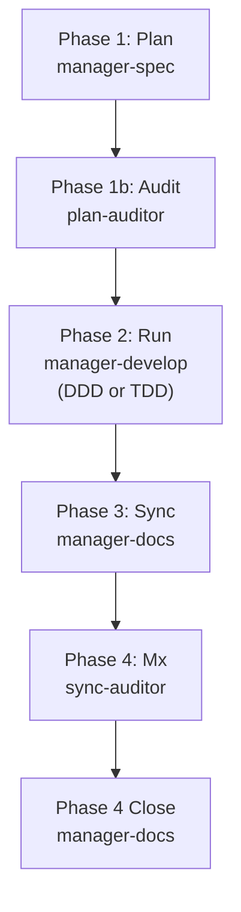

Detailed guide to MoAI-ADK's agent system.


**One-line summary**: Agents are **expert teams** for each domain. MoAI acts as team leader, delegating tasks to appropriate experts.


## What are Agents?

Agents are **AI task executors** specialized in specific domains.

Based on Claude Code's **Sub-agent** system, each agent has an independent context window, custom system prompt, specific tool access, and independent permissions.

Using a company organization analogy: MoAI is the CEO, Manager agents are department heads, Expert agents are experts in each field, and Builder agents are HR teams recruiting new team members.

## MoAI Orchestrator

MoAI is the **top-level coordinator** of MoAI-ADK. It analyzes user requests and delegates tasks to appropriate agents (8 retained agents only).

### MoAI's Core Rules

| Rule | Description |
|------|-------------|
| Delegation Only | Complex tasks are delegated to specialized agents (manager/evaluator/builder), not performed directly |
| User Interface | Only MoAI handles user interaction (subagents cannot prompt users directly) |
| Parallel Execution | Independent tasks are delegated to multiple agents simultaneously (Agent Teams mode) |
| Result Integration | Consolidates agent execution results and reports to user |
| No Archived Agents | The 12 archived agents are not available; domain expertise is injected via manager-develop context injection |

### MoAI's Request Processing Flow



## Agent 8-Agent Consolidated Structure

MoAI-ADK uses **8 retained agents** (7 MoAI-custom + 1 Anthropic built-in):



## Manager Agent Details

Manager agents **coordinate and manage workflows**.

| Agent | Role | Used Skills | Main Tools |
|--------|------|-------------|------------|
| `manager-spec` | Plan-phase: SPEC document creation, EARS format requirements | `moai-workflow-spec` | Read, Write, Grep |
| `manager-develop` | Run-phase: DDD/TDD cycle execution (cycle_type per quality.yaml) | `moai-workflow-ddd`, `moai-workflow-tdd`, `moai-foundation-core` | Read, Write, Edit, Bash |
| `manager-docs` | Sync-phase: Documentation generation, CHANGELOG, README sync | `moai-workflow-project`, `moai-foundation-core` | Read, Write, Edit |
| `manager-git` | PR creation, Git branching, merge strategy (Tier L or --pr flag) | `moai-foundation-core` | Bash (git) |

### Manager Agents and Workflow Commands

Manager agents connect directly to major MoAI workflow commands:

```bash
# Plan phase: manager-spec creates SPEC document
> /moai plan "Implement user authentication system"

# Run phase: manager-develop executes DDD or TDD cycle
> /moai run SPEC-AUTH-001

# Sync phase: manager-docs synchronizes documentation
> /moai sync SPEC-AUTH-001
```

## Evaluator Agent Details

Evaluator agents perform **independent quality assessment** and validation.

| Agent | Role | Used Skills | Main Tools |
|--------|------|-------------|------------|
| `plan-auditor` | Plan-phase: Independent skeptical audit, GEARS compliance, bias prevention | `moai-foundation-core`, `moai-foundation-thinking` | Read, Grep |
| `sync-auditor` | Sync-phase: 4-dimension quality scoring (Functionality, Security, Craft, Consistency) | `moai-foundation-quality`, `moai-foundation-core` | Read, Grep, Bash |

## Domain Expertise Pattern

For domain-specific implementation work (backend API development, frontend UI, security analysis, database design, etc.), the `manager-develop` agent is invoked with domain context injected via per-spawn `Agent(general-purpose)` patterns or domain-specific instructions in the spawn prompt. The archived `expert-*` agents (expert-backend, expert-frontend, expert-security, expert-devops, expert-performance, expert-refactoring) were consolidated per SPEC-V3R6-AGENT-TEAM-REBUILD-001. For modern domain-specific work, use:

- **Backend**: `manager-develop` with backend domain context + `moai-domain-backend` skill
- **Frontend**: `manager-develop` with frontend domain context + `moai-domain-frontend` skill
- **Security**: Quality gates via `sync-auditor` + `moai-foundation-quality` + OWASP reference skill
- **Database**: `moai-domain-database` skill with `manager-develop`
- **Other domains**: Language-specific skills + `manager-develop`

## Builder Agent Details

Builder agent creates **new components that extend MoAI-ADK**.

| Agent | Role | Output |
|--------|------|--------|
| `builder-harness` | Dynamic project-specific agent team generation based on Socratic interview | `.claude/agents/harness/`, `.moai/harness/` |


For details on builder agents, refer to [Builder Agent Guide](/advanced/builder-agents).


## Agent Selection Decision Tree

The process by which MoAI analyzes user requests and selects appropriate agents:



### Agent Selection Criteria

| Task Type | Agent to Select | Example |
|-----------|-----------------|---------|
| Code reading/analysis | Explore | "Analyze this project's structure" |
| API development | manager-develop (backend context) | `/moai run SPEC-XXX` with backend SPEC |
| UI implementation | manager-develop (frontend context) | `/moai run SPEC-XXX` with frontend SPEC |
| Test writing | manager-develop (TDD mode) | `/moai run SPEC-XXX` with test-first SPEC |
| Security review | sync-auditor | Independent quality validation during sync |
| SPEC creation | manager-spec | `/moai plan "feature description"` |
| Implementation | manager-develop | `/moai run SPEC-XXX` (auto-selects DDD/TDD) |
| Document generation | manager-docs | `/moai sync SPEC-XXX` |
| Plan verification | plan-auditor | Independent audit of SPEC completeness |
| Extension creation | builder-harness | `/moai project` Socratic interview |

## Agent Definition Files

The 8 retained agents are defined as markdown files in the `.claude/agents/moai/` directory.

### File Structure

```
.claude/agents/moai/
├── manager-spec.md
├── manager-develop.md
├── manager-docs.md
├── manager-git.md
├── plan-auditor.md
├── sync-auditor.md
├── builder-harness.md
└── Explore                # Anthropic built-in (no file)
```

### Archived Agents

Twelve agents were archived on 2026-05-25 per SPEC-V3R6-AGENT-TEAM-REBUILD-001 consolidation:
- **Manager**: manager-strategy, manager-quality, manager-brain, manager-project
- **Expert**: expert-backend, expert-frontend, expert-security, expert-devops, expert-performance, expert-refactoring
- **Support**: claude-code-guide, researcher

For migration guidance on references to archived agents, see `.claude/rules/moai/workflow/archived-agent-rejection.md`.

### Agent Definition Format

```markdown
---
name: my-backend-specialist
description: >
  Backend specialist for this project. Handles API design, server logic, database integration.
  Generated by builder-harness based on project context.
tools: Read, Write, Edit, Grep, Glob, Bash
model: inherit
---

You are a backend specialist for this project.

## Role
- REST/GraphQL API design and implementation
- Database schema design
- Authentication/authorization system implementation
- Server-side business logic

## Used Skills
- moai-domain-backend
- Language-specific skills (Python, TypeScript, etc.)

## Quality Standards
- TRUST 5 framework compliance
- 85%+ test coverage
- OWASP Top 10 security standards
```


**Caution**: Subagents **cannot directly prompt users for questions**. All user interaction happens only through MoAI. Collect necessary information before delegating to agents. Subagents that need input from the user must return a blocker report to the orchestrator.


## Agent Collaboration Patterns

### Sequential Execution (Plan-Run-Sync)

```bash
# 1. manager-spec creates SPEC
# 2. plan-auditor verifies SPEC completeness
# 3. manager-develop implements with DDD/TDD
# 4. sync-auditor scores quality
# 5. manager-docs generates documentation
> /moai plan "authentication system"
> /moai run SPEC-AUTH-001
> /moai sync SPEC-AUTH-001
```

### Parallel Execution with Agent Teams (Experimental)

```bash
# MoAI delegates parallel teams with --team flag
# Plan phase: researcher + analyst + architect in parallel
# Run phase: backend-dev + frontend-dev + tester in parallel
> /moai plan --team "feature with multiple domains"
> /moai run --team SPEC-XXX
```

### Agent Chain (4-Phase Workflow)

The standard MoAI workflow uses a 4-phase chain.



## Sub-agent System

Claude Code's official Sub-agent system forms the foundation of MoAI-ADK's agent architecture.

### What are Sub-agents?

Sub-agents are **AI assistants specialized for specific task types**.

| Feature | Description |
|---------|-------------|
| **Independent Context** | Each sub-agent runs in its own context window |
| **Custom Prompts** | Customized system prompts define behavior |
| **Specific Tool Access** | Only necessary tools provided |
| **Independent Permissions** | Individual permission settings |

### Sub-agent vs Agent Teams

| Sub-agent Mode | Agent Teams Mode |
|-----------------|------------------|
| Single sub-agent works sequentially | Multiple team members collaborate in parallel |
| Best for simple tasks | Best for complex multi-phase tasks |
| Faster execution | Requires careful coordination |

## Agent Teams (Experimental)

Agent Teams mode is an advanced workflow where dynamic specialists **collaborate in parallel**. This mode spawns runtime-generated team members based on project context (role_profiles from `workflow.yaml`), NOT from a pre-defined list of archived agents.


**Experimental Feature**: Agent Teams require Claude Code v2.1.50+ with `CLAUDE_CODE_EXPERIMENTAL_AGENT_TEAMS=1` environment variable and `workflow.team.enabled: true` setting.


### Team Mode Settings

| Setting | Default | Description |
|---------|---------|-------------|
| `workflow.team.enabled` | `false` | Enable Agent Teams mode |
| `workflow.team.max_teammates` | `5` | Maximum number of teammates per team (Anthropic recommendation) |
| `workflow.team.auto_selection` | `true` | Auto-select mode based on complexity |

### Mode Selection

| Flag | Behavior |
|------|----------|
| **--team** | Force Agent Teams mode (dynamic team generation) |
| **--solo** | Force sub-agent mode (sequential delegation) |
| **No flag** | Auto-select based on complexity thresholds (domains >= 3, files >= 10, score >= 7) |

### /moai --team Workflow

MoAI's `--team` flag activates Agent Teams with dynamically generated role profiles.

```bash
# Plan phase: Dynamic team for analysis
> /moai plan --team "user authentication system"
# Roles: researcher, analyst, architect (dynamically spawned)

# Run phase: Dynamic team for implementation
> /moai run --team SPEC-AUTH-001
# Roles: implementer, tester, designer (dynamically spawned per project context)

# Sync phase: Documentation (always sub-agent)
> /moai sync SPEC-AUTH-001
# manager-docs generates documentation
```

### Dynamic Team Generation

Rather than pre-defined agents, Agent Teams uses **runtime role profiles** defined in `workflow.yaml`:

```yaml
workflow:
  team:
    enabled: true
    role_profiles:
      researcher: { mode: "plan", model: "haiku" }
      analyst: { mode: "plan", model: "inherit" }
      implementer: { mode: "acceptEdits", model: "inherit" }
      tester: { mode: "acceptEdits", model: "inherit" }
```

Each role spawns an `Agent(subagent_type: "general-purpose")` with domain-specific instructions injected at spawn time.

## `disallowedTools` MCP Server-Level Enforcement

When an agent's `disallowedTools` frontmatter field references an MCP tool (e.g. `mcp__context7__*`, `mcp__web_search_prime__webSearchPrime`), the restriction is enforced at the MCP server level (CC 2.1.178+): the tool's specs are not exposed to the agent at all, so the agent cannot invoke it even indirectly. This is stricter than the plain tool-deny behavior for built-in tools — a `disallowedTools` entry on an MCP tool is a hard gate, not a soft prompt. Author agents with this in mind when scoping MCP tool access.

## Nested `.claude/` Precedence

When the same agent name appears in more than one `.claude/agents/` directory along a nested chain (project root vs a nested subdirectory's own `.claude/agents/`), the **closest-directory-wins** rule resolves the collision: the `.claude/agents/` nearest to the current working directory shadows the one further up the tree. This is the same closest-wins precedence that applies to skills, workflows, and output-styles under nested `.claude/` directories — the innermost `.claude/` wins. Managed (enterprise) settings remain priority 1 regardless of nesting depth.

## Related Documents

- [Skill Guide](/advanced/skill-guide) - Skill system used by agents
- [Builder Agent Guide](/advanced/builder-agents) - Custom agent creation
- [Hooks Guide](/advanced/hooks-guide) - Automation before/after agent execution
- [SPEC-based Development](/core-concepts/spec-based-dev) - SPEC workflow details


**Tip**: You don't need to specify agents directly. Just make natural language requests to MoAI and it will automatically select the optimal agent. Say "Create API" and `manager-develop` is automatically invoked with backend context. Say "Review this code" and `sync-auditor` provides quality assessment.

