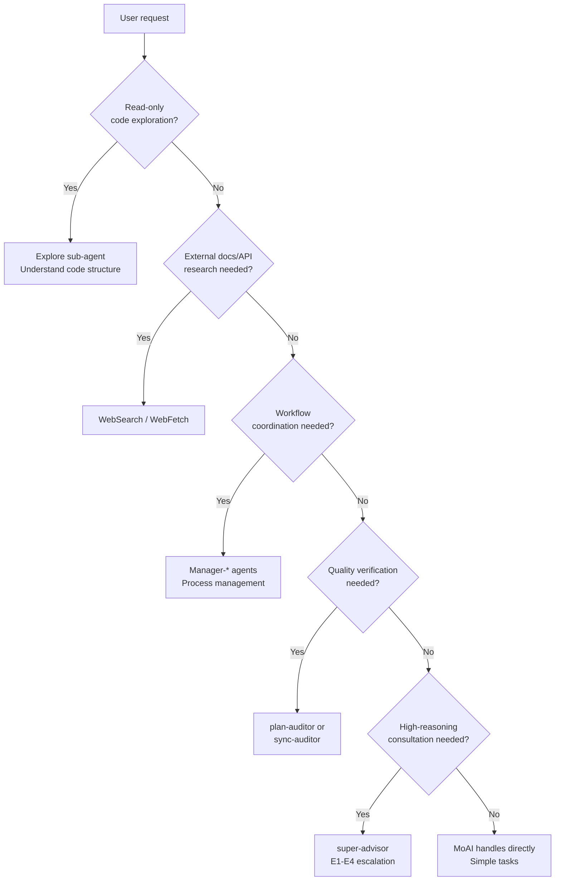
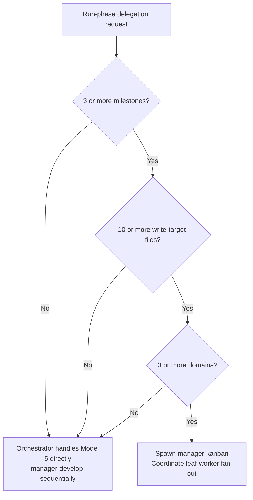
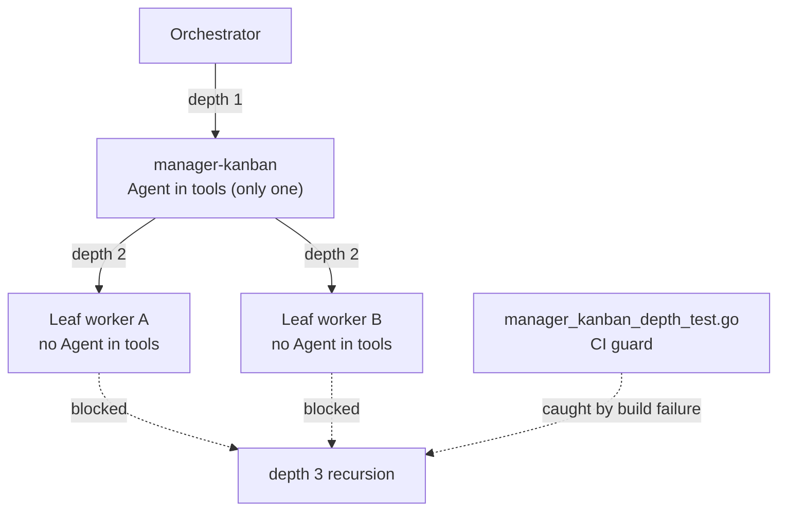
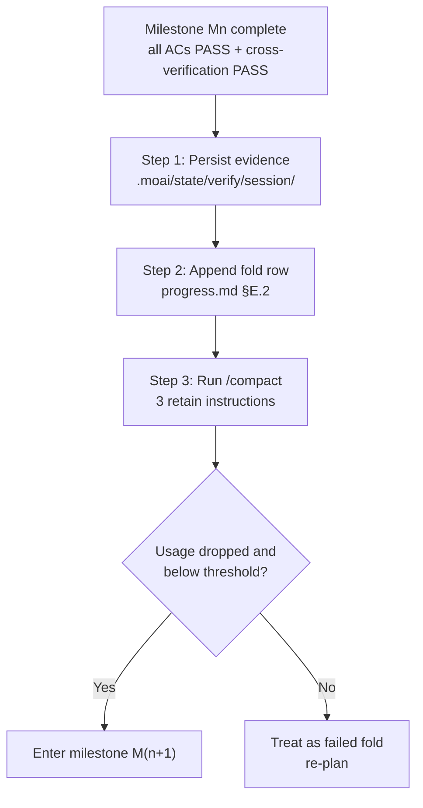
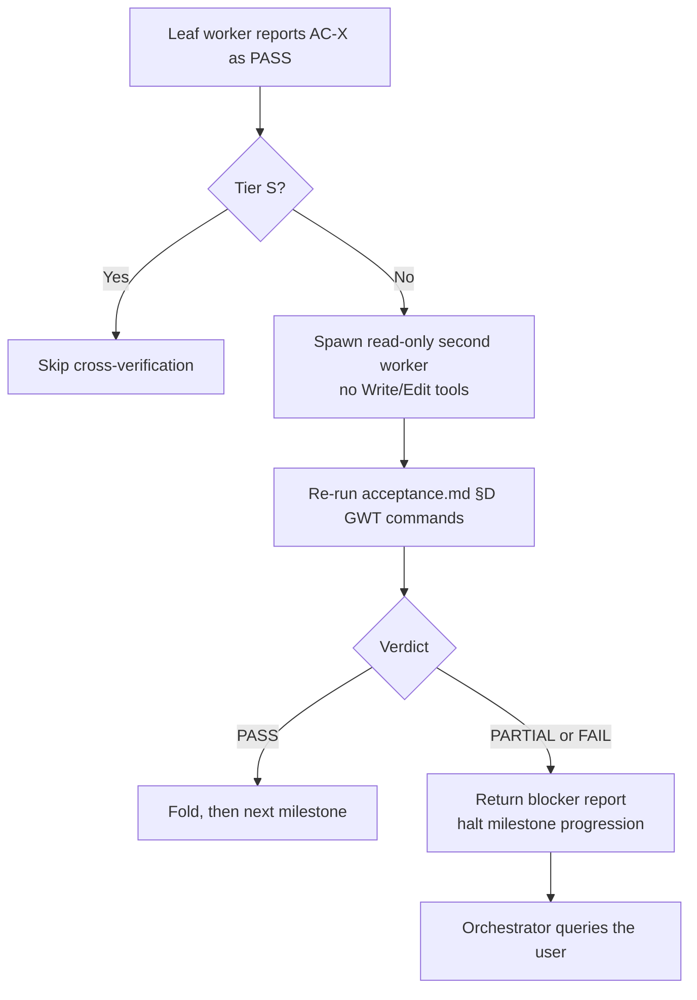

A detailed guide to the catalog of 12 core agents in MoAI-ADK v3.0.


**One-line summary**: Agents are a **team of specialists**, one for each field. MoAI, as team leader, distributes work to the right specialist — and the agent that authors a plan is always separated from the agent that audits it.



Background on the platform layer is in [Subagents](/en/claude-code/agentic/sub-agents). This page is the MoAI-ADK account of it.


## What Is an Agent?

An agent is an **AI task performer** specialized in a particular field.

Built on Claude Code's **Sub-agent** system, each agent has an independent context window, a custom system prompt, specific tool access, and independent permissions.

In a company analogy, MoAI is the CEO, Manager agents are department heads, Evaluator agents are quality inspectors, the Builder agent is the new-team creation officer, and the Advisor agent is an external consultant.

The agent count was refined over the v3 period from 22 → 17 → 8 → 10 → **11**. More agents is not better — every delegation carries a context cost, so shrinking the catalog is itself part of tokenomics.

## The MoAI Orchestrator

MoAI is the **top-level coordinator** of MoAI-ADK. It analyzes user requests and delegates work to the appropriate agents.

### MoAI's Core Rules

| Rule | Description |
|------|------|
| Delegation only | Complex work is delegated to specialist agents rather than performed directly |
| Sole user channel | Only MoAI interacts with the user (sub-agents cannot) |
| Parallel execution | Independent read-only tasks are delegated to multiple agents simultaneously |
| Result consolidation | Agent execution results are aggregated and reported to the user |

## The 12-Agent Core Catalog

MoAI-ADK uses **12 core agents** (11 MoAI custom + 1 Anthropic built-in).

### Manager Agents (6)

| Agent | Role | Phase | Model / effort | Key skills |
|----------|------|------|---------------|----------|
| `manager-spec` | SPEC document creation, GEARS-format requirements | Plan | inherit / medium  | `moai-workflow-spec` |
| `manager-develop` | DDD/TDD/autofix cycle implementation (cycle_type in quality.yaml) | Run | inherit / medium  | `moai-workflow-ddd`, `moai-workflow-tdd` |
| `manager-docs` | Documentation generation, CHANGELOG, README sync | Sync | inherit / low  | `moai-workflow-project` |
| `manager-git` | PR creation, Git branching, merge strategy | PR (Tier L) | sonnet / low  | `moai-foundation-core` |
| `manager-design` | Claude Design bidirectional collaboration (D1-D5 pipeline) | Design | inherit / medium  | `moai-foundation-core` |
| `manager-kanban` | Hierarchical-team Tier L coordination (sole Agent-carrier, depth-2 sealed) | Run (Tier L) | inherit / xhigh  | `moai-foundation-core`, `moai-workflow-project` |

### Evaluator Agents (2)

| Agent | Role | Evaluates | Model / effort | Key skills |
|----------|------|---------|---------------|----------|
| `plan-auditor` | Independent plan-phase audit, GEARS compliance, bias prevention | SPEC completeness | inherit / medium  | `moai-foundation-core`, `moai-foundation-thinking` |
| `sync-auditor` | Sync-phase quality scoring (4 dimensions: Functionality, Security, Craft, Consistency) | Implementation quality | inherit / medium  | `moai-foundation-quality`, `moai-foundation-core` |

The key point is that planning and auditing are separated — the one who built it does not inspect their own work. Audit agents approach with a skeptical (fresh-judgment) stance — doubting every claim until evidence appears, and accepting only reproducible results rather than "it seems to pass." Scores are computed as the harmonic mean rather than the simple average, so if one dimension collapses, the overall score falls with it. This design upholds the reliability of the TRUST 5 quality framework.

### Builder Agent (1)

| Agent | Role | Model / effort | Produces |
|----------|------|---------------|--------|
| `builder-harness` | Creates project-specific dynamic specialist teams (based on a Socratic interview) | inherit / medium  | `.claude/agents/harness/`, `.moai/harness/manifest.json` |

### Advisor Agent (1)

| Agent | Role | Model / effort | Characteristics |
|----------|------|---------------|------|
| `super-advisor` | High-reasoning consultation — deadlocks, design decision points, second opinions (E1-E4 escalation) | inherit / high  | Non-binding prescriptions — the orchestrator makes the final call |

### Specialist Agent (1)

| Agent | Role | Model / effort | Characteristics |
|----------|------|---------------|------|
| `e2e-tester` | E2E test execution across web/mobile/desktop (journey scripting, CLI-first suite runs, artifact management) | inherit / low  | Execution owner of the `/moai e2e` workflow — selection questions stay with the orchestrator |

### Built-in Agent (1, Anthropic)

| Agent | Role | Model / effort | Characteristics |
|----------|------|---------------|------|
| `Explore` | Read-only code exploration and analysis | sonnet / low (call-time default) | Read-only tools; no agent file on disk, so effort is stated in the spawn prompt rather than pinned |


**4-tier token-cost tiers** ( max ·  high ·  medium ·  low): `model: inherit` inherits the parent session model, and effort determines the reasoning-token budget.

The values above are the **shipped frontmatter**, which is pinned to the `medium` column of the [profile matrix](/en/advanced/profile-matrix/) so a fresh deployment matches the default profile. Switching the profile rewrites these values — under `high`, `manager-develop` and `super-advisor` move to `max` (the only two cells that use it), and under `low` the agentic rows drop to `low` while `manager-docs` and `e2e-tester` fall back to Sonnet. Inspect the resolved values for the active profile with `moai model profile`.


## Manager-Develop Domain Context Injection

Rather than keeping one agent per domain, a single `manager-develop` is invoked with domain-specific context injected.

- **Backend work**: `manager-develop` + backend domain context + the `moai-domain-backend` skill
- **Frontend work**: `manager-develop` + frontend domain context + the `moai-domain-frontend` skill
- **Other domains**: per-language skills + expertise prompts

## Agent Selection Decision Tree

The process by which MoAI analyzes a user request and selects the appropriate agent.


```mermaid
flowchart TD
    START[User request] --> Q1{Read-only<br>code exploration?}

    Q1 -->|Yes| EXPLORE["Explore sub-agent<br>Understand code structure"]
    Q1 -->|No| Q2{External docs/API<br>research needed?}

    Q2 -->|Yes| WEB["WebSearch / WebFetch"]
    Q2 -->|No| Q3{Workflow<br>coordination needed?}

    Q3 -->|Yes| MANAGER["Manager-* agents<br>Process management"]
    Q3 -->|No| Q4{Quality verification<br>needed?}

    Q4 -->|Yes| EVAL["plan-auditor or<br>sync-auditor"]
    Q4 -->|No| Q5{High-reasoning<br>consultation needed?}

    Q5 -->|Yes| ADVISOR["super-advisor<br>E1-E4 escalation"]
    Q5 -->|No| DIRECT["MoAI handles directly<br>Simple tasks"]
```

## Hierarchical Teams — How manager-kanban Works

`manager-kanban` is a dedicated agent for coordinating Tier L run phases. It writes no code itself. Instead, it splits the work into milestones, hands each one to a leaf worker, then folds context and runs cross-verification at every milestone boundary. Leaf workers are created on demand via `Agent(general-purpose)` and run on worktree-isolated branches so their write surfaces never overlap.

This delegation path is a variant of Mode 5 (sequential sub-agents), not a new execution mode. It is also unrelated to the retired Agent Teams static layer — the Mode 3 tombstone and the `MODE_TEAM_UNAVAILABLE` behavior are unchanged.

### Entry Conditions — All Three Must Hold

The orchestrator spawns `manager-kanban` only when **all** three conditions below hold. If any one falls short, the orchestrator processes the milestones sequentially itself in Mode 5. Attaching `manager-kanban` to work that does not meet the bar only adds coordination cost that is never recovered.

| Axis | Threshold |
|------|-----------|
| Milestone count | 3 or more in the plan.md §F milestone list |
| File surface | 10 or more write targets across all milestones |
| Domain span | 3 or more distinct domains (e.g. backend + frontend + devops) |

The three conditions are AND, not OR. The thresholds are deliberately narrow so that work touching only one axis — a single-milestone 10-file refactor, for instance — is not pulled in. The orchestrator records its finding that all three conditions are satisfied in `progress.md` § Mode Selection before spawning.


```mermaid
flowchart TD
    START["Run-phase delegation request"] --> Q1{"3 or more milestones?"}
    Q1 -->|"No"| MODE5["Orchestrator handles Mode 5 directly<br>manager-develop sequentially"]
    Q1 -->|"Yes"| Q2{"10 or more write-target files?"}
    Q2 -->|"No"| MODE5
    Q2 -->|"Yes"| Q3{"3 or more domains?"}
    Q3 -->|"No"| MODE5
    Q3 -->|"Yes"| LEAD["Spawn manager-kanban<br>Coordinate leaf-worker fan-out"]
```

### The depth-2 Seal

`manager-kanban` is the **only** catalog agent that carries `Agent` in its `tools:` list. Every other agent omits `Agent`, which is how the flat hierarchy is maintained — and this is the single place where that exception is opened, one layer deep. So orchestrator → `manager-kanban` is depth 1, `manager-kanban` → leaf worker is depth 2, and no depth 3 is ever created.

Leaf workers receive their `tools:` list at spawn time, and `Agent` is always excluded from it. Should leaf workers later be defined as files, declaring themselves via the frontmatter field `leaf_of: manager-kanban` or the body marker `<!-- manager-kanban leaf-worker -->` makes the CI guard in `internal/template/manager_kanban_depth_test.go` check that file's `tools:` for `Agent` and fail the build if it is present.


This seal is a **MoAI policy invariant, not a runtime invariant**. The Claude Code runtime itself permits deeper recursion — nested spawning is enabled by default as of v2.1.219, with a default depth ceiling of 3. Since the runtime will not stop it, the only two things actually holding the depth are the practice of omitting `Agent` from `tools:` and the CI guard above.



```mermaid
flowchart TD
    ORCH["Orchestrator"] -->|"depth 1"| LEAD["manager-kanban<br>Agent in tools (only one)"]
    LEAD -->|"depth 2"| W1["Leaf worker A<br>no Agent in tools"]
    LEAD -->|"depth 2"| W2["Leaf worker B<br>no Agent in tools"]
    W1 -.->|"blocked"| X["depth 3 recursion"]
    W2 -.->|"blocked"| X
    GUARD["manager_kanban_depth_test.go<br>CI guard"] -.->|"caught by build failure"| X
```

### Context Folding in Three Steps

Once every AC row for milestone Mn is PASS and the cross-verification of those rows also comes back PASS, `manager-kanban` takes three steps before moving to the next milestone. The procedure **composes only existing tooling** — it introduces no new Go code, no new hooks, and no new CLI subcommands.

1. **Persist evidence** — redirect each AC's verification command output to `.moai/state/verify/<session>/M<n>.<AC-id>.{log,out}`. `/tmp` is not used because the OS clears it. The cited evidence is valid only if that path actually opens at audit time. An AC whose evidence could not be captured is marked `GAP`, not `PASS`.
2. **Append a fold row** — add one line to `progress.md` §E.2 in the existing row format: `M<n>: <AC-id-1>=PASS, ... | evidence: .moai/state/verify/<session>/M<n>.* | fold-at: <ISO-8601>`. The `M<n>:` prefix was chosen so it does not collide with the §E heading matcher in `internal/spec/era.go`, letting the two coexist without touching the matcher.
3. **Run `/compact`** — compact with explicit retain instructions: retain-current-milestone (the milestone just finished and its fold row), retain-fold-rows (every earlier fold row in §E.2), and retain-armed-goal (the condition armed via `/moai goal`, if any).

Two invariants hold after the fold: post-compaction token usage must be lower than it was before compaction, and it must simultaneously sit below the model-specific handoff threshold (50% for the 1M class, 90% for the 200K/256K class). If it did not drop, treat the fold as failed and re-plan. When `/compact` is unavailable in a sub-agent context, return a blocker report so the orchestrator can compact on its behalf or route around it via `/clear` plus a resume message.


```mermaid
flowchart TD
    MN["Milestone Mn complete<br>all ACs PASS + cross-verification PASS"] --> S1["Step 1: Persist evidence<br>.moai/state/verify/session/"]
    S1 --> S2["Step 2: Append fold row<br>progress.md §E.2"]
    S2 --> S3["Step 3: Run /compact<br>3 retain instructions"]
    S3 --> CHECK{"Usage dropped and<br>below threshold?"}
    CHECK -->|"Yes"| NEXT["Enter milestone M(n+1)"]
    CHECK -->|"No"| REPLAN["Treat as failed fold<br>re-plan"]
```

### Peer Cross-Verification

When a leaf worker marks an AC as PASS, `manager-kanban` spawns a second read-only `Agent(general-purpose)` that **did not do that work**. Read-only is enforced by omitting Write/Edit/NotebookEdit from its `tools:`. That worker re-runs the Given-When-Then commands from `acceptance.md` §D verbatim and returns one of `PASS` / `PARTIAL` / `FAIL`.

The second worker has no stake in the author's claim. That is what exposes self-report failures such as miscounting a grep result, citing a stale baseline, or skipping one verification command.

On `FAIL` or `PARTIAL`, `manager-kanban` does not advance to the next milestone. It returns a blocker report to the orchestrator carrying the AC ID, the evidence the author offered, the cross-verifying worker's evidence, and the point where the two diverged. Asking the user is the orchestrator's job — sub-agents do not use the user channel. Tier S skips cross-verification (the scope is small enough that verification costs more than it returns).

The role differs from `sync-auditor` in the sync phase. `sync-auditor` is a final skeptical read that scores four dimensions after implementation is done; peer cross-verification is a binary verdict attached to each individual AC during implementation. Neither substitutes for the other.


```mermaid
flowchart TD
    AUTHOR["Leaf worker reports AC-X as PASS"] --> TIER{"Tier S?"}
    TIER -->|"Yes"| SKIP["Skip cross-verification"]
    TIER -->|"No"| PEER["Spawn read-only second worker<br>no Write/Edit tools"]
    PEER --> RERUN["Re-run acceptance.md §D GWT commands"]
    RERUN --> VERDICT{"Verdict"}
    VERDICT -->|"PASS"| NEXT["Fold, then next milestone"]
    VERDICT -->|"PARTIAL or FAIL"| BLOCK["Return blocker report<br>halt milestone progression"]
    BLOCK --> ORCH["Orchestrator queries the user"]
```

## Agent Definition Files

The 10 MoAI custom agents are defined as markdown files in the `.claude/agents/moai/` directory.

### File Structure

```
.claude/agents/moai/
├── manager-spec.md
├── manager-develop.md
├── manager-docs.md
├── manager-git.md
├── manager-design.md
├── plan-auditor.md
├── sync-auditor.md
├── builder-harness.md
├── super-advisor.md
├── e2e-tester.md
└── (Explore: Anthropic built-in, no file)
```

### Agent Definition Format

```markdown
---
name: my-specialist
description: >
  A specialist for this project. Describe the specific domain expertise.
tools: Read, Write, Edit, Grep, Glob, Bash
model: inherit
---

You are this project's [domain] specialist.

## Role

- Responsibility 1
- Responsibility 2
- Responsibility 3

## Skills Used

- moai-domain-[domain]
- Language-specific skills
```

## Inter-Agent Collaboration Patterns

### The Plan-Run-Sync Sequential Workflow

The most fundamental collaboration flow. An independent audit is inserted between each phase.

```bash
# 1. manager-spec creates the SPEC
/moai plan "feature description"

# 2. plan-auditor validates SPEC quality
# (runs automatically)

# 3. manager-develop implements with DDD/TDD
/moai run SPEC-XXX

# 4. sync-auditor scores quality across 4 dimensions
# (runs automatically)

# 5. manager-docs synchronizes documentation
/moai sync SPEC-XXX
```

## Sub-agent System Fundamentals

Claude Code's official Sub-agent system is the foundation of the MoAI-ADK agent architecture.

### Sub-agent Characteristics

| Characteristic | Description |
|------|------|
| **Independent context** | Each sub-agent runs in its own model-dependent context window (model-dependent — 1M-class models also exist) |
| **Custom prompt** | Role and behavior defined via a specialized system prompt |
| **Specific tool access** | Only the necessary tools are selectively provided |
| **Independent permissions** | Individual permission modes can be configured |

### Sub-agent Constraints

| Constraint | Description |
|------|------|
| Nested sub-agent limits | Nested sub-agent spawning is governed by whether the `Agent` tool is allowed — MoAI agents do not nest |
| AskUserQuestion restriction | Sub-agents cannot interact with the user directly (they return blocker reports instead) |
| No skill inheritance | Skills from the parent conversation are not inherited |
| Independent context | Each agent has its own model-dependent independent context window (model-dependent) |

## Agent Teams Static Layer — Retired in v3.0

The Agent Teams static orchestration layer from earlier versions (the `workflow.team.*` settings and the `--team` force flag) was **retired** in v3.0.0.

- Forcing `--team` announces `MODE_TEAM_UNAVAILABLE` and automatically falls back to sub-agent mode.
- Research and review work that needs parallelism is handled with parallel sub-agent fan-out; sequential coding work is handled with a sub-agent chain.
- The native Claude Code teammate runtime (the GLM panes of `moai cg`, `moai worktree --team`) continues to operate independently of this — from a tokenomics standpoint, CG mode's Claude-leader + GLM-worker division of labor takes over this role.

## Related Documents

- [Builder Agents and Harness v4](/en/advanced/builder-agents) - dynamic agent team creation
- [Skill Guide](/en/advanced/skill-guide) - the skill system agents draw on
- [SPEC-Based Development](/en/workflow-commands/moai-plan) - SPEC workflow details


**Tip**: You do not need to specify agents directly. Ask MoAI in natural language and Analyze-First routing will analyze your intent and automatically select the optimal agent.

