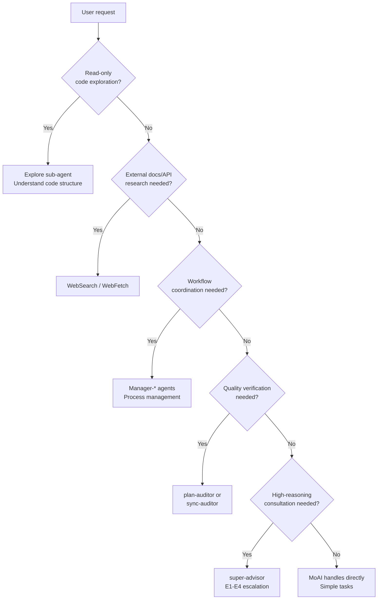

A detailed guide to the catalog of 10 core agents in MoAI-ADK v3.0.


**One-line summary**: Agents are a **team of specialists**, one for each field. MoAI, as team leader, distributes work to the right specialist — and the agent that authors a plan is always separated from the agent that audits it.


## What Is an Agent?

An agent is an **AI task performer** specialized in a particular field.

Built on Claude Code's **Sub-agent** system, each agent has an independent context window, a custom system prompt, specific tool access, and independent permissions.

In a company analogy, MoAI is the CEO, Manager agents are department heads, Evaluator agents are quality inspectors, the Builder agent is the new-team creation officer, and the Advisor agent is an external consultant.

The agent count was refined over the v3 period from 22 → 17 → 8 → **10**. More agents is not better — every delegation carries a context cost, so shrinking the catalog is itself part of tokenomics.

## The MoAI Orchestrator

MoAI is the **top-level coordinator** of MoAI-ADK. It analyzes user requests and delegates work to the appropriate agents.

### MoAI's Core Rules

| Rule | Description |
|------|------|
| Delegation only | Complex work is delegated to specialist agents rather than performed directly |
| Sole user channel | Only MoAI interacts with the user (sub-agents cannot) |
| Parallel execution | Independent read-only tasks are delegated to multiple agents simultaneously |
| Result consolidation | Agent execution results are aggregated and reported to the user |

## The 10-Agent Core Catalog

MoAI-ADK uses **10 core agents** (9 MoAI custom + 1 Anthropic built-in).

### Manager Agents (5)

| Agent | Role | Phase | Key skills |
|----------|------|------|----------|
| `manager-spec` | SPEC document creation, GEARS-format requirements | Plan | `moai-workflow-spec` |
| `manager-develop` | DDD/TDD/autofix cycle implementation (cycle_type in quality.yaml) | Run | `moai-workflow-ddd`, `moai-workflow-tdd` |
| `manager-docs` | Documentation generation, CHANGELOG, README sync | Sync | `moai-workflow-project` |
| `manager-git` | PR creation, Git branching, merge strategy | PR (Tier L) | `moai-foundation-core` |
| `manager-design` | Claude Design bidirectional collaboration (D1-D5 pipeline) | Design | `moai-foundation-core` |

### Evaluator Agents (2)

| Agent | Role | Evaluates | Key skills |
|----------|------|---------|----------|
| `plan-auditor` | Independent plan-phase audit, GEARS compliance, bias prevention | SPEC completeness | `moai-foundation-core`, `moai-foundation-thinking` |
| `sync-auditor` | Sync-phase quality scoring (4 dimensions: Functionality, Security, Craft, Consistency) | Implementation quality | `moai-foundation-quality`, `moai-foundation-core` |

The key point is that planning and auditing are separated — the one who built it does not inspect their own work.

### Builder Agent (1)

| Agent | Role | Produces |
|----------|------|--------|
| `builder-harness` | Creates project-specific dynamic agent teams (based on a Socratic interview) | `.claude/agents/harness/`, `.moai/harness/manifest.json` |

### Advisor Agent (1)

| Agent | Role | Characteristics |
|----------|------|------|
| `super-advisor` | High-reasoning consultation — deadlocks, design decision points, second opinions (E1-E4 escalation) | Non-binding prescriptions — the orchestrator makes the final call |

### Built-in Agent (1, Anthropic)

| Agent | Role | Characteristics |
|----------|------|------|
| `Explore` | Read-only code exploration and analysis | Haiku model, read-only tools |

## Manager-Develop Domain Context Injection

Rather than keeping one agent per domain, a single `manager-develop` is invoked with domain-specific context injected.

- **Backend work**: `manager-develop` + backend domain context + the `moai-domain-backend` skill
- **Frontend work**: `manager-develop` + frontend domain context + the `moai-domain-frontend` skill
- **Other domains**: per-language skills + expertise prompts

## Agent Selection Decision Tree

The process by which MoAI analyzes a user request and selects the appropriate agent.


```mermaid
flowchart TD
    START[User request] --> Q1{Read-only<br>code exploration?}

    Q1 -->|Yes| EXPLORE["Explore sub-agent<br>Understand code structure"]
    Q1 -->|No| Q2{External docs/API<br>research needed?}

    Q2 -->|Yes| WEB["WebSearch / WebFetch"]
    Q2 -->|No| Q3{Workflow<br>coordination needed?}

    Q3 -->|Yes| MANAGER["Manager-* agents<br>Process management"]
    Q3 -->|No| Q4{Quality verification<br>needed?}

    Q4 -->|Yes| EVAL["plan-auditor or<br>sync-auditor"]
    Q4 -->|No| Q5{High-reasoning<br>consultation needed?}

    Q5 -->|Yes| ADVISOR["super-advisor<br>E1-E4 escalation"]
    Q5 -->|No| DIRECT["MoAI handles directly<br>Simple tasks"]
```

## Agent Definition Files

The 9 MoAI custom agents are defined as markdown files in the `.claude/agents/moai/` directory.

### File Structure

```
.claude/agents/moai/
├── manager-spec.md
├── manager-develop.md
├── manager-docs.md
├── manager-git.md
├── manager-design.md
├── plan-auditor.md
├── sync-auditor.md
├── builder-harness.md
├── super-advisor.md
└── (Explore: Anthropic 내장, 파일 없음)
```

### Agent Definition Format

```markdown
---
name: my-specialist
description: >
  이 프로젝트의 전문가. 특정 도메인 전문성 설명.
tools: Read, Write, Edit, Grep, Glob, Bash
model: inherit
---

당신은 이 프로젝트의 [도메인] 전문가입니다.

## 역할

- 책임 1
- 책임 2
- 책임 3

## 사용 스킬

- moai-domain-[domain]
- 언어별 스킬
```

## Inter-Agent Collaboration Patterns

### The Plan-Run-Sync Sequential Workflow

The most fundamental collaboration flow. An independent audit is inserted between each phase.

```bash
# 1. manager-spec이 SPEC 생성
/moai plan "기능 설명"

# 2. plan-auditor가 SPEC 품질 검증
# (자동 실행)

# 3. manager-develop이 DDD/TDD 구현
/moai run SPEC-XXX

# 4. sync-auditor가 4차원 품질 점수
# (자동 실행)

# 5. manager-docs가 문서 동기화
/moai sync SPEC-XXX
```

## Sub-agent System Fundamentals

Claude Code's official Sub-agent system is the foundation of the MoAI-ADK agent architecture.

### Sub-agent Characteristics

| Characteristic | Description |
|------|------|
| **Independent context** | Each sub-agent runs in its own 200K-token context window |
| **Custom prompt** | Role and behavior defined via a specialized system prompt |
| **Specific tool access** | Only the necessary tools are selectively provided |
| **Independent permissions** | Individual permission modes can be configured |

### Sub-agent Constraints

| Constraint | Description |
|------|------|
| Nested sub-agent limits | Nested sub-agent spawning is governed by whether the `Agent` tool is allowed — MoAI agents do not nest |
| AskUserQuestion restriction | Sub-agents cannot interact with the user directly (they return blocker reports instead) |
| No skill inheritance | Skills from the parent conversation are not inherited |
| Independent context | Each agent has its own independent 200K-token context |

## Agent Teams Static Layer — Retired in v3.0

The Agent Teams static orchestration layer from earlier versions (the `workflow.team.*` settings and the `--team` force flag) was **retired** in v3.0.0-rc11.

- Forcing `--team` announces `MODE_TEAM_UNAVAILABLE` and automatically falls back to sub-agent mode.
- Research and review work that needs parallelism is handled with parallel sub-agent fan-out; sequential coding work is handled with a sub-agent chain.
- The native Claude Code teammate runtime (the GLM panes of `moai cg`, `moai worktree --team`) continues to operate independently of this — from a tokenomics standpoint, CG mode's Claude-leader + GLM-worker division of labor takes over this role.

## Related Documents

- [Builder Agents and Harness v4](/en/advanced/builder-agents) - dynamic agent team creation
- [Skill Guide](/en/advanced/skill-guide) - the skill system agents draw on
- [SPEC-Based Development](/en/workflow-commands/moai-plan) - SPEC workflow details


**Tip**: You do not need to specify agents directly. Ask MoAI in natural language and Analyze-First routing will analyze your intent and automatically select the optimal agent.

