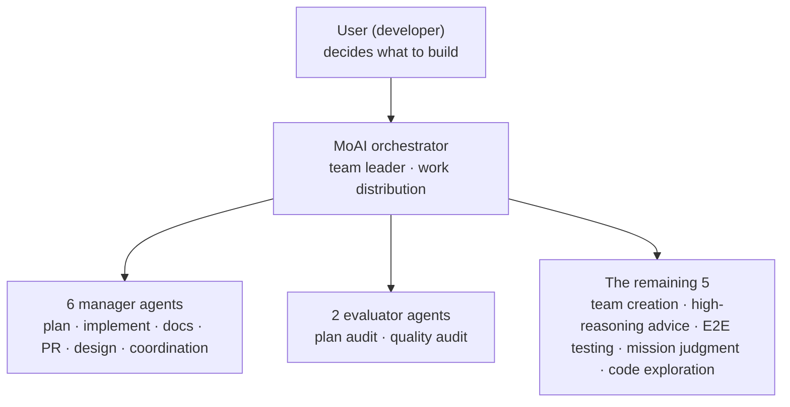
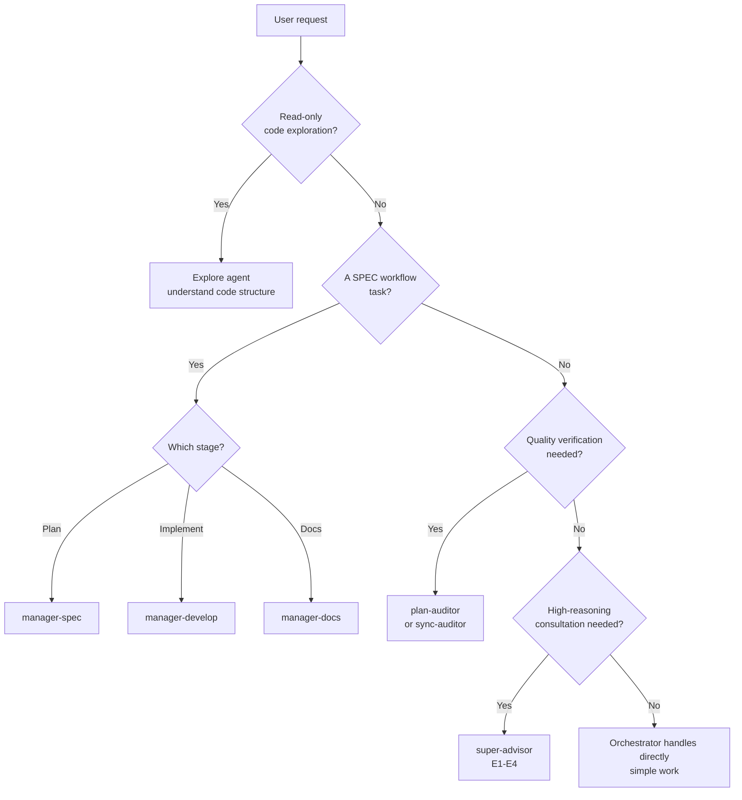
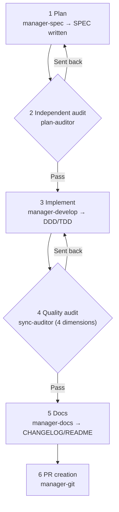
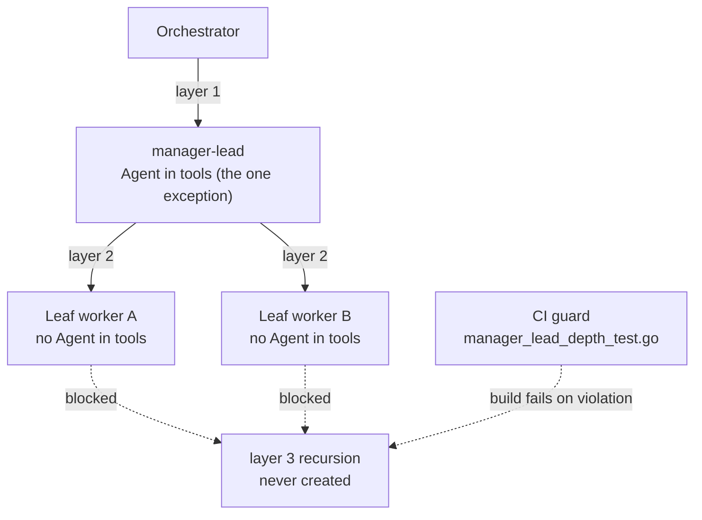

This page walks through the 13-agent (self-directed AI helpers) catalog MoAI-ADK uses, step by step from the ground up. It untangles "what an agent is, why there are several, and how they collaborate" clearly enough to explain to a friend.


**One-line summary**: Agents are specialists in their own fields. MoAI, as the team leader, hands work to the right specialist — and **the agent that authors a plan is always a different agent from the one that audits it**. The design exists so the maker never grades their own work.


## What Is an Agent?

An agent is an AI task performer specialized in a specific field. Instead of one big AI doing everything, MoAI-ADK splits the work across multiple agents matched to the nature of the task, each with its own context window (memory space), system instructions, and tool permissions.

Mapped onto a company, the structure falls into place naturally. The user is the owner deciding the product, the MoAI orchestrator (the central coordinator of all work) is the team leader, the manager agents are department heads, and the evaluator agents are quality inspectors. This analogy carries straight into the structure.

```mermaid
flowchart TD
    USER["User (developer)<br>decides what to build"] --> MOAI["MoAI orchestrator<br>team leader · work distribution"]
    MOAI --> MGR["6 manager agents<br>plan · implement · docs · PR · design · coordination"]
    MOAI --> EVAL["2 evaluator agents<br>plan audit · quality audit"]
    MOAI --> ETC["The remaining 5<br>team creation · high-reasoning advice · E2E testing · mission judgment · code exploration"]
```

Every agent runs on Claude Code's Sub-agent system. Each sub-agent gets an independent context window, a custom system prompt, a selected toolset, and separate permissions. MoAI-ADK places its 13 specialist roles on top of this foundation.

## Why Multiple Agents?

One agent handling everything looks convenient, but in practice quality and cost collapse together.

First, **quality**. If the agent that authored a plan also judges whether the plan turned out well, it goes easy on its own work. Humans are the same — proofreading your own writing hides the errors. That is why MoAI-ADK separates the manager family (planning and implementation) from the evaluator family (inspection) at the design stage.

Second, **cost**. Each agent fills a fresh context and runs its own reasoning, so every delegation costs tokens. "More is better" does not hold. The catalog was refined over the v3 cycle from 22 → 17 → 8 → 10 → 12 → 13, and is now kept at the minimum where the roles do not overlap. Shrinking the agent count is itself part of tokenomics (spending tokens wisely).


Four words this page uses constantly, up front.

- **Agent** (a self-directed AI helper) — the AI performer charged with a specific field's work
- **Harness** (the automated quality apparatus) — the rules and gates that keep agents working well
- **Skill** (a bundle of reusable task instructions) — the domain knowledge an agent calls in and uses
- **SPEC** (a requirements specification) — the document that says what to build, why, and how


## The MoAI Orchestrator — Team Leader

The MoAI orchestrator is the top-level coordinator: it receives the user's request, analyzes intent (Analyze-First routing), delegates work to the right agents, then collects the results and reports back. Its core rule is not to do complex work itself but to delegate it.

| Rule | What it does |
|------|--------|
| Delegation only | Complex work goes to specialist agents |
| Single channel | Only the orchestrator talks to the user; sub-agents never address the user |
| Parallel execution | Independent read-only work is delegated to several agents at once |
| Result consolidation | Agent results are gathered and reported to the user |

Which agent the orchestrator calls is defaulted by the delegation map in `.moai/config/sections/delegation.yaml`. The map is a default, not a barrier — the orchestrator can judge from the work's context and change it.

## The 13-Agent Catalog

MoAI-ADK runs **13 agents** (12 MoAI custom + 1 Anthropic built-in `Explore`). Here is the full list, grouped by role.

### Manager Agents — 6

The workhorses that produce the actual deliverables. Each owns one stage of the SPEC workflow.

| Agent | Role | Stage |
|----------|--------|------|
| `manager-spec` | Writes the SPEC document, shapes requirements into rule-conforming form | Plan |
| `manager-develop` | Implements code through DDD/TDD/autofix cycles | Implement |
| `manager-docs` | CHANGELOG · README · frontmatter synchronization | Docs |
| `manager-git` | PR creation, branch strategy, merges | PR |
| `manager-design` | Exchanges design back and forth with the design tools | Design |
| `manager-lead` | Coordinates Tier L-scale implementation milestone by milestone | Implement (Tier L) |

### Evaluator Agents — 2

An agent other than the maker does the inspection. This separation is the backbone of quality.

| Agent | What it evaluates | When |
|----------|----------|------|
| `plan-auditor` | SPEC completeness, requirements-rule compliance, bias | Right after planning |
| `sync-auditor` | 4-dimension implementation quality score (functionality · security · craft · consistency) | Docs stage |

### Builder · Advisor · Specialist Agents — 4

| Agent | Role |
|----------|--------|
| `builder-harness` | Builds project-specific dynamic agent teams (from a user interview) |
| `super-advisor` | High-reasoning consultation — deadlocks, design decision points, second opinions (E1-E4 escalation) |
| `e2e-tester` | Runs web/mobile/desktop E2E tests |
| `mission-governor` | Reads the sealed snapshot of an approved GTD auto mission and returns exactly one structured decision (read-only) |

`mission-governor` returns a decision and **does not execute anything itself**. It writes no files, runs no shell or Git commands, touches no queue, dispatches no work to lanes, and performs no commits, merges, approvals, or audit verdicts. The side that inspects the returned decision and actually changes state is a deterministic executor (an automated handler that moves only along fixed rules). Its tool list is just four — `Read`, `Grep`, `Glob`, `Skill` — and it returns a blocker decision whenever a request falls outside the sealed scope, or the evidence it needs to judge is missing or stale.


`mission-governor` **deliberately has no place** in the [Agent Selection Decision Tree](#agent-selection-decision-tree) below. It is not an agent the orchestrator picks and calls; it is a decision role the GTD auto-mission workflow invokes directly. Its absence from the tree is by design, not an omission.


### Built-in Agent — 1

| Agent | Role |
|----------|--------|
| `Explore` | Read-only code exploration · analysis (Anthropic built-in, no file) |


The old way of assigning each agent a model and effort has retired. **Subagents follow the main session's model and reasoning depth as-is** — you pass neither `model` nor `effort` when calling a subagent, and MoAI agent definitions declare neither. Change the session's effort (`/effort`, `ultrathink`) and every agent in that session follows.


## The Separation of Planning and Auditing — Why the Maker Does Not Inspect

This principle is the design philosophy running through the whole catalog. When `manager-spec` writes a plan, `plan-auditor` inspects it in a separate context; when `manager-develop` finishes an implementation, `sync-auditor` assigns the 4-dimension score. Because the building agent and the auditing agent differ, self-report failures — miscounting grep results, citing a stale baseline, skipping one verification step — surface on the inspection side.

Audit agents approach with a fresh-judgment (skeptical) stance — doubting every claim until evidence appears, and accepting only reproducible results, never "seems to pass." Scores use a harmonic mean rather than a simple average, so when one dimension collapses the overall score falls with it. This design upholds the trust of the TRUST 5 quality framework.

## How Domain Expertise Comes In

There is no per-domain agent for backend, frontend, security, and so on. Instead, a single `manager-develop` is invoked with domain knowledge and skills injected to match the work's context.

- Backend work → `manager-develop` + backend context + the `moai-domain-backend` skill
- Frontend work → `manager-develop` + frontend context + the `moai-domain-frontend` skill
- Other domains → the language's skills + expertise instructions

This keeps the catalog small at 13 while filling domain depth through skill injection. Instead of growing the agent count and the token cost, you swap in skills (bundles of reusable task instructions).

## Agent Selection Decision Tree

How the orchestrator receives a request and decides which agent to call. Most of the time Analyze-First routing classifies on natural-language intent alone, so you rarely need to point at an agent yourself.

```mermaid
flowchart TD
    START["User request"] --> Q1{"Read-only<br>code exploration?"}
    Q1 -->|"Yes"| EXPLORE["Explore agent<br>understand code structure"]
    Q1 -->|"No"| Q2{"A SPEC workflow<br>task?"}
    Q2 -->|"Yes"| Q3{"Which stage?"}
    Q3 -->|"Plan"| SPEC["manager-spec"]
    Q3 -->|"Implement"| DEV["manager-develop"]
    Q3 -->|"Docs"| DOCS["manager-docs"]
    Q2 -->|"No"| Q4{"Quality verification<br>needed?"}
    Q4 -->|"Yes"| EV["plan-auditor<br>or sync-auditor"]
    Q4 -->|"No"| Q5{"High-reasoning<br>consultation needed?"}
    Q5 -->|"Yes"| ADV["super-advisor<br>E1-E4"]
    Q5 -->|"No"| DIRECT["Orchestrator handles directly<br>simple work"]
```

## Working Together — Plan-Run-Sync

The basic flow showing how the agents chain together. Independent audits insert themselves between stages — that is the point. You drive this flow with `/moai plan`, `/moai run`, and `/moai sync`.

```mermaid
flowchart TD
    PLAN["1 Plan<br>manager-spec → SPEC written"] --> A1{"2 Independent audit<br>plan-auditor"}
    A1 -->|"Sent back"| PLAN
    A1 -->|"Pass"| RUN["3 Implement<br>manager-develop → DDD/TDD"]
    RUN --> A2{"4 Quality audit<br>sync-auditor (4 dimensions)"}
    A2 -->|"Sent back"| RUN
    A2 -->|"Pass"| SYNC["5 Docs<br>manager-docs → CHANGELOG/README"]
    SYNC --> PR["6 PR creation<br>manager-git"]
```

A rejection at audit sends the work back one stage. This "going back" pays rework costs earlier — quality problems are caught right after each stage, not right before the PR. That is what stops the same mistake from flowing into the next stage and becoming expensive.

## Retired Agents and the Rejection Rule

Names of agents from the past may survive in old documents or copied messages. The following 12 names are **retired (archived)**, and spawning them is rejected.

`manager-strategy`, `manager-quality`, `manager-brain`, `manager-project`, `claude-code-guide` (MoAI custom file only), `researcher`, `expert-backend`, `expert-frontend`, `expert-security`, `expert-devops`, `expert-performance`, `expert-refactoring`.


**Caution**: if a resume message copied from an old session carries one of these names, the orchestrator refuses the spawn. In that case, run the same work on `Agent(general-purpose)` with domain instructions attached, or on one of the 13 current agents. The replacement paths are collected in `.claude/rules/moai/workflow/archived-agent-rejection.md`.


One point is easy to confuse. A Claude Code built-in helper shares its name with the retired MoAI custom file `claude-code-guide`. Calling the built-in helper is not rejected — the rejection applies to the MoAI custom file only.

## Hierarchical Teams — manager-lead

`manager-lead` is the dedicated agent that coordinates Tier L-scale implementation. It writes no code itself: it splits the work into milestones, hands each to leaf workers, then folds context and runs cross-verification at every milestone boundary. Leaf workers are created on demand via `Agent(general-purpose)` and run on worktree-isolated branches so their write surfaces never overlap.

### Only When All Three Conditions Hold

The orchestrator creates `manager-lead` only when **all (AND)** three conditions below hold. If any one falls short, the orchestrator processes the milestones sequentially itself — attaching a coordinator to work below the bar only adds cost that is never recovered.

| Condition | Bar |
|------|------|
| Milestone count | 3 or more |
| Write-target files | 10 or more |
| Domain span | 3 or more distinct domains (e.g. backend + frontend + devops) |

The three conditions are AND, not OR. The values are deliberately narrow so that work clearing only one condition — a single-milestone 10-file refactor, say — is not pulled in.

### The depth-2 Seal — Why the Hierarchy Opens Only Two Layers

Of the 13 agents, only `manager-lead` carries the `Agent` tool in its `tools:` list. Everyone else omits `Agent`, keeping the hierarchy flat. So orchestrator → `manager-lead` is layer 1, `manager-lead` → leaf workers is layer 2, and layer 3 never comes into existence.

```mermaid
flowchart TD
    ORCH["Orchestrator"] -->|"layer 1"| LEAD["manager-lead<br>Agent in tools (the one exception)"]
    LEAD -->|"layer 2"| W1["Leaf worker A<br>no Agent in tools"]
    LEAD -->|"layer 2"| W2["Leaf worker B<br>no Agent in tools"]
    W1 -.->|"blocked"| X["layer 3 recursion<br>never created"]
    W2 -.->|"blocked"| X
    GUARD["CI guard<br>manager_lead_depth_test.go"] -.->|"build fails on violation"| X
```


This seal is a **policy invariant, not a runtime invariant**. The Claude Code runtime itself permits deeper recursion — nested spawning has been enabled by default since v2.1.219, with a default depth ceiling of 3. So the only two things actually holding the depth are the practice of omitting `Agent` from `tools:`, and the CI guard that fails the build when a leaf worker file carries `Agent`.


### Context Folding and Cross-Verification

When one milestone ends, three steps run before moving on. First, each acceptance criterion's (AC) verification output is captured into machine-local scratch, and only the lines that decided the verdict are written into the tracked verdict file `.moai/reports/<card-id>/verdict.md` so they open at audit time — that verdict is the only tracked name under a card directory. Next, the progress record gains a one-line summary row naming that verdict. Finally, `/compact` compresses the context. Only when tokens drop after compaction and fall below the handoff threshold (50% for the 1M class, 90% for the 200K class) does the next milestone begin — if it did not drop, the fold is treated as failed and re-planned.

When a leaf worker marks an AC as PASS, a second worker that **did not do the work** is called in read-only (its `tools:` minus the write tools) and re-runs the same verification commands. The second worker has no stake in the result, so self-report failures surface as they are. If the verdicts diverge, the milestone stops and a blocker report goes back to the orchestrator — asking the user is the orchestrator's job. Tier S skips this step: its scope is small enough that cross-verification costs more than it returns.

This differs in role from the sync stage's `sync-auditor`. `sync-auditor` is the final skeptical read scoring four dimensions after implementation is done; peer cross-verification is the binary judgment attached to each AC during implementation. Neither substitutes for the other.

## Agent Definition Files

All 12 MoAI custom agents live as markdown files under `.claude/agents/moai/`. `Explore` is an Anthropic built-in, so it has no file on disk.


Each file is a YAML frontmatter plus a body. The frontmatter carries `name`, `description`, and `tools` (a CSV string); the body states the role, responsibilities, and skills used in prose. `model` and `effort` are not written — subagents follow the session's model and reasoning depth as-is, so an agent definition has no need to declare them. To create a new agent yourself, use the `builder-harness` agent or follow the agent-authoring rule (`.claude/rules/moai/development/agent-authoring.md`).


## Sub-agent System Fundamentals

The foundation of the MoAI-ADK agent structure is Claude Code's official sub-agent system.

| Trait | Description |
|------|------|
| Independent context | Each agent runs in its own model-dependent context window |
| Custom instructions | A specialized system prompt defines the role and behavior |
| Selected tools | Only the needed tools are picked |
| Separate permissions | Individual permission modes can be set |

Sub-agents cannot talk to the user directly — when required input is missing they return a blocker report, and the orchestrator asks the user and re-delegates with the answer. This boundary upholds the "single channel" rule.

## Sub-agent Tool Filtering — Two Stages

Which tools a sub-agent may use is decided not by one setting but by a two-stage filter: the static allowlist at spawn time is stage 1, and runtime deferred loading is stage 2.

**Stage 1 — the spawn-time static filter.** Every agent definition carries a `tools:` allowlist in its frontmatter (a CSV string, e.g. `tools: Read, Write, Edit`), and tools outside the list cannot be invoked. Read-only roles earn their restriction by shrinking this list itself — auditors and cross-verification workers drop the write tools (Write, Edit), removing the path that could modify a file. But this is narrowing, not sealing — if `Bash` remains on the list, writing can happen through it, so read-only must be judged by the absence of write capability, not the absence of tool names.

**Stage 2 — runtime deferred loading.** Some tools do not have their schema loaded at spawn time. `AskUserQuestion` (the tool that asks the user to choose) and the `Task*` (task-list management) family are like this. These deferred tools can be invoked only after their schema is explicitly loaded at the moment of need via a ToolSearch `select:` query — a second gate that narrows the field once more even among tools that passed stage 1.

Two rules emerge from these two stages combined.

| Rule | Content |
|------|------|
| User questions are orchestrator-only | `AskUserQuestion` is used by the orchestrator alone, and the runtime enforces this boundary. A sub-agent needing user input returns a structured blocker report instead of a prompt, and the orchestrator asks the user and re-delegates with the answer |
| Sweep sub-agents cannot ask either | Sub-agents of a dynamic workflow (sweep) run under the main session and cannot prompt the user. A needed question routes through the orchestrator's channel |

The earlier rule — sub-agents cannot talk to the user directly — is upheld at runtime by exactly this two-stage filter.

## Agent Teams Static Layer — Retired in v3.0, Re-allowed as Experimental

The earlier Agent Teams static orchestration layer (the `workflow.team.*` settings, the `--team` force flag) was retired in v3.0.0, then re-allowed as an experimental surface (selected only by an explicit `--team` request; never auto-selected). During the retirement era, forcing `--team` announced `MODE_TEAM_UNAVAILABLE` and fell back to sub-agent mode; that sentinel survives as documented history.

Parallel research and review run as parallel sub-agent fan-out; sequential coding runs as a sub-agent chain. CG is retired. Check the migration options first with `moai migrate cg`.

## Related Documents

- [Builder Agents and Harness v4](/en/advanced/builder-agents) — dynamic agent team creation
- [Skill Guide](/en/advanced/skill-guide) — the skill system agents draw on
- [SPEC-Based Development](/en/workflow-commands/moai-plan) — SPEC workflow details
- [Profile Matrix](/en/advanced/profile-matrix/) — how model · effort are now decided by session inheritance


**Tip**: You do not need to point at agents yourself. Ask MoAI in natural language and Analyze-First routing analyzes the intent and picks the right specialist automatically.

