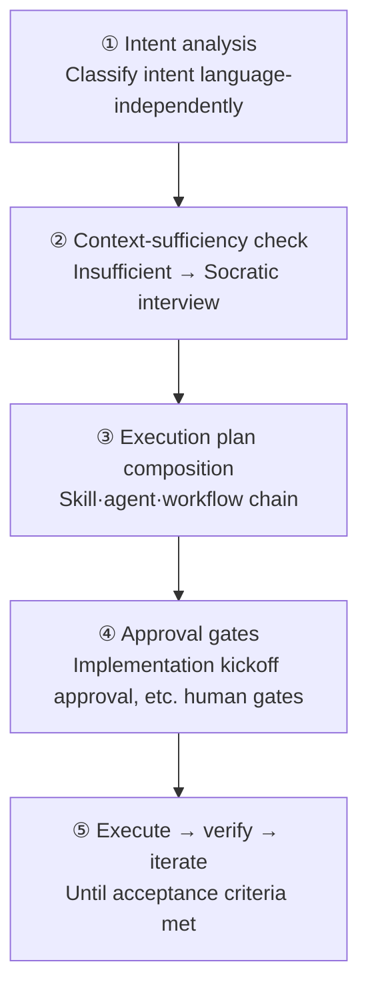

# Analyze-First Routing

From v3 onward, `/moai`'s default routing is **Analyze-First**. It classifies request meaning rather than matching English keywords. So you get the same routing quality in any language — whether you ask in Korean "로그인 버그 고쳐줘" or in English "fix the login bug", intent analysis routes both to the same workflow.

This page walks through the five stages Analyze-First uses to turn a request into execution.

## Five-Stage Pipeline

Every request — `/moai` subcommand or natural language, any input language — flows through one ordered pipeline. Each stage takes the previous stage's result as input.

### ① Intent Analysis

Classify the request's intent independently of language. Whether input is Korean, English, or Japanese, technical signals serve only as context for stage ③ and are NOT erected at routing forks. "이거 고쳐줘" and "fix this" both classify as the same intent (fix).

### ② Context-Sufficiency Check

After intent classification, check whether context is sufficient to execute the request. If insufficient, run Rule 5 Context-First Discovery's Socratic interview via `AskUserQuestion` to pose clarification questions. If sufficient, proceed to the next stage.

### ③ Execution Plan Composition

With context in hand, compose an execution plan. Decide which skills to load, which agents to spawn in what order. For non-trivial work, this plan is surfaced to the user before execution (Approach-First). Here Phase 4 orchestration mode is also chosen, deciding whether parallel fan-out or sequential sub-agents is appropriate.

### ④ Approval Gates

When the plan is set, pass through the pipeline's named gates in order. In particular, **Implementation Kickoff Approval** (plan → run human gate) is NOT an autonomous bypass target — even when plan artifacts are audit-ready, immediately before run-phase entry you MUST obtain the user's explicit approval via `AskUserQuestion`. The autonomy axis (semi-autonomous vs. autonomous) chooses what happens AFTER approval passes, not skipping the gate itself.

### ⑤ Execute → Verify → Iterate

With approval, run the plan. Verify against acceptance criteria and iterate as needed. When a goal is armed (`/moai goal`), the goal evaluator decides completion.

## Pipeline Gates

The base pipeline passes through four gates in order. Each gate is independent — a FAIL or INCONCLUSIVE stops the chain.

| Gate | Owner | Role |
|------|-------|------|
| **Plan-audit gate** | plan-auditor | Independent audit of SPEC plan artifacts. A different agent than the planning side evaluates to prevent bias. |
| **Implementation kickoff approval** | Human (human gate) | Exactly once per pipeline entry, always approve regardless of score. |
| **Phase 4 mode selection** | Orchestrator | Chosen autonomously after implementation kickoff approval, recorded in `progress.md`. |
| **Sync-audit gate** | sync-auditor | Evaluate sync results in 4 dimensions (functionality·security·craft·consistency). |


**Implementation kickoff approval is score-independent.** Even when Plan-audit is PASS-eligible (≥ 0.90), user approval before run-phase entry is NOT skipped. Phase 0.5 SKIP and implementation kickoff approval are different decisions — the former is whether to re-run plan-auditor (automatable), the latter is whether the user enters run (user decision mandatory).


## Natural Language to Workflow

When you enter only natural language without a subcommand, ① intent analysis automatically picks an appropriate workflow.

- **Fix** intent → `fix` family workflow
- **New feature** intent → `plan → run → sync` pipeline
- **Exploration** intent → Read-only subagent fan-out

For example, entering just `/moai "로그인 버그 고쳐줘"` still classifies as "fix" intent and routes to the `fix` family. `/moai "소셜 로그인 추가하고 싶어"` classifies as "new feature" and reaches the 3-stage pipeline. Single-word intents like `/moai status` likewise route appropriately.

## What Analyze-First Gives Users

- **No language friction** — No need to memorize English keywords. Request in your native language and get the same routing quality.
- **Transparent gates** — Before execution, it's revealed which skills·agents will be called in what order.
- **Consistent approval points** — Even in autonomous mode, users can block before run entry at least once.

## Related Documents

- [/moai](/en/utility-commands/moai/) — The entry command for Analyze-First
- [SPEC-based development](/en/core-concepts/spec-based-dev/) — The parent frame for the plan → run → sync pipeline
- [Harness profiles and evaluation](/en/advanced/harness-profiles/) — Gate evaluation and Tier classification
