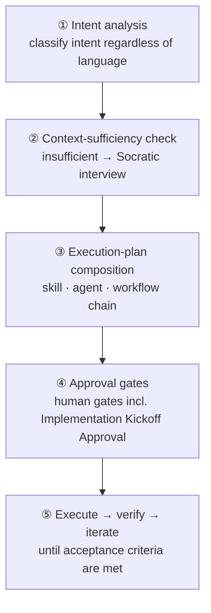
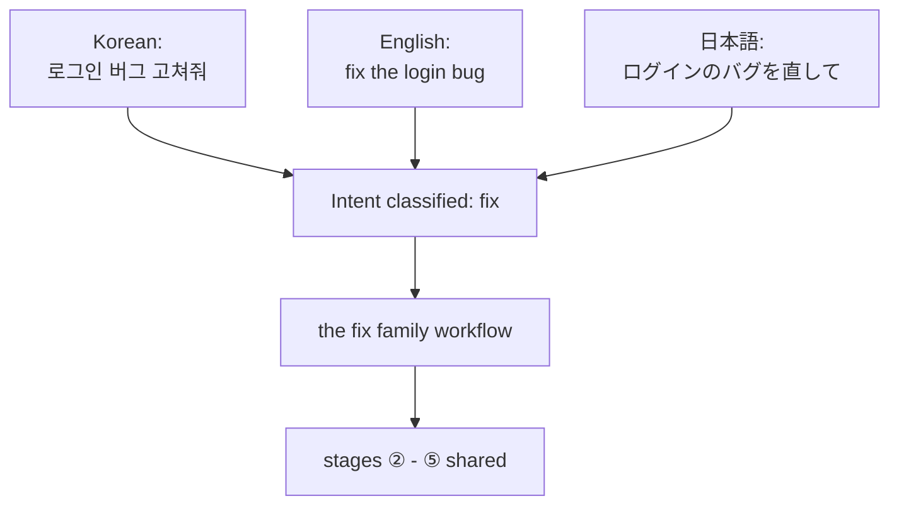

# Analyze-First Routing

The first thing an agent orchestrator (an AI tool that works on its own) does is routing — deciding "where does this request go." From v3 onward, `/moai`'s default routing is **Analyze-First** (analyze the meaning of the request first, then choose the path). Rather than matching English keywords, it classifies what the request wants. So any language routes with the same quality — whether you say "로그인 버그 고쳐줘" in Korean, "fix the login bug" in English, or "ログインのバグを直して" in Japanese, intent analysis reaches the same workflow.

This page covers why Analyze-First is needed, how the five stages that carry a request into execution connect, and which approval gates stand between them.

## Why meaning, not keywords

A keyword-matching router looks simple. Type `/moai fix` and it sends you to the fix workflow; type `/moai plan` and it sends you to the plan workflow. But this approach breaks in two places.

First, the user has to memorize the English command vocabulary. Say it naturally in your own language — "로그인 버그 고쳐줘" — and the router does not hear it. So every time, the user has to think "right, I need to type the English word — is this fix, plan, or run?" Second, similar words can take different paths. "고쳐줘", "수정해 줘", "버그 잡아 줘" all mean the same thing, but different keywords give different results. When the router splits on words, the user gets a different experience each time depending on which word they happened to use.

Analyze-First solves both problems with "classify the meaning." What the router classifies is not the surface words but the **intent** (what the user wants). With the same intent, any language and any phrasing takes the same path. Technical signals (say, "this is a Go project", "this is a test file") are used only as context, never erected at routing forks. This distinction is the heart of Analyze-First, and the classifier in charge of it is called the **Intent Router** (the device that classifies intent and chooses the path).


**Picture a hospital reception desk**

A keyword-matching router is a reception desk that only sends you to the right room if you say the English word "orthopedics" exactly. Say "팔이 부러졌어요" in Korean and it does not understand.

The Analyze-First router is a reception desk that listens to symptoms and classifies the **need**. Whether you arrive with "팔이 부러졌어요", "I broke my arm", or "腕が折れました", it classifies "broken bone" and sends you to the same room. The user never needs to know the room's English name.


## The five-stage pipeline

Every request — `/moai` subcommand or natural language, any input language — flows through one ordered pipeline. Each stage takes the previous stage's result as input, and if any stage trips on "context is insufficient" or "approval is required," the request cannot move on.

### ① Intent analysis

The request's intent is classified independently of language. Whether the input is Korean, English, or Japanese, "이거 고쳐줘", "fix this", and "これを直して" classify as the same intent (fix). Technical signals here — "this is a Go file", "it lives in the test directory" — are not used for the routing decision; they pass through only as context for stage ③. Looking at intent and technology together could send "bug fix in a Go project" and "bug fix in a Python project" down different paths, and that would be the router learning the wrong habit. Language and framework are information about "how," never a verdict about "what."

The Intent Router has two paths. The **P1 subcommand fast path** (when the user names a subcommand like `/moai plan`, it skips classification and goes straight to that workflow) and the **P3 semantic classification** (when only natural language arrives with no subcommand, it classifies the intent and picks the right workflow). If the subcommand is known, there is nothing to classify; if not, classify — both paths merge into the same pipeline.

### ② Context-sufficiency check

Once intent is classified, the pipeline checks whether context is sufficient to execute the request. "Fix the bug" has a clear intent, but if **which bug**, **where** it reproduces, or **what behavior counts as normal** is missing, it cannot run. When insufficient, the **Socratic interview** of Rule 5 Context-First Discovery (a clarification dialogue that narrows one thing at a time) runs through `AskUserQuestion` (the question channel that offers the user choices and collects an answer), posing clarification questions. Interview rounds continue until the context is 100% clear; once sufficient, the pipeline moves on.

### ③ Execution-plan composition

With context in place, an execution plan is composed. It decides which skills to load, which agents to invoke in what order, and whether a dynamic workflow is needed. For non-trivial work only, this plan is surfaced to the user before execution (Approach-First — showing "here is how I will do it" first). The plan is presented in an editable form so the user can read and correct it.

The **orchestration mode** is chosen here as well. Sequential coding-centered work goes to sub-agent mode (the default form that hands work to agents one step at a time); investigation · review needing multiple independent perspectives goes to parallel fan-out (spreading 3-5 read-only agents at once); mechanical bulk work applying the same transformation across dozens of files goes to dynamic workflows (the form where a script coordinates many agents). Mode selection is autonomous, and its rationale is recorded in the work log.

### ④ Approval gates

Once the plan is set, the pipeline passes through its named gates in order. The most important of them is **Implementation Kickoff Approval** (the mandatory human approval pressed before crossing from plan to run). This gate is not an autonomous-bypass target — even with plan artifacts audit-passed, immediately before run-phase entry the user's explicit approval is always obtained.

Why always approve, regardless of score? A quality score indicates "how well this plan was built," not "whether it is okay to start spending tokens and changing the working tree now." The latter is not a quality question — it is the user's decision. So no matter how high the audit score, the score says "the plan is good," never "you may proceed."

Past the approval, one more axis opens: choosing between **semi-autonomous** (the user confirms each step) and **autonomous** (proceeds without human intervention once conditions are met). This axis only chooses what happens **after** approval — it never skips the gate itself. "How autonomously to proceed after approval" and "whether to get approval at all" are different decisions.

### ⑤ Execute → verify → iterate

With approval granted, the plan runs. Verification checks against the SPEC's (requirements document's) acceptance criteria, iterating as needed. If a goal is armed (`/moai goal`), the **goal evaluator** (the device that checks the completion condition at each turn's end) delivers the termination verdict. Without a goal, each stage's gates decide pass or fail.

## The same workflow in every language

The diagram below shows how Analyze-First converges the same intent expressed in three languages into one workflow. The words differ but the intent (fix) is the same, so the Intent Router sends all three to the same node.

One premise has to hold for this convergence. The router must classify intent by **meaning**, not by surface **words**. Classify by words and the three inputs split three ways; classify by meaning and the three merge into one. Analyze-First takes the latter.

## One line of natural language becomes a workflow

Enter natural language with no subcommand, and ① intent analysis (the P3 semantic-classification path) picks an appropriate workflow on its own. Here are three frequent intents and their destinations.

- **Fix** intent → the `fix` family workflow (fixes the issues found by diagnostic tools in succession)
- **New feature** intent → the `plan → run → sync` 3-stage pipeline
- **Exploration** intent → parallel fan-out of read-only sub-agents

For instance, entering just `/moai "로그인 버그 고쳐줘"` classifies as "fix" and connects to the `fix` family. `/moai "소셜 로그인 추가하고 싶어"` classifies as "new feature" and reaches the 3-stage pipeline. `/moai "이 코드베이스 구조 한 번 분석해 줘"` classifies as "exploration" and read-only agents pile on in parallel. If you know the subcommand, calling it directly — `/moai fix`, `/moai plan` — is faster (the P1 fast path); if not, just speak naturally (P3 semantic classification picks for you).

## Pipeline gates

The base pipeline passes through four gates in order. Each gate is independent — a FAIL or INCONCLUSIVE stops the chain.

| Gate | Owner | Role |
|--------|------|------|
| **Plan-audit gate** | the plan-auditor agent | Audits SPEC plan artifacts separately. A different agent than the planning side evaluates, to prevent bias |
| **Implementation Kickoff Approval** | Human (human gate) | Exactly once per pipeline entry — always approved, regardless of score |
| **Orchestration mode selection** | the orchestrator | Chosen autonomously after Implementation Kickoff Approval; recorded in the work log |
| **Sync-audit gate** | the sync-auditor agent | Evaluates sync results across 4 dimensions (functionality · security · craft · consistency) |


**Implementation Kickoff Approval is score-independent.** Even if Plan-audit receives a passing score (say, 0.90 or above), the user approval before run-phase entry is never skipped. Whether to re-run the plan-phase audit (automatable) and Implementation Kickoff Approval (a mandatory user decision) are different decisions — the former can be resolved by a quality score, but the latter is the user's judgment of "may we start the work now," which no score can stand in for.


## What Analyze-First gives users

- **No language friction** — no English keywords to memorize. Request in your native language and get the same routing quality. This is the biggest reason Analyze-First was adopted.
- **A transparent plan** — before execution, which skills and agents will be invoked in what order is surfaced. The user can read the plan and correct it.
- **A consistent approval point** — even in autonomous mode, the user can block once before run entry. The autonomy axis opens only after this gate.

## Related documents

- [/moai](/en/utility-commands/moai/) — the entry command of Analyze-First
- [SPEC-Based Development](/en/core-concepts/spec-based-dev/) — the parent frame of the plan → run → sync pipeline
- [Autonomy Tier](/en/advanced/autonomy-tier/) — how far the autonomy axis opens after Implementation Kickoff Approval
- [Harness Profiles and Evaluation](/en/advanced/harness-profiles/) — gate evaluation and tier classification
