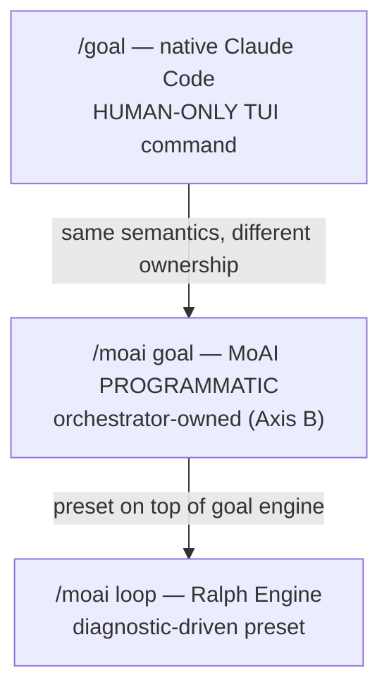

# Autonomous Continuation Loops

The core question of agentic loops is "when to stop and when to continue." MoAI-ADK provides two continuation-loop primitives, `/moai goal` and `/moai loop`; Claude Code provides a third of its own, the native goal command. This page distinguishes all three, and explains each one's ownership, implementation status, and safety guardrails.

## When to Stop, When to Continue

Some tasks finish in a single turn, but others require convergence across tens of turns — for example, "until all tests PASS" or "until the diagnostic tool's issue queue is empty." If the user must type a prompt each turn, the benefit of autonomy is lost.

The continuation-loop primitives solve this. Declare a completion condition, and the session continues working until the condition is met or a turn limit is reached.

## Three Continuation-Loop Primitives

Three continuation-loop primitives are in play — two owned by MoAI-ADK and one owned by Claude Code itself — each with different trigger semantics.

| Primitive | Ownership | Trigger | When appropriate |
|-----------|-----------|---------|------------------|
| `/goal` | User TUI (HUMAN-ONLY) | model evaluates condition | "continue until this condition is true" |
| `/moai goal` | Orchestrator (PROGRAMMATIC) | stop-goal Stop-hook evaluation | autonomous continuation within MoAI pipeline |
| `/moai loop` | Ralph Engine (diagnostic-driven) | diagnostic tool issue queue | "fix all issues the tool finds" |



### `/goal` — native Claude Code (HUMAN-ONLY)

 `/goal` is a native Claude Code TUI command. It is a user-entered command that the model cannot invoke on the user's behalf. This is the **HUMAN-ONLY** constraint.

When you declare a completion condition, after each turn a small fast model (Haiku by default) evaluates whether the condition is met. If not, another turn starts; if so, the loop ends.

```text
/goal go test ./... exits 0 && lint is clean, or stop after 20 turns
```

The condition can be up to 4,000 characters, and you can include a turn/time bound to bound the loop. Bare `/goal` checks status; `/goal clear` terminates early.

### `/moai goal` — MoAI PROGRAMMATIC (Axis B)

 `/moai goal` is MoAI's programmatic reimplementation. Since native `/goal` is HUMAN-ONLY, this is the only path for the orchestrator to register and arm an autonomous continuation loop within the pipeline.

It provides three verbs:

```bash
moai goal arm "<completion-condition>"  # register + arm the condition
moai goal status                        # check current condition + turn/token spend
moai goal clear                         # remove the condition (end loop)
```

At session start, `PruneOrphans` cleans up orphan goals. This mechanism was implemented in SPEC-GOAL-ENGINE-001 (CLOSED).

### `/moai loop` — Ralph Engine (diagnostic-driven preset)

 `/moai loop` is a deterministic loop that scans the issue queue found by diagnostic tools, fixes each issue, and repeats until the queue drains or diagnostics are clean. It is a preset on top of the goal engine.

`/moai loop` is NOT an alias for `/moai run --mode loop`. `/moai run --mode loop` is a runtime mode-dispatch value; `/moai loop` is a standalone subcommand. Both use the same goal engine, but their entry paths and preset behavior differ.

## Native /goal Details

`/goal <condition>` sets a completion condition, and Claude continues working without a prompt until the condition becomes true. After each turn, a small fast model evaluates the condition.

Writing an effective condition:

- **One measurable end state** — test result, build exit code, file count, empty queue
- **A stated check** — how Claude should prove it ("`go test ./... exits 0`")
- **Constraints that matter** — what must not change on the way ("no other test file is modified")

Include a turn bound to bound the loop ("`or stop after 20 turns`"). Running `/clear` also removes an active goal. Resuming with `--resume` / `--continue` restores the goal.

## Implementation vs Roadmap

 **REQ-DA-062 honesty distinction**: The implementation status of the three primitives is clearly distinguished.

-  `/goal` (native) — implemented in Claude Code runtime (requires v2.1.139+)
-  `/moai goal` (PROGRAMMATIC) — SPEC-GOAL-ENGINE-001 CLOSED, 4-verb CLI fully implemented
-  `/moai loop` (Ralph Engine) — implemented as diagnostic-driven loop
-  AGENTIC-CORE Epic — in progress. SPEC-1 (Analyze-First routing) CLOSED. SPEC-2 (autonomous/semi-autonomous kickoff REQ) awaiting user requirement.

## Safety Guardrails

 Safety guardrails are unchanged for all loop primitives.

- **Implementation Kickoff Approval** (plan → run HUMAN GATE) cannot be bypassed by any loop. Even with `/goal` active, user approval before run-phase entry is mandatory.
- **Safety boundary unchanged** — even with a loop active, the "confirm before hard-to-reverse / shared-system actions" boundary is not relaxed. The goal evaluator only decides whether to continue; it does not pre-approve destructive operations.
- **Combination with auto mode** — combining Claude Code auto mode (per-tool auto-approval) with `/moai goal` (per-turn continuation) enables an unattended `ac_converge` loop. Auto mode removes per-tool approval prompts; `/moai goal` removes per-turn STOP prompts. Implementation Kickoff Approval is still mandatory before run-phase entry.

## Multi-Model Review Gate (Optional)

 An opt-in Stop hook extends the autonomy loop with cross-model adversarial review, so a fully-autonomous `/moai goal` run gains a multi-model safety net (Path C of the autonomy redesign).

### `audit_model: multi` convergence

When `audit_model: multi` is selected, the `audit_multi` MCP tool fans out audit across the active backends — claude as the in-session anchor, plus codex and GLM as secondaries (each per its `audit_gate`) — and converges their verdicts through a 4-step policy:

- Any required backend returning `FAIL` → `overall_verdict = FAIL`.
- All required backends returning `PASS` → `overall_verdict = PASS`.
- A split among required backends → conservative `FAIL` plus a `disagreement_flag`.
- A conflict involving advisory-only backends → `PASS` plus a `disagreement_flag`.

Disagreement is surfaced as `disagreement_flag` + `residual_risk_note` in the `ConvergenceResult` — it NEVER hard-blocks the flow on its own. Independence is structurally preserved: the secondary fan-out goroutines receive only `(target, focus, model, effort)` and never the `claude_verdict`, so codex and GLM produce uncorrelated second opinions rather than contaminated re-samples. Mandatory fail-open holds in both directions — a missing or unauthenticated optional backend returns `VerdictInconclusive` and falls back to claude, never a hard error.

### `moai hook multi-review-gate` Stop hook

The multi-review-gate Stop hook is opt-in (`workflow.multi_review_gate.enabled`, BranchGuard pattern sibling to `workflow.codex.review_gate`, default off) and overrides the moai-default 5 s hook timeout to 900 s. On each code-edit turn it reads the most recent `ConvergenceResult` (persisted at `.moai/state/audit-multi/<session>.json` by the convergence engine) and emits the standard ALLOW/BLOCK contract:

- All required backends PASS → ALLOW.
- Any required backend FAIL → BLOCK.
- Advisory-only conflict → ALLOW (the disagreement surfaces as advisory, never a block).
- All non-Claude backends inconclusive → fail-open to the claude verdict.

The mandatory self-gate ALLOWs no-edit turns immediately — status reports, review results, and other non-editing turns are never falsely blocked.

### Where it fits

 The multi-review-gate is a Stop hook, not a continuation primitive. It composes with `/moai goal` (per-turn continuation) and `/moai loop` (diagnostic-driven preset): the loop drives the session forward, and the gate applies the cross-model convergence contract at each code-edit boundary. Implementation Kickoff Approval remains mandatory before run-phase entry in every combination.

## Next Steps

- [Tokenomics Overview](/en/advanced/tokenomics-overview/) — where autonomous loops connect to tokenomics
- [Harness Self-Evolution](/en/advanced/self-evolving/) — `/moai loop` / `/moai goal` convergence trajectories integrated into Loop 0 observation
