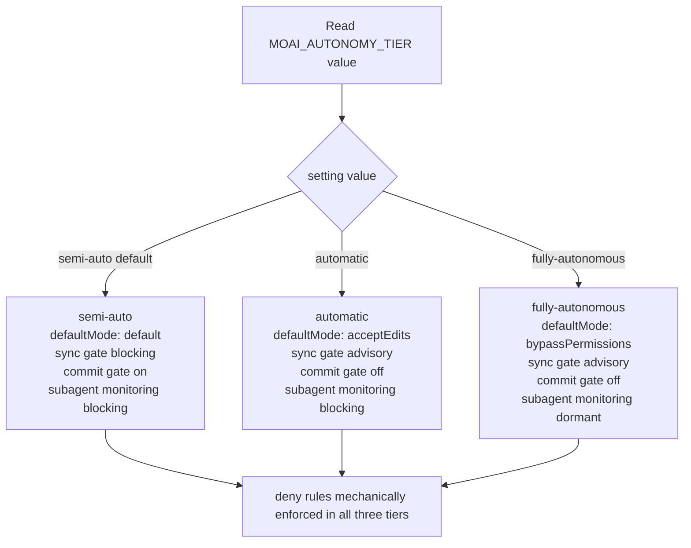
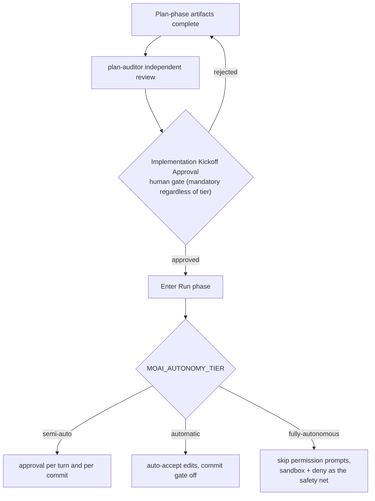

MoAI-ADK offers three autonomy tiers — from a semi-autonomous mode where the user confirms turn by turn, to a fully autonomous mode where, when the conditions are met, the agent drives a task to completion without human intervention. Each tier is expressed as a value of the `MOAI_AUTONOMY_TIER` environment-variable token, and decides — across the full lifecycle of a SPEC (requirements document), from plan through implementation, documentation, and audit — where user approval is required and where the flow proceeds automatically.

This page walks through the structure of the three tiers, the permission surface each tier touches, and the safety mechanisms that must harden as autonomy rises.

## Four Surfaces the Three Tiers Touch

What the autonomy tier changes is not the model or the effort (reasoning depth) — it is where human approval gates intervene. As the tier rises, the human hand lifts from the four surfaces below.

 **Do not confuse this with the model tier.** The "autonomy tier" on this page is a _different axis_ from the "model tier" of the [3-tier agent architecture](/en/advanced/no-haiku-3tier/). The model tier chooses _which model to call at which effort_ (single-shot, agentic, peak); the autonomy tier chooses _how much human approval to remove_. The two axes are orthogonal, not substitutive — the user picks a model tier matched to capability and an autonomy tier matched to oversight, _independently_.



The concrete behavior of each surface differs by tier.

| Surface | semi-auto (default) | automatic | fully-autonomous |
|---------|---------------------|-----------|------------------|
| `defaultMode` (default permission mode) | `default` | `acceptEdits` | `bypassPermissions` |
| sync gate | blocking | advisory | advisory |
| commit gate | on | off | off |
| subagent lifecycle monitoring (SubagentStop/TeammateIdle) | blocking | blocking | dormant |

One line stays unchanged across every tier. Rules that block dangerous actions via `deny` are never relaxed when you raise the tier, and remain mechanically enforced even under `bypassPermissions`. The autonomy safety net ultimately rests on this `deny` list and — additionally, in `fully-autonomous` — on a proven sandbox (an isolated execution environment).

## Step 1 — Read and Interpret the Tier Value

The autonomy tier is read from the `MOAI_AUTONOMY_TIER` environment variable. You can print the current value directly from the shell.

```bash
# Print the autonomy tier active in the current session
echo "${MOAI_AUTONOMY_TIER:-semi-auto}"
```

If the value is empty or has never been set, it is interpreted as `semi-auto`. This is a backward-compatibility invariant — sessions that have not explicitly chosen a tier continue to behave exactly as today, and sessions that do not opt in pay not one bit of behavioral change.

The three values mean:

- **`semi-auto`** (default) — keeps today's behavior unchanged. `defaultMode: default`, sync gate blocking, commit gate on, allowlist-based Bash execution that asks for approval per tool.
- **`automatic`** — semi-autonomous execution. Edit tools are accepted without asking (`acceptEdits`), the commit gate turns off, and the sync gate steps down from blocking to advisory. Subagent lifecycle monitoring stays blocking, so an implementation agent that misses its completion condition still halts.
- **`fully-autonomous`** — unattended autonomy. Permission prompts are skipped outright (`bypassPermissions`), and subagent monitoring is put into a dormant state. Instead, a proven sandbox, the `deny` rules, and a manager kill-switch (a device that revokes all autonomy at once in an emergency) form this tier's safety boundary.

## Step 2 — Pick a Tier in the `moai init` Wizard

The autonomy tier is chosen when first setting up a project, in the `moai init` wizard (an interactive setup tool). The wizard asks for one of the three tiers and saves the choice into the project settings.

```bash
# Create a new project and pick the autonomy tier at the same time
moai init myproject --autonomy-tier semi-auto
```

The `--autonomy-tier` flag accepts only one of a closed set of three values. An invalid value is rejected with a reason. This closed set guarantees that the autonomy tier remains a single source of truth read consistently later — it is the first pin that prevents runtime hooks and renderers from diverging in their interpretation.

To change the tier on an existing project without re-running the wizard, use the `moai web` toggle or edit the `workflow.yaml` key in the settings file directly. Note, however, that `fully-autonomous` is disabled in the web toggle without a proven sandbox — unattended autonomy requires a verified isolated environment as a precondition.

## Step 3 — Track How the Tier Reshapes the Permission Bundle

The chosen tier flows through the settings renderer (the device that turns permission bundles into actual files) into two scopes. `defaultMode` is written to the **user scope** (USER scope, personal settings), while `deny`/`ask` rules are written to the **project scope** (PROJECT scope, team-shared settings). This separation ensures that even if one person raises their autonomy, the safety rules shared by the whole team do not shift.

```bash
# Verify the renderer emits exactly the same deny/ask rules for every tier
diff <(grep -A20 'deny:' .claude/settings.json) \
     <(grep -A20 'deny:' .claude/settings.local.json) && echo "deny list matches"
```

This check must pass because the `deny`/`ask` _rule set is tier-invariant_. Whichever tier you pick, the kinds of actions blocked by `deny` do not shrink, and the kinds of actions gated by `ask` do not drop. What the tier changes is only `defaultMode`, the sync-gate mode, the commit gate on/off, and the activation of subagent monitoring — the four surfaces in the table above. This invariant prevents raising autonomy from opening new dangerous actions.

The enforcement power of `deny` rules survives under `bypassPermissions`. Permission evaluation always proceeds in the order `deny → ask → allow`, and the first match decides. In `fully-autonomous`, `ask` rules step down to advisory, but `deny` rules still block mechanically. So the effective safety net of full autonomy is "proven sandbox + `deny` list + scope-qualified `ask` rules" — which is why it does not lean on `ask` alone.

## Step 4 — Relate the Tier to Implementation Kickoff Approval and the Stop-chain

Even when you raise the autonomy tier, there is one gate that can never be skipped: **Implementation Kickoff Approval** (the human approval gate at the plan-to-run boundary). This gate is always mandatory regardless of the autonomy tier; a passing verdict or a high score from the plan-auditor (the plan-review agent) does not auto-advance this gate.



Once the human approval gate has been passed, the tier decides how far autonomy is permitted from there. `semi-auto` returns to ask for approval at every turn and every commit, `automatic` accepts edits automatically, and `fully-autonomous` skips the permission prompt itself. But note once more that the safety net of `fully-autonomous` is the sandbox and `deny`, not the `ask` prompt — the higher the tier, the more safety shifts from prompts to mechanical enforcement.

The autonomy tier is also paired with the voluntary relaxation of the Stop-chain (the verification loop that runs at turn end). Stop-chain hooks normally spin up the `moai` binary as a cold start (the cost of re-launching it every time) at every turn end and every commit to run verification. In an unattended loop this round-trip cost accumulates, so the hook reads the `MOAI_AUTONOMY_TIER` token and conditionally skips advisory gates. When no goal state file is present, the goal-evaluation hook is skipped; when the current commit is not a sync commit, the heavy checks of the sync-quality gate are not run. However, `deny` and safety rules are _not_ subject to this relaxation — the Stop-chain only reduces "round-trip cost within the scope the human has already approved."

## Tier Selection Guide

Which tier is right depends on the character of the task and the readiness of the verification environment.

- **`semi-auto`** — when first using the system, working in an unfamiliar codebase, or mixing in hard-to-reverse actions. Re-confirming intent at each step makes it the safest.
- **`automatic`** — when driving a single SPEC end-to-end from plan through implementation and documentation. The long implementation breath is not interrupted by per-edit approvals, and subagent monitoring remains to halt if the completion condition slips.
- **`fully-autonomous`** — when running an already-approved task to completion in a proven sandbox, even while the human steps away. A sandbox proof is a precondition, and a manager kill-switch must be available to revoke autonomy at any moment.

In every tier, the `deny` list is unchanged and Implementation Kickoff Approval is always mandatory. Raising autonomy is "receiving fewer human approvals," not "loosening the safety boundary." What the tier changes is the _frequency_ of approval, not the _strength_ of safety.

## Next Steps

- [3-Tier Agent Architecture](/en/advanced/no-haiku-3tier/) — the model tier (single-shot, agentic, peak). The orthogonal "which model" axis to the autonomy tier.
- [Profile Matrix](/en/advanced/profile-matrix/) — the single matrix for choosing each agent's `{model, effort}`.
- [Autonomous Loops](/en/advanced/autonomous-loops/) — unattended continuous execution on top of the goal engine.
- [Factory Mode](/en/advanced/factory-mode/) — running autonomy tiers in parallel across a multi-session factory.
