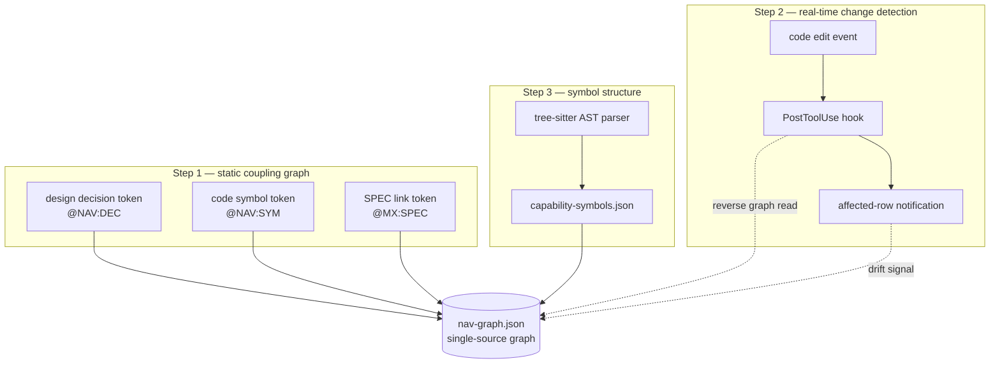

# BAS Navigator 3-Stage Codemap Synchronization

Many projects have code that keeps moving while the documentation stands still. BAS Navigator (a synchronization layer that anchors codemaps to the blueprint) is the device that closes this gap. This page is a tutorial that follows how BAS Navigator synchronizes a codemap (a map that summarizes project structure in symbol units) across three stages. You can read it while running each command yourself.


**BAS Navigator in one line**

BAS (BluePrint-Anchored Synchronization) Navigator is a three-stage synchronization layer that ties design decisions, SPECs (requirements documents), and code symbols into a single graph, instantly surfaces the affected rows the moment code changes, and breaks code structure down to the symbol level. It starts from the premise that "documentation without refresh infrastructure is not alive — it is a snapshot whose source is now better."


## Why It Is Needed

For an agent (an AI assistant that works on its own) to find its direction in a large repository, it needs to see at a glance "which design decision became which code, and which SPEC that code came from." In the past, MoAI-ADK had separate commands for redrawing the codemap (`regen`), auditing the gap between design and implementation (`audit`), and extracting symbols with tree-sitter (a parser that interprets source code as a grammar tree) (`enrich`). Each command worked well on its own, but none pointed at the others, so when one side changed the other could not know.

BAS Navigator rearranges these three synchronization axes into three stages — **static coupling, real-time detection, symbol structure** — and gathers the result into a single `nav-graph.json` (the single-source file of the Navigator graph). Because the graph is the single source, drift (the phenomenon of design and implementation diverging) at any stage can be traced through the same graph.

The diagram below shows how the three stages surround the graph.



Each stage only produces or consumes the graph and never touches another stage's producer. This "bridge not absorb" principle means fixing any stage does not shake the others. Let's now practice stage by stage.

## Step 1 — Build the Static Coupling Graph

The first stage is the **binding token trio** (a set of three linking tokens) that ties design decisions, code symbols, and SPECs into one graph. Tokens are small markers embedded directly in documentation and code, and there are three kinds.

| Token                  | Where it goes          | What it points to      |
| ---------------------- | ---------------------- | ---------------------- |
| `@NAV:DEC-<id>`        | `.moai/project/*.md`, ADR | design decision record |
| `@NAV:SYM:<symbol>`    | code comments, design docs | named code symbol   |
| `@MX:SPEC:<id>`        | code comments          | SPEC backlink          |

Once the three tokens are scattered through docs and code, the Navigator collects them and weaves them into edges of `nav-graph.json`. The nodes are the three entities — decisions, SPECs, symbols — and each edge carries its source file and line number by token kind. So reading the graph lets you trace "which file, which line did this decision first appear in."

Let's stamp a token once and rebuild the graph.

```bash
# 1) Leave a decision token in a design doc (add one line inside .moai/project/tech.md)
#    @NAV:DEC-auth-token — authentication is token-based, not session-based ...

# 2) Attach a SPEC backlink in a code comment (inside internal/auth/token.go)
#    // @MX:SPEC:SPEC-AUTH-001

# 3) Rebuild the graph
moai codemaps
```


`@MX:SPEC` was originally a token used as a backlink from code comments to SPECs. BAS Navigator does not invent this token; it _bridges_ the existing moai-adk linking result into the graph. So you do not need to touch existing comments.


## Step 2 — Catch Drift at the Moment of Edit

The second stage is **Falconer Detect** (a real-time detection layer that watches every edit). The instant a file is saved, a PostToolUse hook (an automatic hook that reacts right after a tool runs) reads the changed path, walks the graph in reverse, and immediately surfaces the affected rows.

Detection is read-only. It does not block edits, and it leaves results in two places. One is a short notification surfaced in the session, and the other is a machine-readable impact record (a `jsonl` file under `.moai/state/navigator-detect/`). This record is consumed by the refresh pipeline of the next stage.

Let's observe detection in action.

```bash
# 1) Edit one source file (e.g., modify a function in internal/auth/token.go)
#    Save via the Edit tool inside Claude Code

# 2) Check the impact record the hook left — this file appears right after the edit
ls .moai/state/navigator-detect/

# 3) View the most recent record — affected nodes and edges are listed line by line
tail -n 3 .moai/state/navigator-detect/*.jsonl
```

The output shows, one per line, which decision node, which SPEC node, and which symbol node the file you just touched reaches. This is the heart of detection — warning "at the cheapest moment, just before drift takes hold." Edits that lack a structured path — such as moving files via Bash — are not subject to detection. This is an intentional design choice, a boundary that reduces false positives.

## Step 3 — Extract Code Structure at the Symbol Level

The third stage is **tree-sitter AST enrichment** that breaks code down into symbol units. You cannot hand-annotate every marker in design docs. So a tree-sitter parser supporting 16 languages automatically extracts functions, types, and call relationships and fills `capability-symbols.json`. This result in turn enriches the symbol nodes of the graph.

This stage splits into two layers. The lower layer is the deterministic structure layer (signatures, declarations, and references that the parser extracts mechanically); the upper layer is the LLM narrative layer (the layer that fills documentation strings and call context in natural language). Because the two layers are separated, the deterministic layer does not stall even in environments where the LLM cannot be used.  Structure first, narrative second.

Let's run enrichment once.

```bash
# Refresh the codemap — tree-sitter re-extracts symbols and fills capability-symbols.json
/moai codemaps

# Inspect the symbol enrichment result
jq '.symbols | length' .moai/project/navigator/capability-symbols.json
```

The detailed flags and output format of the command are documented separately on the `utility-commands/moai-codemaps.md` command reference page. This tutorial only touches on the "enrichment runs in one line" flow.

## Step 4 — Read the Whole Graph and Catch Differences

The final stage ties the previous three into one cycle. Detection surfaces affected rows, enrichment re-extracts symbols, and refresh brings the graph up to date. The audit mode (`--audit`) that inspects the gap between design intent and implemented functionality reads the graph left by this cycle and reports "present in docs / absent in code" pairs.

Let's run the full cycle at once.

```bash
# 1) Audit design intent vs implementation gap
/moai codemaps --audit

# 2) Cross-check the affected rows pointed to by detection records against the latest graph
jq '.affected_rows[] | {node: .identifier, type: .entity_type}' \
  .moai/state/navigator-detect/*.jsonl | head

# 3) View the summary of the audit report
cat .moai/project/navigator/audit-report.json | jq '.summary'
```

If the audit is clean, the graph stays alive. When differences are reported, you can walk back through the Step 1 tokens and Step 3 symbol enrichment to narrow down which stage is empty. This is the BAS Navigator cycle that keeps the codemap alive _without redrawing the whole thing at once_.

## Wrap-up

To recap the three stages:

| Stage  | What it does                          | Output                       |
| ------ | ------------------------------------- | ---------------------------- |
| Step 1 | Build the coupling graph with the token trio | `nav-graph.json`        |
| Step 2 | Detect affected rows at the moment of edit   | `navigator-detect/*.jsonl` |
| Step 3 | Enrich symbols with tree-sitter AST    | `capability-symbols.json`    |
| Step 4 | Catch differences via audit and close the cycle | `audit-report.json`     |

BAS Navigator lays three synchronization axes on top of a single-source graph so that documentation does not fall behind even as code changes. For command specifications, see `utility-commands/moai-codemaps.md`; for design background, see the SPECs that define each stage (SPEC-NAVIGATOR-SYNC-001, 002, 003). Good pages to read next in the same Advanced section are `manager-lead.md` and `autonomy-tier.md`. Both cover the agent organization and autonomy tiers that move on top of this codemap.
