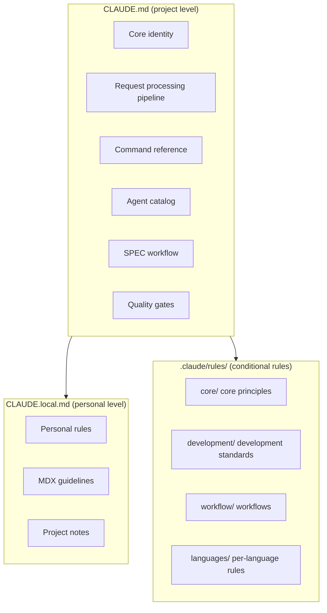
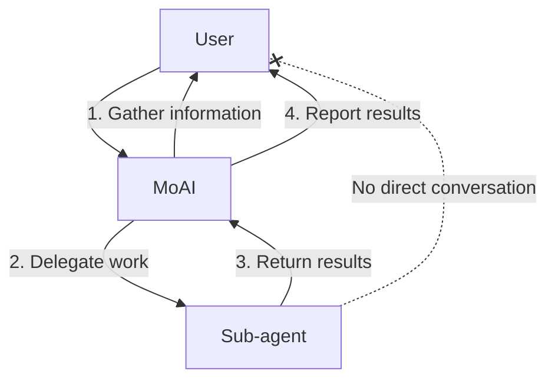
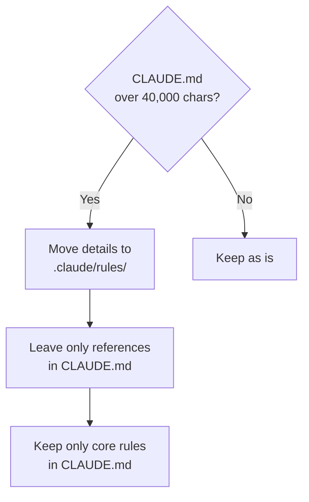
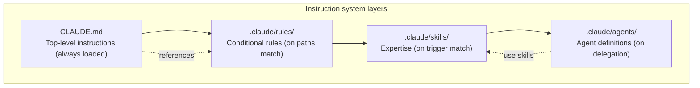

A detailed guide to Claude Code's core instruction file system. `CLAUDE.md` is loaded in every session, so every single line of this file is a standing context cost — designing the instruction system is harness design and tokenomics at the same time.


**One-line summary**: `CLAUDE.md` is the project's **constitution**. How Claude Code understands the project, which rules it follows, and which agents it invokes are all decided in this file.


## What Is CLAUDE.md?

`CLAUDE.md` is **the first instruction file Claude Code reads** when it starts a session. The project's rules, agent structure, workflow, and quality criteria are defined in this file.

Just as a person joining a new company reads the employee handbook, Claude Code reads `CLAUDE.md` at session start to grasp the project's context.

## File Structure

MoAI-ADK uses two instruction files plus a rules directory.



| File/directory | Purpose | Git-tracked | On update |
|---------------|------|----------|-------------|
| `CLAUDE.md` | MoAI-ADK core instructions | Yes | Overwritten |
| `CLAUDE.local.md` | Personal custom instructions | No | Preserved |
| `.claude/rules/moai/` | Conditional detailed rules | Yes | Overwritten |
| `.claude/rules/local/` | Personal custom rules | No | Preserved |

## Key Sections of the MoAI CLAUDE.md

### 1. Core Identity

Defines the role of the MoAI orchestrator and the HARD rules.

```markdown
## 1. Core Identity

MoAI is the strategic orchestrator for Claude Code.

### HARD Rules (required)
- [HARD] Language-aware responses: respond in the user's conversation_language
- [HARD] Parallel execution: run independent tool calls in parallel
- [HARD] No XML tags: no XML in user-facing responses
- [HARD] Markdown output: use Markdown for all communication
```

### 2. Request Processing Pipeline (Analyze-First)

Every request goes through a single ordered pipeline, regardless of input language. The core of v3.0 is that **intent analysis always comes first** — routing is by language-independent semantic classification, not English keyword matching.

| Stage | Description |
|------|------|
| 1. Intent analysis | Classify the request's intent language-independently (Analyze-First) |
| 2. Context-sufficiency check | If insufficient, confirm via a Socratic interview before execution |
| 3. Execution-plan composition | Skill/agent/workflow chain + orchestration mode selection |
| 4. Approval gates | Includes Implementation Kickoff Approval (the plan→run human gate) |
| 5. Execute → verify → iterate | Verify against acceptance criteria; when a goal is set, the goal evaluator judges termination |

### 3. Command Reference

`/moai` is the single entry point for all MoAI development workflows.

| Type | Commands | Purpose |
|------|--------|------|
| SPEC pipeline | `/moai plan`, `/moai run`, `/moai sync` | The 3-phase development workflow |
| Loop/fix | `/moai goal`, `/moai loop`, `/moai fix` | Condition-declared loop, iterative fixing, one-shot fixing |
| Project/harness | `/moai project`, `/moai harness` | Project docs + harness creation/management |
| Quality/utility | `/moai review`, `/moai gate`, `/moai clean`, `/moai mx`, `/moai codemaps`, `/moai feedback` | Review, gate, cleanup, annotations, docs, reporting |
| (Natural language) | `/moai "request"` | Analyze-First routing → autonomous pipeline |

### 4. Agent Catalog

MoAI-ADK consists of **11 retained agents** (10 MoAI-custom + 1 Anthropic built-in). Through architecture simplification, 12 archived agents such as manager-strategy, manager-quality, manager-brain, and manager-project were replaced by per-spawn `Agent(general-purpose)` delegation for specific domains.

| Category | Agents | Role |
|------|----------|------|
| Manager (5) | manager-spec, manager-develop, manager-docs, manager-git, manager-design | Specialists per core lifecycle phase |
| Evaluator (2) | plan-auditor, sync-auditor | Independent quality assessment at plan/completion stages |
| Builder (1) | builder-harness | Dynamic per-project harness generation |
| Advisor (1) | super-advisor | High-reasoning consultation (E1-E4 escalation) |
| Specialist (1) | e2e-tester | E2E test execution across web/mobile/desktop (`/moai e2e`) |
| Built-in (1) | Explore (Anthropic) | Read-only codebase exploration |

### 5. SPEC Workflow

Defines the 3-phase SPEC-based development workflow.

```bash
# Plan: create SPEC document (30K tokens)
> /moai plan "feature description"

# Run: DDD implementation (180K tokens)
> /moai run SPEC-XXX

# Sync: documentation sync (40K tokens)
> /moai sync SPEC-XXX

# E2E: run web/mobile/desktop E2E tests
> /moai e2e
```

### 6. Quality Gates

Defines the TRUST 5 framework and the LSP quality gates.

| Quality criterion | Requirement |
|-----------|----------|
| Tested | 85%+ coverage, 0 LSP type errors |
| Readable | Clear naming, 0 LSP lint errors |
| Unified | Consistent style, ≤10 LSP warnings |
| Secured | OWASP compliance, 0 LSP security warnings |
| Trackable | Clear commits, LSP state tracked |

### 7. User Interaction Architecture

Sub-agents cannot converse with the user directly. The user touchpoint is fixed to MoAI alone.



### 8. Configuration Reference

References language settings, user settings, and project rules.

```yaml
language:
  conversation_language: ko           # user response language
  agent_prompt_language: en           # agent internal language
  git_commit_messages: en             # Git commit messages
  code_comments: en                   # code comments
  documentation: en                   # documentation files
```

## Using CLAUDE.local.md

`CLAUDE.local.md` is the file for your personal rules and notes. It is preserved regardless of MoAI-ADK updates.

### Example

```markdown
# Project local settings

## Documentation guidelines

### Prevent MDX rendering errors
- Always put a space between emphasis markers and parentheses

### Mermaid diagram direction
- All diagrams vertical (flowchart TD)

## Personal notes
- Always back up before DB migration
- API endpoint naming: use kebab-case
```

### Usage Tips

| Purpose | Example content |
|------|-----------|
| Coding rules | "Variables camelCase, filenames kebab-case" |
| Project notes | "Auth is JWT, 24h expiry, 7-day refresh" |
| Prohibitions | "Never leave console.log in production code" |
| Preferred patterns | "React components: functional only" |
| MDX rules | "Space required between emphasis and parentheses" |

## The .claude/rules/ System

The `.claude/rules/` directory stores **conditionally loaded detailed rules**. There is exactly one reason not to put every rule in CLAUDE.md and to split them into conditional files instead — so that unused rules do not occupy context.

### Directory Structure

```
.claude/rules/moai/
├── core/                          # core principles
│   └── moai-constitution.md       # TRUST 5, core rules
├── development/                   # development standards
│   ├── skill-authoring.md         # skill authoring guide
│   └── coding-standards.md        # coding standards
├── workflow/                      # workflows
│   └── spec-workflow.md           # SPEC workflow (Plan/Run/Sync definitions)
└── languages/                     # per-language rules (16)
    ├── python.md
    ├── typescript.md
    ├── javascript.md
    └── ...
```

### Conditional Loading (paths frontmatter)

A rule file is **loaded only when working on specific files**, via the `paths` frontmatter.

```yaml
---
paths:
  - "**/*.py"
  - "**/pyproject.toml"
---

# Python coding rules
- use the ruff formatter
- type hints required
- Google-style docstrings
```

This rule loads only when Python files are being modified, **saving tokens**.

### Kinds of Rule Files

| Directory | File | Load condition |
|----------|------|-----------|
| `core/` | `moai-constitution.md` | Always loaded |
| `development/` | `skill-authoring.md` | During skill-related work |
| `development/` | `coding-standards.md` | During code work |
| `workflow/` | `spec-workflow.md` | On workflow commands / SPEC-related work |
| `languages/` | `python.md`, etc. | When editing files of that language |

## Size Limit

`CLAUDE.md` must stay **under 40,000 characters**. MoAI-ADK itself kept putting CLAUDE.md on a diet throughout the v3 period — the shorter the always-loaded instructions, the cheaper every session becomes.

### What to Do When the Limit Is Exceeded



**Response strategies:**

1. **Move details out**: split long explanations into `.claude/rules/` files
2. **Use references**: reference from `CLAUDE.md` via `@file-path`
3. **Keep only the core**: retain only identity, HARD rules, and the agent catalog
4. **Convert to skills**: turn long pattern explanations into skills

## Practical Examples: CLAUDE.local.md Custom Rules

### Frontend Project

```markdown
# Project local settings

## React rules
- Components must be written as functional components
- Define the Props interface at the top of the component file
- Use Zustand for state management
- Use Tailwind CSS only for CSS

## Naming rules
- Components: PascalCase (UserProfile.tsx)
- Utilities: camelCase (formatDate.ts)
- Constants: UPPER_SNAKE_CASE (MAX_RETRY_COUNT)
- API endpoints: kebab-case (/api/user-profiles)

## Prohibitions
- No use of the any type
- No console.log in production code
- No default export (named exports only)
```

### Backend Project

```markdown
# Project local settings

## Python rules
- Use FastAPI
- Prefer async functions (async/await)
- Use Pydantic v2 models
- SQLAlchemy 2.0 style

## Database rules
- Always back up before migration
- Add indexes after analyzing query patterns
- Use the soft-delete pattern (is_deleted flag)

## API rules
- RESTful endpoint naming
- Unified response format: {"data": ..., "message": ...}
- Standardized error codes
```

## The Relationship Between CLAUDE.md, Rules, and Skills

The instruction system is divided into 4 layers; loading conditions narrow as you descend.



| Layer | Files | Loaded when | Role |
|------|------|-----------|------|
| 1. CLAUDE.md | `CLAUDE.md` | Always | Project identity, core rules |
| 2. Rules | `.claude/rules/*.md` | On file-pattern match | Conditional detailed rules |
| 3. Skills | `.claude/skills/*/skill.md` | On trigger match | Expertise, patterns |
| 4. Agents | `.claude/agents/*.md` | On delegation | Specialist role definitions |

## Related Documents

- [Skill Guide](/en/advanced/skill-guide) - skill system details
- [Agent Guide](/en/advanced/agent-guide) - agent system details
- [settings.json Guide](/en/advanced/settings-json) - configuration file management
- [Hooks Guide](/en/advanced/hooks-guide) - event automation


**Tip**: Rather than editing `CLAUDE.md` directly, we recommend adding your personal rules to `CLAUDE.local.md`. Your personal rules are safely preserved across MoAI-ADK updates.

