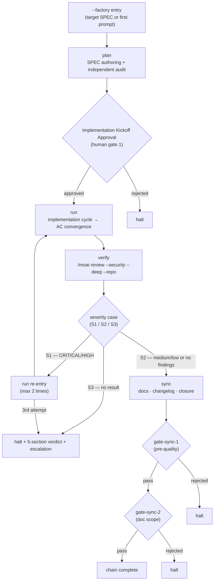




 <strong>Value home</strong>: agentic loop engineering · agentic harness

<!-- @value: self-learning, agentic-harness -->

Attaching the `--factory` (short form `-f`) switch to the session launcher makes the orchestrator (the conductor that directs work) run the four phases — `plan → run → verify → sync` — in one session, driving a single SPEC (requirements document) end-to-end from plan to closure. There is no new subcommand and no new runtime. It is only an entry contract laid on top of the infinite-continuation loop of the existing `/moai goal`, mounting a goal preset (a bundle that predeclares a completion condition) called `factory_chain`.

This page breaks the procedure for driving one SPEC to completion in Factory Mode into four phases. For a short introduction from the workflow-command viewpoint, see the Factory Mode entry in [`/moai` unified command](/en/workflow-commands/) first. Here we go one layer deeper into the entry conditions, the chain phases, the four human gates (decision points where a human approves), the severity branching, the exit conditions, and "what is _not_ automated."

## What This Page Covers

Factory Mode is an entry contract that extends the `full-pipeline` contract (an agreement that auto-chains run→sync for one SPEC). It adds exactly two things.

1. **plan-phase chain head** — instead of the chain calling each phase individually, it starts at plan.
2. **verify entry/exit gate** — places an automated security review (`/moai review --security --deep --repo`) at the run-phase exit.

The rest of the chaining rules are inherited as-is. There is no second chaining mechanism. The whole chain flow fits in a single diagram.



## Step 1 — Open a Session in Factory Mode


**Not a slash command**: Factory Mode is not a `/` command in the Claude Code chat window; it is a switch that opens the session itself. You attach it in the terminal when starting the session. It cannot be turned on or off from inside the chat window.


Start in the terminal by attaching `--factory` to the session launcher. If you also pass a SPEC identifier, that SPEC is the target; if you omit it, plan-phase begins from the first prompt.

```bash
# Enter the factory chain targeting a SPEC
$ claude --factory SPEC-AUTH-001

# Short form
$ claude -f SPEC-AUTH-001

# Without a target SPEC — start plan from the first prompt
$ claude --factory

# Same entry via the moai cc launcher
$ moai cc --factory SPEC-AUTH-001
```

On successful entry the launcher injects two things into the session. First, it arms (after Implementation Kickoff Approval passes) the `factory_chain` goal preset you will see shortly. Second, it raises the consecutive-block ceiling of the Claude Code runtime (`CLAUDE_CODE_STOP_HOOK_BLOCK_CAP`, default 8) to 200 via the `MOAI_FACTORY` environment variable. This raise does not bypass any gate — human gates fire through `AskUserQuestion`, not through the block ceiling, so the gate's firing condition is the same whether the ceiling is 8 or 200. When the session ends, a `defer` restores the pre-entry value, leaving the global environment untouched.

```bash
# Conceptual flow — what the launcher injects at session start/end
# (the user does not need to touch the environment variable directly)
enter_factory_session():
    set CLAUDE_CODE_STOP_HOOK_BLOCK_CAP=200 via MOAI_FACTORY
    defer restore original CAP value
    start factory_chain preset
```

There is one hard boundary. Factory Mode is rejected by the mixed-backend launcher `moai cg`. `moai cg` runs the leader on one backend and teammates on another, which contradicts the chain's precondition of "one session / one backend / one chain" — the verify stage could no longer decide which backend it ran on. The session does not open, and the rejection sentinel `FACTORY_MODE_UNSUPPORTED_BACKEND` is emitted. This is an intentional boundary, not a gap to adapt around.

## Step 2 — plan Passage and Implementation Kickoff Approval

The plan phase authors the SPEC document, and an independent audit (the plan-auditor sub-agent) verifies its contents. This part is the head of the chain and runs identically with or without Factory Mode.

When plan finishes, the chain does not immediately proceed to run. The first human gate — **Implementation Kickoff Approval** — steps in between plan and run. The orchestrator uses `AskUserQuestion` to ask the user "shall I start implementation on this SPEC as-is," and only on approval does it enter the run-phase. This gate is not invented by Factory Mode; it is inherited — the same door that `/moai run` honors on any day.

The point where this gate passes is also the point where the goal preset is armed. After this, the chain has no way to ask for user preferences, so `factory_chain` is armed only after passing through this door, where preferences are fully drained. The arming rules are three.

- **Arm only after gate 1 passes.** The place where user preferences are fully drained is the plan→run gate.
- **Arm alongside the work, not instead of it.** It is `arm-only`, registering only the condition and starting nothing. So the orchestrator arms the preset in the same turn that it starts the phase the preset drives.
- **Bind via flags, not prose.** `--max-turns 0 --max-duration 14400` — infinite turns, a 4-hour wall-clock ceiling (wall-clock, a limit measured by elapsed time). If you write "stop after 20 turns" in prose inside the condition sentence, the evaluator does not parse it, so the ceiling you trusted silently does not fire.

The completion condition of `factory_chain` is built _entirely from model conditions_ (predicates that judge the conversation transcript). At every turn end, the existing `stop-goal` Stop-hook evaluator evaluates it. Not a single new runtime, hook, or evaluator is introduced — one condition is laid on top of existing machinery.

```text
The plan-phase artifacts for the targeted SPEC are surfaced as authored and
the plan audit verdict is surfaced as PASS; AND every blocking acceptance
criterion has its PASS evidence surfaced in the conversation; AND the verify
stage is surfaced as having produced a readable result, with its severity case
(S1 / S2 / S3) and its rung stated in the transcript; AND the sync phase is
surfaced as closed, with the SPEC status transition recorded. All of these
hold — that is the end state.
```

Each sentence refers to something the orchestrator writes into the conversation as it works. If these were predicates that required opening file paths, they would not be model conditions, and they could not converge silently. The accepted risk is also made explicit — an unattended factory run can consume up to 4 hours of tokens before the wall-clock ceiling fires. This is an intentional trade-off so that a chain that legitimately needs many turns is not cut off mid-way. If you do not want this, do not arm with this ceiling.

## Step 3 — run Wrap-up and verify Severity Branching

In the run phase, the configured implementation cycle (TDD or DDD) implements code until it converges on the Acceptance Criteria (AC — the pass conditions the SPEC must meet). This stage itself is the same with or without Factory Mode.

The structural device the factory chain introduces sits at the run-phase exit. When run finishes, the verify stage runs once, where `/moai review --security --deep --repo` produces a security review result. Once the result is in, it branches three ways by severity. This branch is exactly where the new human gate the factory chain adds is created.

```bash
# S1 — CRITICAL/HIGH found: go back to run and rewrite the fix
plan(as-is) → run(re-enter) → verify(re-evaluate)

# S2 — medium/low or no findings: carry the findings forward into sync
plan(done) → run(done) → verify(S2) → sync

# S3 — no readable result at all: does not count against the re-entry ceiling
verify(S3) → halt + 5-section verdict + escalation
```

S1 is a block. After the run-phase fixes the discovered CRITICAL/HIGH, verify runs again. Re-entry is **capped at 2 times**; if S1 still comes out on the third attempt, the chain halts and escalates a 5-section verdict (claim / evidence / baseline attribution / gaps / residual risk). This ceiling is the safety against an infinite re-entry loop. S2 is not a block — it carries medium/low findings forward into the sync stage. It is not ignoring the findings; it is loading them at "a weight sync can handle." S3 is a different kind of failure from S1/S2. When verify cannot produce a result due to timeout, tool failure, or format mismatch, the chain halts immediately. S3 is **not counted** against the re-entry ceiling (2 times) — so that the ceiling is not wasted on a "try again and maybe it will come out" guess.

The `AskUserQuestion` round the orchestrator asks when CRITICAL/HIGH is found is exactly the **new human gate** (gate 2) that Factory Mode introduces. It is the only gate Factory Mode creates; the other three are inherited.

The verify result carries one more attribute besides severity — a **rung** (the trust grade of the review tool). The rung expresses up to which grade the review tool operated, in three cells.

| rung | Meaning | Effect on sync |
|------|---------|----------------|
| `PRIMARY` | The primary inspection tool ran normally | sync Phase 8's security-review step runs normally |
| `FALLBACK` | The primary failed and a backup tool was used | sync Phase 8 runs the same (content based on the fallback result) |
| `DEGRADED` | run ended with the security review skipped | Force-disable the sync Phase 8 security-review suppression (Step 0.55.1) |

The `DEGRADED` cell matters. It means "let run finish, but do not leave sync in the state where the security review was skipped." It is the device that makes sync supplement the security review that run missed.

## Step 4 — sync Wrap-up and Chain Closure

The sync phase updates documentation, writes the changelog, and closes the phases. Here, too, the two inherited human gates fire — `gate-sync-1` (gate 3), which inspects pre-quality, and `gate-sync-2` (gate 4), which inspects the documentation scope. Both are the same doors that `/moai sync` honors on any day.

The factory chain's verify exchanges a record with the sync stage about "which security check was run at the end of run." This record prevents sync Phase 8 from rerunning the same check. It is important that the design is an **allowlist, not a denylist** — it is built not on the side of removing checks but on the side of explicitly acknowledging the checks run already ran.

```bash
# Inspection revision-match predicate (conceptual)
# scan result of run's last commit vs the check sync is about to run
if revision_match(scanned_commit, current_commit):
    skip_duplicate_scan()    # skip the check already seen at run
    record_skip_reason("already scanned at <sha>")
else:
    run_scan_normally()      # if there is a difference, run normally
```

If the predicate is false — that is, if the commit where run ran the security check differs from the commit sync is looking at — sync runs the security-review step normally. Skipping applies purely to results already observed at the same commit. Skipped checks are explicitly recorded in the result directory with the matched `scanned_commit`, so "why was this check omitted" can be traced later. The dependency-manifest audit (`go.mod`, `package-lock.json`, etc.) is **always run with no exceptions** in this contract — dependency changes are an unconditional area that must be inspected every time, regardless of commit.

The chain ends the first time any of the following occurs. There is no fifth exit.

- **Condition holds** — chain complete.
- **4-hour wall-clock ceiling** — `--max-duration 14400` fires.
- **Stagnation guard** — the goal engine catches N consecutive no-progress iterations and halts.
- **Human gate rejection** — rejected at any of the four gates.
- **S3 or S1 ceiling reached** — verify produces no readable result, or S1 still comes out after 2 re-entries, halts.

A factory session keeps one record per session key under `.moai/state/factory/`. The launcher writes one on entry and cleans up when the session ends. The record carries `session_id`, `spec_id`, `backend`, `entered_at`, `deepscan_dir`, `verify_rung`, `verify_reentries` fields, so if the session ends interrupted it tells you where it stopped. Whether to start over or resume on re-entry is left to the operator's judgment — Factory Mode itself does not promise automatic resumption.

## When to Use It, When Not to


**One SPEC, one session, one backend.** Factory Mode is one SPEC at a time. When this SPEC ends, the chain ends too; to roll the next SPEC you must open a new factory session.


**When to use** — when driving one SPEC to closure in one go. When there is a reasonable premise that it will finish within the wall-clock ceiling (4 hours). When working on a single backend.

**When not to use** — when you want a human to judge and review intermediate artifacts between phases (in this case, proceed turn by turn with the normal `plan → run → sync`). When you must use a mixed backend (`moai cg`). Arming a 4-hour-ceiling infinite loop for a one- or two-turn short task is overkill.

## What This Page Does Not Do (Scope Boundaries)

- **Not a new subcommand** — `--factory` is a launcher switch, not a chat command like `/moai factory`.
- **Not a new runtime** — the `stop-goal` evaluator, `full-pipeline` chaining, and the four human gates all use existing machinery as-is.
- **Does not skip human gates** — the four gates fire unchanged. Raising the block ceiling does not bypass any gate.
- **Does not work on mixed backends** — rejected by the `moai cg` launcher.

## Related Documentation

- [`/moai` unified command — Factory Mode](/en/workflow-commands/) — a short introduction from the workflow-command viewpoint
- [`/moai goal`](/en/workflow-commands/moai-goal) — the goal engine on which the `factory_chain` preset that drives the factory chain rides
- [Autonomous Continuation Loops](/en/advanced/autonomous-loops) — ownership and guardrail comparison across `/moai goal`, `/moai loop`, and native `/goal`
- [`/moai run`](/en/workflow-commands/moai-run) — run-phase autonomy wiring (`ac_converge`), the one the factory chain's run stage inherits
- [Harness Engineering](/en/core-concepts/harness-engineering) — how phase chaining and observation sit on top of the harness design
