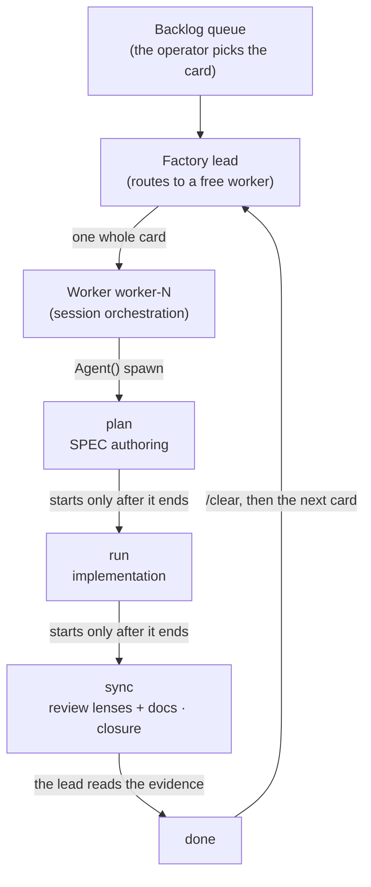



# Factory Mode


 <strong>Value affiliation</strong>: multi-session orchestration · tokenomics


Factory Mode is the second form of Kanban Mode. Where kanban is a board on which three role companions carry one card between columns, the factory is an assembly line on which **N numbered workers** carry several cards at once. A card does not hop between columns — it goes **whole** into one free worker, and that worker owns it end to end through `plan → run → sync`, in order, in-session.

The entry is the dedicated token `-f`: as the kanban chain uses `-k`, the factory uses `-f`. The queue, evidence reading, integration, and disposal rules are identical to kanban — the only thing that changes is the shape of how cards flow across the board.

## Where factory diverges from kanban

| | Kanban Mode (`-k`) | Factory Mode (`-f`) |
|---|---|---|
| Session makeup | 1 lead + 3 role companions (`plan` · `run` · `sync`) | 1 lead + workers `worker-1` … `worker-N` |
| Card movement | column to column, session to session | whole into one worker, phases in order inside the worker |
| Phase execution | each column's companion session owns it | the worker spawns each phase as an `Agent()` sub-agent and runs it |
| Card classes | A/B/C define which **columns** the card **passes through** | A/B/C name only the **ceremonies** the card skips — no card ever changes sessions |
| `/clear` boundary | between phases | between cards |

In kanban, the card class defined the shape of the shortcut — Class A skipped the `plan` column, and so did Class B. The factory has no session seated per column, so this distinction dissolves. The class still names the ceremonies the card skips (Class B proceeds without `plan`, so no SPEC exists; Class A goes straight to closing), but it no longer changes which session works the card. Every worker performs whatever phases remain for its card, serially.

## Entry — opening the lead and the workers

```bash
# Lead — opens the factory lead (one worker, worker-1)
$ moai cc -f

# Workers — each in its own terminal; the role token joins the next free number
$ moai cc -f worker
$ moai cc -f worker
$ moai cc -f worker

# You can also pick a number directly and join exactly that worker
$ moai cc -f worker-3

# GLM-backend workers take the same form
$ moai glm -f worker
```

Attach no value to `-f` and the factory lead opens. To join as a worker, use `-f worker` (auto-join the next free number) or `-f worker-<n>` (exactly that number) — like kanban's companions, workers are launched **by hand, each in its own terminal**. There is no path by which a session launches another session.

**When a number collides with a live legacy worker.** A worker launched under an old spelling — `agent-<n>` or `lane-<n>` — shares the same number space. When `-f worker-<n>` names a number a live legacy row already holds, the join is refused by name — e.g. `worker-3 is held by legacy label agent-3 (a live session launched under the legacy spelling; legacy agent-<n> and lane-<n> labels share the worker number space) — pick another number with -f worker-<n>, or use -f worker to take the next free one`. Auto-assigning the next free number with `-f worker` is never refused; it reports by name which legacy numbers it skipped — e.g. `factory: skipped number(s) held by legacy label(s) lane-2 — legacy agent-<n> and lane-<n> labels share the worker number space; launching as worker-3`.

**The legacy spellings are deprecated aliases.** `-f agent` (and the `agent-<n>` label) and `-f lane-<n>` / `--name lane-<n>` still parse and produce exactly the same result, but as the canonical form (`-f worker`, `worker-<n>`) settles in, every launch prints a "deprecated spelling" hint. Nothing has been removed — only the hint nudging you toward the new spelling is on.

One launch takes one entry token — passing `-k` and `-f` together is an error. The v1.2.0 unified entry forms — `-k <N>` (lead) and `-k <N> --name worker-<i>` (worker) — remain valid (a bare `-k --name worker-<i>` with no N defaults to 8 workers). `--name lane-<i>` also keeps working as a deprecated alias. As the kanban lead's socket opens at `/tmp/moai-socket-kanban/<run-id>`, the factory lead's socket opens at `/tmp/moai-socket-factory/<run-id>`, and the bootstrap notice carries the actual path. CG is retired; use `moai migrate cg` to preview explicit migration choices.

## The lead's routing — whole cards to free workers

What the factory lead does differs from a kanban lead. Where a kanban lead coordinates the phases of one card, the factory lead **routes already-picked cards to free workers**. A "free worker" here means the previous card has reached `done` and the lead has read its evidence — a worker holding a card is not called, and when every worker is busy, the card is not routed and waits in the queue.

The actor that picks a card is always the operator (`moai todo next <n>`); the factory lead does not scan the queue and line cards up. The kanban foreman loop (a bare `/loop`) is no exception — it dispatches the next card already marked `picked` and never picks one itself. The dispatch block takes the same form as kanban, with the `cmd` field pointing at the entry phase the class dictates — `/moai plan` for Class C, `/moai run` for Class B, direct close for Class A. The worker proceeds through the remaining phases on its own, with no further dispatches.

## The 3 stages inside a worker — serial

How one worker passes one card fits in three sentences. **Run does not start until plan finishes, and sync does not start until run finishes** — a worker never runs two phases of the same card at once. Each phase's execution is spawned by the worker as an `Agent()` sub-agent; the worker itself only orchestrates. Sub-agent output stays in that session's window, and the worker reads the evidence they leave to assemble the result.



Human gates still fire while the phases proceed. Human approval points such as Implementation Kickoff Approval are never passed automatically inside a worker.

## Parallelism caps and isolation

Each worker can run **up to 10 agents concurrently** — the launcher injects a `CLAUDE_CODE_MAX_CONCURRENT_SUBAGENTS` cap into each worker session, so N workers fanning out simultaneously divide the machine's capacity by construction rather than by operator restraint.

Parallelism has two axes, and they do not mix:

- **Between cards (fan-out)** — you can attach a worker per card and push several at once. Each worker writes only inside its own card directory (`.moai/specs/<SPEC-ID>/`), so parallel writes do not collide.
- **Within a card (stages)** — the phases of one card are serial. Two write agents are never attached to the same card in parallel — one card, one writer at a time.

When spawning write-capable sub-agents in parallel, always attach worktree isolation (`isolation: "worktree"`) — each write agent works in its own worktree copy, so file writes do not collide even outside the card directory, and the worker integrates through evidence and merges. Read-only investigation and audit fan-outs are not isolated — a place where the worktree setup cost buys nothing.

### Staggered activation and no model override

Never activate every worker at once. Activate the first worker, wait for evidence that it has started producing output (first job or visible progress), then activate the remaining workers — concurrent requests cannot read a cache entry still being written, so simultaneous activation breaks cache efficiency. For the same reason, do not put a model override on dispatch messages — the GLM tier mapping rides the `ANTHROPIC_DEFAULT_*_MODEL` slot environment variables, and a per-spawn override splits the caches and can bypass the slot→GLM mapping.

## Worker-number ownership — factory.db

Which worker holds which number is recorded in `~/.moai/db/<project-key>/factory/factory.db`. A project whose launch directory is a temporary one (no absolute `MOAI_HOME` override) keeps this database project-local at `<base>/.moai/db/<project-key>/factory/factory.db`, the same exception the backlog queue follows. When a new worker opens, its number skips **only those held by live sessions** and attaches to the next free number — a dead worker's claim no longer blocks its number (leftover claims are cleared from the database too) — an explicitly-picked `-f worker-<n>` can reuse that number right away, but `-f worker` auto-assignment always takes one past the highest live number and never backfills a gap. A worker launched under a legacy spelling (`agent-<n>` / `lane-<n>`) shares the same number space, so auto-assignment skips live legacy rows and reports them by name, and an explicitly-picked number colliding with a live legacy row is refused (see "When a number collides with a live legacy worker" above). A legacy `.moai/state/factory/workers.json` is imported once and retained as rollback evidence. The `-f worker-<n>` form (or legacy `-f lane-<n>`) already names the worker, so passing `--name`/`-n` alongside it is an error.

## What does not change

The factory changes only the shape of how cards flow. The remaining rules stand word for word as in kanban:

- **The delegation channel is the queue on disk.** A dispatch is a pointer, not a copy; a message is a nudge, never the delegation itself.
- **Completion is judged only on evidence read.** A card advances on whether the progress record was read, not on whether the worker replied. The final PASS/FAIL verdict is always the lead's — the worker that produced the work judging its own output is not an allowed shape.
- **The `/clear` boundary sits between cards.** Losing the between-phase handoffs is the point of this mode, but the between-card handoff does not go away — when a card reaches `done`, the worker is `/clear`-ed before taking the next one.
- **A card worktree is not disposed of until the remote merge lands.** If the branch is not yet merged, the worktree is the only copy of that work.

## Related docs

- [Kanban Mode](/en/advanced/kanban-mode) — the first form, three roles carrying one card between columns. Card classes and the board·queue rules shared with the factory
- [`/moai todo`](/en/utility-commands/moai-todo) — the backlog queue that admits cards onto the board. The operator is the one who picks
- [manager-lead Lead Coordinator](/en/advanced/manager-lead) — the coordination agent that drives dispatch inside a kanban or factory lead session
- [`/moai loop`](/en/utility-commands/moai-loop) — the unattended foreman driven by a bare `/loop`. The same "never picks, only routes" boundary as the factory lead
- [Kanban Board Terms](/en/core-concepts/kanban-board-terms) — the formal glossary with definitions and examples of card, column, lane, and lead
