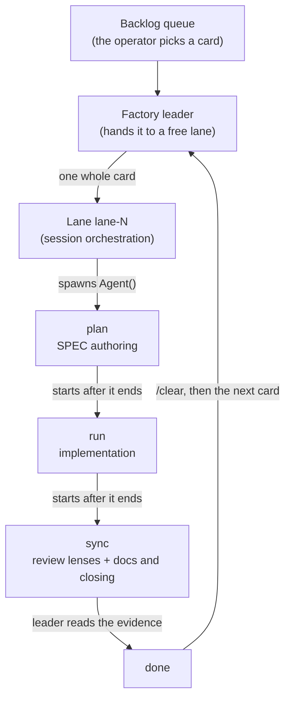



# Factory Mode


 <strong>Value area</strong>: multi-session orchestration · tokenomics


Factory Mode is an assembly line that carries several cards at once with one **leader** session and several numbered **lane** sessions. A card does not hop between columns. It goes **whole** into one free lane, and that lane is responsible for it through `plan → run → sync`, in order, inside its own session.

There are only two entry tokens, and neither takes an argument. `-f` opens the leader and `-l` joins as a lane. These tokens only start or join sessions. They run no pipeline, arm no goal, and select no SPEC.

## Entry forms

| What you want | Command | Role |
|---------------|---------|------|
| Open the factory leader | `moai cc -f` · `moai glm -f` (long form `--factory`) | Leader |
| Join the running factory as a lane | `moai cc -l` · `moai glm -l` · `moai codex -l` (long form `--lane`) | Lane |

- `-l` joins the running factory and takes the **next lane number automatically**. You do not pick the number; it is one past the highest live lane. If no factory is running, the join is refused.
- `moai codex` has no leader entry. It can only join as a lane; open the leader with `moai cc -f` or `moai glm -f`.
- A launch carries at most one entry token. `-f` together with `-l` is an error.

```bash
# Leader: open the factory leader
$ moai cc -f

# Lanes: each in its own terminal, joining the next number (lane-1, lane-2, ...)
$ moai cc -l
$ moai cc -l
$ moai glm -l      # a lane on the GLM backend, same form
$ moai codex -l    # a Codex lane
```

You start lanes **by hand, one per terminal**. There is no path for a session to start another session on your behalf.

### Refused forms

An entry carrying a value is refused with a one-line error. The message names the correct form.

| Refused form | Why |
|--------------|-----|
| `moai cc -f <value>` (a SPEC ID, a number, a lane label) | `-f` takes no argument. Open the leader with `-f` alone and join lanes with `-l` |
| `moai cc -l <value>` (a name such as `lane-2`) | A lane does not name itself. The number is assigned automatically |
| `-f` on `moai codex` | Codex has no leader entry (use `moai cc -f` or `moai glm -f`) |
| `-f` and `-l` in one launch | Only one entry token is allowed |
| The retired `-k` entry | The old multi-session board mode was removed. The error message points to `-f` and `-l` |
| `moai cg`, `moai gpt` | `moai cg` is retired and exits with a migration notice (preview with `moai migrate cg`). `moai gpt` does not exist; GPT models run through `moai codex` |

## When several runs are alive

A lane join reads the run record first. Two selectors can accompany `-l`.

| Selector | Role |
|----------|------|
| `--leader <name>` | Picks which leader session to join (default `leader`). It composes with `-l` or `--lane` only, and is not a short form of any entry token |
| `--factory-run <run-id>` | Picks the run to join by its id |

`--leader` and `--factory-run` are different selectors and cannot be combined. If more than one run is alive and the join cannot decide where to go, it is refused, and the error tells you to choose either `--factory-run <run-id>` or `--leader <leader-name>` together with `-l`. A run whose owner is dead can be retired with `moai factory runs --retire <run-id>`.

**A join still works when the run record is missing but the leader is alive.** When there is no active record at all (the record retired itself, or the leader never wrote one), the join is not refused outright. It verifies the live leader session of this project by pid and process-start fingerprint, restores the run record under that leader's identity, and then joins through the ordinary gate. If more than one leader is verified, it names every candidate and fails closed; if none is, the refusal stands.

## Lane options

These options attach to a lane on `moai cc -l` and `moai glm -l`. Codex lanes take no policy.

| Option | Effect |
|--------|--------|
| `--clear-policy <value>` | Decides how the lane clears its context after finishing a card. `clear-each` (the default, asks for `/clear` after every card), `clear-when-full` (asks only when context usage reaches the model-specific handoff threshold), `relaunch` (asks you to end the session, and the supervising launcher starts a fresh session for the next card) |
| `--no-auto-dispatch` | Starts the lane in manual mode. The default is a **self-dispatch** lane, which does not wait for the leader and leases the next queued card itself with `moai factory next`. With this option the lane takes only the cards the leader sends |

## How a card flows

What the leader does is **hand a card that has already been picked to a free lane**. A free lane is one whose previous card reached `done` and whose evidence the leader has read. If every lane is busy, the card is not handed out and waits in the queue.

The actor that picks a card is the operator. Picking in person is `moai todo next <n>`; picking in advance is invoking `/moai:todo --auto`, and that invocation is the approval: the invoked session takes cards on its own judgment. A lane session takes them only through the factory lease (`moai factory next --card <id>`) and never a card the operator has held or parked, while the operator session's serial cycle does not exclude a parked card but ranks it last. Admitting a card to the queue stays the operator's in both cases. The leader does not scan the queue and rank cards on its own. A self-dispatch lane changes nothing about that rule: all the lane does with the queue is lease the next card that is already on it with `moai factory next`, and queue changes that create, remove, or edit cards are forbidden to a lane.

A dispatch block has fixed fields (`card`, `cmd`, `wt`, `evidence`) and never exceeds 10 lines. `cmd` points at the entry stage the card class prescribes: `/moai plan` for a design change (Class C), `/moai run` for a defect of unknown cause (Class B), and a direct close for a one-line chore (Class A). The lane carries the remaining stages itself, with no further dispatch.

## How three stages run inside a lane

How a lane carries one card comes down to three sentences. **Run starts only after plan has finished, and sync starts only after run has finished.** A lane never runs two stages of the same card at once. The lane spawns each stage's execution as `Agent()` sub-agents and only orchestrates; a sub-agent's output stays in that agent's window, and the lane reads the evidence it leaves behind and merges the result.


```mermaid
flowchart TD
    Queue["Backlog queue<br/>(the operator picks a card)"] --> Lead["Factory leader<br/>(hands it to a free lane)"]
    Lead -->|"one whole card"| Lane["Lane lane-N<br/>(session orchestration)"]
    Lane -->|"spawns Agent()"| Plan["plan<br/>SPEC authoring"]
    Plan -->|"starts after it ends"| Run["run<br/>implementation"]
    Run -->|"starts after it ends"| Sync["sync<br/>review lenses + docs and closing"]
    Sync -->|"leader reads the evidence"| Done["done"]
    Done -->|"/clear, then the next card"| Lead
```

A card class names only the ceremonies a lane skips. Class B runs without `plan`, so it has no SPEC, and Class A goes straight to a direct close. No card changes sessions, and every lane runs whatever stages remain for its card in series. Human gates such as the implementation kickoff approval still fire while the stages run.

After `run` and before integration, a lane passes one more stage, `card-review`. It is a card-scope self-review whose result is written to `.moai/reports/<card-id>/card-review.md`. It is an advisory signal and replaces neither the leader's evidence read nor an independent audit.

## Parallelism limits and isolation

Each lane can run **up to 10 agents at once**. The launcher plants `CLAUDE_CODE_MAX_CONCURRENT_SUBAGENTS=10` in the lane session (leaving an existing value alone), so N lanes fanning out together split the machine's capacity by configuration rather than by operator restraint.

There are two axes of parallelism, and they are not mixed.

- **Across cards (fan-out)**: give each card its own lane and several move at once. Each lane writes only to its own card directory (`.moai/specs/<SPEC-ID>/`), so parallel writes do not collide.
- **Within a card (stages)**: the stages of one card run in series. Two write-capable agents are never attached to the same card. One card, one writer at a time.

When write-capable sub-agents are spawned in parallel, they must carry worktree isolation (`isolation: "worktree"`). Each write agent then works in its own worktree copy, so file writes do not collide even outside the card directory, and the lane integrates through evidence and a merge. Read-only investigation and audit fan-out is not isolated, because creating a worktree buys nothing there.

Do not switch on all lanes at once. Bring up the first lane, wait until it actually starts producing output, and then start the rest. Concurrent requests cannot read a cache entry that is still being written, so a simultaneous start breaks cache efficiency.

## Lane numbers and the run record

Which lane holds which number is recorded in `~/.moai/db/<project-key>/factory/factory.db`. A new lane takes **one past the highest live lane** and does not fill a gap: with live lane-1 and lane-3, the new lane is lane-4. A dead lane's claim no longer blocks a number. Because lane numbers are assigned automatically, combining `--name`/`-n` with `-l` is an error.

The leader's socket opens at `/tmp/moai-socket-factory/<run-id>`, and the bootstrap notice tells you the actual path. When a leader or lane session starts, it writes one session record to `.moai/state/todo/<session-id>.json` holding its role, backend, and entry time.

A factory session raises the consecutive Stop-hook block cap to `CLAUDE_CODE_STOP_HOOK_BLOCK_CAP=200` at launch. This allows longer unattended runs and is not a way around any gate: the human approval gates are questions the orchestrator asks, not Stop-hook blocks.

## What does not change

- **The delegation channel is the queue on disk.** A dispatch is a pointer, not a copy, and a message is only a nudge, never the delegation itself.
- **Completion is judged only on evidence that was read.** A card moves on because the progress record was read, not because a lane replied. The final PASS/FAIL verdict is always the leader's, and a lane judging its own output is not allowed.
- **The `/clear` boundary falls between cards.** Once a card reaches `done`, the lane is cleared before it takes the next one (changeable with `--clear-policy`).
- **A card's worktree is not discarded until the remote merge is done.** If the branch is not yet merged, the worktree is the only copy of the work.
- **One card, one worktree.** A new card starts in a new worktree, and a lane session starts inside its card's worktree and stays there.

## Related documents

- [Origin-Trail Chain](/en/advanced/origin-trail-chain) — how worktree session lineage is recorded and queried with `moai chain`
- [`/moai todo`](/en/utility-commands/moai-todo) — the backlog queue that holds cards. The operator picks the card
- [manager-lead Leader Coordinator](/en/advanced/manager-lead) — the coordination agent that dispatches for the factory leader session
- [`/moai loop`](/en/utility-commands/moai-loop) — the unattended foreman driven by a bare `/loop`, with the same "carry, never pick" boundary as the factory leader
- [moai cc / glm Launchers](/en/cli-reference/launchers) — every launcher flag, `-f` and `-l` included
