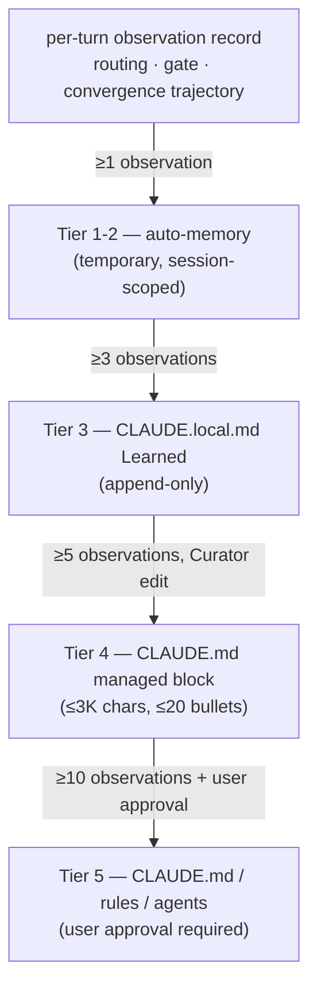
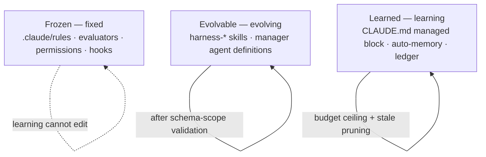



# Harness Learning Surface

A harness (the automated quality-verification apparatus surrounding an agent) improves across sessions not because model weights change, but because harness code and instructions change. This page covers the **learning surface** — the touchpoint where observations accumulated by the harness are surfaced as rules, and which the user directly observes and approves. The pipeline internals (the ACE role model, the 3-Loop, the promotion engine) are placed on a separate [Harness Self-Evolution](/en/advanced/self-evolving/) page; here we cover only "what accumulates as observations, how far it changes automatically, and where the user intervenes."

## What the Learning Surface Is

The learning surface starts from the **observations** (a line recording a routing decision, gate evidence, or convergence trajectory as a privacy-preserving digest) the harness automatically leaves every turn, follows them as they cluster into **patterns**, and ends at the full path up to the **instruction** promoted and shown to the user as a file. The user directly touches only three surfaces — the temporary auto-memory (session-scoped memory), the Learned section of CLAUDE.local.md (the local development guide) that persists in the project, and the managed block of CLAUDE.md (the project instructions file) that the whole team follows. Observations rise up through these three surfaces, and the user decides which of them to accept as rules.

The reason this surface matters is that the harness's self-improvement must ultimately happen only on top of "files the user can review." If instructions change in an invisible place, debugging becomes impossible, and routines that worked yesterday quietly shift, making the cause hard to find. So MoAI-ADK fixes the surface where promotion happens at three, and mechanically gates when and how each surface is used. No matter how deep the SPEC (requirements document) workflow goes, the learning result always appears inside these three files.

## The Path from Observation to Rule

A single line of observation becomes a user-readable rule by climbing a four-stage ladder keyed to frequency. A one- or two-time observation stays only in temporary memory and disappears; when the same pattern repeats and crosses a threshold, it finally rises to a longer-lived surface.

The heart of this ladder is the **threshold**. Something observed once may be an exception, but a pattern repeated five times is a rule. So at low tiers, only temporary memory absorbs the noise, and only observations past the threshold rise to a longer-lived surface. The change the user perceives happens mostly at Tier 3 and Tier 4 — one day a new line appears in the Learned section of CLAUDE.local.md, and when the pattern solidifies a single bullet rises into the managed block of CLAUDE.md.

| Tier | Threshold | Surface reached | Who writes |
|------|-----------|-----------------|------------|
| Tier 1-2 | ≥1 observation | auto-memory (temporary) | automatic |
| Tier 3 | ≥3 observations | CLAUDE.local.md (append-only) | automatic |
| Tier 4 | ≥5 observations | CLAUDE.md managed block (≤3K chars, ≤20 bullets) | Curator |
| Tier 5 | ≥10 observations + user approval | CLAUDE.md / rules / agents | user approval required |

The managed block has character-count and bullet-count ceilings. These ceilings exist to prevent the harness from infinitely inflating instructions under the guise of learning — a file that must be read at every session start growing larger breaks prompt-cache hits and ultimately raises both cost and response time. The Curator (the role that updates instructions) works within these ceilings, adding or removing at the bullet level rather than rewriting existing bullets wholesale.

## The 3-Zone Editing Surface

To keep the harness from editing its own report card, the editable surface is strictly divided into three Zones. This separation is the most important safeguard against the learning loop falling into reward hacking (the act of editing evaluation criteria to raise one's own score).

 **The Frozen Zone is the fence around the harness.** The evaluators that judge the SPEC workflow, the permission modes, the hook registrations, and the frozen-guard itself all live here. The learning loop cannot make its own permissions or its own safeguards the target of proposals — if this constraint breaks, a path opens for the harness to cover its own flaws.

The Evolvable Zone is where the harness's own definitions (user-defined skills, manager-agent definitions, auto-detection blocks) live. This surface can change, but only after schema-scope validation (changes allowed only within a predeclared format) and regression tests. The Learned Zone is where learning results accumulate, with budget ceilings (character count, bullet count) and stale pruning (cutting old entries) applied. From the user's point of view, the only one of the three Zones you open day-to-day is the Learned Zone; the other two can be left as "do not touch / changes only in limited ways."

## The User Approval Gate

Tier 5 — changes that touch rules in CLAUDE.md, `.claude/rules/`, or agent definitions — are **never applied without user approval.** The harness can produce a promotion proposal and show it to the user, but the entity that writes the proposal to the actual file is the user. This gate automates learning from "observation → pattern → rule" but always leaves the last step from "rule → project instruction" to a human decision.

 When a proposal is rejected or rolled back, that pattern key remains in the ledger as **negative evidence** (a record that "this proposal was not accepted"). This prevents the same proposal from coming back and pestering the user again — a proposal once answered "no" does not rise again unless the threshold is re-met.

This design separates "automation" from "control." The harness automatically gathers observations, recognizes patterns, and assembles proposals, but leaves the final click that confirms a proposal as a rule to the user. So learning is fast without losing direction.

## Relationship to the Self-Evolution Pipeline

The learning surface covered on this page is limited to "the surface the user sees and touches." The internal pipeline underneath that gathers observations, extracts patterns, and assembles promotion proposals — the ACE role model (Generator → Reflector → Curator), the 3-Loop structure (observation → reflection → promotion), the GLM observe-only policy — is documented on the [Harness Self-Evolution](/en/advanced/self-evolving/) page. The two pages are split because what a user who uses the harness day-to-day needs is "which file do I open to see the learning result, and how far is automatic" — not the inner workings of the loop. A user curious about the internals goes to the self-evolving page; a user curious about "why did a new bullet appear in my CLAUDE.md today" reads this page.

## Next Steps

- [Harness Self-Evolution](/en/advanced/self-evolving/) — the internal pipeline that assembles observations into promotion proposals underneath the learning surface
- [Decision Memory](/en/advanced/decision-memory/) — where learning results connect to project decisions
- [Tokenomics Overview](/en/advanced/tokenomics-overview/) — where the size ceiling of the managed block meets token cost
