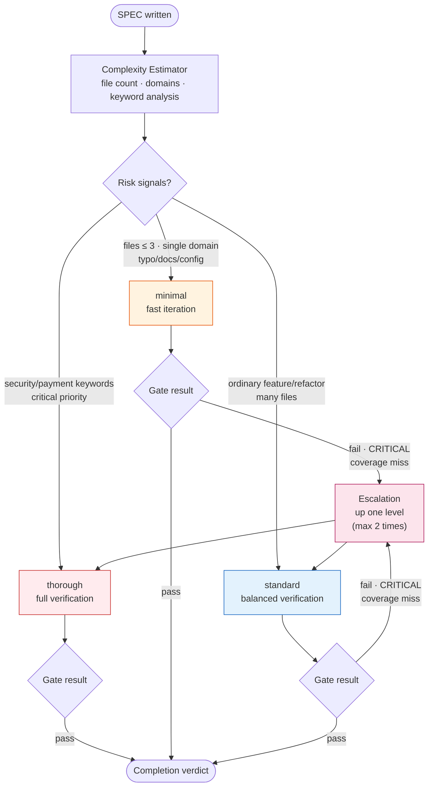
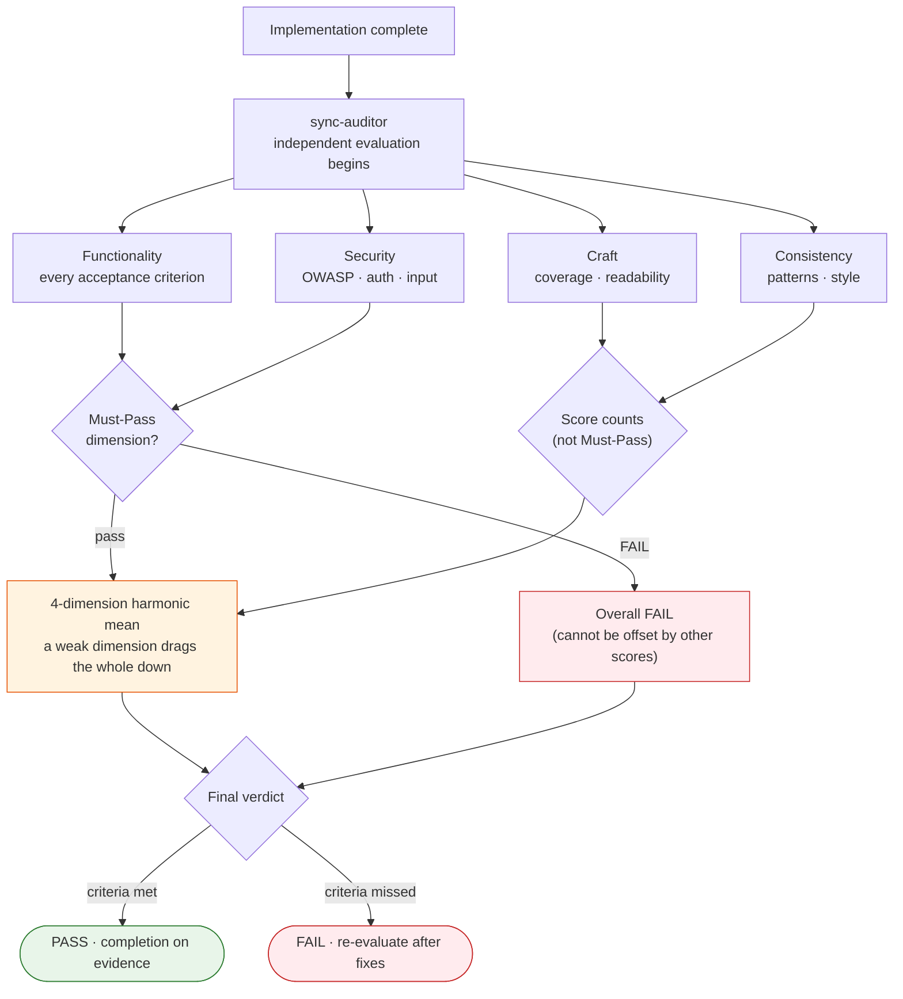

Running a full security audit to fix a one-line typo leaks tokens; running only a light check on a payment system invites an incident. Pouring the same depth of verification over every change fails to avoid one of these two failures. That is the problem MoAI-ADK solves — it adjusts verification depth by itself to match the weight of the change, and entrusts evaluation not to the side that wrote the code but to an independent evaluator agent.


**One-line summary:** verification depth is set automatically to the complexity of the SPEC (the requirements document), and the completion verdict is delivered on the strength of an independent evaluator's scores and evidence — not on "it seems done."


## Two ideas, interlocking

The harness (the machinery that performs quality verification automatically) runs on two distinct ideas meshed together. One is **adaptive depth**; the other is **independent evaluation**.

**Adaptive depth** — it reads the scale and risk of the SPEC and picks one of three verification-depth levels. A typo fix never triggers a full audit; a change to the payment domain never slips past with a light check. Because the system grabs the verification intensity that fits the task, the chore of picking a level every time disappears, and verification cost stays proportional to the risk of the outcome.

**Independent evaluation** — when the agent that built the code (an AI helper that works on its own) grades its own output, the grade always comes out generous. So evaluation belongs to a separate agent, sync-auditor, structurally divorcing the builder from the grader. Neither the agent that planned the work nor the agent that implemented it can touch the evaluation.

## The 3-level harness

Verification depth comes in three levels. Each level differs in the steps it skips, evaluator participation, and gate strictness.

| Level | When it applies | Evaluator | Character |
|------|--------------|--------|------|
| **minimal** | Simple changes — typos, docs, config edits, single domain with 3 or fewer files | Skipped | Fast iteration. Skips most verification steps |
| **standard** | Ordinary development — new features, refactoring, many files | One final pass | Balanced quality checks. Most work lands here |
| **thorough** | Risky changes — security/payment keywords, auth · migration · public API, critical priority | Repeated evaluation per sprint | Full verification + TRUST 5 gates + cross-validation |

The level is chosen automatically by the **Complexity Estimator**, which reads the SPEC's scope. Taking file count, domain count, SPEC type, plus security/payment keywords and critical priority as its conditions, it picks one of minimal · standard · thorough. Not running thorough verification on a typo fix is itself the design that keeps verification cost proportional to outcome risk.

The level is not fixed once and forever. If a quality gate fails mid-verification, a CRITICAL finding appears in review, or coverage drops below 70%, the level steps up. This **escalation** happens at most twice, so even work classified as an "easy change" leaves no gap when risk surfaces midway — it moves into deeper verification.

One caution. The minimal level skips most verification steps, but the **plan-audit (plan-auditor) gate is on without exception**. In the past, when the minimal level had plan audits disabled, 30 SPECs were created without passing audit, and 386 cross-defects burst at once. After that incident, the plan-audit gate was pinned globally on, regardless of level — verification depth is economized, but a plan that goes unexamined never happens again.

In CG mode (the hybrid execution of a Claude leader + GLM workers), the level stays thorough regardless of auto-detection. Handing implementation to GLM workers and evaluation to the Claude leader naturally forms a Generator-Evaluator separation.

## 4-dimension scoring

The independent evaluator, sync-auditor, inspects the result along four dimensions. Each dimension asks its own question.

| Dimension | The question it asks | Default weight | Must-Pass |
|------|----------|------------|-----------|
| **Functionality** | Does it achieve the intended purpose — did every acceptance criterion pass | 40% |  Yes |
| **Security** | Is it safe — no holes in OWASP, authentication, authorization, input validation | 25% |  Yes |
| **Craft** | Is it well made — readability, structure, test coverage | 20% |  No |
| **Consistency** | Does it follow the project's rules — code style, pattern adherence | 15% |  No |

### Harmonic mean — a weak dimension drags the whole score down

When combining the four dimension scores, MoAI-ADK uses the **harmonic mean**, not the simple average. The gap between the two turns dramatic the moment even one result lies at the bottom.

Suppose a result scored 0.25 on Security and a perfect 1.00 on Functionality. A simple average would read (1.00 + 0.25) / 2 = 0.625 and let it pass as "passable." The harmonic mean reacts sharply to the weak side — with one dimension at the floor, no height in the others can pull the whole up. The intent is unmistakable: a security hole cannot be "offset" by excellent functionality. Adding strong and weak dimensions together to paper over each other is blocked structurally.

### The Must-Pass firewall

Stronger than the harmonic mean is the **Must-Pass firewall**. Functionality and Security are Must-Pass dimensions — these two cannot be filled in with other dimensions' scores. If even one Critical or High severity vulnerability is found in Security, the overall verdict becomes FAIL on the spot, even with perfect scores in Functionality and Craft. The compromise "the security has holes but the features are excellent, so pass" is structurally impossible.

Craft and Consistency are not Must-Pass. They contribute to the overall score and leave quality signals, but they never block a pass on their own — the judgment being that code quality and consistency matter, yet are not as immediate a blocking reason as functionality and security.

## Rubric anchors to stand scores on

Left alone, an LLM evaluator's scores swing with its "mood." To prevent lenient-verdict-today, harsh-verdict-tomorrow, every score carries a four-level **rubric anchor**. The evaluator picks one of 0.25 / 0.50 / 0.75 / 1.00 and must attach the evidence for why that anchor applies.

| Score | Level | Meaning |
|------|------|------|
| 0.25 | Below bar | Basic requirements not met |
| 0.50 | Partial | Partially met, improvement needed |
| 0.75 | Met | Mostly met, only minor improvements remain |
| 1.00 | Excellent | Every criterion fully met |

The score is not a continuous number but four fixed footholds. Making it impossible for the evaluator to produce an ambiguous "around 0.6" anchors the verdict in evidence rather than in the evaluator's state.

## Five mechanisms that suppress evaluator bias

Five mechanisms work together so scores never gather inertia. Any one alone is insufficient; layered, they finally make evaluation consistent.

| # | Mechanism | What it does |
|---|------|--------|
| 1 | **Rubric anchoring** | Forces every score to carry its rubric evidence |
| 2 | **Regression baseline watch** | Suspects bias when scores jump abnormally above prior projects |
| 3 | **Must-Pass firewall** | Keeps Functionality · Security failures from being covered by other dimensions' scores |
| 4 | **Independent re-evaluation** | Readjusts scores when deviation between repeated evaluations crosses the threshold |
| 5 | **Anti-pattern cross-check** | Lowers the cap of the affected dimension's score when a known anti-pattern is found |

The shared direction of the five is one thing — narrowing, layer over layer, the path where the evaluator issues a PASS because it "roughly looks good."

## Evaluation profiles — criteria that adapt to the work

Four profiles live in `.moai/config/evaluator-profiles/`. The same four dimensions carry different weights and different pass thresholds depending on the character of the work.

| Profile | Character | Must-Pass threshold | Work it suits |
|--------|------|---------------|--------------|
| `default` | Balanced baseline | All of Functionality PASS · no Critical/High in Security | Most ordinary work |
| `strict` | Strictest | All four dimensions individually ≥ 0.80 · zero security vulnerabilities | Security · payments · migration · public API |
| `lenient` | Lenient | Only no Critical in Security · unverified items allowed | Prototypes · experiments · non-operational code |
| `frontend` | UI/UX specialized | Tuned to frontend quality criteria | Screen · interaction work |

`strict` pairs with the thorough level — in risky domains like authentication or payments, it raises evaluation criteria alongside verification depth and closes the gap from both sides. `lenient`, conversely, permits the "it just needs to run" judgment at the prototype stage, so fast experiments are not crushed under excessive verification cost.

## An evaluator that starts fresh every iteration

Each time the GAN Loop (an adversarial generator-evaluator loop for quality improvement) completes a round, sync-auditor restarts on a **fresh context**. The previous iteration's judgment rationale is not loaded into the new prompt; the only thing carried across iterations is the state of the Sprint Contract (the agreement recording each iteration's goals and status).

This design is deliberate — to stop the evaluator from clinging to its own prior judgment and scoring by inertia. Instead of letting a result once judged "roughly fine" pass the next iteration on that momentum, it is made to look again with new eyes every time. This memory scope is **FROZEN** (frozen — a system-enforced unchangeable rule) and cannot be modified in config.

## Configuration

All values live in `.moai/config/sections/harness.yaml`. The key entries:

- **Default evaluation profile** — when a SPEC names no profile, `default` is used.
- **Memory scope** — fixed to `per_iteration`; it cannot be changed.
- **Auto-detection rules** — the entry conditions for each of minimal · standard · thorough (file count, domains, keywords, priority) are written here.
- **Escalation** — quality-gate failure · CRITICAL review · coverage miss are the triggers that step up one level, at most twice.
- **Effort mapping** — defines how each level maps to the model's reasoning depth (minimal→low, standard→medium, thorough→high).
- **Plan-audit global pin** — forces the plan-audit gate on regardless of level.

Editing this file directly lets you tune auto-detection sensitivity, escalation count, and the steps each level skips to fit your project. The memory scope and the plan-audit global pin, however, cannot be changed by design.

## Why go this far

Matching verification depth to the task, pulling evaluation away from the builder, standing scores on footholds, and wiping the evaluator's memory every run — all of these devices guard one conclusion: that the verdict "the code is complete" rests on evidence and independent judgment, not on someone's feel or inertia. Verification must be proportional to the risk of the outcome, and completion must start from doubt. Because the system enforces both principles from the outside, the same yardstick lands on the code even as sessions change and tasks change.

## Related documents

- [Harness Engineering](/en/core-concepts/harness-engineering) — the full picture of the harness concept
- [TRUST 5 Quality](/en/core-concepts/trust-5) — the five quality criteria: Tested · Readable · Unified · Secured · Trackable
- [Constitution System](/en/core-concepts/constitution) — the split between FROZEN and Evolvable rules
- [Harness Learning](/en/advanced/harness-learning) — the learning surface where observations pile into rules
