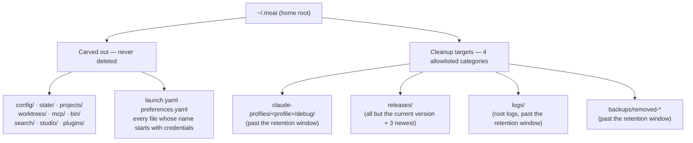
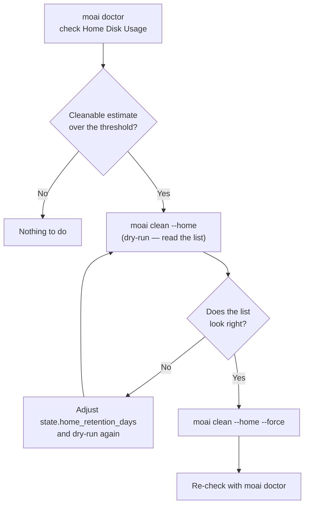



# Home Directory Hygiene (~/.moai)

Every piece of state MoAI keeps outside a project lands in one place: `~/.moai`. Per-profile debug logs, downloaded release binaries, the session registry, the worktree ledger, and backups all accumulate there. On a long-lived machine that directory quietly grows to several gigabytes — nobody looks at it, so it stays invisible until the disk fills.


**In one line**: `MOAI_HOME` decides where the home root lives, `moai doctor` tells you how full it is, and `moai clean --home` tidies only what its allowlist names. The three surfaces are one story.


## What accumulates where



Anything not on the allowlist is invisible to the scanner. And the carve-out wins **inside** an allowlisted container too: if an aged `backups/removed-*` directory holds even one file whose name starts with `credentials`, the whole directory is skipped. Rather than half-delete a backup, it is left alone entirely.

`~/.claude` is never deleted on any path. `moai doctor` **reports** its size and nothing more; `moai clean --home` does not read it at all.

## `MOAI_HOME` — relocating the home root

To move `~/.moai` elsewhere, point the `MOAI_HOME` environment variable at the root you want.

```bash
export MOAI_HOME=/Volumes/work/moai-home
```

Three rules govern the value.

| Value | Behavior |
|---|---|
| Non-empty **absolute** path | That path becomes the home root |
| Empty string | Treated as unset — falls back to `~/.moai` |
| Relative path | Disregarded — falls back to `~/.moai` |


 **Shell hooks do NOT honor `MOAI_HOME`.** Only the Go binary — the `moai` CLI and its subcommands — reads this variable. The shell script wrappers under `.claude/hooks/` and any external tool that writes the `~/.moai` path as a literal string never consult it, so they keep looking at the default location. Relocating `MOAI_HOME` therefore moves **the Go-side state only**, and the paths the shell hooks use diverge from it. Use it only when that limitation is acceptable.


The user's home directory itself resolves HOME-first: a non-empty `HOME` is used as-is, and only then does resolution fall through to the operating system's home lookup. That is why overriding `HOME` in a test or a container works identically on every platform.

## `moai doctor` — see how full it is first

`moai doctor` carries a **Home Disk Usage** entry in its diagnostic list. It is advisory: exceeding the threshold never blocks another command.

```bash
$ moai doctor
```

What the entry reports:

| Item | Content |
|---|---|
| Total size | The total `~/.moai` footprint plus its three largest entries |
| Per-profile breakdown | The size of each `claude-profiles/<profile>` with its category split |
| Release count | How many binaries remain in `releases/`, and the current version |
| Cleanable bytes | The estimate of what `moai clean --home` below could actually delete |
| `~/.claude` | Size only — never a cleanup target |

When the cleanable estimate exceeds the threshold (a compiled default of 500 MB) the status turns WARN and the message recommends `moai clean --home`. Below it, the status stays OK. The estimate calls **the same scanner** `moai clean --home` uses, so the number doctor quotes and the list clean deletes cannot drift apart.

## `moai clean --home` — allowlist-only cleanup

```bash
# Dry-run by default — reports what would be deleted, deletes nothing
$ moai clean --home

# Actually delete
$ moai clean --home --force
```

- **Dry-run is the default.** Nothing is deleted unless `--force` is given explicitly.
- The deletion scope is exactly the four allowlisted categories in the diagram above.
- Under `releases/`, the **currently running version** and the **3 newest of the rest** are protected; every other binary and its paired `.sha256` sidecar become candidates. `version.json` and `LATEST` are never candidates.
- The other three categories (`debug/`, root `logs/`, `backups/removed-*`) only produce candidates past the **retention window**.

### `state.home_retention_days`

The retention window is read from the **HOME tier** config file `~/.moai/config/sections/state.yaml`.

```yaml
state:
  home_retention_days: 30
```

| Value | Behavior |
|---|---|
| Key absent / file absent | The compiled default of **30 days** |
| Positive integer | Only entries older than that many days become candidates |
| `0` | Cleaning **disabled** — no candidate is produced at all |


This key is a **different key on a different tier** from `state.retention_days` in a project's `.moai/config/sections/state.yaml` (which governs project run-artifact retention). There is one home but many projects, so the read site is kept separate to stop two projects from cleaning the same home with two different windows.


## The order of operations



## Related documents

- [/moai clean](/en/utility-commands/moai-clean) — project dead-code cleanup, and how the `--home` surface differs
- [moai doctor diagnostics](/en/cli-reference/doctor) — the full check list and its subcommands
- [config section reference](/en/advanced/config-sections) — how config tiers and section files are structured
- [moai update](/en/cli-reference/update) — the side that creates `backups/removed-*`
