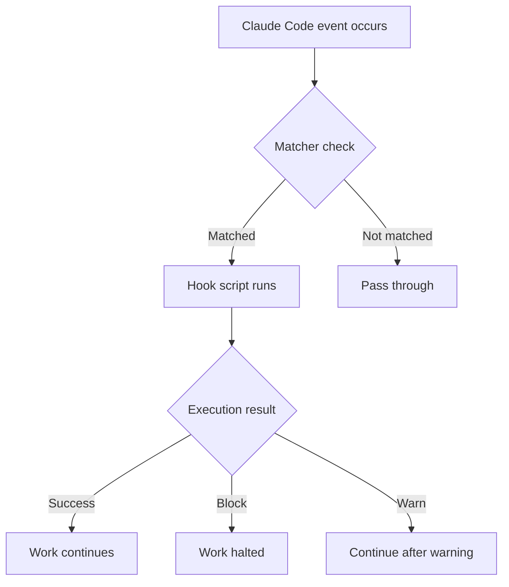
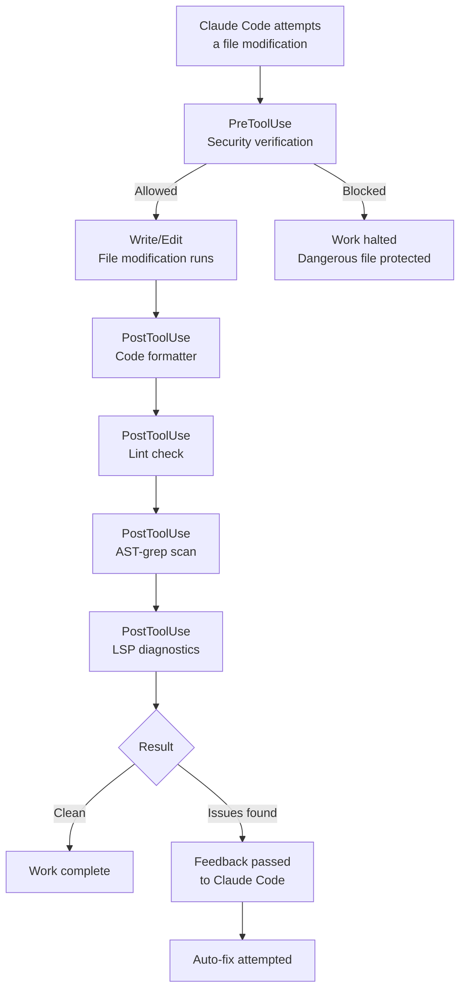

A detailed guide to Claude Code's Hooks system and MoAI-ADK's default hook scripts. In the agentic harness, a prompt is "guidance to follow," but a hook is "code that always runs" — hooks are the layer that puts quality gates and security defenses on determinism rather than probability.


**One-line summary**: Hooks are Claude Code's **automatic reflexes**. Save a file and it auto-formats; dangerous commands are auto-blocked.


## What Are Hooks?

Hooks are **scripts that run automatically** in response to specific Claude Code events.

In the analogy of a doctor's reflex test — tap the knee (the event) and the leg rises automatically (the script runs) — when Claude Code modifies a file (the PostToolUse event), the formatter runs automatically (cleaning up the code).



## Hook Event Types

This guide covers the frequently used core events. (For all 29 events, see the [Hooks Event Reference](/en/advanced/hooks-reference).)

### Main Event List

| Event | Fires when | Main uses |
|--------|-----------|----------|
| `Setup` | Startup with the `--init`, `--init-only`, `--maintenance` flags | Initial setup, environment checks |
| `SessionStart` | A session starts | Project info display, environment initialization |
| `SessionEnd` | A session ends | Cleanup, context saving |
| `PostSession` | After session end (self-hosted runner, CC 2.1.169+) | Post-session cleanup/telemetry; fires after the session is fully released, later than `SessionEnd`. MoAI-ADK does not currently wire this hook — documented as an available option for self-hosted deployments. |
| `PreCompact` | Before context compaction (`/clear`, etc.) | Backup of important context |
| `PreToolUse` | Before tool use | Security verification, blocking dangerous commands |
| **`PermissionRequest`** | When a permission dialog is shown | Automatic allow/deny decisions |
| `PostToolUse` | After tool use | Code formatting, lint checks, LSP diagnostics |
| **`UserPromptSubmit`** | When the user submits a prompt | Prompt preprocessing, validation |
| **`Notification`** | When Claude Code sends a notification | Desktop-notification customization |
| `Stop` | After a response completes | Loop control, completion-condition checks |
| **`SubagentStop`** | After a sub-agent's work completes | Handling sub-task results |

### Event Details

#### 1. Setup
Runs when Claude Code starts with the `--init`, `--init-only`, or `--maintenance` flags. Used for initial setup work and environment checks.

#### 2. SessionStart
Runs when a session starts or an existing session is resumed. Used for project status display and environment initialization.

#### 3. SessionEnd
Runs when a Claude Code session ends. Used for cleanup, context saving, and metrics collection.

#### 4. PreCompact
Runs before Claude Code performs a context-compaction operation (such as the `/clear` command). Used to back up important context.

#### 5. PreToolUse
Runs **before** a tool is invoked. It can block or modify the tool call. Used for security verification and blocking dangerous commands.

#### 6. PermissionRequest
Runs when a permission dialog is displayed to the user. It can allow or deny automatically.

#### 7. PostToolUse
Runs **after** a tool call completes. Used for code formatting, lint checks, and LSP diagnostics collection.

#### 8. UserPromptSubmit
Runs when the user submits a prompt, **before** Claude processes it. Used for prompt preprocessing and validation.

#### 9. Notification
Runs when Claude Code sends a notification. Can be customized into desktop notifications, sound alerts, and more.

#### 10. Stop
Runs when Claude Code finishes a response. Used for loop control and completion-condition checks — `/moai loop` and the goal engine operate on top of this event.

#### 11. SubagentStop
Runs when a sub-agent's work completes. Used to handle sub-task results.

### Events Implemented in MoAI-ADK

MoAI-ADK actually implements the following events (✓ = implemented, — = see official examples).

| Event | Status | Hook file |
|--------|------|-----------|
| `SessionStart` | ✓ | `session_start__show_project_info.py` |
| `PreToolUse` | ✓ | `pre_tool__security_guard.py` |
| `PostToolUse` | ✓ | `post_tool__code_formatter.py`, `post_tool__linter.py`, `post_tool__ast_grep_scan.py`, `post_tool__lsp_diagnostic.py` |
| `PreCompact` | ✓ | `pre_compact__save_context.py` |
| `SessionEnd` | ✓ | `session_end__auto_cleanup.py` |
| `Stop` | ✓ | `stop__loop_controller.py` |
| `Setup` | — | See official examples |
| `PermissionRequest` | — | See official examples |
| `UserPromptSubmit` | — | See official examples |
| `Notification` | — | See official examples |
| `SubagentStop` | — | See official examples |
| `TeammateIdle` | ✓ | Teammate idle detection and quality verification |
| `TaskCompleted` | ✓ | Task completion verification |


**SubagentStop handler unimplemented issue (v2.9.0)**: the `SubagentStop` event is registered in settings.json, but the Go handler is unregistered in `deps.go`. It currently returns only an empty response (`{}`).


### Agent Teams Event Details (v2.9.0)

#### The TeammateIdle Event
Runs when a teammate finishes work and enters the idle state.

- `continue: false` (exit code 2) → idle rejected; the teammate performs additional work
- `continue: true` (default) → idle approved

#### The TaskCompleted Event
Runs when a teammate completes a task.

- Exit code 2 → completion rejected (fixes needed)
- Exit code 0 (default) → completion approved

#### Team Shutdown Sequence [HARD]

When shutting down a team, you **must** follow this order.

1. **Send shutdown_request**: send `SendMessage(shutdown_request)` to each teammate
2. **Wait for responses**: receive `shutdown_response approve:true` from each teammate
3. **[HARD] tmux pane cleanup**: explicitly terminate the tmux panes
   - Read `~/.claude/teams/{team-name}/config.json`
   - Extract each member's `tmuxPaneId` (e.g. "%184")
   - Run `tmux kill-pane -t {paneId}` (from the highest index down)

Team-directory cleanup happens automatically at session end. No explicit teardown call is needed (the explicit team-teardown tool was removed in Claude Code v2.1.178 — every session has one implicit team, and cleanup is automatic).


**Why is tmux pane cleanup mandatory?** `shutdown_response` logically marks a teammate complete but does not terminate the tmux pane process. Team-directory cleanup happens automatically at session end, but it does not terminate the tmux pane processes either. Without explicit pane termination, the panes live forever and the Leader stalls in the "Drain" state.


### Event Execution Order

The order in which hooks run during a typical file-modification task.



This pipeline carries half of the agentic loop's feedback — the agent writes, the hooks check, and any problems become the fix input for the next turn.

## Official Claude Code Examples

These examples are standard patterns from the official Claude Code documentation.

### Bash Command Logging Hook

Logs every Bash command to a log file.

```json
{
  "hooks": {
    "PreToolUse": [
      {
        "matcher": "Bash",
        "hooks": [
          {
            "type": "command",
            "command": "jq -r '\"\\(.tool_input.command) - \\(.tool_input.description // \"No description\")\"' >> ~/.claude/bash-command-log.txt"
          }
        ]
      }
    ]
  }
}
```

### TypeScript Formatting Hook

Automatically runs Prettier after editing TypeScript files.

```json
{
  "hooks": {
    "PostToolUse": [
      {
        "matcher": "Edit|Write",
        "hooks": [
          {
            "type": "command",
            "command": "jq -r '.tool_input.file_path' | { read file_path; if echo \"$file_path\" | grep -q '\\.ts$'; then npx prettier --write \"$file_path\"; fi; }"
          }
        ]
      }
    ]
  }
}
```

### Markdown Formatter Hook

Automatically detects and adds language tags to Markdown files.

```json
{
  "hooks": {
    "PostToolUse": [
      {
        "matcher": "Edit|Write",
        "hooks": [
          {
            "type": "command",
            "command": "\"$CLAUDE_PROJECT_DIR\"/.claude/hooks/markdown_formatter.py"
          }
        ]
      }
    ]
  }
}
```

The `.claude/hooks/markdown_formatter.py` file:

```python
#!/usr/bin/env python3
"""
Markdown formatter for Claude Code output.
Fixes missing language tags and spacing issues while preserving code content.
"""
import json
import sys
import re
import os

def detect_language(code):
    """Best-effort language detection from code content."""
    s = code.strip()

    # JSON detection
    if re.search(r'^\\s*[{\\[]', s):
        try:
            json.loads(s)
            return 'json'
        except:
            pass

    # Python detection
    if re.search(r'^\\s*def\\s+\\w+\\s*\\(', s, re.M) or \
       re.search(r'^\\s*(import|from)\\s+\\w+', s, re.M):
        return 'python'

    # JavaScript detection
    if re.search(r'\\b(function\\s+\\w+\\s*\\(|const\\s+\\w+\\s*=)', s) or \
       re.search(r'=>|console\\.(log|error)', s):
        return 'javascript'

    # Bash detection
    if re.search(r'^#!.*\\b(bash|sh)\\b', s, re.M) or \
       re.search(r'\\b(if|then|fi|for|in|do|done)\\b', s):
        return 'bash'

    return 'text'

def format_markdown(content):
    """Format markdown content with language detection."""
    # Fix unlabeled code fences
    def add_lang_to_fence(match):
        indent, info, body, closing = match.groups()
        if not info.strip():
            lang = detect_language(body)
            return f"{indent}```{lang}\\n{body}{closing}\\n"
        return match.group(0)

    fence_pattern = r'(?ms)^([ \\t]{0,3})```([^\\n]*)\\n(.*?)(\\n\\1```)\\s*$'
    content = re.sub(fence_pattern, add_lang_to_fence, content)

    # Fix excessive blank lines
    content = re.sub(r'\\n{3,}', '\\n\\n', content)

    return content.rstrip() + '\\n'

# Main execution
try:
    input_data = json.load(sys.stdin)
    file_path = input_data.get('tool_input', {}).get('file_path', '')

    if not file_path.endswith(('.md', '.mdx')):
        sys.exit(0)  # Not a markdown file

    if os.path.exists(file_path):
        with open(file_path, 'r', encoding='utf-8') as f:
            content = f.read()

        formatted = format_markdown(content)

        if formatted != content:
            with open(file_path, 'w', encoding='utf-8') as f:
                f.write(formatted)
            print(f"✓ Fixed markdown formatting in {file_path}")

except Exception as e:
    print(f"Error formatting markdown: {e}", file=sys.stderr)
    sys.exit(1)
```

### Desktop Notification Hook

Displays a desktop notification when Claude is waiting for input.

```json
{
  "hooks": {
    "Notification": [
      {
        "matcher": "",
        "hooks": [
          {
            "type": "command",
            "command": "notify-send 'Claude Code' 'Awaiting your input'"
          }
        ]
      }
    ]
  }
}
```

### File Protection Hook

Blocks modification of sensitive files.

```json
{
  "hooks": {
    "PreToolUse": [
      {
        "matcher": "Edit|Write",
        "hooks": [
          {
            "type": "command",
            "command": "python3 -c \"import json, sys; data=json.load(sys.stdin); path=data.get('tool_input',{}).get('file_path',''); sys.exit(2 if any(p in path for p in ['.env', 'package-lock.json', '.git/']) else 0)\""
          }
        ]
      }
    ]
  }
}
```

## MoAI Default Hooks

MoAI-ADK provides **11 default hook scripts**.

### Hook List

| Hook file | Event | Matcher | Role | Timeout |
|-----------|--------|------|------|----------|
| `session_start__show_project_info.py` | SessionStart | All | Project status display, update check | 5s |
| `pre_tool__security_guard.py` | PreToolUse | `Write\|Edit\|Bash` | Blocks dangerous file edits/commands | 5s |
| `post_tool__code_formatter.py` | PostToolUse | `Write\|Edit` | Automatic code formatting | 30s |
| `post_tool__linter.py` | PostToolUse | `Write\|Edit` | Automatic lint checks | 60s |
| `post_tool__ast_grep_scan.py` | PostToolUse | `Write\|Edit` | AST-based security scanning | 30s |
| `post_tool__lsp_diagnostic.py` | PostToolUse | `Write\|Edit` | LSP diagnostics collection | default |
| `pre_compact__save_context.py` | PreCompact | All | Context saving before `/clear` | 3s |
| `session_end__auto_cleanup.py` | SessionEnd | All | Cleanup at session end | 5s |
| `stop__loop_controller.py` | Stop | All | Ralph loop control and completion checks | default |
| `quality_gate_with_lsp.py` | Manual | All | LSP-based quality-gate verification | default |

### SessionStart: Project Info Display

Shows the project's current state when a session starts.

**Displayed information:**
- MoAI-ADK version and update availability
- Current project name and tech stack
- Git branch, changes, last commit
- Git strategy (Github-Flow mode, Auto Branch setting)
- Language settings (conversation language)
- Previous session context (SPEC status, task list)
- A personalized welcome message or setup guide

### PreToolUse: Security Guard

**Protects against dangerous operations** before file edits/command execution.

**Protected files:**

| Category | Protected files | Reason |
|----------|-----------|------|
| Secret stores | `secrets/`, `*.secrets.*`, `*.credentials.*` | Protecting sensitive information |
| SSH keys | `~/.ssh/*`, `id_rsa*`, `id_ed25519*` | Protecting server access keys |
| Certificates | `*.pem`, `*.key`, `*.crt` | Protecting certificate files |
| Cloud credentials | `~/.aws/*`, `~/.gcloud/*`, `~/.azure/*`, `~/.kube/*` | Protecting cloud accounts |
| Git internals | `.git/*` | Git repository integrity |
| Token files | `*.token`, `.tokens/*`, `auth.json` | Protecting auth tokens |

**Note:** `.env` files are not protected — developers are allowed to edit environment variables.

**Blocking behavior:**
- Detects Write/Edit attempts on protected files
- Returns a JSON `"permissionDecision": "deny"` response
- Claude Code stops modifying that file

**Dangerous Bash commands blocked:**
- Database deletion: `supabase db reset`, `neon database delete`
- Dangerous file deletion: `rm -rf /`, `rm -rf .git`
- Full Docker wipe: `docker system prune -a`
- Force push: `git push --force origin main`
- Terraform destruction: `terraform destroy`

### PostToolUse: Code Formatter

**Automatically cleans up code** after file modifications.

**Supported languages and formatters:**

| Language | Formatter (priority order) | Config file |
|------|------------------|----------|
| Python | `ruff format`, `black` | `pyproject.toml` |
| TypeScript/JavaScript | `biome`, `prettier`, `eslint_d` | `.prettierrc`, `biome.json` |
| Go | `gofmt`, `goimports` | default |
| Rust | `rustfmt` | `rustfmt.toml` |
| Ruby | `prettier` | `.prettierrc` |
| PHP | `prettier` | `.prettierrc` |
| Java | `prettier` | `.prettierrc` |
| Kotlin | `prettier` | `.prettierrc` |
| Swift | `swiftformat` | `.swiftformat` |
| C# | `prettier` | `.prettierrc` |

**Exclusions:**
- `.json`, `.lock`, `.min.js`, `.svg`, etc.
- The `node_modules`, `.git`, `dist`, `build` directories

### PostToolUse: Linter

**Automatically checks code quality** after file modifications.

**Supported languages and linters:**

| Language | Linter (priority order) | Checks |
|------|----------------|----------|
| Python | `ruff check`, `flake8` | PEP 8, type hints, complexity |
| TypeScript/JavaScript | `eslint`, `biome lint`, `eslint_d` | Coding standards, potential bugs |
| Go | `golangci-lint` | Code quality, performance |
| Rust | `clippy` | Rust idioms, performance |

### PostToolUse: AST-grep Scan

**Scans for structural security vulnerabilities** after file modifications.

**Supported languages:**
Python, JavaScript/TypeScript, Go, Rust, Java, Kotlin, C/C++, Ruby, PHP

**Example scan patterns:**
- SQL injection vulnerabilities (string-concatenated queries)
- Hardcoded secrets (API keys, tokens)
- Unsafe function calls
- Unused imports

**Configuration:** `.claude/skills/moai-tool-ast-grep/rules/sgconfig.yml` or `sgconfig.yml` at the project root

### PostToolUse: LSP Diagnostics

**Collects LSP (Language Server Protocol) diagnostics** after file modifications.

**Supported languages:**
Python, TypeScript/JavaScript, Go, Rust, Java, Kotlin, Ruby, PHP, C/C++

**Fallback diagnostics:**
When LSP is unavailable, command-line tools are used:
- Python: `ruff check --output-format=json`
- TypeScript: `tsc --noEmit`

**Configuration:** `.moai/config/sections/ralph.yaml`

```yaml
ralph:
  enabled: true
  hooks:
    post_tool_lsp:
      enabled: true
      severity_threshold: error  # error | warning | info
```

### PreCompact: Context Saving

**Saves the current context to a file** before `/clear` runs. It is the safety net of the handoff flow that cuts and resumes a session at the context threshold.

**Save location:** `.moai/memory/context-snapshot.json`

**Saved content:**
- Currently active SPEC state (ID, phase, progress)
- In-progress task list (TodoWrite)
- Completed task list
- Modified file list
- Git status info (branch, uncommitted changes)
- Key decisions

**Archive:** previous snapshots are automatically archived in `.moai/memory/context-archive/`.

### SessionEnd: Auto Cleanup

Performs the following work at session end.

**P0 tasks (required):**
- Save session metrics (files modified, commits, SPECs worked on)
- Save a work-state snapshot (`.moai/memory/last-session-state.json`)
- Warn about uncommitted changes

**P1 tasks (optional):**
- Clean up temp files (older than 7 days)
- Clean up cache files
- Scan for root-directory documentation-management violations
- Generate a session summary

### Stop: Loop Controller

Controls the Ralph Engine feedback loop. `/moai loop` can "repeat until everything is fixed" because this hook mechanically judges the completion conditions at every turn end.

**Completion conditions checked:**
- LSP error count (target: 0 errors)
- LSP warning count
- Whether tests pass
- Coverage target (default 85%)
- Completion-sentence detection (natural-language loop exit signal)

**State file:** `.moai/cache/.moai_loop_state.json`

**Configuration:** `.moai/config/sections/ralph.yaml`

```yaml
ralph:
  enabled: true
  loop:
    max_iterations: 10
    auto_fix: false
    completion:
      zero_errors: true
      zero_warnings: false
      tests_pass: true
      coverage_threshold: 85
```

### Quality Gate with LSP

Verifies the quality gate using LSP diagnostics.

**Quality criteria:**
- Max errors: 0 (default)
- Max warnings: 10 (default)
- Type errors: 0 allowed
- Lint errors: 0 allowed

**Configuration:** `.moai/config/sections/quality.yaml`

```yaml
constitution:
  quality_gate:
    max_errors: 0
    max_warnings: 10
    enabled: true
```

**Example result:**
```json
{
  "lsp_errors": 0,
  "lsp_warnings": 2,
  "type_errors": 0,
  "lint_errors": 0,
  "passed": true,
  "reason": "Quality gate passed: LSP diagnostics clean"
}
```

## The lib/ Shared Library

MoAI Hooks provide modules in the `lib/` directory for shared functionality.

```
.claude/hooks/moai/lib/
├── __init__.py
├── atomic_write.py           # 원자적 쓰기 연산
├── checkpoint.py             # 체크포인트 관리
├── common.py                 # 공통 유틸리티
├── config.py                 # 설정 관리
├── config_manager.py         # 설정 관리자 (고급)
├── config_validator.py       # 설정 유효성 검사
├── context_manager.py        # 컨텍스트 관리 (스냅샷, 아카이브)
├── enhanced_output_style_detector.py  # 출력 스타일 감지
├── file_utils.py             # 파일 유틸리티
├── git_collector.py          # Git 데이터 수집
├── git_operations_manager.py # Git 연산 관리자 (최적화됨)
├── language_detector.py      # 언어 감지
├── language_validator.py     # 언어 유효성 검사
├── main.py                   # 메인 진입점
├── memory_collector.py       # 메모리 수집
├── metrics_tracker.py        # 메트릭 추적
├── models.py                 # 데이터 모델
├── path_utils.py             # 경로 유틸리티
├── project.py                # 프로젝트 관련
├── renderer.py               # 렌더러
├── timeout.py                # 타임아웃 처리
├── tool_registry.py          # 도구 레지스트리 (포맷터, 린터)
├── unified_timeout_manager.py # 통합 타임아웃 관리자
├── update_checker.py         # 업데이트 확인
├── version_reader.py         # 버전 읽기
├── alfred_detector.py        # Alfred 감지
└── shared/utils/
    └── announcement_translator.py  # 공지사항 번역
```

**Key modules:**

- **tool_registry.py**: automatic formatter/linter detection for 16 programming languages
- **git_operations_manager.py**: optimized Git operations via connection pooling and caching
- **unified_timeout_manager.py**: unified timeout management with graceful degradation
- **context_manager.py**: context snapshots, archives, Memory MCP payload generation

## Configuring Hooks in settings.json

Hooks are configured in the `hooks` section of the `.claude/settings.json` file.

```json
{
  "hooks": {
    "SessionStart": [
      {
        "matcher": "",
        "hooks": [
          {
            "type": "command",
            "command": "${SHELL:-/bin/bash} -l -c 'uv run \"$CLAUDE_PROJECT_DIR/.claude/hooks/moai/session_start__show_project_info.py\"'"
          }
        ]
      }
    ],
    "PreToolUse": [
      {
        "matcher": "Write|Edit",
        "hooks": [
          {
            "type": "command",
            "command": "${SHELL:-/bin/bash} -l -c 'uv run \"$CLAUDE_PROJECT_DIR/.claude/hooks/moai/pre_tool__security_guard.py\"'",
            "timeout": 5000
          }
        ]
      }
    ],
    "PostToolUse": [
      {
        "matcher": "Write|Edit",
        "hooks": [
          {
            "type": "command",
            "command": "${SHELL:-/bin/bash} -l -c 'uv run \"$CLAUDE_PROJECT_DIR/.claude/hooks/moai/post_tool__code_formatter.py\"'",
            "timeout": 30000
          },
          {
            "type": "command",
            "command": "${SHELL:-/bin/bash} -l -c 'uv run \"$CLAUDE_PROJECT_DIR/.claude/hooks/moai/post_tool__linter.py\"'",
            "timeout": 60000
          },
          {
            "type": "command",
            "command": "${SHELL:-/bin/bash} -l -c 'uv run \"$CLAUDE_PROJECT_DIR/.claude/hooks/moai/post_tool__ast_grep_scan.py\"'",
            "timeout": 30000
          },
          {
            "type": "command",
            "command": "${SHELL:-/bin/bash} -l -c 'uv run \"$CLAUDE_PROJECT_DIR/.claude/hooks/moai/post_tool__lsp_diagnostic.py\"'"
          }
        ]
      }
    ],
    "PreCompact": [
      {
        "matcher": "",
        "hooks": [
          {
            "type": "command",
            "command": "${SHELL:-/bin/bash} -l -c 'uv run \"$CLAUDE_PROJECT_DIR/.claude/hooks/moai/pre_compact__save_context.py\"'",
            "timeout": 5000
          }
        ]
      }
    ],
    "SessionEnd": [
      {
        "matcher": "",
        "hooks": [
          {
            "type": "command",
            "command": "${SHELL:-/bin/bash} -l -c 'uv run \"$CLAUDE_PROJECT_DIR/.claude/hooks/moai/session_end__auto_cleanup.py\"'",
            "timeout": 5000
          }
        ]
      }
    ],
    "Stop": [
      {
        "matcher": "",
        "hooks": [
          {
            "type": "command",
            "command": "${SHELL:-/bin/bash} -l -c 'uv run \"$CLAUDE_PROJECT_DIR/.claude/hooks/moai/stop__loop_controller.py\"'"
          }
        ]
      }
    ]
  }
}
```

### Configuration Structure

| Field | Description | Example |
|------|------|------|
| `matcher` | Tool-name matching pattern (regex) | `"Write\|Edit"` |
| `type` | Hook type | `"command"` |
| `command` | The command to run | A shell script path |
| `timeout` | Execution time limit (milliseconds) | `5000` (5 seconds) |

### Matcher Patterns

| Pattern | Description |
|------|------|
| `""` (empty string) | Matches all tools |
| `"Write"` | Matches only the Write tool |
| `"Write\|Edit"` | Matches the Write or Edit tools |
| `"Bash"` | Matches only the Bash tool |

## Writing Custom Hooks

### Basic Template

Custom hook scripts can be written in Python.

```python
#!/usr/bin/env python3
"""커스텀 PostToolUse Hook: 파일 수정 후 특정 검사 수행"""

import json
import sys

def main():
    # stdin에서 Hook 입력 데이터 읽기
    input_data = json.loads(sys.stdin.read())

    tool_name = input_data.get("tool_name", "")
    tool_input = input_data.get("tool_input", {})
    file_path = tool_input.get("file_path", "")

    # 검사 로직
    if file_path.endswith(".py"):
        # Python 파일에 대한 커스텀 검사
        result = check_python_file(file_path)

        if result["has_issues"]:
            # Claude Code에 피드백 전달
            output = {
                "hookSpecificOutput": {
                    "hookEventName": "PostToolUse",
                    "additionalContext": result["message"]
                }
            }
            print(json.dumps(output))
            return

    # 문제 없으면 출력 억제
    output = {"suppressOutput": True}
    print(json.dumps(output))

def check_python_file(file_path: str) -> dict:
    """Python 파일 커스텀 검사"""
    # 검사 로직 구현
    return {"has_issues": False, "message": ""}

if __name__ == "__main__":
    main()
```

### Hook Response Format

| Field | Value | Behavior |
|------|-----|------|
| `suppressOutput` | `true` | Displays nothing |
| `hookSpecificOutput` | object | Provides additional context |
| `permissionDecision` | `"allow"` | Allows the operation (PreToolUse) |
| `permissionDecision` | `"deny"` | Blocks the operation (PreToolUse) |
| `permissionDecision` | `"ask"` | Requests user confirmation (PreToolUse) |

### Hook Input Data

Hook scripts receive JSON data on standard input (stdin).

```json
{
  "tool_name": "Write",
  "tool_input": {
    "file_path": "/path/to/file.py",
    "content": "파일 내용..."
  },
  "tool_output": "파일 출력 결과 (PostToolUse에서만)"
}
```

## Hook Directory Structure

```
.claude/hooks/moai/
├── __init__.py                        # 패키지 초기화
├── session_start__show_project_info.py # 세션 시작
├── pre_tool__security_guard.py         # 보안 가드
├── post_tool__code_formatter.py        # 코드 포맷터
├── post_tool__linter.py                # 린터
├── post_tool__ast_grep_scan.py         # AST-grep 스캔
├── post_tool__lsp_diagnostic.py        # LSP 진단
├── pre_compact__save_context.py        # 컨텍스트 저장
├── session_end__auto_cleanup.py        # 자동 정리
├── stop__loop_controller.py            # 루프 제어기
├── quality_gate_with_lsp.py            # 품질 게이트
└── lib/                                # 공유 라이브러리
    ├── atomic_write.py                 # 원자적 쓰기
    ├── checkpoint.py                   # 체크포인트
    ├── common.py                       # 공통 유틸리티
    ├── config.py                       # 설정
    ├── config_manager.py               # 설정 관리자
    ├── config_validator.py             # 설정 유효성 검사
    ├── context_manager.py              # 컨텍스트 관리
    ├── git_operations_manager.py       # Git 연산 관리
    ├── tool_registry.py                # 도구 레지스트리
    ├── unified_timeout_manager.py      # 타임아웃 관리
    └── ...                             # 기타 모듈
```


**Warning**: Setting hook timeouts too long slows Claude Code's responsiveness. We recommend keeping formatters under 30 seconds, linters under 60 seconds, and the security guard under 5 seconds.


## Disabling Hooks via Environment Variables

Specific hooks can be disabled via environment variables.

| Hook | Environment variable |
|------|-----------|
| AST-grep scan | `MOAI_DISABLE_AST_GREP_SCAN=1` |
| LSP diagnostics | `MOAI_DISABLE_LSP_DIAGNOSTIC=1` |
| Loop controller | `MOAI_DISABLE_LOOP_CONTROLLER=1` |

```bash
export MOAI_DISABLE_AST_GREP_SCAN=1
```

## Related Documents

- [Hooks Event Reference](/en/advanced/hooks-reference) - the full 29-event reference
- [settings.json Guide](/en/advanced/settings-json) - how to configure hooks
- [CLAUDE.md Guide](/en/advanced/claude-md-guide) - managing project instructions
- [Agent Guide](/en/advanced/agent-guide) - agent and hook integration


**Tip**: Hooks are the core of MoAI-ADK's quality assurance. Automating code formatting and lint checks lets developers focus only on logic. Add custom hooks to build automation that fits your project.

