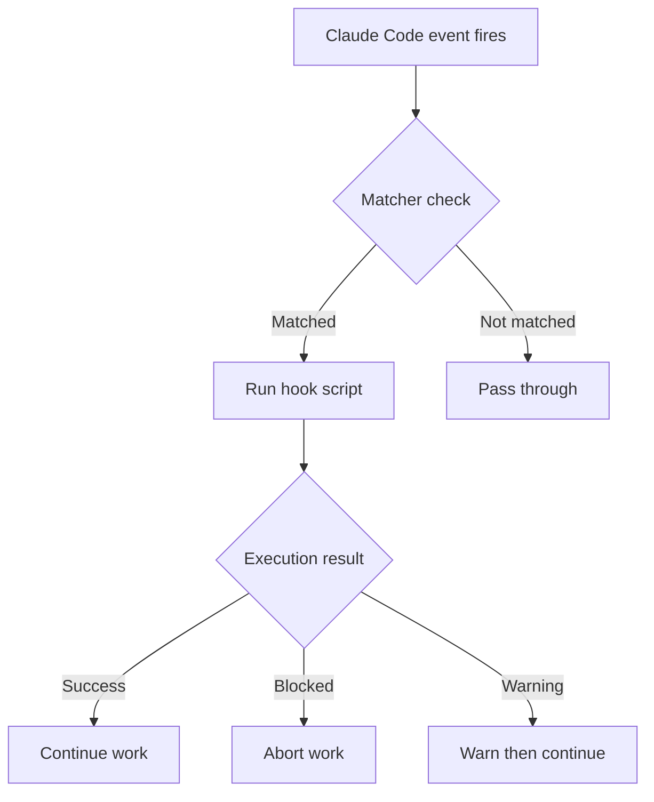
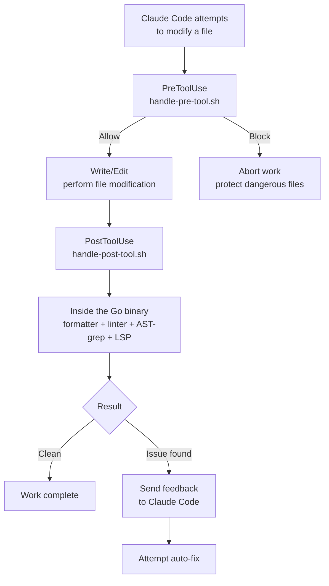

A detailed guide to Claude Code's Hooks system and MoAI-ADK's default Hook scripts. In an agentic harness a prompt is "guidance to follow," but a hook is "code that always runs" — hooks are the layer that builds quality gates and security defenses on determinism rather than probability.


**One-line summary**: Hooks are Claude Code's **automatic reflexes**. Save a file and it is formatted automatically; a dangerous command is blocked automatically.


## What Are Hooks?

Hooks are **scripts that run automatically** in response to specific Claude Code events.

By analogy with a doctor's reflex test, just as tapping the knee (event fires) makes the leg swing up automatically (script runs), when Claude Code modifies a file (PostToolUse event) the formatter runs automatically (code cleanup).



## Hook Event Types

This guide covers the frequently used core events. (For the full catalog of Claude Code's 30 event types, see the [Hooks Event Reference](/en/advanced/hooks-reference).)

### Key Event List

| Event | When it runs | Main use |
|--------|-----------|----------|
| `Setup` | Started with `--init`, `--init-only`, `--maintenance` flags | Initial setup, environment checks |
| `SessionStart` | When a session starts | Show project info, initialize environment |
| `SessionEnd` | When a session ends | Cleanup, save context |
| `PostSession` | After session end (self-hosted runner, CC 2.1.169+) | Post-session cleanup/telemetry; fires after the session is fully released, later than `SessionEnd`. MoAI-ADK does not currently wire this hook — it is documented as an available option for self-hosted deployments. |
| `PreCompact` | Before context compaction (`/clear` etc.) | Back up important context |
| `PreToolUse` | Before tool use | Security validation, blocking dangerous commands |
| **`PermissionRequest`** | When the permission dialog is shown | Auto allow/deny decision |
| `PostToolUse` | After tool use | Code formatting, lint checks, LSP diagnostics |
| **`UserPromptSubmit`** | When the user submits a prompt | Prompt preprocessing, validation |
| **`Notification`** | When Claude Code sends a notification | Customize desktop notifications |
| `Stop` | After a response completes | Loop control, completion-condition checks |
| **`SubagentStop`** | After a subagent finishes work | Handle subagent results |

### Event Details

#### 1. Setup
Runs when Claude Code starts with the `--init`, `--init-only`, or `--maintenance` flags. Used for initial setup work and environment checks.

#### 2. SessionStart
Runs when a session starts or an existing session is resumed. Used to show project state and initialize the environment.

#### 3. SessionEnd
Runs when a Claude Code session ends. Used for cleanup, saving context, and collecting metrics.

#### 4. PreCompact
Runs before Claude Code performs context compaction (such as the `/clear` command). Used to back up important context.

#### 5. PreToolUse
Runs **before** a tool is invoked. Can block or modify the tool call. Used for security validation and blocking dangerous commands.

#### 6. PermissionRequest
Runs when the permission dialog is shown to the user. Can automatically allow or deny.

#### 7. PostToolUse
Runs **after** a tool call completes. Used for code formatting, lint checks, and LSP diagnostics collection.

#### 8. UserPromptSubmit
Runs when the user submits a prompt, **before** Claude processes it. Used for prompt preprocessing and validation.

#### 9. Notification
Runs when Claude Code sends a notification. Can be customized with desktop notifications, sound alerts, and so on.

#### 10. Stop
Runs when Claude Code finishes a response. Used for loop control and completion-condition checks — `/moai loop` and the goal engine operate on top of this event.

#### 11. SubagentStop
Runs when a subagent finishes its work. Used to handle subagent results.

### Events Implemented in MoAI-ADK

MoAI-ADK implements hooks with a **shell wrapper script + Go binary** architecture. The `command` in settings.json points to the `.claude/hooks/moai/handle-<event>.sh` shell wrapper, and that wrapper forwards the stdin JSON to the `moai hook <event>` Go subcommand, which runs the actual logic. There is no Python or `uv run` dependency — it works with just shell scripts and a single Go binary.

| Event | Status | Shell wrapper | Go subcommand |
|--------|------|---------|---------------|
| `SessionStart` |  | `handle-session-start.sh` | `moai hook session-start` |
| `PreToolUse` |  | `handle-pre-tool.sh` | `moai hook pre-tool` |
| `PostToolUse` |  | `handle-post-tool.sh` | `moai hook post-tool` |
| `PreCompact` |  | `handle-compact.sh` | `moai hook compact` |
| `SessionEnd` |  | `handle-session-end.sh` | `moai hook session-end` |
| `Stop` |  | `handle-stop.sh` | `moai hook stop` |
| `SubagentStart` |  | `handle-subagent-start.sh` | `moai hook subagent-start` |
| `SubagentStop` |  | `handle-subagent-stop.sh` | `moai hook subagent-stop` |
| `PermissionRequest` |  | `handle-permission-request.sh` | `moai hook permission-request` |
| `UserPromptSubmit` |  | `handle-user-prompt-submit.sh` | `moai hook user-prompt-submit` |
| `Notification` |  | `handle-notification.sh` | `moai hook notification` |
| `TeammateIdle` |  | `handle-teammate-idle.sh` | `moai hook teammate-idle` |
| `TaskCompleted` |  | `handle-task-completed.sh` | `moai hook task-completed` |

Beyond those 13, the Go binary also implements `PostToolUseFailure`, `StopFailure`, `PostCompact`, `InstructionsLoaded`, `ConfigChange`, `TaskCreated`, `CwdChanged`, `FileChanged`, `PermissionDenied`, `WorktreeCreate`, `WorktreeRemove`, `Elicitation`, and `ElicitationResult` — 38 subcommands in total. (See the full list with `moai hook --help`.)

### Teammate Collaboration Events

MoAI's static Agent Teams orchestration layer is RETIRED, but Claude Code's native teammate runtime (tmux-pane based) is still supported, and the `TeammateIdle` and `TaskCompleted` hook events work.

#### TeammateIdle Event
Runs when a teammate finishes work and enters the idle state.

- `continue: false` (exit code 2) → idle rejected, teammate does more work
- `continue: true` (default) → idle approved

#### TaskCompleted Event
Runs when a teammate completes a task.

- Exit code 2 → completion rejected (needs revision)
- Exit code 0 (default) → completion approved

#### Team Shutdown Sequence [HARD]

When shutting down a team, you **must** follow this order.

1. **Send shutdown_request**: send `SendMessage(shutdown_request)` to each teammate
2. **Wait for the response**: receive `shutdown_response approve:true` from each teammate
3. **[HARD] tmux pane cleanup**: explicitly terminate the tmux panes
   - Read `~/.claude/teams/{team-name}/config.json`
   - Extract each member's `tmuxPaneId` (e.g., "%184")
   - Run `tmux kill-pane -t {paneId}` (from the highest index down)

Team-directory cleanup is performed automatically at session end. No explicit teardown call is needed (the explicit team-teardown tool was removed in Claude Code v2.1.178 — every session has one implicit team and cleanup is automatic).


**Why is tmux pane cleanup mandatory?** `shutdown_response` marks a teammate logically complete but does not terminate the tmux pane process. Team-directory cleanup happens automatically at session end, but it does not terminate the tmux pane process. Without explicit pane termination, the pane stays alive indefinitely and the Leader hangs in the "Drain" state.


### Event Execution Order

The order in which hooks run during a typical file-modification operation.



This pipeline handles half the feedback of the agentic loop — the agent writes, the hook inspects, and if there is a problem it becomes the fix input for the next turn.

## Claude Code Official Examples

These examples are the standard patterns provided in the official Claude Code documentation.

### Bash Command Logging Hook

Records every Bash command to a log file.

```json
{
  "hooks": {
    "PreToolUse": [
      {
        "matcher": "Bash",
        "hooks": [
          {
            "type": "command",
            "command": "jq -r '\"\\(.tool_input.command) - \\(.tool_input.description // \"No description\")\"' >> ~/.claude/bash-command-log.txt"
          }
        ]
      }
    ]
  }
}
```

### TypeScript Formatting Hook

Automatically runs Prettier after editing a TypeScript file.

```json
{
  "hooks": {
    "PostToolUse": [
      {
        "matcher": "Edit|Write",
        "hooks": [
          {
            "type": "command",
            "command": "jq -r '.tool_input.file_path' | { read file_path; if echo \"$file_path\" | grep -q '\\.ts$'; then npx prettier --write \"$file_path\"; fi; }"
          }
        ]
      }
    ]
  }
}
```

### Markdown Formatter Hook

Automatically detects and adds language tags to Markdown files.

```json
{
  "hooks": {
    "PostToolUse": [
      {
        "matcher": "Edit|Write",
        "hooks": [
          {
            "type": "command",
            "command": "\"$CLAUDE_PROJECT_DIR/.claude/hooks/markdown_formatter.sh\""
          }
        ]
      }
    ]
  }
}
```

The `.claude/hooks/markdown_formatter.sh` file:

```bash
#!/bin/bash
# Markdown formatter: fix missing code-fence language tags, clean up excessive blank lines

input_data=$(cat)
file_path=$(echo "$input_data" | jq -r '.tool_input.file_path // ""')

# Pass through if not a Markdown file
case "$file_path" in
  *.md|*.mdx) ;;
  *) exit 0 ;;
esac

[ -f "$file_path" ] || exit 0

# Clean up excessive blank lines (3+ lines → 2 lines)
content=$(cat "$file_path")
formatted=$(echo "$content" | awk 'BEGIN{blank=0} /^$/{blank++; if(blank<=2) print; next} {blank=0; print}')

if [ "$formatted" != "$content" ]; then
  echo "$formatted" > "$file_path"
  echo "Markdown formatting fixed: $file_path" >&2
fi
```

### Desktop Notification Hook

Shows a desktop notification when Claude is waiting for input.

```json
{
  "hooks": {
    "Notification": [
      {
        "matcher": "",
        "hooks": [
          {
            "type": "command",
            "command": "notify-send 'Claude Code' 'Awaiting your input'"
          }
        ]
      }
    ]
  }
}
```

### File Protection Hook

Blocks modification of sensitive files.

```json
{
  "hooks": {
    "PreToolUse": [
      {
        "matcher": "Edit|Write",
        "hooks": [
          {
            "type": "command",
            "command": "f=$(jq -r '.tool_input.file_path // \"\"'); case \"$f\" in *.env|*package-lock.json|*.git/*) exit 2;; esac"
          }
        ]
      }
    ]
  }
}
```

## MoAI Default Hooks

MoAI-ADK provides Hooks with a **shell wrapper + Go binary** architecture. Each `handle-<event>.sh` wrapper forwards the stdin JSON to the `moai hook <event>` subcommand, and the actual logic — formatting, linting, security scanning, LSP diagnostics — all runs inside the Go binary. No Python runtime or `uv` dependency is required.

### Hook List

| Shell wrapper | Go subcommand | Event | Matcher | Role | Timeout |
|---------|---------------|--------|------|------|----------|
| `handle-session-start.sh` | `session-start` | SessionStart | all | Show project state, check for updates | 30s |
| `handle-pre-tool.sh` | `pre-tool` | PreToolUse | `Write\|Edit\|Bash` | Block dangerous file modifications/commands | 5s |
| `handle-post-tool.sh` | `post-tool` | PostToolUse | `Write\|Edit` | Code formatting, lint, AST-grep scan, LSP diagnostics | 10s |
| `handle-compact.sh` | `compact` | PreCompact | all | Save context before `/clear` | 30s |
| `handle-session-end.sh` | `session-end` | SessionEnd | all | Cleanup at session end | 10s |
| `handle-stop.sh` | `stop` | Stop | all | Loop control and completion check | default |
| `handle-subagent-stop.sh` | `subagent-stop` | SubagentStop | all | Handle subagent work results | default |
| `handle-permission-request.sh` | `permission-request` | PermissionRequest | all | Auto allow/deny permission decision | 5s |

### SessionStart: Show Project Info

Shows the project's current state when a session starts.

**Displayed info:**
- MoAI-ADK version and whether an update is available
- Current project name and tech stack
- Git branch, changes, last commit
- Git strategy (Github-Flow mode, Auto Branch setting)
- Language setting (conversation language)
- Previous session context (SPEC state, task list)
- Personalized welcome message or setup guide

### PreToolUse: Security Guard

**Protects dangerous operations** before file modification/command execution.

**Protected files:**

| Category | Protected files | Reason |
|----------|-----------|------|
| Secret storage | `secrets/`, `*.secrets.*`, `*.credentials.*` | Protect sensitive information |
| SSH keys | `~/.ssh/*`, `id_rsa*`, `id_ed25519*` | Protect server-access keys |
| Certificates | `*.pem`, `*.key`, `*.crt` | Protect certificate files |
| Cloud credentials | `~/.aws/*`, `~/.gcloud/*`, `~/.azure/*`, `~/.kube/*` | Protect cloud accounts |
| Git internals | `.git/*` | Git repository integrity |
| Token files | `*.token`, `.tokens/*`, `auth.json` | Protect auth tokens |

**Note:** `.env` files are not protected, so developers can edit environment variables.

**Blocking behavior:**
- Detects Write/Edit attempts on protected files
- Returns a `"permissionDecision": "deny"` response in JSON form
- Claude Code aborts modification of that file

**Blocking dangerous Bash commands:**
- Database deletion: `supabase db reset`, `neon database delete`
- Dangerous file deletion: `rm -rf /`, `rm -rf .git`
- Full Docker cleanup: `docker system prune -a`
- Force push: `git push --force origin main`
- Terraform destroy: `terraform destroy`

### PostToolUse: Code Formatter

**Automatically cleans up code** after file modification.

**Supported languages and formatters:**

| Language | Formatter (priority) | Config file |
|------|------------------|----------|
| Python | `ruff format`, `black` | `pyproject.toml` |
| TypeScript/JavaScript | `biome`, `prettier`, `eslint_d` | `.prettierrc`, `biome.json` |
| Go | `gofmt`, `goimports` | default |
| Rust | `rustfmt` | `rustfmt.toml` |
| Ruby | `prettier` | `.prettierrc` |
| PHP | `prettier` | `.prettierrc` |
| Java | `prettier` | `.prettierrc` |
| Kotlin | `prettier` | `.prettierrc` |
| Swift | `swiftformat` | `.swiftformat` |
| C# | `prettier` | `.prettierrc` |

**Excluded targets:**
- `.json`, `.lock`, `.min.js`, `.svg`, etc.
- `node_modules`, `.git`, `dist`, `build` directories

### PostToolUse: Linter

**Automatically checks code quality** after file modification.

**Supported languages and linters:**

| Language | Linter (priority) | Checks |
|------|----------------|----------|
| Python | `ruff check`, `flake8` | PEP 8, type hints, complexity |
| TypeScript/JavaScript | `eslint`, `biome lint`, `eslint_d` | Coding standards, potential bugs |
| Go | `golangci-lint` | Code quality, performance |
| Rust | `clippy` | Rust idioms, performance |

### PostToolUse: AST-grep Scan

**Scans for structural security vulnerabilities** after file modification.

**Supported languages:**
Python, JavaScript/TypeScript, Go, Rust, Java, Kotlin, C/C++, Ruby, PHP

**Scan pattern examples:**
- SQL Injection vulnerabilities (string-concatenation queries)
- Hardcoded secret keys (API keys, tokens)
- Unsafe function calls
- Unused imports

**Config:** `.moai/config/astgrep-rules/` (the default shipped ruleset is `go-hardcoding.yml`)

### PostToolUse: LSP Diagnostics

**Collects LSP (Language Server Protocol) diagnostics** after file modification.

**Supported languages:**
Python, TypeScript/JavaScript, Go, Rust, Java, Kotlin, Ruby, PHP, C/C++

**Fallback diagnostics:**
When LSP is unavailable, command-line tools are used:
- Python: `ruff check --output-format=json`
- TypeScript: `tsc --noEmit`

**Config:** `.moai/config/sections/ralph.yaml`

```yaml
ralph:
  enabled: true
  hooks:
    post_tool_lsp:
      enabled: true
      severity_threshold: error  # error | warning | info
```

### PreCompact: Save Context

**Saves the current context to a file** before `/clear` runs. It is the safety net of the handoff flow that cuts a session at the context threshold and continues.

**Save location:** `.moai/state/session-memo.md`

**Saved content:**
- Current active SPEC state (ID, phase, progress)
- In-progress task list (TodoWrite)
- Completed task list
- Modified file list
- Git state info (branch, uncommitted changes)
- Key decisions

**State files:** Active worktree and session state are recorded in `.moai/state/` (e.g. `worktrees.json`, `active-sessions.json`).

### SessionEnd: Automatic Cleanup

Performs the following work at session end.

**P0 work (mandatory):**
- Save session metrics (files modified, commits, SPECs worked on)
- Save a work-state snapshot (`~/.moai/state/last-session-state.json`)
- Warn about uncommitted changes

**P1 work (optional):**
- Clean up temporary files (older than 7 days)
- Clean up cache files
- Scan for root-directory document-management violations
- Generate a session summary

### Stop: Loop Controller

Controls the Ralph Engine feedback loop. `/moai loop` can "repeat until everything is fixed" because this hook mechanically judges the completion condition at the end of every turn.

**Completion-condition check:**
- LSP error count (target of 0 errors)
- LSP warning count
- Whether tests pass
- Coverage target (default 85%)
- Completion-sentence detection (natural-language loop-end signal)

**State file:** `.moai/cache/.moai_loop_state.json`

**Config:** `.moai/config/sections/ralph.yaml`

```yaml
ralph:
  enabled: true
  loop:
    max_iterations: 10
    auto_fix: false
    completion:
      zero_errors: true
      zero_warnings: false
      tests_pass: true
      coverage_threshold: 85
```

### Quality Gate with LSP

Validates the quality gate using LSP diagnostics.

**Quality criteria:**
- Max errors: 0 (default)
- Max warnings: 10 (default)
- Type errors: 0 allowed
- Lint errors: 0 allowed

**Config:** `.moai/config/sections/quality.yaml`

```yaml
constitution:
  quality_gate:
    max_errors: 0
    max_warnings: 10
    enabled: true
```

**Result example:**
```json
{
  "lsp_errors": 0,
  "lsp_warnings": 2,
  "type_errors": 0,
  "lint_errors": 0,
  "passed": true,
  "reason": "Quality gate passed: LSP diagnostics clean"
}
```

## Go Binary Architecture

The shared logic of MoAI Hooks is compiled **inside the `moai` Go binary**, not in a Python `lib/` directory. The shell wrappers (`handle-<event>.sh`) are only a thin forwarding layer, and the following capabilities are all implemented inside the Go binary:

- **16-language formatter/linter registry**: auto-detects the project language and runs the matching toolchain (Go: gofmt/golangci-lint, Python: ruff/black, Rust: cargo fmt/clippy, etc.)
- **Git data collection**: caches branch, change, and commit info to optimize repeated queries
- **Unified timeout management**: per-hook-event timeouts and graceful degradation
- **Context snapshot**: context archiving before `/clear`, memory-payload generation
- **LSP diagnostics collection**: aggregates Language Server Protocol diagnostic results

The benefit of this architecture: no Python runtime (`uv`, virtual environment) installation is needed, and as long as the single binary (`moai`) is on PATH, all hooks work. If the binary is missing, the wrapper exits safely (exit 0) so it does not block the Claude Code flow.

## Configuring Hooks in settings.json

Hooks are configured in the `hooks` section of the `.claude/settings.json` file.

```json
{
  "hooks": {
    "SessionStart": [
      {
        "matcher": "",
        "hooks": [
          {
            "type": "command",
            "command": "\"$CLAUDE_PROJECT_DIR/.claude/hooks/moai/handle-session-start.sh\"",
            "timeout": 30
          }
        ]
      }
    ],
    "PreToolUse": [
      {
        "matcher": "Write|Edit|Bash",
        "hooks": [
          {
            "type": "command",
            "command": "\"$CLAUDE_PROJECT_DIR/.claude/hooks/moai/handle-pre-tool.sh\"",
            "timeout": 5
          }
        ]
      }
    ],
    "PostToolUse": [
      {
        "matcher": "Write|Edit",
        "hooks": [
          {
            "type": "command",
            "command": "\"$CLAUDE_PROJECT_DIR/.claude/hooks/moai/handle-post-tool.sh\"",
            "timeout": 10
          }
        ]
      }
    ],
    "PreCompact": [
      {
        "matcher": "",
        "hooks": [
          {
            "type": "command",
            "command": "\"$CLAUDE_PROJECT_DIR/.claude/hooks/moai/handle-compact.sh\"",
            "timeout": 30
          }
        ]
      }
    ],
    "SessionEnd": [
      {
        "matcher": "",
        "hooks": [
          {
            "type": "command",
            "command": "\"$CLAUDE_PROJECT_DIR/.claude/hooks/moai/handle-session-end.sh\"",
            "timeout": 10
          }
        ]
      }
    ],
    "Stop": [
      {
        "matcher": "",
        "hooks": [
          {
            "type": "command",
            "command": "\"$CLAUDE_PROJECT_DIR/.claude/hooks/moai/handle-stop.sh\""
          }
        ]
      }
    ]
  }
}
```

### Configuration Structure

| Field | Description | Example |
|------|------|------|
| `matcher` | Tool-name matching pattern (regex) | `"Write\|Edit"` |
| `type` | Hook type | `"command"` |
| `command` | Command to run | Shell script path |
| `timeout` | Execution time limit (seconds) | `5` (5s) |

### Matcher Patterns

| Pattern | Description |
|------|------|
| `""` (empty string) | Matches all tools |
| `"Write"` | Matches only the Write tool |
| `"Write\|Edit"` | Matches the Write or Edit tool |
| `"Bash"` | Matches only the Bash tool |

## How to Write a Custom Hook

### Basic Template

Custom Hook scripts can be written as shell scripts (bash). Claude Code passes JSON data on stdin and expects a JSON response on stdout. Using `jq` makes JSON parsing simple.

```bash
#!/bin/bash
# Custom PostToolUse Hook: run a specific check after file modification

# Read the hook input data from stdin
input_data=$(cat)
file_path=$(echo "$input_data" | jq -r '.tool_input.file_path // ""')

# Check logic
if [[ "$file_path" == *.env ]]; then
  # On dangerous-file detection, pass feedback to Claude Code
  jq -n --arg msg "A .env file was modified. Verify no sensitive information is exposed." \
    '{hookSpecificOutput: {hookEventName: "PostToolUse", additionalContext: $msg}}'
  exit 0
fi

# Suppress output if there is no problem
echo '{"suppressOutput": true}'
```

### Hook Response Format

| Field | Value | Behavior |
|------|-----|------|
| `suppressOutput` | `true` | Show nothing |
| `hookSpecificOutput` | object | Provide additional context |
| `permissionDecision` | `"allow"` | Allow the operation (PreToolUse) |
| `permissionDecision` | `"deny"` | Block the operation (PreToolUse) |
| `permissionDecision` | `"ask"` | Request user confirmation (PreToolUse) |

### Hook Input Data

Hook scripts receive JSON data on standard input (stdin).

```json
{
  "tool_name": "Write",
  "tool_input": {
    "file_path": "/path/to/file.py",
    "content": "file content..."
  },
  "tool_output": "file output result (PostToolUse only)"
}
```

## Hook Directory Structure

```
.claude/hooks/moai/
├── handle-session-start.sh          # SessionStart → moai hook session-start
├── handle-pre-tool.sh               # PreToolUse → moai hook pre-tool
├── handle-post-tool.sh              # PostToolUse → moai hook post-tool
├── handle-compact.sh                # PreCompact → moai hook compact
├── handle-post-compact.sh           # PostCompact → moai hook post-compact
├── handle-session-end.sh            # SessionEnd → moai hook session-end
├── handle-stop.sh                   # Stop → moai hook stop
├── handle-stop-goal.sh              # Stop (goal engine) → moai hook stop-goal
├── handle-stop-failure.sh           # StopFailure → moai hook stop-failure
├── handle-subagent-start.sh         # SubagentStart → moai hook subagent-start
├── handle-subagent-stop.sh          # SubagentStop → moai hook subagent-stop
├── handle-notification.sh           # Notification → moai hook notification
├── handle-user-prompt-submit.sh     # UserPromptSubmit → moai hook user-prompt-submit
├── handle-permission-request.sh     # PermissionRequest → moai hook permission-request
├── handle-permission-denied.sh      # PermissionDenied → moai hook permission-denied
├── handle-teammate-idle.sh          # TeammateIdle → moai hook teammate-idle
├── handle-task-completed.sh         # TaskCompleted → moai hook task-completed
├── handle-task-created.sh           # TaskCreated → moai hook task-created
├── handle-config-change.sh          # ConfigChange → moai hook config-change
├── handle-cwd-changed.sh            # CwdChanged → moai hook cwd-changed
├── handle-file-changed.sh           # FileChanged → moai hook file-changed
├── handle-instructions-loaded.sh    # InstructionsLoaded → moai hook instructions-loaded
├── handle-worktree-create.sh        # WorktreeCreate → moai hook worktree-create
├── handle-worktree-remove.sh        # WorktreeRemove → moai hook worktree-remove
├── handle-elicitation.sh            # Elicitation → moai hook elicitation
├── handle-elicitation-result.sh     # ElicitationResult → moai hook elicitation-result
├── handle-post-tool-failure.sh      # PostToolUseFailure → moai hook post-tool-failure
├── handle-agent-hook.sh             # Generic Agent-hook wrapper
├── status-transition-ownership.sh    # SPEC status-transition audit (PostToolUse)
├── handle-harness-observe-stop.sh   # Harness observation (Stop)
├── handle-harness-observe-subagent-stop.sh  # Harness observation (SubagentStop)
└── handle-harness-observe-user-prompt-submit.sh  # Harness observation (UserPromptSubmit)
```


**Note**: Setting a hook script's timeout too long slows down Claude Code's responses. We recommend keeping the security guard (pre-tool) within 5 seconds and the formatter/linter (post-tool) within 10 seconds. SessionStart and PreCompact are allowed up to 30 seconds for context loading.


## Related Documents

- [Hooks Event Reference](/en/advanced/hooks-reference) - Full reference for Claude Code's 30 event types
- [settings.json Guide](/en/advanced/settings-json) - How to configure hooks
- [CLAUDE.md Guide](/en/advanced/claude-md-guide) - Managing project instructions
- [Agent Guide](/en/advanced/agent-guide) - Integrating agents with hooks


**Tip**: Hooks are the core of MoAI-ADK's quality assurance. By automating code formatting and lint checks, they let developers focus on logic alone. Add custom hooks to build automation tailored to your project.

