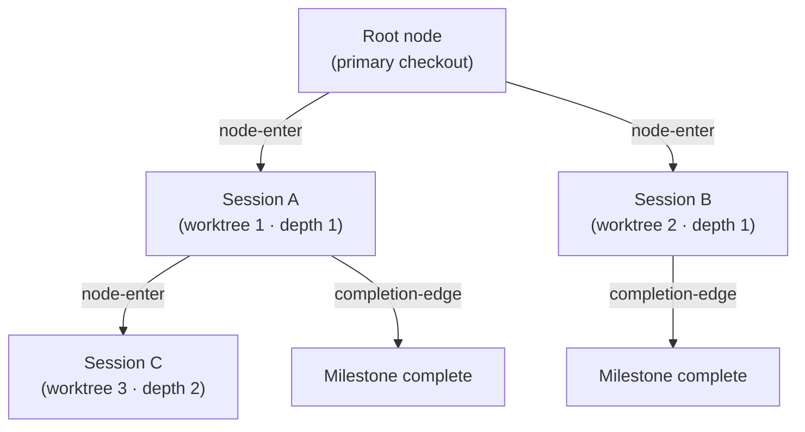
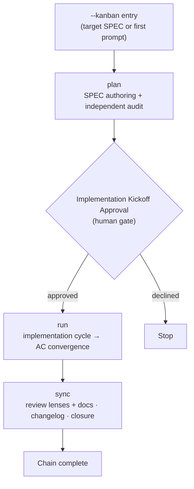
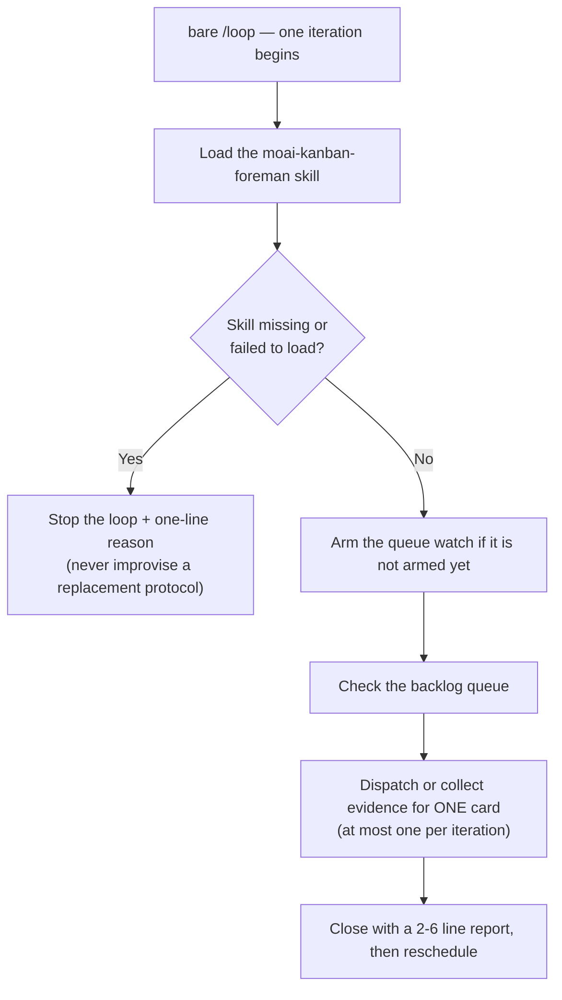



# Kanban Mode


 <strong>Value affiliation</strong>: agentic loop engineering · multi-session orchestration

<!-- @value: self-learning, multi-session-orchestration -->

Kanban Mode replaces the old model — driving one SPEC at a time in a single session — with a **multi-session board**. One lead session conducts, companion sessions work simultaneously each in their own worktree, and completed cards flow across the board. The backbone of that board is the Origin-Trail Chain.

You start it by attaching the `--kanban` (short `-k`) switch to the session launcher. It is neither a new subcommand nor a new runtime — it is merely an entry contract under which the launcher arms the kanban-mode environment. The three phases of the chain (plan → run → sync — the review verdict is absorbed by the sync gate) and the human gates inherit the existing `/moai goal` engine and `full-pipeline` chaining rules as-is. The bulk shape — many cards carried at once by numbered lanes — is split off as **Factory Mode** (`-f`), covered in the "Factory Mode" section below.

This page covers the entry conditions of Kanban Mode, the Origin-Trail Chain design, the chain phases, and "what is _not_ automated." For a short introduction from the workflow-command viewpoint, see [`/moai` unified command](/en/workflow-commands/) first.

## Why "kanban"


**Analogy**: each card on a kanban board is one worktree session. As cards flow across the board, sessions flow along the chain.


In the old model, a single session owned one SPEC end to end — writing the plan, implementing in run, and tidying docs in sync. As a SPEC grows large, one session struggles to handle it, and when it hits the context-window limit, the session must be split.

Kanban Mode reframes this structure from a **board viewpoint**:

- One **lead session** writes the plan and coordinates progress.
- Several **run sessions** implement in parallel, each in its own worktree.
- Each session is a **card** on the board, and cards flow through phases.

For this multi-session board to work, "where did this session come from," "is the parent session alive," and "how far has it gotten" must not be lost. The **Origin-Trail Chain** takes on this role.

## Origin-Trail Chain — design direction

The Origin-Trail Chain is an append-only tree that tracks the lineage of multi-session worktrees. Each worktree session is a node, and parent-child edges record "this session branched off that session."

### append-only JSONL event stream

The chain is stored in `.moai/state/chain/events.jsonl`. Every write appends one line via `O_APPEND` — there is no overwriting and no truncation. Because the kernel serializes concurrent appends, even when several sessions write simultaneously, one line never corrupts another.



Three event types are recorded in the stream:

| Event | When recorded | Contents |
|-------|---------------|----------|
| `node-enter` | at worktree spawn time | node ID, parent node, depth, lineage chain, worktree path, SPEC ID, entry time |
| `node-update` | on child SessionStart or milestone completion | session ID backfill or milestone state update |
| `completion-edge` | on session end (SubagentStop hook) | parent-child nodes, completed milestones, next resume target |

The event stream is a **flat file**, but at read time `BuildNodes()` replays the events to derive the current node state. No mutable tree file exists.

### WorktreeNode — 13 fields

Each node is reconstructed at read time as a state view with 13 fields:

| Field | Meaning |
|-------|---------|
| `node_id` | monotonically sortable unique ID (millisecond timestamp + random) |
| `parent_node_id` | the parent node that spawned it. Empty for the root |
| `depth` | nesting depth. Primary checkout is 0, first worktree is 1 |
| `origin_chain` | the ID path from root to this node (O(1) lineage lookup without traversal) |
| `worktree_path` | absolute worktree path |
| `session_id` | the Claude Code session ID assigned by the runtime (filled via two-phase backfill) |
| `spec_id` | the SPEC identifier this node works on |
| `milestone` | current milestone label |
| `entered_at` | node creation time (RFC 3339) |
| `exited_at` | session end time. Derived from heartbeat staleness (not an exit event) |
| `last_completed_milestone` | the most recently marked-complete milestone |
| `resume_target` | one-line description of what to do on resume |
| `resume_command` | the single command to run on resume |

### CWD-collision resolution

Sessions that reuse the same worktree path can collide — if you delete a worktree and recreate it at the same path, two sessions share the same `worktree_path`. The chain distinguishes them by the `(worktree_path, session_id)` pair:

1. **Primary key**: find the node whose `(worktree_path, session_id)` pair matches exactly.
2. **Fallback**: if `session_id` is empty or no matching node exists, resolve to the most recently entered node at that path.

This mechanism accurately restores "what is the current node for this path" when resuming a session after `/clear`.

### Two core problems and their solutions

The Origin-Trail Chain solves two problems:

**Depth amnesia** — when re-entering after `/clear` from a deeply nested worktree, "who are this session's ancestors" is lost. You had to recover it through grep or scrollback archaeology. The chain denormalizes the full ID path from root to leaf in the `origin_chain` field, restoring lineage in O(1) without traversal.

**Dead leader socket** — the state where the lead session has died but the child session does not know it. The child sits frozen waiting for the dead leader. The chain records session termination with `completion-edge` events, so together with heartbeat staleness (the derived `exited_at`), a child can detect its parent's state.

### Depth ceiling

An infinitely deep session tree makes complexity uncontrollable. The chain caps complexity with a depth ceiling — beyond the ceiling it refuses deeper spawns and guides work to shallower layers.

### Session ID two-phase backfill

At the moment of spawning a worktree, the session ID is not yet known — because the Claude Code runtime assigns the session ID only after starting the child process. So it is split into two phases:

1. **At spawn time**: append a `node-enter` event with `session_id` left empty. The node ID is passed to the child process via the `MOAI_CHAIN_NODE_ID` environment variable.
2. **At child SessionStart**: once the runtime assigns the session ID, backfill `session_id` with a `node-update` event.

This protocol bridges the gap between spawn time and session-ID assignment time.

## Current implementation status

In v3.1 the entry path of Kanban Mode is wired end to end. Each surface differs in completeness, though, so it is worth separating what you can use from the command line today from what still lives only in the library layer.

### Reachable from the command line today

- **`-k` / `--kanban` launcher switch** — wired into both `moai cc` and `moai glm`. Passed bare (or with a SPEC identifier) it enters as the lead; passed as `-k --name <role>` it joins an already-open run as a companion session. The mixed-backend launcher `moai cg` refuses it with a sentinel.
- **`-f` / `--factory` launcher switch** — the dedicated Factory Mode entry. `moai cc -f N` announces the lead together with the launch commands for lanes `lane-1`…`lane-N`, and `moai cc -f lane-<n>` adds one lane at a time. Covered in the "Factory Mode" section below.
- **Bootstrap notice** — when the lead session opens, the SessionStart hook prints the run identifier and the three companion launch commands (`moai cc -k --name plan` and so on) in the user's language. The notice reaching a companion announces which run it joined and the session name. Names are bare role names (`plan`, `run`, `sync`); if a live session already claims the same role name, the next number is attached (`plan-1`, `plan-2`, …). The notice also carries the recommended backend mix and the per-session concurrent-agent cap (10).
- **Session record** — the entered session's role, backend, and target SPEC are recorded.
- **`moai chain` CLI** — five subcommands work: `status` (current-node summary), `lineage` (root-to-leaf lineage), `back` (parent node's resume target and command), `list` (all nodes with freshness), `prune` (folding terminated old nodes into an archive). The `internal/chain/` storage layer below backs them.
- **Dispatch** — the actor moving cards between columns is the lead session's orchestrator. The protocol lives in `.claude/rules/moai/workflow/kanban-dispatch.md`, and companion sessions are launched by hand, one per terminal. There is no path by which a session launches another session.

### Chain storage layer

- `internal/chain/store.go` — append-only JSONL writer/reader. Appends one line at a time via `O_APPEND`, and skips corrupt lines with skip + warn.
- `internal/chain/node.go` — `WorktreeNode` (13 fields) + `ChainEvent` type definitions.
- `internal/chain/populate.go` — `Populator`: node creation at spawn time, session ID backfill, milestone update, completion-edge recording, current-node interpretation.
- `GenerateNodeID` — generates IDs with a monotonic timestamp + random, with no external dependencies.

### Not yet called by anyone

The **board state store** in `internal/kanban/` is complete as code — a closed five-column enumeration (backlog → plan → run → sync → done), a single-origin state file converging on one primary checkout, file locking, corruption recovery, and reconciliation with SPEC frontmatter status (it marks mismatches rather than fixing them). But no production caller reads or writes it yet. That means column position is held by the lead session's memory and the SPEC status, not by a file, and no CLI verbs exist to view the board or move a card.


 **There is no `moai kanban` command.** The CLI surface of Kanban Mode is the launcher switch `-k` and the lineage query command `moai chain`, nothing else.


## Opening a session in Kanban Mode


**Not a slash command**: Kanban Mode is not a `/` command in the Claude Code chat window; it is a switch that opens the session itself. You attach it in the terminal when starting the session.


Start in the terminal by attaching `--kanban` (short `-k`) to the MoAI launcher (`moai cc` or `moai glm`). If you also pass a SPEC identifier, that SPEC is the target; if you omit it, plan-phase begins from the first prompt.

```bash
# Enter as the lead — start the kanban chain targeting a SPEC
$ moai cc --kanban SPEC-AUTH-001

# Short form
$ moai cc -k SPEC-AUTH-001

# Without a target SPEC — start plan from the first prompt
$ moai cc -k

# Same entry on the GLM backend
$ moai glm -k SPEC-AUTH-001
```

When the lead session opens, it prints the run identifier together with the three companion launch commands. A human runs each one **in a separate terminal** to populate the board.

```bash
# Companion sessions — join under their bare role name (the run-id is the lead's identifier)
$ moai cc -k --name plan
$ moai cc -k --name run
$ moai cc -k --name sync
```

On successful entry the launcher arms the kanban-mode environment (the `MOAI_KANBAN` chain seed) inside the session, and the lead's SessionStart notice announces the run id and the companion launch commands — not a new runtime or hook, but an entry contract riding on existing machinery.

## Running one chain across four terminals

Opening the lead with `moai cc -k` prints one launch command per companion session alongside the run identifier. The operator opens each of them **in its own terminal** to complete the four-session run — the lead instructs, and plan · run · sync each work in their own worktree.


Cards flow like this: the lead instructs the `plan` session to author, the `run` session implements from that plan, and the `sync` session reconciles the code with the SPEC and commits. The review verdict is not a separate column: the sync gate absorbs it, running the review lenses itself. Each dispatch happens only after the lead has read the phase's progress evidence.

Each of the three companions can call sub-agents in parallel. The `plan` session in particular fans out SPEC authoring across cards — one parallel `Agent()` worker per card directory, so authoring does not wait its turn one card at a time. The concurrent-agent count is capped at 10 per session: the launcher injects a `CLAUDE_CODE_MAX_CONCURRENT_SUBAGENTS` cap into each companion, so even with all four sessions fanning out at once, the machine's capacity is divided by construction rather than by operator restraint.


**Why this shape — a backend per role.** Design and leading run on Opus; implementation runs on GLM. When opening companions, `moai glm -k --name ...` instead of `moai cc -k --name ...` joins that session on the GLM backend. Keeping the expensive model where judgment is needed and routing the implementation load to the cheaper backend is what makes the token cost of a multi-session run sustainable. Sessions message each other, and cross-session messaging is auto-permitted through the injected `--settings`.


### Backend mix — the default recommendation and why

The bootstrap notice carries a default recommendation. Token availability first:

```bash
moai glm -k                    # lead — the seat that watches the queue and moves cards
moai cc  -k --name plan        # plan — design and judgment on Claude
moai glm -k --name run         # run — implementation-heavy work on GLM
moai cc  -k --name sync        # sync — review and wrap-up on Claude
```

The reasoning is the kind of thinking each role needs. Plan and sync turn on judgment and review, so they sit on Claude; run is implementation-heavy, so GLM keeps its cost down. The lead is not the seat that renders verdicts — it watches the queue and moves cards — so GLM, cheap to keep waiting, fits it. When a Claude verdict is needed under a GLM lead, escape through a session named `judge` — the only route by which the GLM lead uses Claude. When one account starts hitting 429s, spreading sessions across accounts is the workable move. This mix is only the default — a different combination, or unifying every session on one backend, is equally fine.

The model labels visible in the screenshot's statuslines reflect one operator's session at capture time, not the shipped default.

## Factory Mode — many cards at once across N lanes


 **Value affiliation**: multi-session orchestration · tokenomics


If kanban is the shape where "three roles carry one card through the phases," **Factory Mode** is the shape where "N numbered lanes carry several cards at once." As of v3.1.1 the factory carries its own entry token `-f` — the kanban chain keeps `-k`, the factory takes `-f`.

```bash
# Lead — a 4-lane factory run (prints the launch commands for lane-1..lane-4)
$ moai cc -f 4

# Lanes — each in its own terminal; the number goes into the command
$ moai cc -f lane-1
$ moai cc -f lane-2
$ moai cc -f lane-3
$ moai cc -f lane-4

# GLM-backend lanes take the same form
$ moai glm -f lane-3
```

Attach no count to `-f` and the run starts with one lane (`lane-1`) by default. As the queue piles up, add one lane at a time with `moai cc -f lane-<n>` (or the glm form). A number whose label is held by a live session is bumped to the next free number.

### Every card goes to one lane whole

What the factory lead does differs from a kanban lead. Where a kanban lead coordinates the phases of a single card, the factory lead **routes already-picked cards to free lanes**. Reading the queue and picking a card is not the factory lead's job — the operator is always the one who picks (`moai todo next <n>`), and the factory routes only those **picked** cards. The kanban foreman loop (a bare `/loop`) is no exception: it dispatches the next **picked** card and never picks one itself. The unit of routing is always the whole card — every card goes to one lane in its entirety, and that lane carries it through the serial 3-stage path (`plan -> run -> sync`, one stage completing before the next begins) in-session. Each stage is spawned and run by the lane as an `Agent()` sub-agent; a card is never split across lanes.

Every lane can run up to 10 agents concurrently in parallel — the launcher injects a `CLAUDE_CODE_MAX_CONCURRENT_SUBAGENTS` cap into each lane session, so N lanes fanning out simultaneously divide the machine's capacity by construction rather than by operator restraint.

### Staggered activation and no model override

Never activate every lane at once. Activate the first lane, wait for evidence that it has started producing output (first job or visible progress), then activate the remaining lanes — concurrent requests cannot read a cache entry still being written, so simultaneous activation breaks cache efficiency. Do not put a model override on dispatches either — the GLM tier mapping rides the `ANTHROPIC_DEFAULT_*_MODEL` slot environment, and a per-spawn override splits the caches and can bypass the slot-to-GLM mapping.

The kanban lead's socket opens at `/tmp/moai-socket-kanban/<run-id>` and the factory lead's at `/tmp/moai-socket-factory/<run-id>`; the bootstrap notice carries the actual path. The mixed-backend launcher (`moai cg`) refuses it for the same reason as kanban (`FACTORY_MODE_UNSUPPORTED_BACKEND`).


**The earlier shapes still work.** The v1.2.0 unified entry forms — `-k <N>` (lead) and `-k <N> --name lane-<i>` (lane) — remain valid compatibility forms (a bare `-k --name lane-<i>` with no N defaults to 8 lanes). One entry token per launch, though: passing `-k` and `-f` together is an error.


## Watching the board in a browser

Rather than scanning four terminals by eye, `moai web` shows the same state on one screen. The Kanban screen carries the kanban chain board alongside the SPEC pipeline, with Overview, Specs, Monitor, and Settings screens beside it.


The console binds to loopback only. See [moai web console](/en/advanced/moai-web-console) for the full guide.

## Chain phases

The kanban chain extends the `full-pipeline` contract (an agreement that auto-chains run → sync for one SPEC). Three phases proceed in order:



The detailed procedure of each phase inherits the existing chaining rules:

- **plan** — authors the SPEC document, and an independent audit (plan-auditor) verifies its contents. See [`/moai plan`](/en/workflow-commands/moai-plan).
- **run** — the implementation cycle (TDD or DDD) implements code until it converges on the Acceptance Criteria (AC). See [`/moai run`](/en/workflow-commands/moai-run).
- **sync** — the sync gate runs the review lenses (matched to the surfaces the change touched) and reaches the review verdict itself, then updates docs, writes the changelog, and closes the phase. See [`/moai sync`](/en/workflow-commands/moai-sync).

What Kanban Mode adds on top is the **multi-session board viewpoint** — the lead session coordinates, run sessions work in parallel, and the Origin-Trail Chain tracks that lineage. For the detailed rules of the chain phases themselves, see the `/moai` unified command and `/moai goal`.

## The unattended foreman — a bare `/loop` 

In this project, typing **`/loop`** with no arguments makes that session repeat one **kanban foreman** cycle unattended. It is not the ordinary iterative-fix loop: it is a watch-dispatch-collect cycle over the backlog queue.

What one iteration does is small and idempotent.



Three boundaries bind this loop.

- **It cannot ask the operator.** While the skill is active, `AskUserQuestion` is removed from the tool pool. The loop runs with nobody watching, so there is no channel to ask through — anything needing judgement is reported in the iteration output instead.
- **It schedules work, it never generates it.** Admitting a card to the backlog (`moai todo add`) and picking the next one remain the operator's acts. The foreman only moves an already-picked card into a free lane.
- **It answers no approval gate on the operator's behalf.** Implementation Kickoff Approval and every other human gate still fire inside the unattended loop, and the foreman never passes one by proxy.

Completion is always judged on **evidence it read** — the card advances on the progress record on disk, not on a lane's reply. To test a single cycle by hand, invoke the `moai-kanban-foreman` skill directly.

## When to use it, when not to


**One lead, three companions.** Entry and dispatch work in v3.1. The board state store that would pin column positions to a file has no callers yet, so the current position of a card is held by the lead session and the SPEC status.


**When to use** — when advancing one SPEC (or several SPECs) simultaneously across multiple worktree sessions. When you need to track session lineage with the Origin-Trail Chain. When you want to drive one SPEC all the way to closure in one go. When many cards of the same shape have piled up and you want them split across parallel lanes, Factory Mode (`-f`) is that shape.

**When not to use** — when you want a human to judge and review intermediate artifacts between phases (in this case, run the ordinary `plan → run → sync` turn by turn). Short work that finishes in a turn or two. When you need the mixed backend (`moai cg`).

## Scope boundaries

This page states explicitly what it does not do:

- **It is not a new subcommand** — `--kanban` is a launcher switch, not a chat command like `/moai kanban`.
- **It does not skip human gates** — Implementation Kickoff Approval, the pre-implementation quality gate, and the documentation-scope gate all still fire. Even if the chain flows automatically, each gate requires human approval.
- **Unsupported backend** — Kanban Mode is rejected by the mixed-backend launcher `moai cg`. `moai cg` runs the leader on one backend and teammates on another, which contradicts the chain's precondition of "one session / one backend / one chain." The session does not open, accompanied by a rejection sentinel.

## Related docs

- [`/moai` unified command](/en/workflow-commands/) — a short introduction from the workflow-command viewpoint
- [`/moai todo`](/en/utility-commands/moai-todo) — the backlog queue that admits cards onto the board
- [`/moai loop`](/en/utility-commands/moai-loop) — the unattended foreman driven by a bare `/loop`: one session that watches the backlog queue, routes operator-picked cards to free lanes, and collects evidence, on repeat
- [`/moai goal`](/en/workflow-commands/moai-goal) — the goal engine that drives the kanban chain
- [manager-lead Lead Coordinator](/en/advanced/manager-lead) — the coordination agent that drives dispatch inside a kanban or factory lead session
- [Autonomous continuation loop](/en/advanced/autonomous-loops) — ownership and guardrail comparison of `/moai goal`, `/moai loop`, and the native `/goal`
- [`/moai run`](/en/workflow-commands/moai-run) — run-phase autonomy wiring, the rules the kanban chain's run phase inherits
- [Harness engineering](/en/core-concepts/harness-engineering) — how phase chaining and observation sit on top of the harness design
- [Statusline](/en/advanced/statusline) — how session lineage and worktree state are displayed in the statusline
