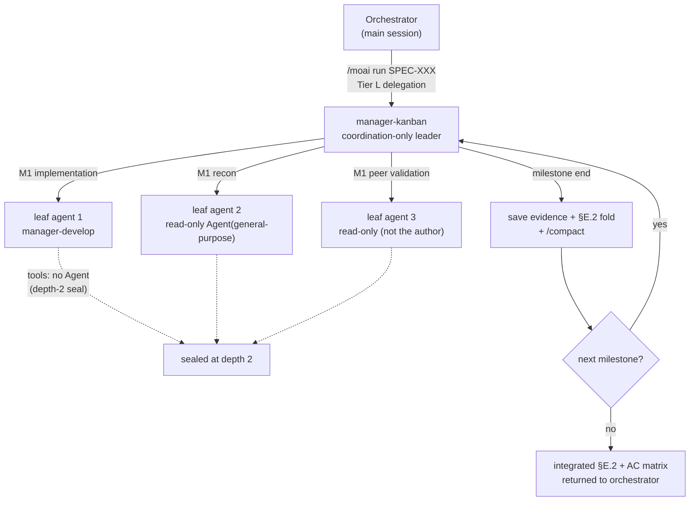




 <strong>Value home</strong>: agentic loop engineering · agentic harness

<!-- @value: self-learning, agentic-harness -->

Implementing one large SPEC (requirements document) invariably runs into two limits. One is the context window. Once you pass five milestones (sequential stages within a SPEC), the file contents read early in implementation and the outputs of the agent (an AI assistant that works on its own) pile up, and at some point you reach a state where you cannot proceed without `/clear`. The other is trust. When the agent in charge of implementation self-reports "the acceptance criteria passed," if there is no independent eye beside it to verify that report, we have no choice but to believe the claim.

`manager-kanban` is the twelfth manager agent (an agent that coordinates other agents), newly introduced in v3.1 to address both limits at once. When the orchestrator hands a Tier-L-scale SPEC to `manager-kanban`, this agent folds context per milestone (Context-Folding) to keep the window light, runs peer cross-validation on each acceptance criterion (AC — the criterion for a pass verdict) that has been marked pass, and makes it possible to go end-to-end in a single window. It does not write code itself; it only coordinates.

This page is an advanced page. It goes one layer deeper into the hierarchical structure, the entry conditions, per-milestone context folding, peer validation, and "what does _not_ change."

## What This Page Covers

`manager-kanban` is not a single agent but a work **shape**. This shape consists of five axes.

1. **Coordination-only leader** — `manager-kanban` does not write code, does not edit the SPEC body, and does not ask the user questions directly.
2. **Depth-2 seal** — among the manager agents, only `manager-kanban` carries the `Agent` tool, and the leaf agents it calls below cannot carry `Agent` again.
3. **Per-milestone context folding** — at the end of each milestone, evidence is saved to a file, a one-line summary is written to `progress.md`, and the window is cleared with `/compact`.
4. **Peer cross-validation** — a second agent that is not the author reruns the same command to confirm the AC pass verdict.
5. **Schema-based fan-out** — when read-only recon agents return in a fixed heading format, the leader mechanically concatenates them.

All five axes must come together for the work flow we call a "hierarchical team" to hold.

## Why It Is Needed

When implementing a Tier-L-scale SPEC in sequential mode (Mode 5), the orchestrator calls the `manager-develop` agent milestone by milestone in turn. This flow works well in most cases, but as the SPEC grows, two phenomena appear.

First, the context fills up. Files read early in implementation, tests written in the first milestone, and the output of AC verification commands all keep staying in one window. Around the fifth milestone the window is nearly full, so to continue after `/clear` you have to receive the prior progress as a summary. The cost of context blurring through these summaries accumulates.

Second, the limit of self-reporting surfaces. When an agent reports "AC-003 passed," if the orchestrator does not re-check the command output underlying that verdict one by one, a false report is only caught late, at the sync stage. A defect that would be cheap to catch in the middle goes all the way to the end.

`manager-kanban` responds to each of these two phenomena. It folds context at milestone boundaries to keep the window light, and it has a peer agent that is not the author re-confirm the AC verdict on the spot. So Tier-L execution survives end-to-end in one session, and the claim "it passed" advances to the next milestone in a structurally verified state.

## Hierarchical Structure at a Glance



What to watch carefully in the diagram is the direction of the arrows. The orchestrator calls only up to `manager-kanban`, and the only one that calls leaf agents below is `manager-kanban` itself. Leaf agents cannot call agents again (the seal indicated by the dotted line). This is the "depth-2 seal," the structural safety net that prevents the hierarchy from deepening without bound.

## Step 1 — Check Whether Entry Conditions Hold

`manager-kanban` is not the path laid down by default for every execution. The orchestrator hands work to `manager-kanban` only when the SPEC satisfies _all three_ conditions below. If even one is missing, it stays on the standard sequential mode (Mode 5).

| Condition | Criterion | Why it is needed |
|-----------|-----------|------------------|
| Number of milestones | ≥ 3 | At least three boundaries are needed for the folding effect to accumulate |
| Number of files | ≥ 10 | At smaller scale, sequential mode is cheaper |
| Domain spread | Cross-domain fan-out | Schema merging shines when recon splits across multiple areas |

These three conditions are not "if any is true" but "all must be true." A single-milestone refactor touching 10 files in one domain looks like one condition is missing, but in fact none of the three fit, so it does not enter the `manager-kanban` path. This is intentional — sequential mode is cheaper and faster.

Before calling `manager-kanban`, the orchestrator records this choice in the `§F Phase 4 Mode Selection` cell of `progress.md`. The user can grep this record to confirm which path the current execution took.

```bash
# Check in progress.md whether the current SPEC took the manager-kanban path
grep -A 2 "Mode Selection" .moai/specs/SPEC-EXAMPLE-001/progress.md | grep -i "manager-kanban"
```

## Step 2 — Hand Tier-L Execution to manager-kanban

When the orchestrator calls `manager-kanban`, `manager-kanban` receives the SPEC identifier, the milestone map, and the AC matrix. From here the role split is clear.

- **Orchestrator** — guards the user gates, receives the integrated result `manager-kanban` returns, and passes it to the sync stage.
- **manager-kanban** — calls leaf agents per milestone, folds context, and runs peer validation. It does not write code itself or edit the SPEC body. It also does not call `AskUserQuestion` directly — if it gets stuck, it returns a blocker report to the orchestrator.
- **Leaf agents** — implement as `manager-develop`, do read-only recon as `Agent(general-purpose)`, or rerun AC verification as a peer agent that is not the author.

The most notable point in this split is that only `manager-kanban` carries the `Agent` tool. Among the twelve manager agents, only `manager-kanban` has the `Agent` tool; the other manager agents all maintain a flat hierarchy with tool lists that omit `Agent`. Instead of opening the flat hierarchy in more than one place, the leaf agents below are blocked from carrying `Agent` again, sealing the hierarchy at two levels. This is the "depth-2 seal."

```text
# Tool list when manager-kanban calls a leaf agent (conceptual example)
manager-kanban:         [Read, Write, Edit, Grep, Glob, Bash, TaskCreate, TaskUpdate, TaskList, TaskGet, Agent, Skill]
leaf manager-develop: [Read, Write, Edit, Grep, Glob, Bash, TaskCreate, TaskUpdate, TaskList, TaskGet, Skill]  ← no Agent
leaf read-only verify: [Read, Grep, Glob, Bash]  ← no Write/Edit/Agent
```

Here `manager-kanban`'s `Write` and `Edit` are used only for coordination. That is, they are used to add a fold line to the §E.2 cell of `progress.md` or to write evidence files under `.moai/state/verify/` — never to touch source code. Code is always the leaf agents' job.

One point to emphasize is that `manager-kanban` is not a new execution mode. The six modes of Phase 4 (1 trivial, 2 background, 3 agent-team — retired, 4 parallel, 5 sub-agent, 6 workflow) stay as they are, and `manager-kanban` is a delegation target in the shape of Mode 5 (sequential calling). There is no new "Mode 7," and the retired Mode 3 has not been resurrected.

## Step 3 — Fold Context at Every Milestone Boundary

The most distinctive habit of `manager-kanban` is folding the window light at milestone boundaries. We call this procedure **Context-Folding**. When all ACs of a milestone have received a pass verdict, `manager-kanban` takes three steps in turn.

1. **Save evidence** — saves the output of the AC verification commands run in that milestone to files. The path follows the `.moai/state/verify/<session>/M<milestone>.<AC-id>.{log,out}` format. The reason for placing them under `.moai/state/` rather than `/tmp` is that when the OS clears `/tmp`, the cited paths break.
2. **Write a fold line** — adds a one-line summary to the §E.2 cell of `progress.md`. This line follows the form "M2: AC-004=PASS, AC-005=PASS | evidence: .moai/state/verify/.../M2.* | fold-at: 2026-08-12T...". Later, in the audit stage, the evidence path on this line must point to an actual file.
3. **Fold the window** — calls `/compact` with an explicit preservation directive, leaving only the current milestone plan and the fold lines so far, and clearing the rest.

```text
# Example fold lines added to progress.md §E.2
M1: AC-001=PASS, AC-002=PASS | evidence: .moai/state/verify/abc123/M1.* | fold-at: 2026-08-12T10:14:00Z
M2: AC-003=PASS, AC-004=PASS | evidence: .moai/state/verify/abc123/M2.* | fold-at: 2026-08-12T11:42:00Z
```

Once this procedure finishes, `manager-kanban`'s active context is proportional to "current milestone size + fold lines so far + the always-loaded rule prefix." Even when about to enter the fifth milestone, the raw records of the first milestone do not occupy the window. So a six-milestone Tier-L execution survives end-to-end in a single window.

```bash
# Check the evidence files remaining after milestone 2 ends (persisted under .moai/state/verify)
ls .moai/state/verify/"$(moai session current)"/M2.*
```

Note that the procedure does not bypass gates. Even with folding, if you reach the model-specific context limit (e.g., 50% for 1M-window models), `manager-kanban` produces a paste-ready resume message and recommends `/clear`. Folding is a technique for keeping the window light, not for letting go of the hand.

The path for leaving evidence must not be closed either. If any AC's evidence file is empty or its path is broken, that AC is marked `GAP` rather than `PASS`, and `manager-kanban` does not advance to the next milestone. Leaving a blank is not allowed.

## Step 4 — Add Trust to Acceptance Criteria via Peer Cross-Validation

When the implementation agent reports "AC-003 passed," `manager-kanban` calls a second agent that is not the author, in read-only mode, to rerun the same AC verification command. We call this stage **peer cross-validation**.

Why rerun it at all? The author is already invested in the verdict it called a pass. A failing grep might be miscounted and disguised as a pass, or the output of an earlier run might be pulled in and cited as if it were the current run's output. A peer agent has no investment in the author's pass claim. Its job is only to rerun the same command in the same tree and determine whether the result reproduces (pass), whether the command runs but the output differs (partial), or whether the command does not run at all or contradicts the claim (fail).

This stage yields three cases.

- **PASS** — the verification command reproduces the same result as the author's claim. Advance to the next milestone.
- **PARTIAL** — the command runs but the output differs from the author's claim. Record the difference and send a blocker report to the orchestrator.
- **FAIL** — the command does not run or contradicts the author's pass claim. Also send a blocker report.

```bash
# Example verification command a peer validation agent reruns in the same tree for AC-003
go test -run AC-003 ./internal/hierarchical/...
# exit code 0 means PASS, non-zero means FAIL — compare against the author's claim to tell PARTIAL from FAIL
```

When PARTIAL or FAIL comes back, `manager-kanban` does not advance to the next milestone. Instead it bundles the AC identifier, the pass evidence the author presented, and the difference the peer caught into a blocker report and returns it to the orchestrator. Offering options to the user is the orchestrator's job — it asks via `AskUserQuestion` whether to recall the author, accept the difference as documented debt, or halt the milestone. `manager-kanban` never asks the user directly.

Tier S skips this stage. At small scale, the cost of peer validation exceeds its value. Tier M and Tier L are obligatory. Peer cross-validation does not replace sync-auditor at the sync stage — sync-auditor is the final-pass read that scores four dimensions after implementation is done, while peer cross-validation is a binary verdict run per AC mid-execution. The two are complementary.

## Merging Recon via Schema-Based Fan-Out

Tier-L execution often starts with recon across multiple domains. For example, when implementing a new authentication system, the agent may need to look at three places at once: the existing session layer, the database migration convention, and frontend routing. Here `manager-kanban` calls several read-only recon agents simultaneously.

If these recon agents return prose in arbitrary formats, `manager-kanban` has to re-derive structure per return value. The cost of this grows linearly as recon multiplies. So `manager-kanban` has the recon agents return in a fixed heading format defined by the `plan-research-fanout` skill. Then merging (reduce) is no longer re-deriving — it is mechanically concatenating N fixed-format results.

If two recon agents return contradictory findings on the same signal, `manager-kanban` does not silently pick one; it writes the contradiction into an explicit cell. When a contradiction is visible, the user can judge; if it is hidden, it bursts only at the end.

The number of agents called at once does not exceed the 3–5 concurrency limit of MoAI Mode 4. If more than five recon passes are needed, `manager-kanban` calls them in sequential batches.

## Re-anchoring Worktree Isolation

When `manager-kanban` calls multiple leaf agents at once, write-capable agents must not touch the same working tree. To prevent one agent from overwriting a file another is editing, write agents called in parallel are isolated with `isolation: "worktree"`. This isolation gives each agent an independent working directory (worktree), keeping their changes from mixing.

Before v3.1, this isolation rule was tied to "team mode," a now-retired concept. When team mode was retired, the isolation rule appeared to have become useless too, but with the arrival of `manager-kanban`, the rule's condition was re-anchored to "write agents running in parallel inside a hierarchical team." The principle that enables isolation is unchanged; the condition no longer depends on a retired layer.

Read-only agents can be called without isolation — they only read, so they cannot dirty the working tree.

## Not Mode 7 (Non-Regression Guarantee)

The arrival of `manager-kanban` does not increase the execution modes of Phase 4. This point is now an explicit non-regression promise.

- **Execution mode list** — 1 trivial, 2 background, 3 agent-team (retired), 4 parallel, 5 sub-agent, 6 workflow. Unchanged.
- **New mode** — there is no "Mode 7." `manager-kanban` is a sequential delegation target in the shape of Mode 5.
- **`--mode` values** — `autopilot`, `loop`, `team`, `pipeline` values are unchanged. No new value was added, and the retired Mode 3 has not been resurrected.

This promise is the answer to the natural concern "does adding one more agent make the orchestration layer more complex?" `manager-kanban` is a single agent that fits inside the existing Mode 5 vessel; it does not create a new vessel.

## Summary

`manager-kanban` is a coordination-only agent for driving Tier-L-scale execution end-to-end in a single session. It only steps in when all three conditions hold (≥3 milestones, ≥10 files, cross-domain fan-out), and once in, it folds context per milestone to keep the window light and adds trust to every passing AC via peer cross-validation. It does not write code itself or ask the user directly; when work gets stuck, it returns a blocker report to the orchestrator.

Thanks to the depth-2 seal, the hierarchy never exceeds two levels, and thanks to schema-based fan-out, multiple recon results are merged mechanically. And all of this happens without adding a new line to the execution-mode list. When you need to drive a wide SPEC end-to-end in one go, `manager-kanban` is the structural backbone that supports that execution.
