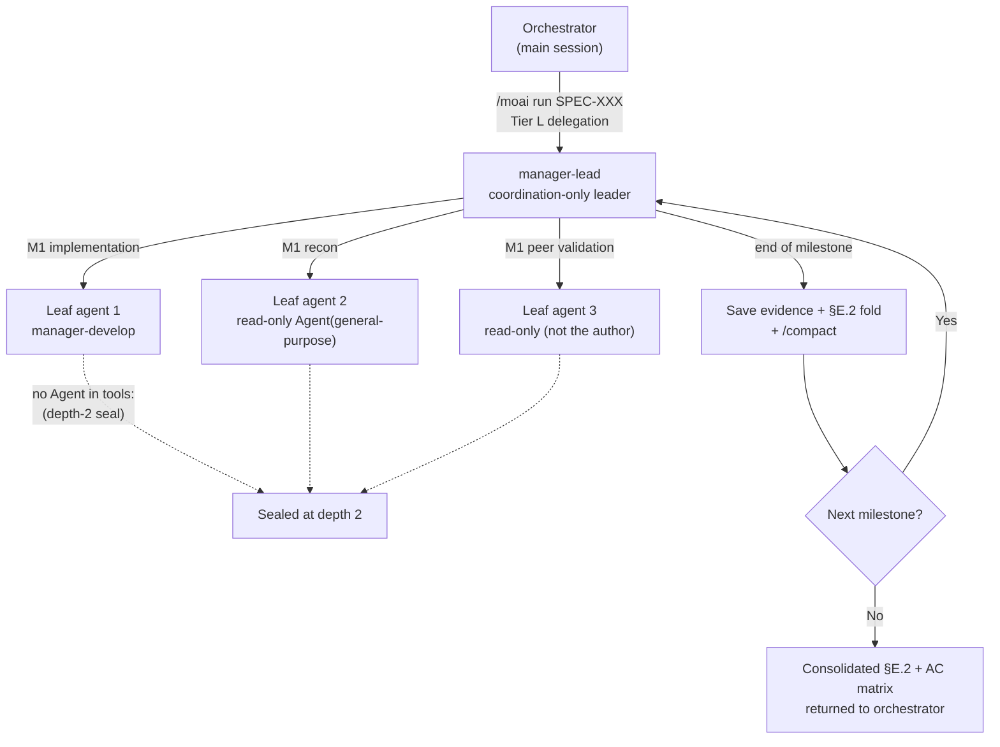



# manager-lead Lead Coordinator


 <strong>Value home</strong>: agentic loop engineering · agentic harness

<!-- @value: self-learning, agentic-harness -->

Work that is too large for one agent to carry usually runs into two limits. The first is the context window. Once you pass five milestones (the sequential stages inside a SPEC), the file contents read early in implementation and the agent's outputs pile up, until you reach a point where you cannot go further without `/clear`. The second is trust. When the agent doing the implementation reports on its own that "the acceptance criteria passed," and no independent eye sits beside it to verify that report, we have no choice but to take the claim at its word.

`manager-lead` is the twelfth manager agent — an agent that coordinates other agents — and it handles both limits plus the coordination of multiple sessions and multiple cards as a single skill set. It was renamed from `manager-kanban` in v3.1.1, and with the rename its role widened to include coordinating kanban and factory lead sessions. It never writes code itself; it only coordinates.

This is an advanced page. It goes one layer deeper into the boundary between the two roles, the hierarchical structure, the entry conditions, per-milestone context folding, peer validation, the posture of a lead session, and what does _not_ change.

## What this page covers — two roles, one skill set

`manager-lead` is not a single agent but a work **shape**, and that shape is made of two roles that never blend into each other.

| | Role A — in-session fan-out | Role B — cross-session dispatch |
|---|---|---|
| Unit of work | A milestone inside one SPEC | A card on the kanban board (-k), or a card assigned to a factory lane (-f) |
| Who does the work | Leaf `Agent()` spawns it creates directly | Companion sessions the operator launched by hand (-k: plan · run · sync) and lanes (-f: lane-1…lane-N) |
| Entry | Orchestrator delegation at the Tier L threshold | A -k/-f session whose SessionStart context declares the lead role |

Role A takes the execution of a Tier-L-scale SPEC, folds context at every milestone (Context-Folding) to keep the window light, and runs peer cross-validation on every acceptance criterion (AC — the criterion for a pass verdict) that has been marked pass, so the run survives end-to-end in a single window.

Role B is the work in which the **lead session owns the dispatch cycle** in kanban mode (`moai cc -k`) and factory mode (`moai cc -f N`). The kanban lead moves cards across the board along the `lead > plan > run > sync` chain — the `plan` session fans per-card SPEC authoring out to parallel `Agent()` workers — while the factory lead assigns an operator-picked card to an empty lane as a whole. Neither one creates a session. The operator launches companion sessions and lanes by hand, one per terminal, and the lead addresses them by name to send messages.

Three disciplines run through both roles. Work proceeds **in order rather than in competition**, completion is judged **only on evidence that was read, never on a claim**, and the user-question channel belongs to the orchestrator — when this agent is blocked, it returns a blocker report.

## The posture of a lead session — the conversation continues, the work runs behind it

In Role B the lead session's posture is non-blocking in both directions. The conversation with the user keeps flowing while parallel work runs behind it, and lane and companion-session coordination never stalls waiting for the user's next answer. The lead session talks to the user over the orchestrator channel (the agent itself only returns blocker reports), and everything that can run in parallel — read-only verification batches, cross-checking reports, per-card SPEC authoring the lead holds directly — is pushed out as background `Agent()` spawns.

Layered on top of this is the **subagent-first token discipline**. Only coordination stays in the context of the lead and the lanes; all substantive work is pushed down to child agents. If per-card authoring, verification, and report writing happen inside the lead's window, four windows grow heavy at once; pushed down to child agents, each finishes in its own window and only a summary comes back to the lead. The concurrent-spawn ceiling is 10 per session, and on the GLM backend spawns are launched **without a name** — a named spawn can turn into an in-process teammate that returns no result under `CLAUDE_CODE_EXPERIMENTAL_AGENT_TEAMS`.

## Why it is needed

When a Tier-L-scale SPEC is implemented in sequential mode (serial), the orchestrator calls the `manager-develop` agent milestone by milestone in turn. This flow fits most cases well, but as the SPEC grows two phenomena appear.

First, the context fills up. Files read early in implementation, tests written in the first milestone, and the output of AC verification commands all keep sitting in one window. Around the fifth milestone the window is nearly full, so to continue after `/clear` you have to be handed the prior progress as a summary. The cost of context blurring across those summaries accumulates.

Second, the limit of self-reporting surfaces. When an agent reports "AC-003 passed," and the orchestrator does not re-check the command output behind that verdict one by one, a false report is only caught at the sync stage. A defect that would be cheap to catch mid-run goes all the way to the end.

`manager-lead` answers each of these two phenomena. Context is folded at milestone boundaries to keep the window light, and each AC verdict is re-checked on the spot by a peer agent that is not the author. That way a Tier L run survives end-to-end within one session, and the claim "it passed" moves to the next milestone structurally verified. Role B extends the same discipline outside the session — the lead, too, reads the evidence in the progress record itself before moving a card, and stops the card where it is if it could not read that evidence.

## The hierarchy at a glance



The thing to watch in this diagram is the direction of the arrows. The orchestrator calls only as far as `manager-lead`, and the only caller of the leaf agents below it is `manager-lead`. A leaf agent cannot call another agent (the seal the dotted lines point to). This is the "depth-2 seal," a structural safety net that prevents the hierarchy from deepening without limit. The same holds in Role B — the lead's background `Agent()` spawns go one level only, and companion sessions and lanes were never created by the lead in the first place; they are independent sessions the operator launched.

## Step 1 — check that the entry conditions hold

Role A is not a path that underlies every run by default. The orchestrator hands work to `manager-lead` only when the SPEC satisfies **all** three conditions below. If even one condition is missing, the run stays in standard sequential mode (serial).

| Condition | Threshold | Why it is needed |
|------|------|-------------|
| Milestone count | ≥ 3 | Folding needs at least three boundaries for its effect to accumulate |
| File count | ≥ 10 | At small scale, sequential mode is cheaper |
| Domain spread | Cross-domain fan-out | Schema merging pays off when recon splits across several areas |

These three conditions are "all must be true," not "any one is true." A single-milestone, 10-file refactor touching one domain looks as if only one condition is missing, but in fact none of the three hold, so it does not enter the `manager-lead` path. That is by design — sequential mode is cheaper and faster.

Role B's entry is simpler. If the session's SessionStart context declares the `lead` role of kanban mode (`moai cc -k`) or factory mode (`moai cc -f N`), that is all it takes, and the thresholds do not apply — because the board (or the set of lanes) is itself the work. A subagent spawn has no SessionStart context, so Role B cannot be entered by spawning.

Before calling `manager-lead`, the orchestrator records this choice in the `§F Phase 4 Mode Selection` field of `progress.md`. Users can grep this record to confirm which path the current run took.

```bash
# Check in progress.md whether the current SPEC took the manager-lead path
grep -A 2 "Mode Selection" .moai/specs/SPEC-EXAMPLE-001/progress.md | grep -i "manager-lead"
```

## Step 2 — handing over the run

In Role A, when the orchestrator calls `manager-lead`, `manager-lead` takes in the SPEC identifier, the milestone map, and the AC matrix. From here the division of roles becomes explicit.

- **Orchestrator** — guards the user gates, receives the consolidated result `manager-lead` returns, and passes it on to the sync stage.
- **manager-lead** — calls leaf agents per milestone, folds context, and runs peer validation. It does not write code itself, and it does not edit the SPEC body. It does not call `AskUserQuestion` either — when something blocks, it returns a blocker report to the orchestrator.
- **Leaf agents** — implement with `manager-develop`, do recon with a read-only `Agent(general-purpose)`, or rerun AC verification as a peer agent that is not the author.

The most striking thing about this split is that only `manager-lead` carries the `Agent` tool. Among the twelve manager agents, `manager-lead` is the only one holding `Agent`; every other manager agent keeps the flat hierarchy with a tool list that omits `Agent`. In exchange for opening the flat hierarchy at exactly one place, the leaf agents below it are blocked from carrying `Agent` again, sealing the hierarchy so it never exceeds two levels. This is the "depth-2 seal," and a CI guard (`manager_lead_depth_test.go`) enforces it.

```text
# Tool lists when manager-lead calls leaf agents (conceptual example)
manager-lead:        [Read, Write, Edit, Grep, Glob, Bash, TaskCreate, TaskUpdate, TaskList, TaskGet, Agent, Skill]
leaf manager-develop: [Read, Write, Edit, Grep, Glob, Bash, TaskCreate, TaskUpdate, TaskList, TaskGet, Skill]  ← no Agent
leaf read-only validation: [Read, Grep, Glob, Bash]  ← no Write/Edit/Agent
```

Here `manager-lead`'s `Write` and `Edit` are used for coordination only. That is, they serve to add a fold line to the §E.2 field of `progress.md`, or to capture verification output to scratch and export the part that decided the verdict to `.moai/reports/<card-id>/` — they never touch source code. Code is always the leaf agents' job.

Delegation routing attaches sequential and parallel separately. Work that must run in turn within one window (per-milestone implementation) goes out as sequential spawns; work that is independent of the rest (recon, read-only verification batches, per-card SPEC authoring) goes out as parallel spawns. Skill access is fully open — the `Skill` tool loads whatever domain skill is needed on the spot.

One point worth emphasizing is that `manager-lead` is not a new execution mode. The four Phase 4 modes (direct, serial, fanout, sweep) are unchanged, and `manager-lead` is a delegation target shaped like serial (calling in turn). No new mode was created, and the experimental agent-team surface (selected only by an explicit `--team` request) did not become a catalog mode either.

## Step 3 — folding context at every milestone boundary

`manager-lead`'s most distinctive habit is folding the window light at milestone boundaries. This procedure is called **Context-Folding**. Once every AC in a milestone has a pass verdict, `manager-lead` takes three steps in order.

1. **Capture the evidence, then export it** — the output of the AC verification commands run in that milestone is first captured to `.moai/state/verify/<session>/M<milestone>.<AC-id>.{log,out}`. That location is **machine-local scratch** and nothing more: it outlives `/tmp` clearance, but it is gitignored, so it reaches no clone, no CI runner, and no other machine. So **before** an AC row cites its evidence, the lines that decided the verdict — the exit code, the failure summary, the figure the row quotes — are exported to the tracked path `.moai/reports/<card-id>/M<milestone>.<AC-id>.log`, and the citation names that one file. Only the named file moves; the scratch directory is never exported wholesale, and the loss risk of what stays behind is recorded under Residual-risk in the verdict.
2. **Write the fold line** — a one-line summary is added to the §E.2 field of `progress.md`. This line follows the form "M2: AC-004=PASS, AC-005=PASS | evidence: .moai/reports/t123/M2-report.md | fold-at: 2026-08-12T...". Later, at the audit stage, the evidence path on this line must point at a file that actually exists — and only a tracked path does.
3. **Fold the window** — `/compact` is called with an explicit preservation instruction, keeping only the current milestone plan and the fold lines so far and clearing the rest.

```text
# Example fold lines added to progress.md §E.2
M1: AC-001=PASS, AC-002=PASS | evidence: .moai/reports/t123/M1-report.md | fold-at: 2026-08-12T10:14:00Z
M2: AC-003=PASS, AC-004=PASS | evidence: .moai/reports/t123/M2-report.md | fold-at: 2026-08-12T11:42:00Z
```

Once this procedure is done, `manager-lead`'s active context is proportional to "the size of the current milestone + the fold lines so far + the always-loaded head of the rules." Even with the fifth milestone ahead, the raw record of the first milestone does not occupy the window. That is how a 6-milestone Tier L run survives end-to-end in one window.

```bash
# Check that the cited evidence opens at audit time — only the tracked path meets that condition
ls .moai/reports/t123/M2-report.md

# The verbatim output kept in scratch stays on this machine only
ls .moai/state/verify/"$(moai session current)"/M2.*
```

What to watch is that the procedure does not bypass any gate. Even with folding, once the per-model context limit is reached (for example, 50% on a 1M-window model), `manager-lead` composes a paste-ready resume message and recommends `/clear`. Folding is a technique for keeping the window light, not a technique for taking your hands off.

The path that leaves evidence must not be closed either. If the evidence file for an AC is empty or its path is broken, that AC is marked `GAP` rather than `PASS`, and `manager-lead` does not move on to the next milestone. Leaving a blank as it is not permitted.

## Step 4 — adding trust to acceptance criteria with peer cross-validation

When the implementing agent reports "AC-003 passed," `manager-lead` calls a second, read-only agent that is not the author and reruns the same AC verification command. This step is called **peer cross-validation**.

Why run it a second time at all? The author is already invested in the pass verdict it issued. It may miscount a failing grep and turn it into a pass, or pull output from an earlier run and cite it as if it were this run's output. The peer agent has no investment in the author's pass claim. Its job is to rerun the same command on the same tree and decide only whether the result reproduces (pass), whether the command runs but the output differs (partial), or whether the command does not run at all or contradicts the claim (fail).

This step yields three outcomes.

- **PASS** — the verification command reproduces the same result as the author's claim. The run moves to the next milestone.
- **PARTIAL** — the command runs, but the output differs from the author's claim. The difference is recorded and a blocker report goes to the orchestrator.
- **FAIL** — the command does not run, or it contradicts the author's pass claim. A blocker report goes out here too.

```bash
# Example verification command the peer agent reruns for AC-003 on the same tree
go test -run AC-003 ./internal/hierarchical/...
# Exit code 0 means PASS, non-zero means FAIL — compare against the author's claim to decide PARTIAL vs FAIL
```

When PARTIAL or FAIL comes back, `manager-lead` does not move on to the next milestone. Instead it gathers the AC identifier, the pass evidence the author presented, and the difference the peer caught into a blocker report and returns it to the orchestrator. Presenting options to the user is the orchestrator's job — it asks via `AskUserQuestion` whether to call the author again, accept the difference as documented debt, or halt the milestone. `manager-lead` never asks the user directly.

Tier S skips this step. At small scale the cost of peer validation exceeds its value. Tier M and Tier L are obligatory. Peer cross-validation does not replace the sync-auditor at the sync stage — the sync-auditor is a final-round read that scores across four dimensions after implementation is finished, while peer cross-validation is a binary verdict that runs per AC mid-run. The two are complementary.

## Merging recon with schema-based fan-out

A Tier L run often begins with recon spanning several domains. When implementing a new authentication system, for example, the agent may need to look at the existing session layer, the database migration conventions, and frontend routing all at once. In that case `manager-lead` calls several read-only recon agents simultaneously.

If those recon agents return prose in whatever format they like, `manager-lead` has to re-derive structure from every return value. The more recon there is, the more this cost grows linearly. So `manager-lead` has the recon agents come back in the fixed heading format defined by the `plan-research-fanout` skill. Then the reduce is no longer a re-derivation but a mechanical concatenation of N results in a fixed format.

When two recon agents return contradictory findings about the same signal, `manager-lead` does not quietly pick one of them; it writes the contradiction into an explicitly designated field. A contradiction that is surfaced lets the user judge; one that is hidden blows up only at the very end.

The number of agents called simultaneously does not exceed MoAI fanout's 3–5 concurrency limit. If more than five recon runs are needed, `manager-lead` groups them and calls them in turn.

## Worktree isolation — writes isolated, reads left alone

When `manager-lead` calls several leaf agents at once, write-capable agents must not touch the same working tree. To prevent one agent overwriting a file another is editing, **write subagents called in parallel are isolated with `isolation: "worktree"`**. This isolation gives each agent an independent working directory (worktree) so their changes never mix.

**Read-only fan-out is safe to call without isolation** — because it only reads, it cannot dirty the working tree. Recon and verification batches run as they are, and the rule is to attach isolation only to write spawns.

Before v3.1 this isolation rule was tied to "team mode," a concept that has since been retired. When team mode was retired the isolation rule looked as if it had become useless too, but with `manager-lead` arriving, the rule's condition was re-anchored to "write subagents running in parallel." The principle that makes isolation possible is unchanged; the condition simply no longer depends on a retired layer.

## Not a new mode (non-regression guarantee)

The arrival of `manager-lead` does not increase the number of Phase 4 execution modes. This point is settled as an explicit non-regression promise.

- **Execution mode list** — direct, serial, fanout, sweep. Unchanged (agent-team remains an experimental footnote available by explicit request only, and is never selected automatically).
- **New modes** — there are none. `manager-lead` is a serial-shaped sequential delegation target.
- **`--mode` values** — `autopilot`, `loop`, `team`, `pipeline` are unchanged. No new value was added, and agent-team remains an experimental surface available by explicit request only (the `MODE_TEAM_UNAVAILABLE` sentinel is kept as documented history).

This promise answers the natural worry: "does adding one more agent make the orchestration layer more complex?" `manager-lead` is one agent that fits inside the existing serial vessel; it does not create a new vessel. The same holds in kanban and factory lead sessions — the dispatch cycle runs on the cross-session messaging and backlog queue that already exist, and installs no new runtime.

## Summary

`manager-lead` is an agent that only coordinates, across two surfaces. In Role A it pushes a Tier-L-scale run end-to-end within one session — it steps in only when all three conditions (≥ 3 milestones, ≥ 10 files, cross-domain fan-out) are true, and once it does, it folds context at every milestone to keep the window light and adds trust with peer cross-validation on every AC that passes. In Role B it owns dispatch for kanban and factory lead sessions — cards move only on evidence that was read, parallel work is pushed out as background spawns so the user conversation never stalls, and `/clear` is requested between stages.

It does not write code itself and does not ask the user directly; when work blocks, it returns a blocker report to the orchestrator. Thanks to the depth-2 seal the hierarchy never exceeds two levels, thanks to schema-based fan-out several recon results merge mechanically, and thanks to worktree isolation on write spawns, parallelism is safe. And all of this happens without adding a single line to the execution mode list.
