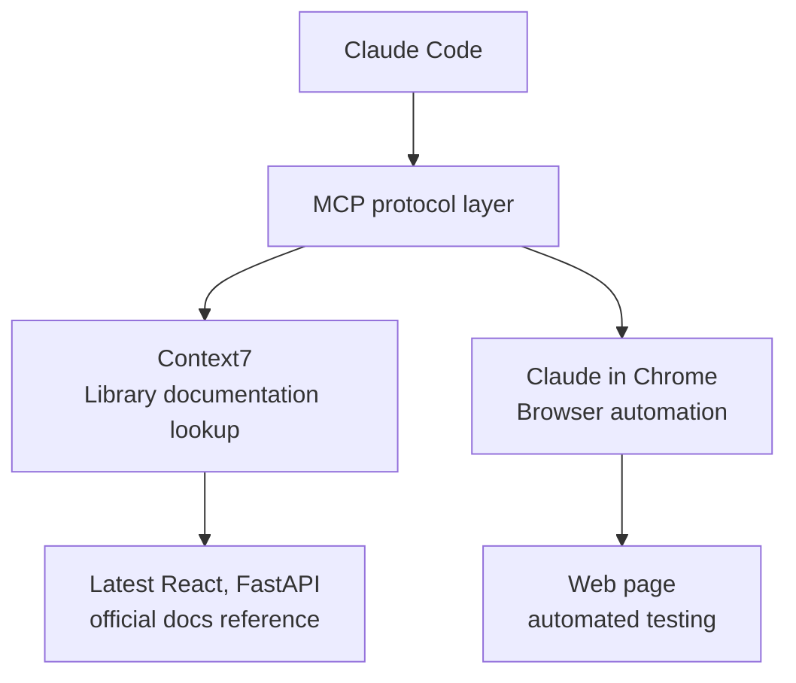

A detailed guide to using Claude Code's MCP (Model Context Protocol) servers. MCP is the harness's tool-extension layer — but every connected server's tool schemas occupy context, so the principle of "connect only the servers you need" works here as tokenomics too.


**One-line summary**: MCP is the **USB port that connects external tools** to Claude Code. Look up the latest documentation with Context7, and analyze complex problems with Adaptive Thinking (via the `--ultrathink` keyword).


## What Is MCP?

MCP (Model Context Protocol) is a standard protocol for **connecting external tools and services** to Claude Code.

Claude Code natively has tools like file read/write and terminal commands. MCP extends this tool set with capabilities such as library documentation lookup and browser automation.



## MCP Servers Used in MoAI

### MCP Server List

| MCP server | Purpose | Tools | Enabled via |
|----------|------|------|--------|
| **Context7** | Real-time library documentation lookup | `resolve-library-id`, `get-library-docs` | `.mcp.json` |
| **Claude in Chrome** | Browser automation | `navigate`, `screenshot`, etc. | `.mcp.json` |

## Using Context7

Context7 is an MCP server that **looks up official library documentation in real time**.

### Why Is It Needed?

Claude Code's training data only covers information up to a certain point in time. With Context7 you can reference **the latest version of official documentation** in real time and generate accurate code. The round trip of generating code from a wrong old-version pattern and then fixing it is the most expensive form of token waste.

| Situation | Without Context7 | With Context7 |
|------|---------------|---------------|
| New React 19 features | May not be in training data | References latest official docs |
| Next.js 16 configuration | May use previous-version patterns | Applies current-version patterns |
| Latest FastAPI API | May use old-version syntax | Applies the latest syntax |

### How to Use

Context7 operates in two steps.

**Step 1: library ID resolution**

```bash
# Claude Code가 내부적으로 호출
> React의 최신 문서를 참조해서 코드를 작성해줘

# Context7이 수행하는 작업
# mcp__context7__resolve-library-id("react")
# → 라이브러리 ID: /facebook/react
```

**Step 2: documentation search**

```bash
# 특정 주제의 문서 검색
# mcp__context7__get-library-docs("/facebook/react", "useEffect cleanup")
# → React 공식 문서에서 useEffect 정리 함수 관련 내용 반환
```

### A Practical Scenario

```bash
# 시나리오: Next.js 16 App Router 설정
> Next.js 16으로 프로젝트 설정을 해줘

# Claude Code 내부 동작:
# 1. Context7으로 Next.js 최신 문서 조회
# 2. App Router 설정 패턴 확인
# 3. 최신 설정 파일 생성
# 4. 공식 권장 사항 반영
```

### Examples of Supported Libraries

| Category | Libraries |
|------|-----------|
| Frontend | React, Next.js, Vue, Svelte, Angular |
| Backend | FastAPI, Django, Express, NestJS, Spring |
| Database | PostgreSQL, MongoDB, Redis, Prisma |
| Testing | pytest, Jest, Vitest, Playwright |
| Infrastructure | Docker, Kubernetes, Terraform |
| Other | TypeScript, Tailwind CSS, shadcn/ui |

## Adaptive Thinking via UltraThink

The `--ultrathink` keyword activates **Adaptive Thinking, the built-in reasoning mode** of Opus 4.7+/4.8 and Sonnet 4.6.

Unlike the fixed `budget_tokens` parameter of earlier models, the newer models' Adaptive Thinking **dynamically allocates reasoning tokens according to task complexity**. Reasoning depth is controlled by the **effort** parameter (`xhigh`, `high`, `medium`, `low`), not by a fixed budget. In the tokenomics allocation of "plan deeply, implement cheaply," this effort axis is the lever on the reasoning-depth side.

### When to Use `--ultrathink`

Using the `--ultrathink` keyword activates an enhanced analysis mode for complex problems.

```bash
# UltraThink로 아키텍처 분석
> 인증 시스템 아키텍처를 설계해줘 --ultrathink

# Opus 4.7+/4.8 또는 Sonnet 4.6에서:
# 1. 작업 복잡도에 따라 동적으로 추론 토큰 할당
# 2. 여러 각도에서 문제 분해 탐색
# 3. 트레이드오프를 체계적으로 평가
# 4. 검증된 추론으로 최적 솔루션 도출
```

### When It Kicks In

Adaptive Thinking is useful in the following situations.

| Situation | Example |
|------|------|
| Complex problem decomposition | "Design a microservices architecture" |
| Affecting 3+ files | "Refactor the entire authentication system" |
| Technology comparison | "JWT vs session authentication — which is better?" |
| Trade-off analysis | "How do I improve performance while preserving maintainability?" |
| Breaking-change review | "How does this API change affect existing clients?" |

### Model Compatibility

- **Opus 4.8, Opus 4.7, Sonnet 4.6**: Adaptive Thinking (dynamically allocated reasoning)
- **Haiku 4.5**: extended reasoning not supported (the `--ultrathink` keyword is a no-op)
- **Older models**: upgrading to a current Claude model enables deep reasoning

## Configuring MCP

### .mcp.json Configuration

MCP servers are configured in the `.mcp.json` file at the project root.

```json
{
  "context7": {
    "command": "npx",
    "args": ["-y", "@anthropic/context7-mcp-server"]
  }
}
```

### Enabling in settings.local.json

To enable a specific MCP server personally, add it to `settings.local.json`.

```json
{
  "enabledMcpjsonServers": [
    "context7"
  ]
}
```

### Allowing Permissions in settings.json

To use MCP tools, they must be registered in `permissions.allow`.

```json
{
  "permissions": {
    "allow": [
      "mcp__context7__resolve-library-id",
      "mcp__context7__get-library-docs"
    ]
  }
}
```

## Practical Examples

### Referencing the Latest Docs with Context7 in a React Project

```bash
# 1. 사용자가 React 19의 새 기능을 사용하고 싶다고 요청
> React 19의 use() 훅을 사용해서 데이터 페칭을 구현해줘

# 2. Claude Code 내부 동작
# a) Context7으로 React 라이브러리 ID 조회
#    → resolve-library-id("react") → "/facebook/react"
#
# b) React 19 use() 관련 문서 검색
#    → get-library-docs("/facebook/react", "use hook data fetching")
#
# c) 최신 공식 문서 기반으로 코드 생성
#    → use() 훅의 올바른 사용법 적용
#    → Suspense 바운더리와 함께 사용
#    → 에러 바운더리 처리 포함

# 3. 결과: 최신 패턴이 반영된 정확한 코드 생성
```

### Using UltraThink for Complex Architecture Decisions

```bash
# 아키텍처 결정이 필요한 상황
> 우리 서비스의 인증을 JWT로 할지 세션으로 할지 분석해줘 --ultrathink

# Adaptive Thinking이 동적으로 할당된 추론으로:
# 1. 문제를 하위 문제로 분해
# 2. 각 하위 문제를 단계적으로 분석
# 3. 이전 결론을 재검토하고 수정
# 4. 최적의 솔루션 도출
```

## Related Documents

- [settings.json Guide](/en/advanced/settings-json) - MCP server permission configuration
- [Skill Guide](/en/advanced/skill-guide) - the relationship between skills and MCP tools
- [Agent Guide](/en/advanced/agent-guide) - how agents use MCP tools
- [CLAUDE.md Guide](/en/advanced/claude-md-guide) - MCP-related configuration reference


**Tip**: Context7 is most useful when referencing the latest library documentation. Enable Context7 when adopting a new framework or upgrading to the latest version to get accurate code.

