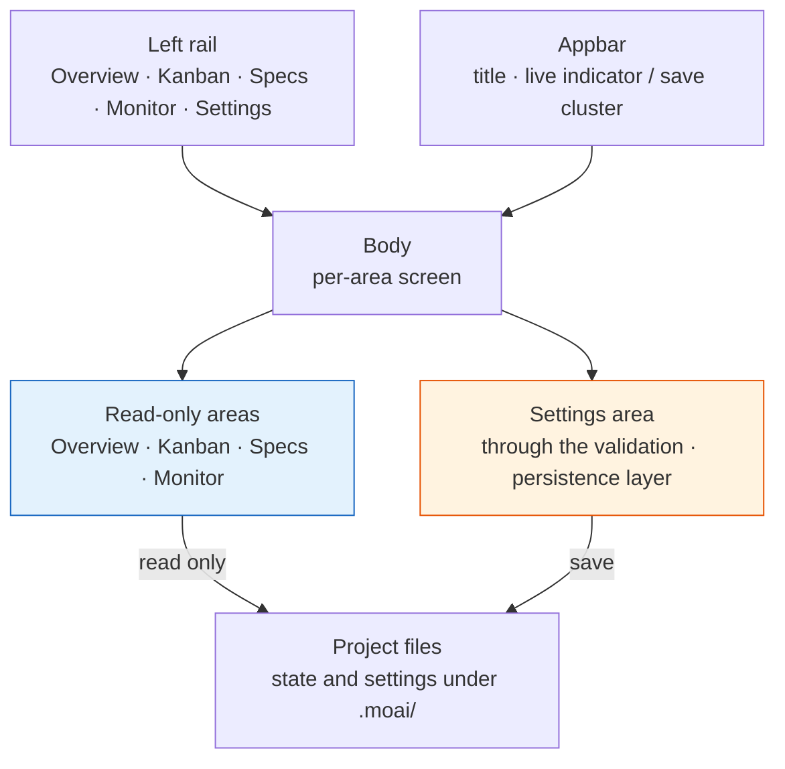

# MoAI Web Console

**MoAI Web Console** is the local operations screen you open with `moai web`. It shows the project's SPEC catalog, the Kanban chain, sessions and goals, and verification history in one place, and lets you edit settings from the same screen. The browser connects to `127.0.0.1` only, and there is no database and no login.


**In one line:** the console is an operations shell that groups four observation areas and one settings area behind a left rail. The observation areas only read; the settings area uses the same validation and persistence layer as the terminal wizard.


## The operations shell — left rail and appbar

The screen has three parts. The **rail** on the left stacks the five areas vertically, the **appbar** across the top carries the current title and status, and the rest is the **body**. The rail and the appbar stay in place whichever area you are in.

| Area | Route | What it does |
|------|-------|--------------|
| Overview | `/` | Whole-project summary — stat tiles, Kanban chain, in-progress SPECs, attention list, sessions |
| Kanban | `/kanban` | Chain session board plus the four-column SPEC pipeline |
| Specs | `/specs` | SPEC catalog search, filters and detail, close debt and MUST-FIX drift |
| Monitor | `/monitor` | Sessions, goals, verification and epics in four panels |
| Settings | `/settings` | Profile preferences and project sections across nine tabs |

What sits at the right of the appbar depends on the area. The four observation areas show a **live indicator**; the settings area shows a **save cluster** (the change count and the save button). The context chips (`lang` · `model` · `effort` · `dev`) render in the settings area only — they exist so you can confirm the key values of the profile you are editing before you save.

The foot of the rail gathers the profile button, the project name, the interface-language picker and the shutdown button. Pressing the profile button opens a popover where switching, creating, renaming and deleting all happen in one place. It is the same popover from every screen, so the console has exactly one surface for handling profiles.

## Overview — what state is the project in right now

Overview opens with four stat tiles: **SPEC** (total count and how many are in progress), **drift** (MUST-FIX count), **session** (PID-confirmed count / registry count), and **verify** (the last verification result and the number of keys).

Below them, the **Kanban chain bar** shows in one line how far the current card has travelled through the five roles `lead → plan → run → review → sync`. If a role has no session, that point is marked as where the chain stops. Then come the **in-progress SPECs** list, the **Needs attention** panel (which collects only MUST-FIX drift, failed verification, stalled goals and idle roles), and the **Sessions** panel on the right.

## Kanban — two boards

The Kanban area stacks two boards of different character.

The **chain session board** lays the five roles out as cards and records each one's session id, backend, model, effort level, context usage and last heartbeat. The stage state is **estimated** from the heartbeat, so it carries an estimation mark; model, effort and context are not recorded yet, so they are left blank — not filling them in is the discipline.

The **SPEC pipeline** lays SPECs out in four columns by status (`draft` · `in-progress` · `implemented` · `completed`). `superseded`, `archived` and `rejected` never reach this board; you see them through the filter in the Specs area.

## Specs — the catalog and two warning panels

The Specs area starts with a search box and status filter chips. Two warning panels then come **before** the list.

- **Close debt** — SPECs whose implementation landed (`implemented`) but whose lifecycle was never closed to `completed`. When there are many, only the most recently updated few are shown, along with the fact that the list was truncated and the total count.
- **MUST-FIX drift** — drift that carries a remediation command. The command is **copied only**. The console never runs any command on the server — you copy it and run it yourself in your own terminal.

The reason both panels sit above the list is simple. When the catalog runs to hundreds of rows, anything placed below it is pushed so far down the page that it is effectively absent.

The list has columns for ID, title, status, Tier, era, updated date and drift. Selecting a row opens a detail panel on the right with the document list, the file path and the drift detail.

## Monitor — four observation panels

| Panel | What it reads |
|-------|---------------|
| Sessions | Session id, SPEC, backend, heartbeat, working directory |
| Goals | The armed goal's condition, turns taken, whether it has stalled, and the verdict |
| Verification | A per-key recent-history sparkline and whether it passed |
| Epics | Per-epic progress as computed by `moai epic status` |

## Live updates — send a signal, then re-fetch

The observation areas refresh themselves when files change. The server holds an SSE (Server-Sent Events — the standard for streaming one-way events from server to browser) stream open at `GET /events`, watches under `.moai/`, and emits changes coalesced into 250-millisecond batches.

The key property is that **the event carries no data**. The server sends only the name of the area that changed; the browser takes that signal, re-fetches the current page and swaps the body. The truth about rendering stays in exactly one place — the server — so the screen and the files can never tell different stories.

| Event | What is watched |
|-------|-----------------|
| `spec` | `.moai/specs` |
| `session` | `.moai/state` |
| `goal` | `.moai/state/goal` |
| `verify` | `.moai/state/verify` |
| `kanban` | `.moai/state/kanban` |
| `config` | `.moai/config/sections` |

Only the `config` event is handled differently. If the screen changed underneath you while you were editing settings, the values you were typing would disappear — so instead of refreshing, it raises a banner saying the config files changed.

A lost connection does not fail silently. The appbar indicator flips to the disconnected state, and if the browser's reconnection attempts fail three times it falls back to polling every 30 seconds. The indicator keeps showing that polling is what is happening.

## Never write down what it does not know

One discipline shows up all over the screen.

- **Session liveness** is raised to active only where the process was confirmed alive. A registry entry can outlive its process, so anything unconfirmed is marked stale.
- **Stage state** is estimated from the heartbeat, and the fact that it is an estimate is written alongside it.
- **Unrecorded values** (per-role model, effort and context usage) are left blank rather than filled in with something plausible.
- **Empty lists** are not left empty; they say so. An empty panel otherwise reads as "not read yet".

## Settings — same checks, same files

The settings area is the only place in the console that writes files. It defines no validation rules of its own and calls the **same validation and persistence layer** as the terminal wizard (`moai profile`, `moai update -c`). That is why editing from either side produces the same result.

Choosing Settings in the rail unfolds nine tabs below it as a vertical list.

1. **Identity** — display name and project-level identity fields
2. **Language** — conversation, commit message, code comment and documentation language
3. **LLM** — permission mode, model, effort level
4. **3rd Party LLM** — per-tier GLM models, per-tier effort, GLM API key
5. **Workflow** — execution mode, default mode, agentic-loop, loop-prevention
6. **Git & Worktree** — `git_strategy.mode`, per-profile `merge_method`, worktree and branch-guard toggles
7. **Audit** — the audit model and the per-backend gates
8. **Agents** — per-agent profile and model assignment
9. **Report** — report format and output preferences

The number beside each tab is how many fields that tab renders. A tab with errors carries a warning mark instead of the number, so the list itself tells you which tab to open.

### Widget honesty

Fields render with the widget that matches the value's real domain. A bool field is drawn as a two-option radio group rather than a checkbox — a checkbox hides the current choice, a radio pair reveals it. Closed sets such as `execution_mode` or `audit.model` are select boxes or radio groups, and values outside the set are rejected on save. Only genuinely open domains, such as repository paths or API keys, stay free text.

### GLM honesty badge

The only runtime delivery channel for effort is a single session-level environment variable, so per-tier effort values are **stored only**. They persist in the config, but the runtime reads only the session-level value. The 3rd Party LLM tab carries a badge naming the source that actually applies, so this is stated rather than implied.

### Editing scope

What can be edited is fixed by a single source of truth, and the console writes only inside it. `user`, `language`, `quality`, `git-convention`, `git-strategy` and `llm` save through the typed validation path; `workflow` and `report` save through a seam that preserves the comments and line order inside the file. Machine and state sections and the large policy files are excluded, and a new section is refused by default until it is explicitly listed. The keys in each section are covered in the [configuration sections reference](/en/advanced/config-sections/).

## Security model

**Loopback only.** The console binds to `127.0.0.1` alone. Another account on the same machine, or a remote host, cannot reach it.

**No database.** Nothing extra is started. Everything it reads and writes lives in files under the current project's `.moai/`.

**No authentication.** Loopback-only is the premise, so there is no login or token layer.

**No command execution.** The observation areas refuse any method other than GET, and no screen runs a command on the server. The console does not perform SPEC status transitions either — those belong to each phase's manager agent.


Loopback-only is what makes no-authentication acceptable. Exposing the console externally through a reverse proxy or a `0.0.0.0` bind is not supported. If you need to view it remotely, forward the local port over an SSH tunnel.


## Four-locale interface

The interface language is chosen from the picker at the foot of the rail: **English · 한국어 · 日本語 · 中文**. The choice persists in the browser and applies from the first paint the next time you open it. It is the same language set as the docs-site [four-locale documentation](/en/resources/i18n-docs/), so you can read the screen and the docs in the same language.

## Starting and stopping

Running `moai web` in a project directory binds `127.0.0.1:3041` and opens a browser automatically.

| Flag | Default | Behavior |
|------|---------|----------|
| `--port <int>` | `3041` | The loopback port to bind |
| `--no-open` | `false` | Do not open the browser automatically |
| `--no-reuse` | `false` | Do not reclaim the port from a stale moai instance; fail on a conflict instead |

To stop it, press `Ctrl+C` in the terminal or use the shutdown button at the foot of the rail. For the details see the [CLI reference — moai web](/en/cli-reference/web/).

## Related documents

- [CLI reference — moai web](/en/cli-reference/web/) — flags and route detail
- [Kanban Mode](/en/advanced/kanban-mode/) — the source contract for the chain the console draws
- [Configuration sections reference](/en/advanced/config-sections/) — the keys the settings area handles
- [moai epic status](/en/cli-reference/epic/) — the producer behind Monitor's epic panel
